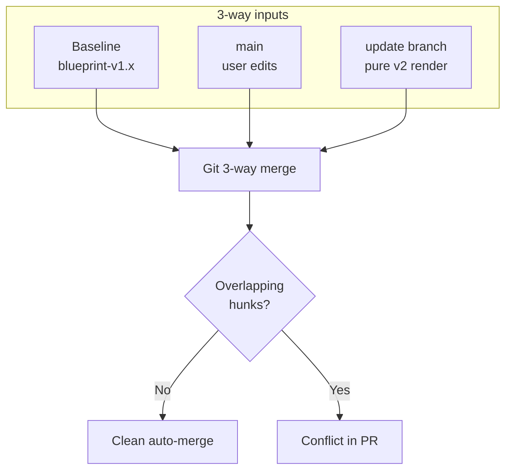

# Blueprint process: instantiate & update

How the Blueprint Server applies a blueprint to a data-product repository the first time (**instantiate**), and how it rolls forward to a newer blueprint version (**update**) using a **tag-based 3-way merge**.

Related:

- [Blueprint manifest](../../src/main/java/org/opendatamesh/platform/pp/blueprint/manifest/README.md) — parameters, strategy, composition, protected resources
- [Protected resources](protected-resources.md) — publication-time integrity check
- [Git providers](git-providers.md) — auth and provider APIs
- API: `POST /api/v2/pp/blueprint/blueprints-versions/instantiate`  
  and `POST /api/v2/pp/blueprint/blueprints-versions/update-data-product`

---

## Concepts

| Concept | Meaning |
|:--------|:--------|
| **Blueprint** | Platform record for a template repository (Git metadata + versions) |
| **Blueprint version** | A released snapshot; `tag` points at the **source** release (e.g. `v1.0.0`) |
| **Checkpoint tag** | Tag on the **data-product** repo marking a **pure** blueprint render: `blueprint-v{version}` |
| **Update branch** | Temporary branch for the next pure render: `update/blueprint-v{version}` |
| **Integration branch** | Usually `main` (or the target’s default / override branch) where users work |

Checkpoint tags and update-branch names are domain policy (`BlueprintGitNamingConventions`). They are **not** the same as the blueprint source release tag.

Phase 1 supports **monorepo, no composition** (exactly one `root` target). Request/response shapes stay **list-based** (`targetRepositories` / `results`) so polyrepo and composition can be enabled later without breaking the API.

---

## Instantiate (Initial Generation)

**Endpoint:** `POST .../blueprints-versions/instantiate`

Instantiate creates the **first pure checkpoint** and integrates it into the target repository so later updates have a correct merge baseline.

### What the service does

1. Resolve the blueprint version and validate parameters against the manifest.
2. Clone the blueprint **source** at the version’s release tag and the **target** at the integration branch.
3. Create an **orphan** branch (empty tree — no user files).
4. Render Velocity templates and copy files into that orphan working tree (plus lineage under `.odm/blueprint/`:
   the blueprint README is moved there; the source manifest is replaced by `.odm/blueprint/blueprint-manifest.yaml`).
   Protected-resource paths must match this **post-instantiation** layout — see [Protected resources](protected-resources.md).
5. Commit the pure render and tag it as **`blueprint-v{version}`**.
6. **Merge** the orphan branch into the integration branch (e.g. `main`).
7. Push the integration branch and the checkpoint tag.

```text
       [blueprint-v1.0.0]  pure orphan commit C1
              │
              │ merge
              ▼
 main:  M0 ──► M1
        │      (user files + blueprint files)
        └── pre-existing user files on main
```

### Why a pure orphan checkpoint?

If you rendered onto `main` and tagged that mixed tip as the checkpoint, Git would treat pre-existing user files as part of the blueprint baseline. On the next update (clean re-render of v2), Git would believe those user files were **deleted by the blueprint** and try to remove them in the PR.

With a pure checkpoint:

- Baseline = only blueprint files  
- User-only paths are **additions on `main`** relative to the baseline  
- Later updates keep user files and only change blueprint content

---

## Update (new blueprint version)

**Endpoint:** `POST .../blueprints-versions/update-data-product`

Update moves a data-product repository from the **current** checkpoint to the **next** blueprint version without destroying user edits on the integration branch.

### What the service does (per target)

1. Clone the target at the **current** checkpoint tag (`blueprint-v{current}`) and the blueprint source at the **next** release tag.
2. Create branch **`update/blueprint-v{next}`** from that checkpoint (not from `main`).
3. Clean the working tree (preserve `.git`), re-render the next version, enrich descriptor lineage.
4. Commit, tag **`blueprint-v{next}`**, push branch + tag.
5. Optionally open a same-repo Pull Request (`createPullRequest`): update branch → `pullRequestTargetBranch` or repo default branch.

```text
(v1 checkpoint)                 (v2 checkpoint)
     C1 ──────────────────────────► C2   update/blueprint-v2.0.0
      \                              \
       \ merge v1                     \ PR (3-way merge)
 main:  M1 ──► M2 ──────────────────► M3
            (user edits)
```

### Important behaviours

- The server **does not** merge the PR or delete the update branch — that stays in the Git provider UI.
- PR open is **best-effort**: if the update push succeeded but PR creation failed, the API still returns **HTTP 200** with **`warnings`**.
- `createPullRequest` is **global** for all targets in the request; each target may set its own `pullRequestTargetBranch`.

---

## Tag-based 3-way merge

When the update PR is merged (or when you preview merging the update branch into `main`), Git’s merge engine compares **three** trees:

| Role | Ref | Content |
|:-----|:----|:--------|
| **Baseline** | Current checkpoint tag (`blueprint-v1.x`) | Pure previous blueprint render |
| **Ours** | Integration branch (`main`) | Baseline + **user** changes |
| **Theirs** | Update branch (`update/blueprint-v2.x`) | Pure **next** blueprint render |

Git does **not** “overwrite main with the template.” It applies both diffs from the shared baseline. The Blueprint Server never resolves conflicts for you — conflicts surface in the PR for humans to resolve.



---

## Merge cases

### 1. User-only files (paths never in the blueprint)

**Setup:** `main` has `user/custom.md`; checkpoints never contain that path.

**Result:** Clean merge. Git sees the path as an addition on `main` only. The update branch does not delete it.

### 2. Blueprint file changed only on the update branch

**Setup:** User did not touch `templates/config.txt`; v2 changes that file.

**Result:** Clean merge. `main` receives the new blueprint content.

### 3. Edits on different lines (non-overlapping hunks)

**Setup:** Same file; user changes line 10 on `main`; blueprint changes line 2 on the update branch.

**Result:** Clean merge. Combined file keeps both edits.

```text
base:     line1 / line2-v1 / … / line10-v1
main:     line1 / line2-v1 / … / line10-user
update:   line1 / line2-v2 / … / line10-v1
merged:   line1 / line2-v2 / … / line10-user
```

### 4. User inserts lines; blueprint only updates other old lines

**Setup:** User inserts new lines between (or after) existing ones; the new blueprint version only rewrites **other** original lines whose hunks do not collide with the insertion.

**Result:** Usually clean merge — user insertions are kept; blueprint line updates apply.

```text
base:     L1-v1 / L2-v1 / L3-v1
main:     L1-v1 / USER / L2-v1 / L3-v1
update:   L1-v2 / L2-v1 / L3-v1
merged:   L1-v2 / USER / L2-v1 / L3-v1
```

### 5. Edits on the exact same lines

**Setup:** User and blueprint both change line 10.

**Result:** **Conflict**. The PR cannot merge until someone chooses or combines the changes.

### 6. Insertions next to blueprint rewrites (hunk overlap)

**Setup:** User inserts between L1 and L2; the new blueprint rewrites **both** L1 and L2 (neighbors of the insertion).

**Result:** **Often a conflict**, even though the user “only added lines.” Git’s change regions from base→main and base→update **overlap** around the same neighborhood of the file.

```text
base:     L1-v1 / L2-v1
main:     L1-v1 / USER / L2-v1
update:   L1-v2 / L2-v2
          └──── overlapping zone ────┘  → conflict risk
```

### 7. Poisoned baseline (what Instantiation prevents)

**Setup:** Checkpoint was tagged on a mixed `main` tip that already included user files.

**Result:** On update, the pure v2 tree omits those user paths → merge treats them as **deletes**. Instantiation’s orphan checkpoint exists to avoid this.

---

## What is a Git hunk? What is hunk overlap?

A **hunk** is a contiguous block of change that Git’s diff finds between two versions of a file (the `@@ … @@` chunks in a patch).

In a 3-way merge Git computes two diffs from the **same baseline**:

- baseline → `main` (user)
- baseline → update branch (blueprint)

**Hunk overlap** means those two regions touch or cover the same part of the file — the same lines, or close enough that Git cannot apply both cleanly. Overlap ⇒ **conflict risk**. Separate regions ⇒ **auto-merge**.

Conflict risk is **higher** when:

| Situation | Why |
|:----------|:----|
| Same lines edited on both sides | Classic content conflict |
| User inserts/deletes **between** lines the blueprint also rewrites | Neighboring context changed on both sides |
| Large wholesale rewrites of a file the user customized heavily | Diffs become one big overlapping hunk |
| Reordering / reformatting entire sections users also touched | Line identity is hard for the merge algorithm |
| Renames/moves without Git rename detection helping | Looks like delete + add |

Conflict risk is **lower** when:

| Situation | Why |
|:----------|:----|
| User edits and blueprint edits land in different files | No shared path |
| Changes are far apart in the same file | Separate hunks |
| Users add **new** files instead of editing generated ones | Additions on `main` only |
| Blueprint keeps stable “extension points” for custom code | Custom lines stay outside template churn |

---

## Best practices for writing blueprints

Author blueprints so updates stay **merge-friendly** for product teams.

### Structure for extension, not overwrite

1. **Separate generated vs user space**  
   Put stable scaffolding in clear paths; document where teams should add their own files (e.g. `user/`, `custom/`, `overrides/`) so Instantiation’s pure checkpoint never “owns” those paths.

2. **Prefer additive extension points**  
   Use hooks, includes, or clearly marked blocks (`# BEGIN CUSTOM` / `# END CUSTOM`) that new blueprint versions leave untouched. Avoid requiring users to edit the middle of generated sections that you often rewrite.

3. **Keep churn localized**  
   When releasing v2, change only what must change. Large drive-by reformats (whitespace, import reorder, wholesale reflows) raise hunk overlap with any user edit in that file.

4. **Stable line neighborhoods**  
   If you expect users to insert configuration between two markers, keep those markers and their surrounding lines **identical** across versions when possible, and put blueprint-driven changes **outside** that window.

5. **Smaller, focused template files**  
   One huge `config.yaml.vm` that mixes infra, app, and team knobs forces every update into one conflict surface. Split by concern so non-overlapping files merge cleanly.

6. **Document protected / do-not-edit paths**  
   Use the manifest’s `protectedResources` and the [protected resources](protected-resources.md) guide so users know which files are owned by the blueprint vs safe to customize. List **post-instantiation** paths only.

7. **Semantic versioning of breaking template moves**  
   Renaming or splitting heavily customized files is a breaking change for merge history — call it out in the changelog so teams expect PR conflicts and plan remapping.

8. **Test the update path**  
   Before publishing a new blueprint version, instantiate v1, make representative user edits (insertions, line tweaks, new files), run update to v2, and inspect the merge preview of `update/blueprint-v…` into `main` — the same check the service’s tag-based merge ITs encode.

### Guidance for data-product teams (consumers)

- Prefer **new files** for custom logic over editing every generated line.
- When you must edit a generated file, change the **smallest** region needed.
- Resolve update PRs carefully when conflicts appear: keep your insertions and adopt blueprint fixes on the old lines when that matches intent.
- After merging an update PR, delete the temporary update branch in the Git UI; keep the new `blueprint-v*` tag — it is the baseline for the next update.

---

## End-to-end flow (recap)

```text
(v1 tag)                 (v2 tag)                  (v3 tag)
   C1 ─────────────────────► C2 ─────────────────────► C3
    │                         │
    ▼                         ▼ (PR merged)
 main: M1 ──► M2 ───────────► M3 ──► M4
           (user edits)            (more user edits)
```

1. **Instantiate** → pure `blueprint-v1` + merge into `main`  
2. Users commit on `main`  
3. **Update** → `update/blueprint-v2` + tag `blueprint-v2` (+ optional PR)  
4. Humans merge the PR (3-way) and clean up the update branch  
5. Repeat from the latest checkpoint for v3, …

---

↑ Back to [docs index](../README.md)
