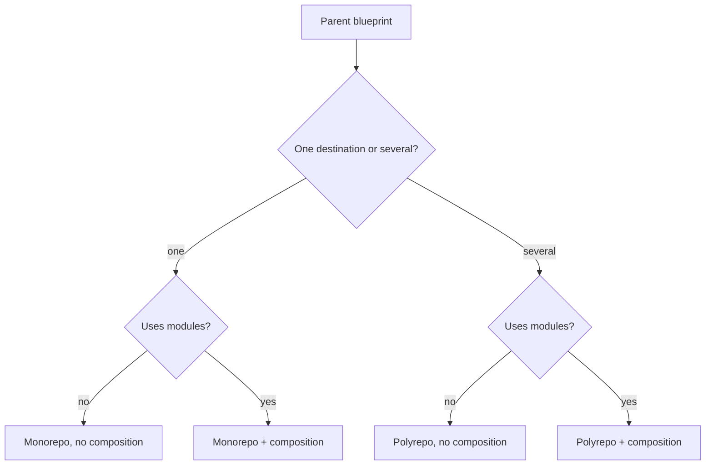

# Multi-repository layouts & composition

A data product is not always a single Git repository, and a blueprint is not always a single template tree. This guide explains how the Blueprint Server can write into **one or many remotes**, and how a parent blueprint can **reuse other published blueprints** as modules.

Related:

- [Blueprint process](blueprint-process.md) — instantiate, update, and tag-based 3-way merge
- [Blueprint manifest](../../src/main/java/org/opendatamesh/platform/pp/blueprint/manifest/README.md) — schema and YAML examples
- [Git providers](git-providers.md) — remotes and auth

---

## Two capabilities

| Capability | What it does |
|:-----------|:-------------|
| **Multiple repositories** | The blueprint declares *logical destinations*. At apply time each destination is mapped to a real Git remote. Files can land in one repo or be split across several. |
| **Composition** | The parent blueprint can include other published blueprints (*modules*). Modules contribute files; the parent still owns identity, parameters, and lineage. |

These two capabilities combine. Composition does not require multiple remotes, and multiple remotes do not require composition.

One destination is always the **root**: the primary data-product repository. Lineage and the data-product descriptor live there. Other remotes receive only the files routed to them.

---

## Layouts

The layout follows from how many destinations the parent declares, and whether it composes modules:

| Layout | Destinations | Composition | Result |
|:-------|:-------------|:------------|:-------|
| **Monorepo, no composition** | 1 | no | One blueprint → one repository |
| **Monorepo + composition** | 1 | yes | Parent and modules → one repository, different paths |
| **Polyrepo, no composition** | several | no | One blueprint split across several repositories |
| **Polyrepo + composition** | several | yes | Parent and modules routed across several repositories |

Examples for each layout are in the [manifest](../../src/main/java/org/opendatamesh/platform/pp/blueprint/manifest/README.md#2-manifest-examples).

---

## How it works

The same ideas apply from authoring through later upgrades. Git details of instantiate and update (checkpoints, merge, pull requests) are in the [process guide](blueprint-process.md).

### 1. Declare the layout in the manifest

The parent blueprint names:

- the **logical destinations** it needs (not physical Git URLs)
- which destination is the **root**
- **routes** — which source folders go to which destination, and at which path
- optional **modules** — which published blueprints to include, which parameters they receive, and where their files go

Physical repository creation, URLs, and credentials are not part of the manifest. They are supplied when the blueprint is applied.

### 2. Publish the version

Publishing records a stable blueprint version and checks that the layout is consistent: destinations are used, routes do not collide, and every composed module exists as a published version with its required parameters mapped.

### 3. Instantiate

Instantiation is the first apply onto real remotes:

1. Collect parameter values for the parent.
2. Map every logical destination to a Git repository (create or select).
3. Resolve modules and copy files according to the routes.
4. On the **root** repository only, record parent lineage (and render the data-product descriptor when the blueprint defines one).
5. Establish the first Git checkpoint on each remote that received files, so later updates have a clean baseline.

Each remote is processed independently with the same Git policy.

### 4. Update

Update rolls an **already instantiated** product to a newer blueprint version. Files, parameter values, and how parameters are passed to modules may change.

The **layout stays the same**: same destinations, same root, same routes, same modules. Adding a new remote, removing a module, or reshaping paths is not an update — that requires a new instantiation (or a later capability; see [Current support](#current-support)).

---

## Composition

Composition is how a parent reuses shared building blocks (for example a storage template or an API skeleton) without copying them.

- The parent lists each module, the blueprint version to use, the parameters to pass, and where the module’s files should land.
- Parameters are passed **explicitly** from the parent (a parent parameter, or a fixed value). Modules do not see the full parent parameter set by default.
- The parent decides placement. A module’s own destination layout is not used when it is composed.
- Lineage stays with the parent on the root repository. Modules contribute files only.

A module must itself be a simple blueprint: **one destination, no nested modules**. Parent and modules must live on the same kind of Git host.

---

## Current support

### Supported

| Area | What works today |
|:-----|:-----------------|
| **Layouts** | All four combinations above, for both instantiate and update |
| **Multiple remotes** | Split parent (and module) content across several Git repositories in one request |
| **Composition** | Parent includes published modules and routes their files into the declared destinations |
| **Root & lineage** | One explicit root repository holds parent lineage and the data-product descriptor |
| **Update (content)** | Newer template files, new parameter values, and updated module parameter mappings — on the same layout |
| **Module version bump** | Same module slot can point at a newer version of that module |

### Not supported

| Area | Limitation |
|:-----|:-----------|
| **Nested composition** | A module cannot itself compose other modules |
| **Polyrepo modules** | A module cannot declare several destinations; only the parent can |
| **Layout changes on update** | Changing destinations, the root, routes, or adding/removing modules is rejected |
| **New remotes on update** | A repository that never received the first apply must go through instantiate |
| **Cross-host composition** | Parent and modules must use the same Git provider type (and base URL) |
| **Orchestration-only parents** | The parent must still contribute at least one file route; it cannot be modules-only |
| **Overlapping destinations** | Two routes cannot write nested or identical paths on the same repository |
| **Distributed rollback** | Each remote is applied independently; a later failure does not undo remotes that already succeeded |

Schema-level rules and copy-paste YAML live in the [Blueprint manifest](../../src/main/java/org/opendatamesh/platform/pp/blueprint/manifest/README.md). Merge behaviour after update lives in the [Blueprint process](blueprint-process.md) guide.

---

↑ Back to [docs index](../README.md)
