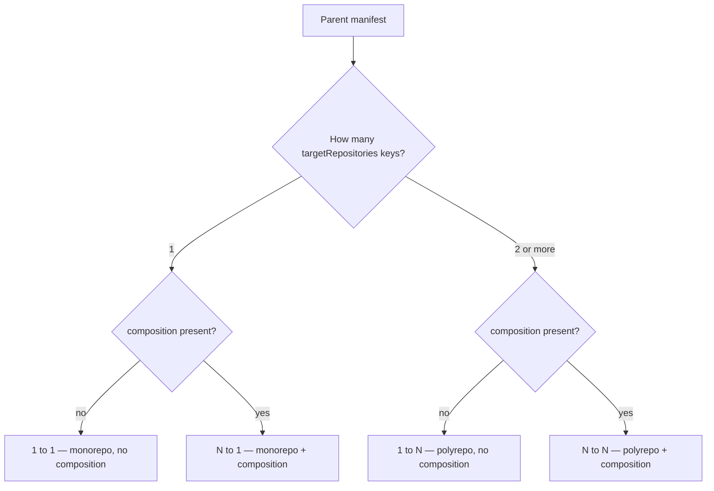
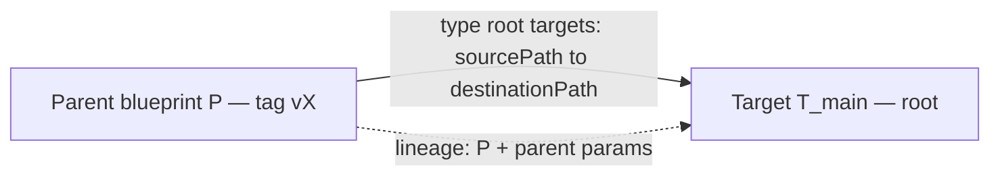
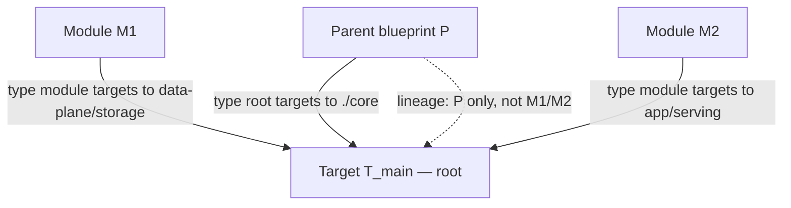
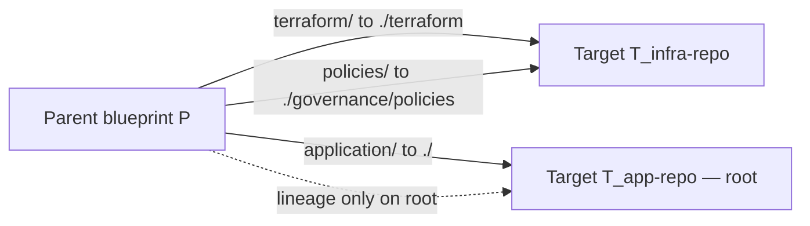
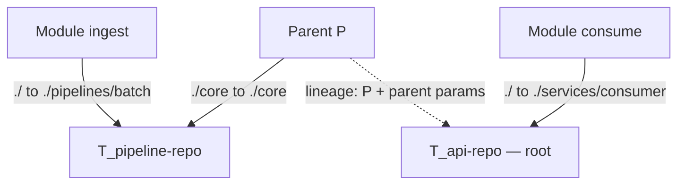
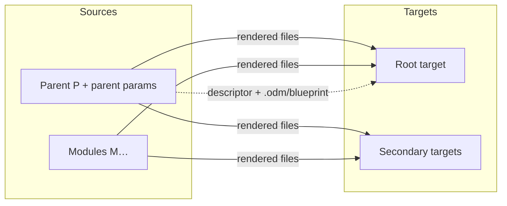
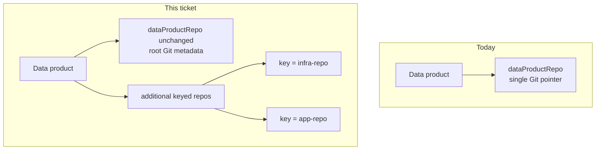
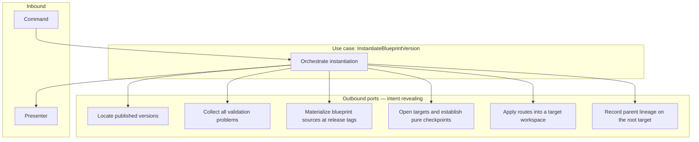

# SPDD Analysis: Support all repositories scenarios for blueprint instantiation

See companion prompt `BDMD-4820-202608261148` for runtime instantiate behavior, and `BDMD-4820-202608271040` / `BDMD-4820-202608271455` for update.

## Original Business Requirement

BDMD-4820
Support all repositories scenario for blueprint instantiation use case.

- **Monorepo, no composition** — 1 repo, no composition, **1→1**: one parent blueprint into one target repo
- **Monorepo + composition** — 1 repo, with composition, **N→1**: parent + modules into one target repo (different paths)
- **Polyrepo, no composition** — ≥2 repos, no composition, **1→N**: one parent blueprint split across several target repos
- **Polyrepo + composition** — ≥2 repos, with composition, **N→N**: parent + modules routed across several target repos

## Notes

### Blueprint - DataProduct Lineage

Keep using only root blueprint and its parameters instantiation values as the only point for lineage tracking.

### DataProduct - Git Repository

Currently the DataProduct registry keeps track only of the "root" git repository (pointer with url and other metadata).
This should be extended to keep track also of other repositories, keeping also their key (the ones defined in the manifest)
so they can be referenced and reconciled during other processes (like blueprint update).
The registry **root** pointer (`dataProductRepo`) is the remote mapped to the **`targetRepositories[]` entry with `isRoot: true`**; other keys are additional repos.

Out of scope:

- UI
- Blueprint update feature

### Additional requirements

1. Blueprint modules MUST be monorepo with no composition (for now).
2. All the blueprint structural validation rules MUST be checked both before publishing and before instantiation.
3. Validation errors should be explicit and clear to the user, specifying ALL the problems found. The error message should also include a hint on how to solve each error.
4. The data-product **root** repository (descriptor + lineage + registry `dataProductRepo`) MUST be designated explicitly via **`targetRepositories[].isRoot: true`** (exactly one entry). Do not infer it from the first route entry, from a descriptor-covering route, or from a reserved key name.
5. Parent **publish** MUST fail when a composition entry’s `parameterMapping` does not cover every parameter declared by the referenced published module that has **no default**. Module parameters that declare a default may be omitted from the mapping.

---

## Scenario charts

Topology is **not** a manifest field. It is derived from:

|                        | **No composition** | **With composition**       |
| ---------------------- | ------------------ | -------------------------- |
| **1 targetRepositories key**   | **1→1** monorepo   | **N→1** monorepo + modules |
| **≥2 targetRepositories keys** | **1→N** polyrepo   | **N→N** polyrepo + modules |



Legend used below: **P** = parent blueprint (root), **M** = composed module blueprint, **T** = target Git repo identified by a manifest `key`. Dashed **lineage** arrows exist only toward the target whose key has **`targetRepositories[].isRoot: true`**.

### 1→1 — Monorepo, no composition

One parent source, one target key. Typical route: `./` → `main` / `./`. That key is the one with `isRoot: true`. Path splits into the **same** key (several root `instantiation[]` targets with one `repo`) are still this case.



```text
P (entire tree or path splits)
        │
        ▼
   T_main  ★ root + lineage
```

### N→1 — Monorepo + composition

Several sources (parent + modules) write into **one** target at **non-nested** destination paths (a destination must not be a path-prefix of another on the same key).



```text
P ──── ./core ─────────────────┐
M1 ── data-plane/storage ──────┼──► T_main  ★ lineage of P only
M2 ── app/serving ─────────────┘
```

Parent `destinationPath: ./` plus module subdirectories on the **same** key is **invalid** (nested path coverage).

### 1→N — Polyrepo, no composition

One parent source; subtrees routed to **different** keys (and therefore different Git remotes). Authors set `isRoot: true` on the data-product root key (example: `app-repo`); that is independent of target list order.



```text
              ┌── terraform/ → ./terraform
              │   policies/  → ./governance/policies  ──► T_infra-repo
P ────────────┤   (sibling dests; not nested)
              └── application/ → ./  ──► T_app-repo ★ lineage
```

Two routes into `T_infra-repo` with `destinationPath: ./` and `destinationPath: governance/policies` would be **400** (`./` prefixes the other).

### N→N — Polyrepo + composition

Parent and modules independently route to any declared keys. The data-product root is the **`targetRepositories[]` entry with `isRoot: true`** (example below: `api-repo`), not whichever key appears first in root routes.



```text
P ──── ./core → ./core ────────────────► T_pipeline-repo
ingest ── ./ → ./pipelines/batch ──────► T_pipeline-repo
consume ─ ./ → ./services/consumer ────► T_api-repo ★ lineage of P only
```

Parent `destinationPath: ./` and module `destinationPath: pipelines/batch` on the **same** key would be **400**.

### Lineage vs file routing (all cases)

File copy follows **every** matching route. Provenance metadata does **not** follow modules or secondary repos.



### Registry: one pointer today vs keyed set



---

## Domain Concept Identification

### Existing Concepts (from codebase)

- **Blueprint / Blueprint version**: Platform records for a template Git repository and a published snapshot (manifest content, source tag). Relationship: instantiate always runs against a parent version; composition modules are other published versions looked up by `blueprintName` + `blueprintVersion`.
- **Blueprint Manifest**: Authoritative routing contract (`targetRepositories[]`, typed `instantiation[]`, `composition[]` with `parameterMapping`). Relationship: topology (monorepo vs polyrepo) is inferred from `targetRepositories` key cardinality; composition presence selects N-source vs 1-source layout; the data-product root key is **designated** via `isRoot: true`, not inferred.
- **Instantiation scenario**: Runtime taxonomy encoded as four cases (1→1, N→1, 1→N, N→N). Relationship: `InstantiateBlueprintVersion` implements **one route-driven pipeline** for all four; `InstantiationScenarioResolver` remains taxonomy for logging/tests, not four Git scripts.
- **Logical repository key / target mapping**: Request `targetRepositories[].targetId` must match `targetRepositories[].key`. Relationship: the instantiate API accepts a **list** of targets; validation requires a **complete unique map** of every declared key.
- **Source repository (parent)**: Materialized from the parent `BlueprintRepo` at the version **tag** (`SourceRepositoryDto` id `__parent__`). Relationship: composition adds module sources at their release tags; `retrieveAllSourceRepositories` validates child provider type/base URL match (throws `BadRequestException` on mismatch).
- **Target Git repository**: Pre-existing Git repo supplied by the client (creation remains outside the service). Relationship: instantiate clones the integration branch, writes a **pure orphan checkpoint**, tags `blueprint-v{version}`, merges into the integration branch, and pushes branch + tag.
- **Route (**`sourcePath` **→** `repo` **+** `destinationPath`**)**: Uniform mapping on `instantiation[].targets[]`. Relationship: `InstantiateBlueprintVersion` flattens routes via the manifest port and applies each through `applyRoute`; lineage and implicit descriptor render run only on the `isRoot` key.
- **Parameter set (parent)**: Manifest-declared keys merged with request values and defaults; used for parent Velocity rendering and descriptor lineage. Relationship: the instantiate manifest port validates `composition[].parameterMapping`, reports unresolved `$param` references after defaults are applied, and builds a **module-local** render context per alias: each child key receives either the referenced resolved parent value or the literal declared by `{ value }`. Empty mappings produce empty child contexts; parent keys are not implicitly copied into modules.
- **Blueprint–data-product lineage (descriptor + sidecar)**: Descriptor enrichment records **parent** blueprint version identity and **parent** resolved parameters on the **root** descriptor file; YAML snapshot of stored parent manifest is written under `.odm/blueprint/` on that same tree. Relationship: this ticket **keeps** that parent-only lineage policy even when modules and extra repos exist.
- **Data Product (registry) + Data Product Repo**: Registry `DataProduct` has a **one-to-one** Git pointer (`DataProductRepo`: URLs, provider, owner, `descriptorRootPath`). Descriptor read/write in the registry always uses that single pointer. Relationship: this is the “root” repo the platform uses today; extra manifest keys have nowhere to live.
- **Checkpoint / orphan-init Git policy**: Per-target pure baseline so later 3-way update can preserve user files. Relationship: update remains **out of scope**, but instantiate must still produce a consistent checkpoint **on every target** that receives generated files, or future update cannot reconcile polyrepo products.

### New Concepts Required

- **Multi-source instantiation (composition)**: Parent plus one or more **module** blueprint versions, each cloned at its own tag, rendered with a **module-local** parameter set, and copied according to matching `instantiation[]` module entries. Relationship: each module **must** itself be **monorepo, no composition**; parent module routing **overrides** the child’s own `instantiation[]` for file placement. Child standalone topology must still be 1→1.
- **Multi-target instantiation (polyrepo)**: Several concrete Git repos, one per declared repository key, each receiving only the routes that point at that key. Relationship: same orphan → checkpoint → merge → push lifecycle **per target**; lineage sidecar and descriptor enrichment apply only to the **root** target.
- **Path-split copy**: Applying `sourcePath` / `destinationPath` instead of whole-tree copy, including **monorepo** cases with multiple routes into the same key. Relationship: required for all four scenarios; copy-all behavior is insufficient even for some valid 1→1 manifests.
- **Root target designation**: Which mapped Git repo is the “root” for lineage, descriptor enrichment, and the registry’s existing descriptor-bearing pointer. Relationship: **`targetRepositories[].isRoot: true`** (exactly one entry). Not a reserved key, not inferred from first route or descriptor-covering route.
- **Keyed data-product repositories (registry)**: Additional Git pointers beside the existing root `dataProductRepo`, each storing a **manifest repository key** plus Git metadata. Relationship: the current root pointer stays as-is; the model is **extended**, not replaced. Instantiate does **not** write the registry. Later update (out of scope) can reconcile `targetId` from these keyed rows.
- **Module parameter context**: Per-module resolved inputs from `parameterMapping` plus child manifest defaults/required rules. Relationship: parent lineage **must not** expand to include module-only parameters or child blueprint identities.
- **Explicit `parameterMapping` entry (**`$param`** vs **`value`**)**: Every mapping value **must** be an object. `{ $param: <parentKey> }` means “take this value from the parent parameter set” (dynamic at instantiate). `{ value: <actualValue> }` means a **fixed** literal baked into the manifest; `actualValue` may be string, number, boolean, object, or array. Bare scalars at the mapping value position are **invalid**.

### Key Business Rules

- All four topologies derived from repository-key count × composition presence must instantiate successfully when the request maps **every** declared repository key to a concrete Git repo.
- Targets are expected to **already exist**; provisioning stays with the client/orchestrator.
- Generated files follow **only** `instantiation[].targets[]` (root and module entries). The root `instantiation[]` entry **must** have non-empty `targets` and must point at least one declared repository key. Pure-orchestration parents (empty root targets) are **out of scope and rejected** at **publication** and **instantiation** (same structural **rules**, each use case’s own validation code).
- Lineage (descriptor `blueprint` block **and** `.odm/blueprint/` manifest snapshot / README relocate) uses **only the parent blueprint version** and **parent instantiation parameter values** on the target whose key has **`targetRepositories[].isRoot: true`**; module and secondary repos do not receive a lineage copy. When `BlueprintRepo.descriptorTemplatePath` is configured, the platform **always** renders that template from the parent blueprint source onto the designated root target at the path derived from `descriptorTemplatePath` (same repository-relative path with `.vm` stripped). Authors do **not** declare an `instantiation[]` route for the descriptor; root routes cover **other** parent content only. Registry `dataProductRepo` is that same key; other keys are additional repos.
- Registry must persist **all** Git repositories bound to the data product **together with their manifest keys**, while remaining able to identify the **root** pointer used for descriptor operations.
- Blueprint **update** and **UI** are not delivered here; registry keys exist so those processes can reconcile later.
- Child modules must be **registered, published** blueprint versions that are **monorepo, no composition** (one repository key, no `composition`). Polyrepo or composed children used as modules **fail**.
- **All structural manifest rules** (unique keys, route references, unused keys, overlapping destinations, **nested path-prefix on the same repository key**, exactly one `isRoot: true` matching a declared key, non-empty root `instantiation[]` targets, relative paths, `parameterMapping` `{ $param }` / `{ value }` object shape, uniqueness of composition module aliases, and the rest of the structural rule set) **MUST** be applied **before publication** and **again before instantiation**. Descriptor placement on the root target is **not** a structural manifest rule — it is platform-owned at instantiate time from `descriptorTemplatePath`. **Same logic, not a shared validator class**: publish and instantiate each implement (or keep) their own validation code that must stay consistent with those rules. Instantiate additionally validates request parameters and `targetRepositories` mapping.
- Validation reports **all** problems found in that gate (do not stop at the first error). Each problem is **explicit**, **clear**, and includes a **hint on how to solve it**.
- Parent parameter validation remains the request contract; module parameters are derived from `parameterMapping`, not a second client parameter bag.
- At **parent publish**, each `composition[].parameterMapping` MUST include an entry for every parameter on the referenced published module that has **no default**. Unmapped module parameters that declare a default are allowed (the default applies at instantiate). Missing mappings are collected with the other composition-module problems (topology, `descriptorTemplatePath`) and returned as 400 with a fix hint. This is not a visitor-only structural check: it needs the published child version.
- Every `targetRepositories[].key` must be referenced by at least one route (`instantiation[].targets[].repo`); unused keys are **rejected**.
- Overlapping routes (same target repository key and same destination `destinationPath` after normalization) are **rejected as bad request** during both **publish** and **manifest/instantiate validation**, before Git mutation.
- Nested path coverage (one destination is a **path-prefix** of another on the **same repository key**) is **rejected as 400** at **publish and instantiate**. Exact `(repo, destinationPath)` duplicates remain **400**. No copy-order policy is required because nested trees are **forbidden**.
- `parameterMapping` values: each entry **must** be an object with **exactly one** discriminant — `{ $param: <key> }` (**reference** to the parent parameter set) or `{ value: <actualValue> }` (**fixed** literal; `actualValue` may be string, number, boolean, object, or array). Bare scalars, arrays, or objects that have neither or both discriminants **fail**. Unknown parent keys on `$param` **fail**. Extra properties besides the discriminant are **ignored**. `$param` resolution uses the request value, else the parent parameter **default**; **fail if neither** is present. `{ value }` is not dynamic: it is copied as-is from the manifest.
- Instantiate **does not** update the data-product registry. Registry clients persist additional keyed repos separately.
- Existing root repository metadata on the data product **stays**; additional repositories are a **model extension**.

---

## Strategic Approach

### Solution Direction

Treat this as a **backend** expansion of the existing instantiate use case (blueprint-server) plus a **registry model** expansion (registry-server), without UI and without implementing update.

In blueprint-server, keep the existing use-case shape (validate → resolve scenario → clone → render/copy → lineage on root → checkpoint/merge/push). **Structural rules are shared (logic only)**; **do not** extract a single validator used by both use cases. Use a **single routing-and-render pipeline** parameterized by sources (parent ± modules) and targets (one or many keys). Git still: per target, orphan branch, render into that working tree, commit, checkpoint tag, merge to integration branch, push. Request `targetRepositories` stays a list; validation requires a **complete, unique mapping of every `targetRepositories[].key`**.

All four instantiate topologies are implemented in `InstantiateBlueprintVersion` using `openSources` + per-target `openTarget`, route flattening via the manifest port, and `applyRoute` / descriptor / lineage templating intents.

In registry-server, **keep** the existing root `dataProductRepo` pointer (shape and descriptor Git ops unchanged). **Extend** the data-product model with a collection of **additional** Git repositories, each carrying the manifest `key`, so non-root remotes can be stored and later reconciled. Instantiate does not write either pointer.

High-level data flow: client supplies parent identity, parent parameters, and a full key→Git map → service loads parent manifest and child versions → clones parent (and modules) at tags and each target at its branch → for each route, Velocity-render the source subtree and copy into the mapped target path → write parent lineage only on the root target → checkpoint and publish each target independently.

### High-level procedural flow (instantiate hexagon)

`InstantiateBlueprintVersion` is a **clean use case** at the center of the hexagon: it owns **when** and **why** work happens. Adapters behind **outbound ports** own **how**. The use case never talks to Git providers, parsers, or CRUD services directly. Port operations are **intent-revealing** (business language). Technical verbs (`clone`, `init`, `evaluate Velocity`, `pushTag`) belong in adapters, not in the use-case script.

**Inbound:** command (parent name/version, parameters, keyed targets, commit identity) and presenter.  
**Outbound (intent):** persistency, instantiation validation, source/target workspaces, rendering into a target, parent lineage on the root target.



The use case drives this sequence (one pipeline for all four topologies). If validation finds problems, it **stops before any Git mutation** and presents **every** issue with a **fix hint**.

1. **Accept the command** — Require parent identity, parameters, and a complete keyed target list (use-case-local checks; still accumulate with later validation where possible).
2. **Locate the parent version** — Persistency: find the published parent by name and version number (not found is a single explicit error).
3. **Collect all validation problems** — Instantiate validation port (same **rules** as publish, **separate code**): structural manifest, exactly one `isRoot: true` (declared key), non-empty root `instantiation[]` targets, unused keys, exact destination duplicates, nested path-prefix on the same key, `parameterMapping` `{ $param }` / `{ value }` shape, parameter values vs defaults, complete unique `targetId` map. Do **not** validate descriptor placement against `instantiation[]` routes. Return **all** findings with hints. Do not materialize Git until this set is empty.
4. **Understand the job** — From the valid manifest, derive scenario, route list (all `instantiation[].targets`), designated **root** target key (`isRoot: true`), and which sources each target needs.
5. **Locate modules** — For each `composition[]` entry, persistency locates that published version. Validation: each module **must** be monorepo, no composition; missing or wrong topology is reported with a hint (with other problems if already collecting; if modules are loaded after the first structural pass, a second collect-all pass is acceptable so the user still sees every module error together).
6. **Resolve module parameter sets** — Ask the manifest port to collect unresolved `$param` references against the resolved parent set; stop before Git if any exist. Then call `resolveModuleParameters` to build one child-local map per composition alias (`$param` → resolved parent value, `value` → literal). Do not leak the complete parent parameter bag into module templates.
7. **For each target key that receives at least one route** (order: fail-fast only on Git/runtime after validation succeeded):
   1. **Materialize needed sources at their release tags** — Parent and any modules that route into this target. Intent: freeze blueprint content; adapter clones/checks out.
   2. **Open the target at the integration branch** — Default branch unless the command overrides.
   3. **Start a pure checkpoint workspace** — Empty tree (orphan) so later update has a clean baseline. Intent: “begin pure instantiation snapshot”, not “create branch”.
   4. **Apply every route for this target** — Rendering port: copy/render the declared `sourcePath` of the right source into the declared `destinationPath`. Parent routes and module routes are just items on the same list (modules already 1→1; nested dests already forbidden).
   5. **If this target is the designated root and `descriptorTemplatePath` is set: render the descriptor onto the root workspace** — Platform-owned step (not a manifest route): Velocity-render the template from the parent source into the root target at the path derived from `descriptorTemplatePath`. Run **after** route application; an overlapping route may be overwritten. Missing template in parent source → fail at instantiate (not publish 400).
   6. **If this target is the designated root: record parent lineage** — Descriptor enrichment and `.odm/blueprint/` snapshot of the **parent** version and **parent** parameters only. Descriptor path resolution uses fixed `./` → `./` mapping; do **not** search root routes for a descriptor-covering route. Intent: “record parent provenance on the root product”, not “write YAML”.
   7. **Establish the checkpoint and integrate it** — Commit the pure snapshot, name the checkpoint tag, merge onto the integration branch, publish branch and tag. Intent stays in the use case as an ordered policy; the Git port exposes those **policy steps** (`commitPureSnapshot`, `markCheckpoint`, `integrateCheckpoint`, `publishCheckpoint`) rather than a single opaque “do git”. The use case must remain the one that **orders** them so the policy is readable.
8. **Present the outcome** — Presenter; no REST types inside the hexagon.

**Port design guardrails**

- The use case **calls** ports; ports do not call the use case (except a workspace callback the use case supplies, if the adapter must bound the lifetime of temp directories). If a callback is used, its name still states intent (`whileSourcesAndTargetAreAvailable`) rather than `withCloned…`.
- **Do not** keep `gitPort.init` as a use-case step: choosing a Git provider is adapter setup when materializing the first source/target, not an instantiate business step.
- **Do not** specialize the use case into four Git scripts. Scenario may be logged; routes + keyed targets are the data the loop consumes.
- Rendering is **“apply this route into this target workspace”**, not `monorepoNoCompositionRenderAndCopy`. Lineage is **only** invoked for the root target, from the use case.
- Instantiate **does not** call the registry.

```text
execute
  locate parent version
  collect ALL validation problems (+ hints) → stop if any
  derive routes, root key, sources per target
  locate modules; collect ALL module topology/mapping problems → stop if any
  for each target
      materialize required sources at tags
      open target at integration branch
      start pure checkpoint workspace
      apply each route into that workspace
      if root: record parent lineage
      establish checkpoint and integrate + publish
  present result
```

### Key Design Decisions

- **One generalized instantiate pipeline vs four separate use-case implementations**: Four copies would duplicate Git/checkpoint policy and diverge. → **One pipeline** driven by the use case (see **High-level procedural flow**): locate → validate (all errors) → derive routes → per-target materialize / pure checkpoint / apply routes / lineage on root / publish checkpoint. Scenario enum is for logging/tests, not four Git scripts.
- **Intent-revealing outbound ports**: Ports read as business procedure via `openSources` + `openTarget` and `applyRoute` / descriptor / lineage intents. Adapters hide clone, Velocity, and provider selection. Checkpoint **order** stays in the use case.
- **How to designate the root target (lineage + registry primary pointer)**: Options: first `targetRepositories[]` entry; first root route; a reserved key such as `"main"`; `primary: true` on exactly one route; infer the repo that receives the rendered descriptor. → **Exactly one `targetRepositories[].isRoot: true`**, matching a declared key. Lineage, descriptor enrichment, and registry `dataProductRepo` always use that key; every other declared key is an additional repo. When `descriptorTemplatePath` is set, the platform **always** renders the descriptor onto that designated root target (authors do not route it in `instantiation[]`). Do **not** infer root from list order, from a covering route, or from descriptor location. `primary` on a target is **not** part of the contract.
- **Module routing vs child manifest instantiation block**: Child manifests have their own `targetRepositories` / `instantiation[]`. Using them when the child is a module would fight the parent’s module routes. → **When used as a module, ignore the child’s instantiation topology for file placement**; only parent `instantiation[]` entries with `type: module` (paths relative to the **child** repo) decide where files go. The child’s standalone topology **must still be monorepo, no composition**.
- **Modules must be monorepo, no composition**: Nested composition or polyrepo children multiply routing vocabularies. → **For now, every** `composition[]` **target blueprint version MUST resolve to 1→1.** Fail if the child has more than one repository key or a non-empty `composition`. Check when the **parent is published** (look up referenced versions) **and** when the **parent is instantiated**. Missing child at instantiate → not found; missing child at parent publish → fail (module must already be a published 1→1 version).
- **Structural validation on publish and instantiate**: → **The same structural rules must hold at both gates.** Implement them in **each use case’s validation** (publish visitor vs instantiate outbound port). **Do not** introduce a shared validator type/class that both call. Request-specific checks (parameter values, `targetId` map) stay instantiate-only. Rule drift between the two code paths is a known risk (tests must cover both).
- **Validation error reporting**: Fail-fast on the first check hides remaining issues. → **Collect all validation problems** for that publish or instantiate request, then return them together. Each item must name the problem clearly (field/path where possible) **and** include a **short hint** on how to fix it. Git/runtime failures after a valid request may still fail on the first operation (pushes are not transactional).
- **Git provider for module sources**: Parent binds one provider (type + base URL) from the **parent** blueprint. → **Require child** `BlueprintRepo` **provider type and base URL to match the parent**. Mixed Git hosts in one instantiate run are out of scope.
- **Path-aware copy including monorepo path splits**: → **Always honor routes**, including 1→1 with multiple root targets into the same key. Default `./` → `./` remains the whole-tree behavior.
- **Empty root targets (pure orchestration)**: → **Avoid / reject.** The root `instantiation[]` entry must contain **at least one** target pointing at a declared repository key. That rule is part of **structural validation**, so it fails **publication and instantiation**.
- **Registry: extra collection vs replace** `dataProductRepo`: Replacing the root pointer would break existing products and descriptor APIs. → **Keep root repository metadata as it is.** Extend the data-product model with **other** repositories (keyed). Do not fold the root into that collection or invent a default key for existing single-repo rows.
- **Does instantiate write the registry?** → **No.** Instantiate stays Git-only given `targetRepositories`. Registry API/storage must still accept additional keyed repos so other clients can persist them; that write path is not instantiate.
- **Unused declared repository keys**: A key with no route would imply an empty checkpoint. → **Reject** as a **structural** rule (publish and instantiate): every `targetRepositories[].key` must appear on at least one route.
- **Overlapping routes**: Last-write-wins would hide author errors. → **Bad request** as a **structural** rule (publish and instantiate) when two routes share the same target key and the same normalized `destinationPath`.
- **Nested path coverage** (one destination is a path-prefix of another on the **same repository key**, e.g. parent `destinationPath: ./` and a module `destinationPath: data-plane/storage`): undefined copy order if both wrote. → **400 at publish and instantiate.** Exact `(repo, destinationPath)` duplicates remain **400**. **No copy-order policy**—nested trees are forbidden.
- **Module** `parameterMapping` **entries**: Treating a bare string as either a parent-key name or a literal is ambiguous. → **Every entry is an object with an explicit discriminant.** `{ $param: projectSlug }` resolves from the parent parameter set: **fail if the parent key is not declared**; extra keys besides `$param` are **ignored**; if the request omits the value, use the parent **default**, otherwise **fail**. `{ value: <actualValue> }` is a **fixed** literal (string, number, boolean, object, or array) copied from the manifest; extra keys besides `value` are **ignored**; it is **not** looked up on the parent. An entry that is a bare scalar, has **both** `$param` and `value`, or has **neither**, **fails**.
- **Incomplete** `parameterMapping` **vs module parameters**: → **Fail parent publish** unless every child parameter **without a default** has a mapping entry. Child parameters that declare a default may be omitted. Check in the publish use case after the module version is loaded (same collect-all pass as topology / `descriptorTemplatePath`), not in the structural visitor.
- **Partial Git failure across multiple targets**: Pushes cannot be a single transaction. → **Fail-fast after the first Git failure**; document that earlier targets may already have been pushed. Prefer finishing clone/render locally per target before pushing that target, but do not attempt distributed rollback.
- **Checkpoint policy on every target vs root only**: Update is out of scope but depends on checkpoints. → **Apply the same orphan/checkpoint/merge/push on every target that receives files** (every declared key has at least one route after the unused-key rule).

### Alternatives Considered

- **Leave composition/polyrepo throwing until UI exists**: Rejected. The ticket explicitly enables all four instantiate scenarios; UI is only out of scope for collection/orchestration UX.
- **Implement update in the same change because keyed repos exist for update**: Rejected. Update is explicitly out of scope; registry keys are preparatory.
- **Write module identities and module parameters into descriptor lineage**: Rejected. Requirement: lineage is **only** the root blueprint and its instantiation parameter values.
- **Copy lineage sidecar into every target “for safety”**: Rejected. Manifest spec and this ticket: lineage copy only on the designated root target.
- **Instantiate recursively expanding child composition**: Rejected for now. Modules **must** be monorepo with no composition.
- **Allow publishing a parent that references a polyrepo or composed module**: Rejected. Module topology is checked at parent **publish** and **instantiate**.
- **Have blueprint-server persist data-product repos**: Rejected. Instantiate does not update the registry.
- **Ignore nested destinations on the same repository key**: Rejected. Nested path coverage is **400** at publish and instantiate; no copy-order policy because nested trees are forbidden.
- **Allow empty root `instantiation[]` targets (pure orchestration parent)**: Rejected. The root entry must always point at least one repository; empty targets is **400** at **publication** and **instantiation**.
- **Infer the data-product root from first root route or a descriptor-covering parent route**: Rejected. Fragile for polyrepo (order-dependent; descriptor may sit on a secondary key). Root is **`targetRepositories[].isRoot: true`**.
- **`primary: true` on exactly one route**: Rejected. Same meaning as `isRoot` but easier to misconfigure (missing or duplicate flags). One required flag on `targetRepositories[]` is the contract.
- **Reserved repository key (e.g. `"main"`) as implicit root**: Rejected. Any declared key may be the data-product root.
- **Extract one shared validator class for publish and instantiate**: Rejected. Rules are shared; implementations stay separate.
- **Stop at the first validation error**: Rejected. Report **all** problems found, each with a **fix hint**.
- **Allow bare YAML/JSON scalars as `parameterMapping` literals**: Rejected. Literals must be `{ value: <actualValue> }` so every entry is an object with an explicit `$param` vs `value` discriminant.

---

## Risk & Gap Analysis

### Resolved requirement decisions

| Topic                                             | Decision                                                                                                                                                                                                                                                                          |
| ------------------------------------------------- | --------------------------------------------------------------------------------------------------------------------------------------------------------------------------------------------------------------------------------------------------------------------------------- |
| **Who writes keyed repos into the registry**      | Instantiate does **not** update the registry. Registry model/API is extended so **other** clients can persist additional keyed repos (tests, future UI, scripts).                                                                                                                 |
| **Default key for existing single-repo products** | Keep **root** repository metadata **as is**. Extend the data-product model with **other** repositories (with manifest keys). Do not invent a default key for the existing root pointer.                                                                                           |
| **Unused declared keys**                          | **Reject** (structural: publish and instantiate). Every `targetRepositories[].key` must be used by at least one route.                                                                                                                                                    |
| **Overlapping routes**                            | **400 Bad Request** (structural: publish and instantiate). Same target key + same normalized `destinationPath`.                                                                                                                                                                  |
| **Nested path coverage** | **400** at **publish and instantiate** when one destination is a **path-prefix** of another on the **same repository key**. Exact `(repo, destinationPath)` duplicates remain **400**. No copy-order policy (nested trees are forbidden). |
| **Protected resources of child modules**          | **Out of scope** for now. Child files are still copied per routes; no extra immutability/integrity behavior.                                                                                                                                                                      |
| **Pure orchestration parent**                     | **Avoid / reject.** Root `instantiation[]` targets must be **non-empty** and must point at least one declared repository. Empty root targets is a **structural** error: **400 at publication and instantiation**. |
| **Data-product root designation**                 | **Explicit.** Exactly one `targetRepositories[].isRoot: true` must equal a declared key. Lineage / descriptor enrichment / registry `dataProductRepo` use that key; other keys are additional repos. Not inferred; not `primary` on a route; not a reserved key. When `descriptorTemplatePath` is set, the platform always renders the descriptor onto that root target; authors do not declare a descriptor route in `instantiation[]`. |
| **Module topology**                               | **For now, modules MUST be monorepo with no composition** (one repository key, no `composition`). Fail parent publish and parent instantiate otherwise.                                                                                                                           |
| **Structural validation gates**                   | **All structural manifest rules MUST be applied before publishing and before instantiation.** Same **logic/rules**, **not** a shared validator class. Instantiate also validates request parameters and target mapping.                                                           |
| **Validation error reporting** | **Explicit and complete.** Surface **ALL** problems found in the validation pass. Each error message includes a **hint on how to solve** that error. |
| **Module parameter mapping**                      | **Every entry is an object:** `{ $param: key }` (parent reference) or `{ value: actualValue }` (fixed literal). Bare scalars **fail**. See below.                                                                                    |
| **`parameterMapping` completeness at publish**    | Parent **publish** **fails (400)** unless each composition mapping covers **every** referenced module parameter that has **no default**. Module parameters with a default may be omitted. Collect-all with other composition-module issues; hint to add a mapping entry or a module default. |
| **Extra keys on a** `$param` **or** `value` **object** | **Ignore** unknown properties besides the discriminant (e.g. `{ $param: x, extra: 1 }` still resolves `x`; `{ value: "eu", extra: 1 }` still uses `"eu"`).                                                                                                                       |
| **Both** `$param` **and** `value` **on one entry** | **Fail** (ambiguous). Hint: keep only one discriminant.                                                                                                                                                                                                                           |
| `$param` **value missing on the parent**          | Resolve from the parent parameter set: request value, else **default**. **Fail if there is no default** (and no request value).                                                                                                                                                   |
| **Typo “bluprint update”**                        | Treated as **blueprint update** (feature out of scope; storing keys is still justified for later reconciliation).                                                                                                                                                                 |

#### `parameterMapping` contract

```yaml
parameterMapping:
  bucketPrefix: { $param: projectSlug } # reference — resolved from the parent parameter set at instantiate
  region: { value: eu-west-1 } # fixed literal (string); not dynamic
  replicas: { value: 3 } # fixed literal (number)
  tags: { value: { env: prod, tier: 1 } } # fixed literal (object)
```

- `{ $param: <key> }` → resolve from the parent parameter set (dynamic).
  - Parent key **not declared** → **fail**.
  - Other properties on the object besides `$param` → **ignore**.
  - Declared parent key with no request value → use **default**; **fail if no default**.
- `{ value: <actualValue> }` → use `actualValue` as-is from the manifest (not looked up on the parent).
  - `actualValue` may be string, number, boolean, object, or array.
  - Other properties on the object besides `value` → **ignore**.
- Bare scalar / array at the mapping value (e.g. `region: eu-west-1`) → **fail**. Hint: wrap as `{ value: ... }` or `{ $param: ... }`.
- Object with **both** `$param` and `value`, or with **neither** → **fail**.
- **Completeness (publish):** every parameter on the referenced published module that has **no default** MUST appear as a `parameterMapping` key. Parameters that declare a default may be omitted. Missing keys → **400** at parent publish, each with a hint. Extra mapping keys the module does not declare are **not** rejected by this rule.

Parser, validator, example YAML in the manifest README, and composition instantiate must all follow this shape.

#### Root designation contract (`isRoot`)

```yaml
targetRepositories:
  - key: pipeline-repo
    description: Pipeline components
  - key: api-repo
    description: API serving components
    isRoot: true
instantiation:
  - type: root
    targets:
      - sourcePath: ./core
        repo: pipeline-repo
        destinationPath: ./core
```

- Exactly one `targetRepositories[]` entry has `isRoot: true`; that key must be a declared repository key.
- Root designation lives on **`targetRepositories[]`**, not on routes or composition entries.
- It is **not** a reserved key name (any declared key may be the root). Do **not** use `primary: true` on a route.
- Lineage, descriptor enrichment, and registry `dataProductRepo` always use this key; other keys are additional repos.
- When `descriptorTemplatePath` is set, the platform **always** renders the descriptor onto this root target at the path derived from that template path. Authors do **not** need an `instantiation[]` route that covers the descriptor.
- Do **not** infer root from the first root route.

### Requirement Ambiguities

None remaining for this analysis.

### Edge Cases

- **Empty root `instantiation[]` targets**: **Rejected (400)** as a structural rule at **publication and instantiation**.
- **Missing or multiple `isRoot: true`**: **Rejected (400)** at both gates.
- **`descriptorTemplatePath` set but template missing in parent source at instantiate**: **Fail at instantiate** (`InternalException` or equivalent); not a publish-time structural 400.
- **Polyrepo manifest with no descriptor-covering root route**: **Allowed** at publish and instantiate validation; descriptor is placed implicitly on the designated root target.
- **Module that is polyrepo or has composition**: **Rejected** at parent **publish** and parent **instantiate**.
- **Parent `parameterMapping` omits a module parameter with no default**: **Rejected at parent publish (400)** with a hint to map the child key or declare a default on the module. Omitting a module parameter that **has** a default is allowed.
- **Child blueprint not found / unpublished / wrong spec**: Fail with not-found / bad request before any Git mutation; parent **publish** also fails if a listed module version is missing or not 1→1.
- **Monorepo composition nested under a parent `./` copy**: **400** (structural, publish and instantiate)—`./` is a path-prefix of any subdirectory on the same key. Authors must not combine a whole-tree root route with module subpaths on that key.
- **Same physical Git repo mapped to two keys**: Not forbidden by schema. Treat as two logical targets (two clone cycles) or reject duplicate clone URLs. Recommendation: **allow** only if `targetId`s differ; document that two checkpoints on one remote is unsupported/undefined if URLs collide.
- **README relocate / manifest delete**: Parent README/manifest paths come from **parent** `BlueprintRepo` metadata; apply that relocate **only on the root target working tree**. The descriptor is always rendered onto the root target when `descriptorTemplatePath` is set; README/manifest relocate applies to files present on that tree after routes and implicit descriptor render.
- **Existing 1→1 products**: Behavior should remain: one key, no composition, whole-tree or explicit `./`→`./` route, lineage unchanged.

### Technical Risks

- **Git working-tree fan-out**: Nested clone callbacks today are one source × one target. Multiple sources and targets need a clone lifecycle that still cleans up temp dirs and does not hold all remotes open unbounded. Mitigation: clone per needed pair or clone each unique source/target once and reuse paths for all routes into that target.
- **Same Git provider constraint**: Mixed GitLab/GitHub modules cannot use one initialized provider. Mitigation: validate up front; error message naming the offending child.
- **Registry uniqueness**: Keep the existing one-to-one `dataProductRepo` (unique `data_product_uuid` stays). Additional repos need a **new** collection/table with unique `(data_product_uuid, key)`. Mitigation: do not migrate or re-key the root row; descriptor services keep using `dataProductRepo` only.
- **Backward compatibility of registry JSON**: Add a list/field for extra keyed repos; leave `dataProductRepo` semantics unchanged so the out-of-scope UI keeps working. Mitigation: extra collection may be empty; no dual-write of root into that list.
- **Manifest** `parameterMapping` **examples**: Spec and fixtures must show `{ $param }` / `{ value }` only. Mitigation: treat README + validator + test fixtures as in-scope specification alignment.
- **README examples nest destinations on one key**: Examples must use sibling destinations (no path-prefix). Mitigation: rewrite examples as sibling destinations.
- **Polyrepo examples omit explicit root**: Examples must set exactly one `isRoot: true`. Mitigation: README, parser model (`ManifestTargetRepository`), and fixtures; reject missing/unknown/duplicate values at publish and instantiate.
- **Empty root targets still allowed in some validators**: Mitigation: reject empty root targets in **publish** validation **and** in **instantiate** validation (same rule, separate code). Update README.
- **Instantiate omits structural rules**: Mitigation: add the **same structural checks** in instantiate validation (do not reuse the publish validator class).
- **Partial / opaque validation errors**: Some paths throw on the first failure or join messages without a fix hint. Mitigation: collect **all** structural (and instantiate request) validation issues; each entry states the problem and a **how-to-fix** hint.
- **Structural rule drift**: Publish and instantiate must enforce the same rules without sharing a validator class. Mitigation: tests that exercise the same invalid manifests on **both** endpoints.
- **Module lookup at parent publish**: Parent publish must resolve `composition[].blueprintName` + `blueprintVersion` to a published 1→1 version. Mitigation: persistency lookup in the **publish** use case; instantiate repeats the same check when loading modules.
- **Non-atomic multi-repo push**: Partial success is user-visible. Mitigation: fail-fast; return which `targetId`s completed if the presenters can expose it (response is currently minimal).
- **Test blast radius**: Instantiate ITs, Git merge ITs, and manifest examples must cover all four topologies (including composition child repos in test data). Registry ITs that assume one repo must still pass for the single-repo case.
- **Update delivered separately**: Multi-target checkpoints from this ticket are prerequisite for update. Follow-up work (`BDMD-4820-202608271040` / `BDMD-4820-202608271455`) implements update for all four topologies with checkpoint-based Git policy; instantiate Git policy (orphan → merge) is unchanged.

### Acceptance Criteria Coverage

The requirement does not number ACs; implied criteria:

| AC# | Description                                                                                  | Addressable? | Gaps/Notes                                                                    |
| --- | -------------------------------------------------------------------------------------------- | ------------ | ----------------------------------------------------------------------------- |
| 1   | Monorepo, no composition (1→1) continues to instantiate parent → one target                  | Yes          | Must honor root `instantiation[]` targets (including default whole-tree); keep parent lineage |
| 2   | Monorepo + composition (N→1): parent + modules into one target at distinct paths             | Yes          | Modules must themselves be 1→1; `{ $param }` / `{ value }`                    |
| 3   | Polyrepo, no composition (1→N): parent split across ≥2 mapped targets                        | Yes          | Complete key mapping required; checkpoint per target; lineage only on root    |
| 4   | Polyrepo + composition (N→N): parent + modules routed across several targets                 | Yes          | Combination of AC2+AC3; same Git-provider constraint                          |
| 5   | Lineage tracks only root (parent) blueprint and parent instantiation parameters              | Yes          | Descriptor + `.odm/blueprint/` on `isRoot` key only        |
| 6   | Registry stores **additional** Git repos with manifest keys; **root pointer unchanged**      | Yes          | Root pointer = `isRoot` key; instantiate does **not** write registry; UI out of scope |
| 7   | Keys on additional repos are sufficient to reconcile later processes (e.g. blueprint update) | Partial      | Storage/API yes; **update feature** explicitly out of scope                   |
| 8   | UI unchanged / not in this delivery                                                          | Yes          | `dataProductRepo` kept as-is                                                  |
| 9   | Blueprint update feature not implemented in **this** instantiate delivery                    | Yes          | Update for all four topologies is a **separate** companion analysis/prompt (`BDMD-4820-202608271040` / `-202608271455`) |
| 10  | Unused repository keys rejected                                                              | Yes          | Structural: publish and instantiate                                           |
| 11 | Overlapping routes and nested path-prefix on the same key → 400 | Yes | Structural: exact `(repo, destinationPath)` duplicates **and** path-prefix on the same key; no copy-order |
| 12  | Manifest spec updated for `{ $param: key }` vs `{ value: actualValue }`                      | Yes          | README, parser, validator, examples; bare scalars invalid                     |
| 13  | Root `instantiation[]` targets non-empty; root always maps to at least one repository          | Yes          | Structural: **400 at publish and instantiate**             |
| 14  | Composition modules are monorepo with no composition                                         | Yes          | Fail parent publish and instantiate if a module is polyrepo or composed       |
| 15  | All structural validation **rules** apply before publish **and** before instantiate          | Yes          | Same logic; **separate code** per use case  |
| 16 | Validation lists **all** problems; each message is clear and includes a **fix hint** | Yes | Accumulate then report; both publish and instantiate |
| 17  | Data-product root is explicit `targetRepositories[].isRoot: true` (declared key) | Yes      | Required; 400 if missing/unknown/duplicate; not inferred; not `primary`; descriptor always rendered on root when `descriptorTemplatePath` is set (platform-owned, not manifest-routed) |
| 18  | Parent publish fails when `parameterMapping` omits a module parameter that has no default        | Yes          | Collect-all 400 with hint; module parameters with defaults may be omitted; extra mapping keys not rejected |

---
