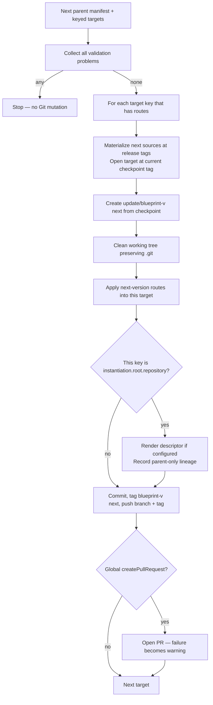
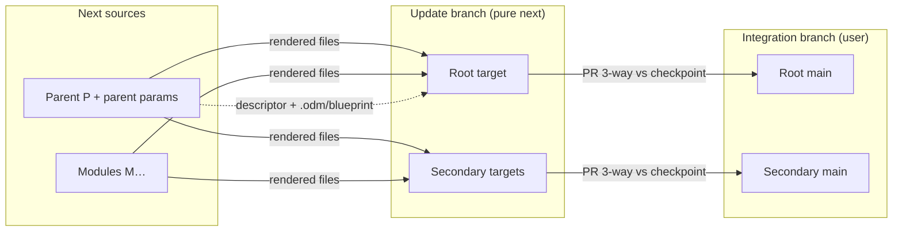
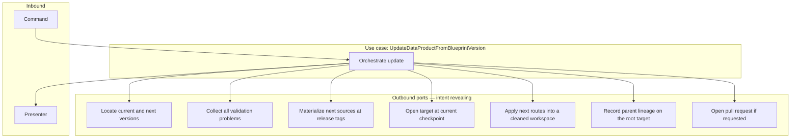

# SPDD Analysis: Support all repository scenarios for blueprint update

## Original Business Requirement

BDMD-4820
Extend the BDMD-4820-202608251703-[Analysis]-support-all-instantiation-repository-scenarios.md to support all repository scenarios for the blueprint update use case

BDMD-4820
Support all repositories scenario for blueprint instantiation use case.

- **Monorepo, no composition** — 1 repo, no composition, **1→1**: one parent blueprint into one target repo
- **Monorepo + composition** — 1 repo, with composition, **N→1**: parent + modules into one target repo (different paths)
- **Polyrepo, no composition** — ≥2 repos, no composition, **1→N**: one parent blueprint split across several target repos
- **Polyrepo + composition** — ≥2 repos, with composition, **N→N**: parent + modules routed across several target repos

## Notes

### Blueprint - DataProduct Lineage

Keep using only root blueprint and its parameters instantiation values as the only point for lineage tracking.

### DataProduct - Git Repository

Currently the DataProduct registry keeps track only of the "root" git repository (pointer with url and other metadata).
This should be extended to keep track also of other repositories, keeping also their key (the ones defined in the manifest)
so they can be referenced and reconciled during other processes (like blueprint update).
The registry **root** pointer (`dataProductRepo`) is the remote mapped to **`instantiation.root.repository`**; other keys are additional repos.

Out of scope:

- UI
- Blueprint update feature

### Additional requirements

1. Blueprint modules MUST be monorepo with no composition (for now).
2. All the blueprint structural validation rules MUST be checked both before publishing and before instantiation.
3. Validation errors should be explicit and clear to the user, specifying ALL the problems found. The error message should also include a hint on how to solve each error.
4. The data-product **root** repository (descriptor + lineage + registry `dataProductRepo`) MUST be declared explicitly on the parent routing block as `instantiation.root.repository` (a declared `repositories[].key`). Do not infer it from the first `root.targets[]` entry, from a descriptor-covering route, or from a reserved key name. `primary` on a target entry is not used.

For now, only support updates of the content of the existing bluperint structure. E.g. are not supported updates that include modification to the blueprint structure, like module change, repository key change, etc..

---

## Scope of this analysis (update)

The instantiate analysis above treated **blueprint update** as out of scope. This document **brings update in scope** for the **same four topologies**, without changing the instantiate/registry contracts already decided there.

In scope:

- `POST /api/v2/pp/blueprint/blueprints-versions/update-data-product` for **1→1**, **N→1**, **1→N**, and **N→N**.
- Same routing, lineage, module, and validation **rules** as instantiate, applied to the **next** blueprint version.
- Same tag-based 3-way merge **policy** as today’s 1→1 update, **per target** that receives routes.
- **Content-only** roll-forward: next version may change **files**, request parameter **values**, and composition **`parameterMapping`** inside an **unchanged** blueprint structure (keys, root, routes, composition slots).

Out of scope:

- UI
- Registry writes from the update use case (clients still pass `targetRepositories`; keyed registry rows remain a client-side reconciliation aid)
- PR merge and update-branch deletion (still user-driven in the Git provider)
- Nested composition / polyrepo modules
- First-time apply of a remote that has never received a pure checkpoint (that remains **instantiate**)
- **Structural** deltas between current and next (module add/remove/replace, repository key change, route/layout change, topology change, root-key change). **`parameterMapping` change is content**, not structure.

---

## Scenario charts (update)

Topology is **not** a manifest field. It is derived from the **next** parent version the same way as instantiate:

|                        | **No composition** | **With composition**       |
| ---------------------- | ------------------ | -------------------------- |
| **1 repository key**   | **1→1** monorepo   | **N→1** monorepo + modules |
| **≥2 repository keys** | **1→N** polyrepo   | **N→N** polyrepo + modules |

Legend: **P** = next parent blueprint, **M** = composed module (next parent’s `composition[]`), **T** = target Git remote identified by a manifest `key`. Each **T** already has a **pure** checkpoint `blueprint-v{current}`. Update writes a new pure tree on `update/blueprint-v{next}` and tags `blueprint-v{next}`. Dashed **lineage** arrows exist only toward the key equal to **next** `instantiation.root.repository`. **Next topology and layout must match current**; source **content**, parameter **values**, and **`parameterMapping`** may change.

### Shared per-target Git policy (all four topologies)



File copy follows **every** matching **next** route. Provenance metadata does **not** follow modules or secondary repos. User edits live on each remote’s integration branch and are combined later by Git’s 3-way merge in the PR — **not** by the server.

### 1→1 — Monorepo, no composition

One parent source, one target key. Path splits into the **same** key remain this case. Lineage stays on that key.

```text
P next (routes)
        │  from checkpoint blueprint-v{current}
        ▼
   T_main  ★ root + lineage  →  update/blueprint-v{next}
```

### N→1 — Monorepo + composition

Parent + modules write into **one** target at **non-nested** destinations (already forbidden at publish/instantiate). One checkpoint, one update branch, one PR (if requested). Lineage is still **parent only**.

```text
P ──── routes ──┐
M1 ── routes ───┼──► T_main  ★ lineage of P only
M2 ── routes ───┘     (clean + re-render next; user files stay on main)
```

### 1→N — Polyrepo, no composition

One parent source; subtrees routed to **different** keys. **Each** remote is updated independently: its own clone at **its** `blueprint-v{current}`, its own `update/blueprint-v{next}`, its own next checkpoint tag (same **name**, different remotes). Lineage only on `instantiation.root.repository`.

```text
              ┌── routes ──► T_infra-repo   (checkpoint + update branch)
P next ───────┤
              └── routes ──► T_app-repo ★ lineage
```

### N→N — Polyrepo + composition

Parent and modules independently route to declared keys. Same per-target update policy. Lineage only on the designated root key.

```text
P ──── routes ────────────────► T_pipeline-repo
ingest ── routes ─────────────► T_pipeline-repo
consume ─ routes ─────────────► T_api-repo ★ lineage of P only
```

### Lineage vs file routing vs 3-way merge (all cases)



---

## Domain Concept Identification

### Existing Concepts (from codebase)

- **Blueprint / Blueprint version**: Platform records for a template Git repository and a published snapshot. Update always loads **two** parent versions of the **same** blueprint (current vs next). Composition modules are other published versions looked up from the **next** parent’s `composition[]`.
- **Blueprint Manifest**: Authoritative routing contract (`instantiation.repositories[]`, `instantiation.root.repository`, `instantiation.root.targets[]`, `composition[]` with `targets[]` and `parameterMapping`). Relationship: **next** version must **repeat the same layout** as current (keys, root, routes, composition slots); **`parameterMapping` is content** and may differ. The use case then renders next content (including next mappings) through that frozen layout. Current is the **layout baseline**, not only a checkpoint name.
- **Instantiation scenario**: Four cases (1→1, N→1, 1→N, N→N) derived from repository-key cardinality × composition. Relationship: instantiate already runs **one pipeline** for all four; update still **switches** and throws “not supported yet” for three cases. Scenario remains a taxonomy for logging/tests, not four Git scripts.
- **Logical repository key / target mapping**: Request `targetRepositories[].targetId` must match `instantiation.repositories[].key`. Relationship: the update API is **already list-based** (`targetRepositories` / `results`); validation still requires **exactly one** entry matching the sole key.
- **Update data product from blueprint version**: Dedicated hexagonal use case (`POST .../update-data-product`). Relationship: Git flow differs from instantiate (branch from checkpoint, clean, no orphan, no merge to main, optional PR). It must **not** call the instantiate use case.
- **Tag-based 3-way merge / checkpoint / update branch**: Domain naming via `BlueprintGitNamingConventions` (`blueprint-v{version}`, `update/blueprint-v{version}`). Relationship: each **data-product remote** that received instantiate files already has a **pure** checkpoint; update creates the next pure commit **from that tag**. Same tag **name** on every remote is correct because tags live in different Git repositories — no per-key discriminator is required.
- **Optional Pull Request (global)**: `createPullRequest` applies to **all** processed targets; each entry may set `pullRequestTargetBranch`. PR open is a **side operation** (HTTP 200 + `warnings` on failure). Merge/delete remain out of scope.
- **Route (`sourcePath` → `repository` + `path`)**: Uniform mapping for parent root and composition modules. Relationship: instantiate already flattens routes and applies them per target; update still whole-tree-copies the **parent only** via `monorepoNoCompositionRenderAndCopy`.
- **Parameter set (parent) + module `parameterMapping`**: Next parent parameters come from the request; modules use **next** `{ $param }` / `{ value }` mappings (changes vs current are **supported**). Parent lineage must not include module-only parameters.
- **Blueprint–data-product lineage**: Parent version identity + parent resolved parameters on the **root** descriptor and `.odm/blueprint/` sidecar. Relationship: this ticket **keeps** parent-only lineage on the designated root target only, including during update.
- **Keyed data-product repositories (registry)**: Root `dataProductRepo` plus additional repos keyed by manifest `key`. Relationship: **preparatory** for clients to assemble `targetRepositories`; **update does not read or write the registry**.
- **Instantiate routing pipeline**: Locate → collect-all validation → flatten routes → per-target materialize sources / apply routes / lineage on root / checkpoint. Relationship: this is the **render/routing** half that update should reuse conceptually; Git **policy** stays update-specific.
- **Git provider constraint**: Module `BlueprintRepo` provider type and base URL must match the parent. Relationship: same as instantiate; mixed hosts in one update run stay out of scope.

### New Concepts Required

- **Multi-source, multi-target update**: Parent plus modules cloned at **next** source tags; each mapped data-product remote opened at **current** checkpoint tag; routes from the **next** manifest applied after a clean working tree. Relationship: same sources/routes as instantiate; different Git starting point (checkpoint, not integration branch) and ending (push update branch + next tag, not merge to main).
- **Cross-version structure freeze (content-only update)**: Current and next parent manifests must share the same **blueprint structure** (instantiation/composition **layout**). Relationship: update re-renders **content** through an **identical** layout: source files; request parameter **values**; composition **`parameterMapping`** (child keys, `$param` vs `value`, parent-key names, `{ value }` literals); optional module **version** bump in the same slot. Structural change is **not supported** (400), including: repository key add/remove/rename; `instantiation.root.repository` change; topology change (1→1 / N→1 / 1→N / N→N); `root.targets` route identity change (`sourcePath` + `repository` + `path`); composition **slot** change (add/remove alias, different `blueprintName`, different composition `targets`). Same alias + same `blueprintName` + same targets may point at a **new** `blueprintVersion` (module content roll-forward). Next `parameterMapping` is validated for **shape** (`{ $param }` / `{ value }`) and resolved against **next** parent parameters — it is **not** compared to current.
- **Per-target update result fan-out**: One `results[]` row per processed target (already on the wire). Relationship: N→1 still one result; 1→N / N→N produce several; warnings remain a **request-level** list.

### Key Business Rules

- All four topologies must **update** successfully when the request maps **every** next-version repository key to a concrete Git repo that already has checkpoint `blueprint-v{current}`.
- Routing, modules, descriptor placement, and lineage follow the **next** version only — same rules as instantiate (non-empty `root.targets`, declared `root.repository`, unused keys rejected, exact and nested destination conflicts rejected, modules 1→1, `{ $param }` / `{ value }`, parent-only lineage on the root key, platform-owned descriptor render when `descriptorTemplatePath` is set).
- **Structural rules** of the **next** manifest MUST be checked in the update use case (same **logic** as publish/instantiate, **separate** validation code — no shared validator class). Update additionally validates: current ≠ next, same blueprint, complete unique `targetId` map, **structure freeze** between current and next (layout fingerprint), parameters against the **next** manifest.
- Validation reports **all** problems found in that gate (do not stop at the first error). Each problem is **explicit**, **clear**, and includes a **hint**. Git/runtime failures after a valid request may still fail on the first operation.
- After validation, **each** target that receives at least one next-version route: open at current checkpoint → create update branch → **clean** → apply routes → if root, descriptor + parent lineage → commit → next checkpoint tag → push branch + tag → optional PR.
- Checkpoint tags remain **pure** next renders. Cleaning before re-render is what makes removed blueprint files disappear on the update branch without touching user-only files on the integration branch.
- The server **does not** merge PRs or delete update branches.
- `createPullRequest` is **global**; PR failure after a successful push for that target is a **warning**, not a failed request.
- Update **does not** call the registry. Clients may use keyed additional repos to fill `targetRepositories`.
- Child modules of the **next** parent must be published **monorepo, no composition**. Child instantiation topology is ignored for file placement; parent `composition[].targets` win.
- Parent parameter validation is the request contract; module parameters are derived from next `parameterMapping`, not a second client parameter bag.
- **Content-only updates** of the existing blueprint structure are supported; **structural modifications are not**. Reject (400, collect-all, with hint) any current→next delta in: repository keys, root key, topology, `root.targets` routes, composition slots (`alias` / `blueprintName` / composition `targets`). Allowed: file changes in parent/module sources; request parameter **values**; **`parameterMapping` changes** (rewire `$param`, change `{ value }`, add/remove mapped child keys) as long as next mappings are well-formed and resolve against next parent parameters; same-slot module `blueprintVersion` bump. First apply of a new remote remains **instantiate**.
- Partial Git failure across targets: **fail-fast** after the first Git failure; earlier remotes may already have been pushed. PR warnings do **not** stop later targets.
- UI remains out of scope.

---

## Strategic Approach

### Solution Direction

Treat this as a **backend** expansion of the existing **update** use case in blueprint-server only. Registry and instantiate contracts stay as delivered by the companion instantiate work. UI stays out of scope.

Keep the existing update hexagon (command + presenter + persistency / manifest / templating / git ports). Replace the scenario switch’s three “unsupported” branches with **one routing-and-render loop** parameterized by next-version sources (parent ± modules) and targets (one or many keys) — the same shape instantiate already uses — while **keeping update Git policy**: checkpoint checkout, update branch, clean, no merge to integration, optional PR.

High-level data flow: client supplies parent name, current/next versions, next parent parameters, and a full key→Git map → service loads current and next parent versions → collect-all validation (next structural + request + **structure freeze vs current**) → clone next sources at tags and each target at current checkpoint → for each target, branch / clean / apply **frozen** routes / lineage on root / commit / tag / push → optional PR per target → present `results` + `warnings`.

### High-level procedural flow (update hexagon)

`UpdateDataProductFromBlueprintVersion` stays a **clean use case**: it owns **when** and **why**. Adapters behind **outbound ports** own **how**. The use case never talks to Git providers, parsers, or CRUD services directly. Port operations stay **intent-revealing**. Technical verbs (`clone`, `evaluate Velocity`, `pushTag`) belong in adapters.

**Inbound:** command (parent name, current/next versions, parameters, keyed targets, author, global PR flag) and presenter.  
**Outbound (intent):** persistency, update validation, source/target workspaces at checkpoint, rendering into a target, parent lineage on the root target, optional PR open.



The use case drives this sequence (one pipeline for all four topologies). If validation finds problems, it **stops before any Git mutation** and presents **every** issue with a **fix hint**.

1. **Accept the command** — Require parent identity, distinct current/next versions, parameters, and a keyed target list.
2. **Locate current and next parent versions** — Same blueprint UUID; not-found is explicit.
3. **Collect all validation problems** — Update validation port (same **rules** as instantiate for the **next** manifest, **separate code**): structural manifest, required `instantiation.root.repository`, non-empty `root.targets`, unused keys, destination duplicates and nested path-prefix, **next** `parameterMapping` shape (not compared to current), parameter values vs defaults, complete unique `targetId` map. **Also:** compare current vs next **layout fingerprint** and reject any structural delta (keys, root key, topology, routes, composition slots). Do **not** include `parameterMapping` in that fingerprint. Do **not** validate descriptor placement against `root.targets`.
4. **Understand the job** — From the valid **next** manifest, derive routes, designated root target key, and which sources each target needs. Scenario may be logged; it does not fork Git policy.
5. **Locate modules** — For each next `composition[]` entry, persistency locates that published version. Each module **must** be monorepo, no composition. Collect all module problems with hints.
6. **Resolve module parameter sets** — `{ $param }` vs `{ value }` against the next parent resolved set. Failures are validation-style with hints.
7. **For each target key that receives at least one next route** (Git/runtime fail-fast after validation):
   1. **Materialize needed next sources at their release tags.**
   2. **Open the target at the current checkpoint tag** (not the integration branch). Missing tag → fail that target (runtime/Git), with a clear message to instantiate first or check the version numbers.
   3. **Start the update branch** from that checkpoint (`update/blueprint-v{next}`).
   4. **Clean the working tree** (preserve `.git`) so the next commit is a pure next render.
   5. **Apply every next route for this target** — same rendering intent as instantiate (`apply this route into this workspace`).
   6. **If designated root and `descriptorTemplatePath` is set:** render the descriptor onto the root workspace (platform-owned, after routes).
   7. **If designated root:** record parent lineage (next parent version + next parent parameters only).
   8. **Commit, mark next checkpoint, publish branch and tag** — use case **orders** these steps; the Git port exposes policy steps, not one opaque “do update”.
   9. **If global PR flag:** try to open a PR; on provider failure, append a **warning** and continue.
8. **Present** `results[]` (one row per processed target) and `warnings[]`.

```text
execute
  locate current and next parent versions (same blueprint, distinct versions)
  collect ALL validation problems (+ hints, including structure freeze vs current) → stop if any
  derive next routes, root key, sources per target
  locate modules; collect ALL module topology/mapping problems → stop if any
  for each target
      materialize required next sources at tags
      open target at current checkpoint
      create update branch; clean
      apply each next route
      if root: descriptor + parent lineage
      commit, next checkpoint tag, push
      optional PR → warnings on failure
  present results + warnings
```

**Port design guardrails**

- The use case **calls** ports; ports do not call the use case (except a workspace callback whose name states intent, e.g. sources + target available at checkpoint).
- **Do not** keep `gitPort.init` as a visible business step: bind the Git provider when materializing the first workspace, from the **parent** blueprint, as instantiate now does.
- **Do not** specialize the use case into four Git scripts.
- **Do not** keep `monorepoNoCompositionRenderAndCopy` as the update render path; rendering is **apply route**, shared conceptually with instantiate (each templating port still **delegates** to `BlueprintRenderService`, without a shared validator or a call from update into the instantiate use case).
- Lineage is **only** invoked for the root target, from the use case.
- Update **does not** call the registry.
- `CreatePullRequest` stays inside the Git port’s open-PR operation; the use case may catch provider failure only to map it to **warnings**.

### Key Design Decisions

- **One generalized update pipeline vs four scenario methods**: Four copies would diverge from instantiate and from each other. → **One pipeline** driven by next-version routes + keyed targets. Scenario enum is for logging/tests, not four Git scripts.
- **Mirror instantiate routing, keep update Git policy**: Instantiate already materializes multiple sources and applies routes per target. Update’s Git starting/ending points differ. → **Reuse routing/lineage/module rules**; **do not** invoke the instantiate use case; **evolve** update’s Git port toward “open next sources + target at checkpoint” instead of a single parent source × single target.
- **Which manifest drives the update?** → **Next** for **content** (source trees, parameter values, **`parameterMapping`**, lineage identity). **Current** is the **layout baseline**. Routes applied at Git time come from next, but they must be **identical** to current’s layout fingerprint or validation fails first.
- **Content-only vs structure change**: Authors may ship new files / template text / request parameter **values** / **`parameterMapping`** on the same layout. They may **not** reshape the product (new module, dropped module, different module `blueprintName`, new/removed/renamed repository key, different `root.repository`, different `root.targets` or composition `targets`, topology change). → **Reject** those layout deltas at validation (collect-all) with a hint that update is content-only for now. **`parameterMapping` is content**: next mappings replace current; validate next shape and resolve against next parent parameters. Same composition **slot** (`alias` + `blueprintName` + targets) may bump `blueprintVersion` so module **content** can move forward. New remotes still go through **instantiate**.
- **Checkpoint tag naming with many remotes**: Tags are per Git remote. → **Keep** `blueprint-v{version}` / `update/blueprint-v{version}` with **no** key suffix. A discriminator would only matter if two logical keys shared one physical remote (already undefined).
- **Structural validation on update**: Update today checks parameters and “exactly one target / 1→1”. → **Same structural rules as instantiate** on the **next** manifest, implemented in **update’s** validation port (not the publish visitor, not instantiate’s validator class). Request checks stay update-specific (versions, **structure freeze vs current**, `targetId` map).
- **Validation error reporting**: Fail-fast hides remaining issues. → **Collect all** validation problems; each with a fix hint. Align message style with instantiate’s issue list.
- **Lineage and descriptor**: Whole-tree update render currently copies parent lineage as part of 1→1 helper. → **Align with instantiate**: routes first; platform-owned descriptor on root; parent lineage only on `instantiation.root.repository`. No lineage copy on secondary remotes.
- **Module parameter mapping**: Bare scalars are invalid; `{ $param }` / `{ value }` as in instantiate. → Always use the **next** parent’s `parameterMapping` (changes vs current are **supported**). Resolve from **next** parent parameter set. Do **not** copy instantiate’s current shortcut of reusing the parent map as the module map if that still skips `parameterMapping`.
- **Git provider for module sources**: → Child provider type and base URL **must match** the parent (same as instantiate).
- **PR policy across many targets**: Already global on/off; already per-target base branch. → After **each** successful target push, attempt PR if the flag is on; PR failure warns and **does not** skip later targets. Git failure **does** stop later targets.
- **Does update write or read the registry?** → **No.** List-based `targetRepositories` remains the contract. Keyed additional repos help **callers** reconcile; they are not loaded inside this use case.
- **Missing current checkpoint**: → Fail that target; do not fall back to the default branch (would poison purity / 3-way semantics).
- **Intent-revealing Git port**: Today `init` + `withClonedSourceAndTargetAtCheckpoint` + `monorepoNoCompositionRenderAndCopy` leak 1→1 mechanics. → Evolve ports so `execute()` reads as the procedure above. Checkpoint **order** stays in the use case.
- **Partial Git failure**: Pushes are not a distributed transaction. → **Fail-fast**; document that earlier `results` may already exist on remotes (presenter may still only run on success today — if the use case throws, the client may not see partial `results`; that limitation is acceptable unless presenters already support partial success).
- **UI**: → Out of scope.

### Alternatives Considered

- **Leave N→1 / 1→N / N→N throwing until UI exists**: Rejected. This ticket explicitly enables all four **update** scenarios; UI remains out of scope.
- **Call instantiate (or share one use case) for the render half**: Rejected. Git policies differ (orphan+merge vs checkpoint+clean+PR). Sharing **render service** and **rules** is enough; sharing the use case would tangle hexagons.
- **Four `updateMonorepoWithComposition`-style methods**: Rejected. Instantiate already showed one route loop scales; four scripts would drift.
- **Allow adding a new repository key on next version and orphan-init that remote inside update**: Rejected. First pure checkpoint is **instantiate** policy (orphan → merge to integration). Mixing it into update would hide a second workflow and skip user confirmation on a brand-new remote. Also a **structure** change (not content-only).
- **Allow removing a key and skip that remote**: Rejected. Silent skip leaves stale products; authors must keep keys stable or run a separate (out of scope) retirement process.
- **Allow route / composition / module-identity changes when repository keys stay the same**: Rejected for now. Update is **content-only** on the existing blueprint structure (files, parameter values, **`parameterMapping`**). Module add/remove/replace and target path reshuffles are unsupported.
- **Freeze `parameterMapping` as part of structure**: Rejected. Mapping rewires, `$param` vs `value` switches, and mapped-key add/remove are **content** and must be applied from the **next** manifest.
- **Treat a module `blueprintVersion` bump as an unsupported “module change”**: Rejected. Same slot (`alias` + `blueprintName` + targets) with a new module version is **content** of that slot; swapping `blueprintName` or adding a slot is structure.
- **Infer missing `targetId`s from registry additional repos**: Rejected for this ticket. Update stays Git-only given the request list; registry is not a runtime dependency of blueprint-server update.
- **Copy lineage sidecar onto every target “so each repo is self-describing”**: Rejected. Lineage remains parent-only on the designated root, consistent with instantiate.
- **Per-target checkpoint tag suffix (`blueprint-v{version}-{key}`)**: Rejected. Unnecessary while each key maps to a distinct remote; collides with existing 1→1 tags already on remotes.
- **Change root key between versions and move lineage to the new root**: Rejected. Descriptor/registry identity would jump remotes without an instantiate of the new root. Require stable `instantiation.root.repository`.
- **Extract one shared validator class for publish, instantiate, and update**: Rejected. Rules are shared; implementations stay separate (known drift risk, covered by tests).
- **Stop at the first validation error**: Rejected. Report **all** problems, each with a hint.
- **Fail the whole request when one PR open fails**: Rejected. PR remains best-effort **warnings** on HTTP 200 for that request (if Git for remaining targets has not failed).
- **Server-side merge of update branches into integration**: Rejected. Tag-based 3-way merge in the user’s PR remains the product strategy.
- **Keep `monorepoNoCompositionRenderAndCopy` for 1→1 and add a second path for the other three**: Rejected. Even 1→1 must honor `root.targets` path splits; one apply-route path covers all four.

---

## Risk & Gap Analysis

### Resolved requirement decisions

| Topic                                          | Decision                                                                                                                                                                                          |
| ---------------------------------------------- | ------------------------------------------------------------------------------------------------------------------------------------------------------------------------------------------------- |
| **Four update topologies**                     | All four must work; no longer “not supported yet”.                                                                                                                                                |
| **Who supplies Git remotes**                   | Client `targetRepositories[]`. Update does **not** read/write the registry.                                                                                                                       |
| **Which version’s manifest**                   | **Next** for **content** (sources, parameter values, **`parameterMapping`**, lineage). **Current** is the **layout baseline**; next keys/root/routes/slots must match. |
| **Content-only vs structure**                  | **Content** (files, request parameter values, **`parameterMapping`**, same-slot module version bump) is supported. **Structure** (keys, root key, topology, routes, composition slots) is **rejected**. |
| **Key / module / route change current → next** | **Reject** (validation). Same keys, same `instantiation.root.repository`, same routes, same composition slots (alias + blueprintName + targets). **`parameterMapping` is not part of this comparison.** |
| **`parameterMapping` change current → next**   | **Supported** (content). Validate and resolve the **next** mapping only. |
| **Checkpoint naming**                          | Unchanged `blueprint-v{version}` / `update/blueprint-v{version}` per remote.                                                                                                                      |
| **Lineage**                                    | Parent next version + parent next parameters, **root target only**.                                                                                                                               |
| **Modules**                                    | Must be 1→1; file placement from parent `composition[].targets`.                                                                                                                                  |
| **Structural validation**                      | Same rules as instantiate, on **next**, in **update’s** own validation code. Collect **all** issues with hints.                                                                                   |
| **PR**                                         | Global flag; per-target base branch; best-effort warnings.                                                                                                                                        |
| **UI**                                         | Out of scope.                                                                                                                                                                                     |
| **First apply of a new remote**                | Instantiate, not update.                                                                                                                                                                          |
| **Shared validator class**                     | No.                                                                                                                                                                                               |
| **Call instantiate from update**               | No.                                                                                                                                                                                               |

### Requirement Ambiguities

None remaining for this analysis after the decisions above. Open product questions that are **explicitly closed** rather than deferred:

- Version **adjacency** / ordering (semver “must be next sequential version”) stays **unchecked** beyond same blueprint, current ≠ next, and existence — consistent with today’s update use case.
- Whether a **partial** Git success should return HTTP 200 with a mix of results is **not** introduced: Git fail-fast still **fails the request** after the first Git error (earlier remotes may already have been mutated).
- Declared parent **parameter keys** may grow or shrink on next as **content**; **next** `parameterMapping` `$param` references must still resolve (unknown parent key or missing value/default fails as today).

### Edge Cases

- **Empty `root.targets` on next**: Rejected (400) as a structural rule at update validation (same as publish/instantiate).
- **Missing or undeclared `instantiation.root.repository` on next**: Rejected (400).
- **Current and next key sets differ** (added/removed/renamed key): Rejected (400) — structure change; hint: keep keys stable or instantiate new remotes first.
- **Root key differs** between current and next: Rejected (400).
- **Topology differs** (e.g. current 1→1, next N→1): Rejected (400) — structure change.
- **`root.targets` or composition `targets` differ** (sourcePath / repository / path): Rejected (400) — structure change; content updates must keep the same routes.
- **Composition slot change** (add/remove alias, different `blueprintName`): Rejected (400) — module change unsupported.
- **Same slot, new module `blueprintVersion`**: Allowed — module **content** roll-forward.
- **`parameterMapping` differs** (child keys, `$param` vs `value`, `$param` parent key, `{ value }` literals): **Allowed**. Resolve **next** mappings; malformed next mapping or unresolvable `$param` still 400 (shape/resolution), not because it differs from current.
- **Missing `blueprint-v{current}` on one polyrepo remote**: Fail at Git open for that target; do not fall back to `main`.
- **Next tag or update branch already exists** on a remote: Reject (collision), same as 1→1 today.
- **Module polyrepo or composed**: Rejected when loading next composition.
- **`descriptorTemplatePath` set but template missing** in next parent source: Fail at update runtime (not a publish-time 400), same as instantiate.
- **Polyrepo with no descriptor-covering `root.targets` route**: Allowed; descriptor still placed on designated root when the template path is set.
- **Monorepo composition nested under parent `./`**: 400 structural (path-prefix), so update never has to define copy order.
- **Same physical Git URL mapped to two keys**: Still undefined/unsupported if URLs collide; two logical update cycles on one remote would fight over the same checkpoint tag name.
- **README/manifest relocate**: Parent `BlueprintRepo` paths; apply **only** on the root target after routes + implicit descriptor render (align with instantiate).
- **Blueprint file removed in next version**: Clean + re-render makes the deletion appear on the update branch; user-only files on integration remain additions vs the old pure checkpoint.
- **User edited same lines as next blueprint** (Scenario 2B): Expected PR conflict; no server resolution — now on **each** remote independently.
- **Empty commit** after clean+render identical to previous pure tip: Keep today’s implicit Git behavior (allow or fail as the Git layer already does); do not invent a new policy.
- **Existing 1→1 products**: Behavior remains: one key, checkpoint → update branch → optional PR; additionally honor `root.targets` instead of ignoring routes.
- **Global PR true, first target PR fails, second target Git still pending**: Warning recorded; continue other targets; overall HTTP 200 only if no Git failure.

### Technical Risks

- **Update Git clone is 1×1 today**: `withClonedSourceAndTargetAtCheckpoint` cannot hold parent + modules. Mitigation: evolve the update Git port like instantiate’s multi-source workspace callback, but check out the **target at the current checkpoint**.
- **Render path split**: Instantiate uses `applyRoute`; update still uses whole-tree `monorepoNoCompositionRenderAndCopy` (which also embeds lineage relocate). Mitigation: point update templating at the same route/descriptor/lineage operations instantiate uses; keep 1→1 as a special case of routes, not a second algorithm.
- **Instantiate module parameters may still skip `parameterMapping`**: Blindly copying instantiate’s use-case body could ship the same gap. Mitigation: update must resolve `{ $param }` / `{ value }` correctly even if instantiate still needs a follow-up.
- **Structural rule drift** across publish, instantiate, and now update: three code paths. Mitigation: the same invalid fixtures exercised on **all three** gates.
- **Same Git provider constraint**: Mixed hosts fail; validate up front with a named child.
- **Working-tree fan-out**: Multiple sources × multiple targets; temp dirs must still always clean up. Mitigation: per-target workspace (sources needed for that target only), same as instantiate.
- **Non-atomic multi-repo push**: Partial success is user-visible on remotes even if the API errors. Mitigation: fail-fast; document; do not attempt distributed rollback.
- **Missing checkpoint vs validation**: Tag existence is a **Git** fact, not in the manifest. Mitigation: fail clearly at open-target; do not try to validate tags without cloning.
- **Test blast radius**: `BlueprintUpdateDataProductControllerIT` and tag-based merge ITs assume 1→1 and treat composition/polyrepo as NotSupported. Those negatives must become positives (including composition child repos). Per-target checkpoint + PR warning cases need polyrepo coverage. Add fixtures where **next** changes structure (extra module, extra key, different route) and expect 400.
- **Layout fingerprint comparison**: Path normalization (`./` vs `""`), composition list order, and ignored extra JSON fields can cause false mismatch or false pass. Mitigation: compare normalized routes and composition **by alias**, same path rules as publish/instantiate. **Do not** include `parameterMapping` in the fingerprint.
- **Process docs** still describe Phase-1 single target. Mitigation: documentation alignment is in scope for the later generate/sync phase, not a product-rule change.
- **Long-running Git I/O**: Worse with N remotes. Mitigation: sequential per-target loop (same as instantiate); no new parallelism in this ticket.

### Acceptance Criteria Coverage

The requirement does not number ACs; implied criteria from the instantiate analysis **plus** update:

| AC# | Description                                                                                                                 | Addressable? | Gaps/Notes                                                                                                              |
| --- | --------------------------------------------------------------------------------------------------------------------------- | ------------ | ----------------------------------------------------------------------------------------------------------------------- |
| 1   | Monorepo, no composition (1→1) continues to update parent → one target from current checkpoint                              | Yes          | Must honor `root.targets`; keep parent lineage; keep PR/warnings behavior                                               |
| 2   | Monorepo + composition (N→1): parent + modules re-rendered into one target at distinct paths                                | Yes          | Modules must be 1→1; `{ $param }` / `{ value }`; one checkpoint/PR                                                      |
| 3   | Polyrepo, no composition (1→N): parent split across ≥2 mapped targets, each from its own current checkpoint                 | Yes          | Complete key mapping; lineage only on root; global PR applies to every target                                           |
| 4   | Polyrepo + composition (N→N): parent + modules routed across several targets                                                | Yes          | Combination of AC2+AC3; same Git-provider constraint                                                                    |
| 5   | Lineage tracks only root (parent) blueprint and parent instantiation parameters                                             | Yes          | Next parent + next parent params on `instantiation.root.repository` only                                                |
| 6   | Public list API (`targetRepositories` / `results`) is used without breaking change                                          | Yes          | Widen validation from “exactly one key” to “complete map”; DTOs already lists                                           |
| 7   | Optional global PR; merge/delete remain manual; PR failure → warnings                                                       | Yes          | Same as BDMD-5127; now N results                                                                                        |
| 8   | Checkpoint/update-branch naming unchanged; 3-way merge semantics preserved per remote                                       | Yes          | No key suffix; missing current tag does not fall back to default branch                                                 |
| 9   | Current vs next blueprint **structure** is frozen (keys, root, topology, routes, composition slots)                         | Yes          | Content-only: files, parameter values, **`parameterMapping`**, and same-slot module version may change; layout deltas are 400 with hint |
| 10  | Update does not write the registry; UI out of scope                                                                         | Yes          | Callers may still persist keyed additional repos separately                                                             |
| 11  | Unused keys, overlapping routes, nested path-prefix → 400 on **next**                                                       | Yes          | Update validation; same rules as instantiate                                                                            |
| 12  | `parameterMapping` `{ $param }` / `{ value }`; bare scalars invalid; **mapping changes vs current are supported**           | Yes          | Applied from **next** manifest when resolving modules; not part of the structure fingerprint                            |
| 13  | `instantiation.root.targets` non-empty; explicit `root.repository`                                                          | Yes          | On next version at update gate                                                                                          |
| 14  | Composition modules are monorepo with no composition                                                                        | Yes          | Fail update if a next-version module is polyrepo or composed                                                            |
| 15  | All structural validation **rules** apply before update (next version)                                                      | Yes          | Same logic; **separate code** from publish/instantiate                                                                  |
| 16  | Validation lists **all** problems; each message includes a **fix hint**                                                     | Yes          | Accumulate then report                                                                                                  |
| 17  | Descriptor always rendered on designated root when `descriptorTemplatePath` is set                                          | Yes          | Platform-owned; not a manifest route                                                                                    |
| 18  | Pre-existing user files on each integration branch are not deleted by later updates                                         | Yes          | Pure next checkpoint + 3-way PR per remote (instantiate already laid checkpoints)                                       |
| 19  | Updates that modify blueprint **layout** (module change, repository key change, route change, etc.) are not supported       | Yes          | Collect-all 400 vs current layout fingerprint; **`parameterMapping` change is allowed** (content)                       |
