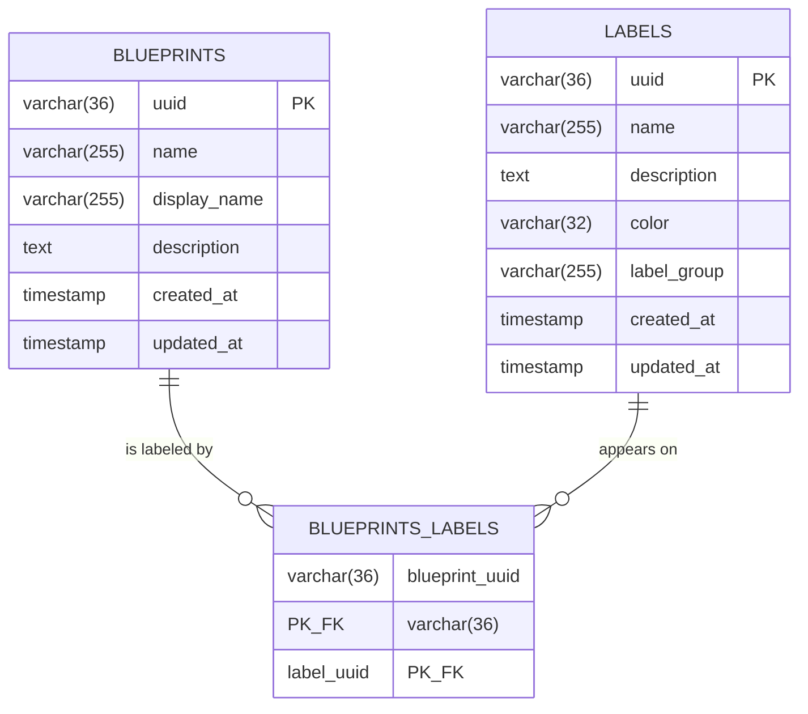

# SPDD Analysis: Blueprint categorization labels

## Original Business Requirement

As a Blueprint Editor,
I would like to be able to define tags for my Blueprint,
so that it can be categorized.

As a Blueprint User,
I would like to be able to select one or more tags,
so that I can filter and view the various Blueprints.

Technical details:  
Provide basic tags; determine whether to introduce a tag taxonomy (similar to Git labels) or leave them as free-form values (e.g. PE schemas).

**Decision (supersedes the options above):** GitHub-style **label** taxonomy. Product and API language is **label** / **labels** everywhere — never `tag` / `tags` for this feature — so it cannot be confused with `BlueprintVersion.tag` (Git release pointer). Label identity and properties live in `labels`; assignments live in `blueprints_labels` (join only, not a root aggregate). Not a concatenated string on `blueprints`, not a denormalized name/color copy on the blueprint. No deprecation. **No default / seed labels** — `V3__blueprint_labels.sql` creates the tables only; the catalog starts empty and admins create labels. See Strategic Approach.

**Agreed increment — label grouping (same ticket BDMD-5154):** Give labels a lightweight **group** so users are guided when filtering blueprints on the list page (e.g. group `Status` containing `experimental` and `stable`). Grouping is **presentation and catalog metadata only**. It must not introduce a first-class group aggregate, uniqueness inside a group, exclusivity, or new search/filter APIs by group. Reuse the **custom properties** grouping pattern unless a divergence is listed in the increment decisions below.

Locked decisions for this increment:

1. **Group is optional.** Omit/null/blank after trim → no stored group; UI fallback **"Other"** (same idea as custom properties **"Other Properties"**; use the shorter **"Other"** for labels). **Whitespace-only is not stored:** trim then validate; empty after trim is ungrouped. Follow the custom-properties pattern except where this increment explicitly diverges. **Distinct groups are exact strings** after trim (e.g. `Status` vs `status` are two groups; no case-folding), same as custom properties.
2. **Keep global label name uniqueness** (case-insensitive, existing rule). Group is not part of the natural key. Two labels cannot share a name even if they sit in different groups.
3. **No uniqueness or exclusivity inside a group.** Users may apply any combination of labels, including several from the same group (e.g. both `experimental` and `stable`). Filter semantics stay **OR** on selected label identities (`labelUuids`). Grouping does not change query meaning.
4. **No filter-by-group** on blueprints (`GET /blueprints` stays identity-based `labelUuids` only).
5. **No search-by-group** on the label catalog (`GET /labels` keeps name `LIKE` only; do not add a `group` search option).
6. **No first-class Group entity.** Do not add a `label_groups` table or group CRUD.

Backend increment (this service):

- Add optional `group` on the label catalog as a string column on `labels`.
- Column name **`label_group`** (avoid SQL reserved word `GROUP`), same rationale as custom properties `properties_group`. JSON/API/Java field name: **`group`**.
- **Use `V3__blueprint_labels.sql`** — do **not** keep labels as V2. After merge with the blueprint-type branch, **`V2__blueprint_type.sql`** already exists; labels (including `label_group`) ship as V3. Do **not** add a later Flyway version only for `label_group`.
- No change to `blueprints_labels`. Group lives on the label, not on the assignment.
- `group` is optional; max length 255 **after trim**; **free text** (internal spaces allowed, e.g. `Status`); do **not** apply the label-name character pattern to group.
- **Trim and validate on write:** leading/trailing whitespace is stripped. Whitespace-only is **not** a stored group (empty after trim → omit/null/empty, not `"   "`). Length is checked on the trimmed value. Distinct group identity is the **exact trimmed string** (no case-folding; `Status` vs `status` are two groups — custom-properties pattern).
- No required-group rule on the API (UI may encourage a value; API accepts omit/null/blank after trim).
- Name uniqueness unchanged: `existsByNameIgnoreCase` → 409. Group does not participate.
- Extend `Label` / `LabelRes` (and mapper) with optional `group`. Create/update/read/list return it.
- Because `BlueprintRes.labels` embeds `LabelRes`, blueprint get/search/register/update-documentation-fields return `group` automatically. No new blueprint endpoints.
- **Do not** add `group` to `LabelSearchOptions`.
- **Do not** add group-based blueprint search.
- Document `group` as a valid **sort** property on label search if the generic CRUD already sorts by entity fields (keep consistent with `name`, `color`, etc.). Sorting is not a filter.
- Agent: no new `/labels` paths. Existing handlers remain sufficient: GET = `BLUEPRINTS_VIEWER`; POST/PUT/DELETE = `BLUEPRINTS_ADMIN`. Additive field on `LabelRes` only.
- Tests: create/update/read round-trip `group` (trimmed); omit/null/blank/whitespace-only accepted as no group; padded group trims; name uniqueness still 409 across groups; existing label-uuid blueprint search unchanged; no ITs for search-by-group or filter-by-group (those APIs must not exist).

Out of scope for this increment (must not be reintroduced): first-class group CRUD / rename-one-place / group color/order entity; exclusive groups / “one label per group” on a blueprint; unique label names per group; `GET /labels?group=` or `GET /blueprints` filtered by group name; showing group text on blueprint cards (tooltip only — UI); new agent routes; a later Flyway version after V3 only for `label_group`.

---

## Domain Concept Identification

#### Existing Concepts (from codebase)

- **Blueprint**: Catalog template a Blueprint Editor registers and a Blueprint User browses. Owner of label assignments. Search is a paginated list filtered by name and by label identities (`BlueprintSearchOptions.labelUuids` + `BlueprintsRepository.Specs.hasAnyLabelUuid`, match-any OR, AND with other specs). Public writes go through register and update-documentation-fields; generic create/update/delete on `BlueprintController` exist (POST/PUT/DELETE are `@Hidden`) and persist whatever is on `Blueprint` / `BlueprintRes`. Business uniqueness of blueprint `name` is application-level (`existsByNameIgnoreCase` → `ResourceConflictException`), not a database unique constraint.
- **Blueprint repository**: Nested Git remote (`blueprints_repositories`). Own `uuid` PK — a **root nested aggregate**, unlike the label join. Not a labeling concept.
- **Blueprint version**: Published snapshot with a **Git release tag** (`tag` on `blueprints_versions`; search option `BlueprintVersionSearchOptions.tag`). Versioning only. Do not link it to the label catalog. That collision is why this feature is named **label**.
- **Blueprint search**: Paginated specification-based listing (`GET` on `BlueprintController`). Name and `labelUuids` are applied. Additional filters are added as fields on `BlueprintSearchOptions` and specs combined with AND. Grouping must **not** add a group filter here.
- **Register blueprint**: Public create. Command embeds `BlueprintRes`; `BlueprintUseCasesService` maps it with `BlueprintMapper.toEntity` and persists via `BlueprintService.create`. Extending `LabelRes` with `group` therefore flows into register **without a new use case**.
- **Update documentation fields**: Public update of display name, description, optional nested repository, and optional label assignments. Uses a **dedicated command**, not `BlueprintRes`. Nested labels are identity-only on write; catalog fields (including the new group) appear on the subsequent `BlueprintRes` read.
- **Anemic CRUD pattern**: `BlueprintController` / `LabelController` + `GenericMappedAndFilteredCrudService` + mapper + repository `Specs`. Label catalog search already supports generic entity-field sort (`uuid`, `name`, `description`, `color`, `createdAt`, `updatedAt`) via Spring Data `Pageable`. After this increment, document `group` in that same OpenAPI sort list — sorting is not a filter and does not require a search option.
- **Label (catalog)**: First-class categorization label with its own identity. Holds **name**, **description**, **color**, optional **group**, and audit timestamps. Shared vocabulary, not owned by one blueprint. Unused labels (zero assignments) are valid. No seed rows. Distinct from the Git release tag on a blueprint version. Physical table `labels` (Flyway `V3__blueprint_labels.sql`); entity `Label`; resource `LabelRes`; search options are **name `LIKE` only**.
- **Label assignment**: Many-to-many fact that a blueprint carries a catalog label. Lives only on `blueprints_labels`. **Not a root aggregate.** Identity of a row is the pair of foreign keys. Deleting a blueprint or a label **cascades** assignments away. Group does **not** live here.
- **Label catalog API**: Anemic CRUD for labels (create, read, update, delete, paginated search) at `/api/v2/pp/blueprint/labels`. Integration tests in `LabelControllerIT`. This remains the only catalog surface.
- **Authorization (boundary, not this service)**: `blindata-agent` path handlers for `/labels`: `BLUEPRINTS_VIEWER` reads; `BLUEPRINTS_ADMIN` catalog writes (create/update/delete). Blueprint-server itself does not check roles. **Assignment** writes stay on existing blueprint endpoints (`BLUEPRINTS_EDITOR`). **No new agent paths** for grouping.
- **Custom-property group (pattern analog in `blindata-api`, not copied here)**: Optional denormalized string on the definition (`properties_group` column → Java/JSON `group`). No groups table, no FK, no group identity, no API to list/rename groups. Group is not part of the natural key. Search options do not include group. UI (separate slice) derives distinct group names from already-loaded definitions.

#### New Concepts Required

- **Label group**: Optional denormalized **string** on the label catalog used as presentation and catalog metadata (e.g. `Status`). **Not** a first-class aggregate: no `label_groups` table, no FK, no group identity, no group CRUD. Groups exist only as distinct **exact trimmed strings** copied onto each label, same idea as custom-property `group` (no case-folding). Omit/null/blank after trim is valid (ungrouped); whitespace-only is trimmed away and is **not** stored. The UI fallback **"Other"** is a client presentation rule, not a stored sentinel. Group is **not** part of the label natural key and **not** stored on `blueprints_labels`.

#### Conceptual relationships

- **Blueprint 0..N — Label** via `blueprints_labels`. Categorization belongs to the blueprint catalog item, not to a version.
- **Label 0..1 — group string**: each label may carry one group string; many labels may share the same string. There is no Group entity to own or rename them in one place.
- **Ownership:** Admins own catalog labels (including the optional group string). Editors own assignments of existing labels. The catalog is shared. Enforcement is agent-side (`BLUEPRINTS_ADMIN` for catalog writes; `BLUEPRINTS_EDITOR` for blueprint assignment writes; `BLUEPRINTS_VIEWER` for catalog reads).
- **Lifecycle:** A catalog label exists independently of any blueprint until it is deleted. Deleting a blueprint removes its assignments only. **Deleting a label removes the label and all of its assignments (CASCADE).** Rename or regroup updates the label row; assignments keep the label identity, so name/color/group change everywhere.
- **Properties live on the label**, not on the blueprint and not on the join. Group is one more such property.
- **Define-first:** Labels are created through the label CRUD. Blueprints **reference existing labels**. Create-on-apply remains out of scope. Inventing a group string on a label is allowed (free text); inventing a Group record is not.

#### Key Business Rules

- Editors attach **existing catalog labels** to a blueprint so it is categorized. (Editor story.)
- Users select one or more catalog labels and see matching blueprints. The picker is the label catalog (may be empty until labels are created). (User story.)
- Product language is **label**, never tag, for this feature. `BlueprintVersion.tag` stays the Git release pointer.
- Filter **blueprints** by **label identity** (join), match-**any** (OR) across selected labels, AND with other search fields (name). Not substring / `CONTAINS` on a concatenated tags column. Untagged (unlabeled) blueprints still appear when no label filter is set. **Grouping does not change this:** no filter-by-group; still `labelUuids` only.
- **Label catalog name search** (`GET /labels?name=`): case-insensitive substring `LIKE` (e.g. `tes` matches `Test`). Distinct from blueprint-list name (still exact) and from identity-based `labelUuids`. **Do not add group search.**
- **Label name:** required; **trim then validate** (leading/trailing whitespace stripped; whitespace-only is not a name → 400 required). Case-insensitive uniqueness mirroring blueprints (`existsByNameIgnoreCase` / exclude self on update) → `ResourceConflictException` **(409)** on duplicate, same as blueprint names. **Global** — group is not part of the key. Two labels cannot share a name even in different groups. **Simple characters including internal spaces:** `^[A-Za-z0-9][A-Za-z0-9 _-]*$` (letters, digits, space, hyphen, underscore; must start with a letter or digit). Length/required/charset failures stay `BadRequestException` **(400)** via `validate()`, same as other catalog fields. Blueprint `name` itself has **no** charset regex and is **not** trimmed in `BlueprintServiceImpl` — label names follow the label **group** trim-then-validate pattern instead.
- **Label group:** optional free text; **trim then validate**; max 255 on the trimmed value; internal spaces allowed; **not** subject to the label-name character pattern. Omit/null/blank after trim accepted. Whitespace-only is not stored as a group. Distinct groups are exact trimmed strings (no uniqueness of group strings; `Status` and `status` may both exist). No exclusivity of labels within a group (several labels from the same group may be assigned together).
- **No duplicate assignment** of the same label on the same blueprint. The join’s identity is the pair of FKs, so the database already forbids a second row. Incoming collections with the same label twice still fail validation (400) rather than relying on a raw constraint error.
- **No deprecation.** Delete is hard delete + CASCADE of assignments. No `deprecated` column, not later.
- **No seed labels.** Catalog starts empty.
- Assignment writes go through existing blueprint endpoints once `Blueprint` / `BlueprintRes` carry labels: hidden POST/PUT on `BlueprintController`, register (via nested `BlueprintRes`), and update-documentation-fields (command already extended). Get and search return labels because they already return `BlueprintRes` — nested `LabelRes.group` therefore appears on those reads automatically.
- Authorization: **Admins** (`BLUEPRINTS_ADMIN`) create/update/delete catalog labels; **Editors** assign existing labels on blueprints; **Viewers** read the catalog. Enforced in `blindata-agent`. No new `/labels` paths.
- Scope of this increment: **blueprint-server** (schema + catalog field + ITs). UI grouping presentation is a companion slice after this API increment. Do not copy custom-property types into this service; follow the analog.

---

## Strategic Approach

#### Solution Direction

Keep the existing GitHub-style label taxonomy in this service and **add optional group metadata on the catalog label**, analog of custom-property grouping. Implemented artifacts (`Label`, `LabelRes`, `V3__blueprint_labels.sql`, `LabelServiceImpl.validate`, `LabelController` OpenAPI sort list, `LabelControllerIT`) include optional `group`. This increment does not add a new aggregate, controller, or use case.

1. **Label catalog** — Already anemic CRUD. Extend the catalog entity/resource with optional `group`. Empty catalog remains valid. No seed data. No new controller or use case. Custom-property analog in `blindata-api`: `CustomPropertyDefinition.group` maps to `properties_group`; `CustomPropertiesSearchOptions` has no group filter — do the same here (`LabelSearchOptions` stays name-only).
2. **Assignments** — Unchanged. Group is not on the join. Nested write still resolves **uuid only**; catalog fields (name, description, color, group) are read from the label.
3. **Search** — Unchanged semantics. `BlueprintSearchOptions.labelUuids` remains identity OR. `LabelSearchOptions` remains name `LIKE` only. **Do not** add group filters. Optionally document `group` as a **sort** property on label search because generic CRUD already sorts by entity fields — sorting is not a filter.
4. **Read** — Get-by-id and paginated search already return `LabelRes` (and nested on `BlueprintRes`); adding `group` there covers catalog, list, and detail.

Reuse: Flyway **`V3__blueprint_labels.sql`** (`labels` including `label_group`; V2 is `V2__blueprint_type.sql` after merge), JPA, MapStruct (`LabelMapper` maps same-named fields), `SpecsUtils`, existing exception types, generic CRUD template. Follow custom properties: denormalized string, column renamed to avoid SQL `GROUP`, JSON field `group`. Do not invent a Group entity, a new search option, or a new exception type.

**Not in this slice:** UI grouping presentation, new agent routes, seed data, deprecation, filter-by-group, search-by-group, exclusivity, per-group name uniqueness.

Chosen physical model (types aligned with the init schema: `varchar(36)` ids; **no** unique index on `labels.name`; **no** `label_groups` table):

`blueprints` is existing (relationship context). Tables: `labels` (`V3__blueprint_labels.sql`), `blueprints_labels` (same file). There is **no** group table and **no** FK from labels to a group identity. `V2__blueprint_type.sql` is the sibling blueprint-type migration, not labels.

`blueprints_labels` is **not** a root aggregate: **no** `uuid`**, no** `created_at`. Prefer **not** mapping it as an entity — a many-to-many join table owned by Blueprint (and Label). The primary key **is** `(blueprint_uuid, label_uuid)`, which is both identity and the uniqueness of an assignment.

| Relationship           | Cardinality | On delete                                                        |
| ---------------------- | ----------- | ---------------------------------------------------------------- |
| Blueprint → assignment | 1 — 0..N    | **CASCADE**                                                      |
| Label → assignment     | 1 — 0..N    | **CASCADE** (delete label → assignments gone; blueprints remain) |

#### Key Design Decisions

- **Naming: label, not tag.** Tables, entities, resources, search fields, OpenAPI, and analysis language use `label` / `labels`. Version Git `tag` is untouched.
- **Where labels live:** On **Blueprint**, not Blueprint version.
- **Label model:** Taxonomy with FK assignments. Properties on `labels` only. No concatenated or JSON labels column on `blueprints`.
- **Join is not an entity.** No surrogate key. Composite PK of the two FKs enforces one association per pair. Application still rejects duplicate ids in a request (400).
- **Label name uniqueness in the application, not the database.** Same mechanism and outcome as blueprint names (`existsByNameIgnoreCase` → `ResourceConflictException` **409**). **Global; group is not part of the natural key.**
- **Character class:** Simple characters on label `name`, **including internal spaces**. Pattern `^[A-Za-z0-9][A-Za-z0-9 _-]*$`. **Trim then validate** (max 255 on the trimmed value). Invalid → 400 via existing `validate()` / `BadRequestException`. **Do not apply that pattern to `group`.** Blueprint catalog `name` is not charset-restricted and is not trimmed; do not copy that here.
- **Label group (this increment):** Optional denormalized free-text string on the catalog label. SQL column `label_group` (avoid reserved `GROUP`); API/Java/JSON field `group`. **Trim then validate** (max 255 on trimmed value). Omit/null/blank after trim accepted; whitespace-only is not stored. Distinct groups are exact trimmed strings (custom-properties pattern; no case-folding). Analog of custom-property `properties_group` / `group`. **Not** a Group entity. **Not** on `blueprints_labels`.
- **`V3__blueprint_labels.sql`, not V2.** After merge with the blueprint-type branch, V2 is `V2__blueprint_type.sql`. Labels (including `label_group` on the `labels` table) ship as V3. Do **not** add a later version only for `label_group`.
- **No search-by-group / no filter-by-group.** `LabelSearchOptions` stays name-only. `BlueprintSearchOptions` stays `labelUuids` identity OR. UI grouping is client-side over loaded catalog rows.
- **Sort by `group` is allowed, not a filter.** Generic CRUD already sorts by entity fields; document `group` alongside `name`, `color`, etc. on label search. Do not add a dedicated group-sort API.
- **No exclusivity / no per-group uniqueness.** Any combination of labels may be assigned, including several from the same group. Filter meaning stays OR on identities.
- **Catalog API:** Existing anemic CRUD controller for labels. No new endpoints. `LabelRes.group` on create/update/read/list; nested automatically on `BlueprintRes.labels`.
- **Blueprint assignment write path:** Unchanged identity-only nested writes. Do not treat nested `group` on assignment payloads as a write of catalog metadata (catalog remains source of truth, same as name/color).
- **Blueprint assignment read path:** `GET /{uuid}` and `GET` search already return `BlueprintRes` — `group` on nested `LabelRes` covers detail and list.
- **Search:** Additional filter on `BlueprintSearchOptions` (selected label identities). Match-**any** (OR). Compose with name via existing AND of specs. Must stay wired. **No group field.**
- **Delete:** CASCADE from both blueprint and label. No RESTRICT. No deprecate. Group string dies with the label row; nothing else to cascade.
- **Rename / regroup:** Update the label row; assignments keep `label_uuid`. There is no one-place group rename (non-goal).
- **No seed labels.**
- **Authorization:** Agent `/labels` GET = `BLUEPRINTS_VIEWER`; POST/PUT/DELETE = `BLUEPRINTS_ADMIN`. Assignment writes stay editor-gated on blueprint endpoints. **No new paths.** Additive field only.
- **Scope:** `odm-platform-pp-blueprint-server` for this increment. UI grouping presentation is the companion UI SPDD. Do not copy custom-property code into this service.

#### Alternatives Considered

| Approach                                                  | Why rejected                                                                 |
| --------------------------------------------------------- | ---------------------------------------------------------------------------- |
| Concatenated string + `CONTAINS` on `blueprints`          | No catalog, substring false positives, cannot store color/description        |
| Free-form list / assignment-of-strings only               | No label properties; unused seed/catalog rows unsupported                    |
| Catalog + denormalized **value** on the blueprint (no FK) | Two sources of truth; rename/delete drift                                    |
| Taxonomy + extra concatenated search column               | Dual write, no benefit at this scale                                         |
| Labels on versions                                        | Wrong list to filter; Git `tag` already taken                                |
| Word `tag` for this feature                               | Collides with `BlueprintVersion.tag`                                         |
| UI-only filtering                                         | List is server-paginated; UI is out of this slice                            |
| Join table as entity with its own `uuid` / `created_at`   | Join is not a root aggregate                                                 |
| `UNIQUE` on `labels.name` in Flyway                       | Diverges from blueprint name; uniqueness stays an application rule           |
| RESTRICT on label delete / deprecation                    | Discarded; CASCADE hard delete is the definitive design                      |
| Seed / “basic labels” in migration                        | No initial seed                                                              |
| Create-on-apply                                           | Labels are created via label CRUD, then referenced                           |
| Implementing agent permissions in this slice              | Follow-up; established handlers live in `blindata-agent`                     |
| New use case only for assigning labels                    | Existing blueprint POST/PUT, register, and documentation-fields cover writes |
| First-class `label_groups` table / group CRUD             | Rejected: grouping is a denormalized string, same as custom properties       |
| Unique names per group / group in the natural key         | Rejected: keep global case-insensitive name uniqueness                       |
| Exclusive groups (one assigned label per group)           | Rejected: any combination remains valid; filter stays OR on identities       |
| `GET /labels?group=` or blueprint filter by group name    | Rejected: no search-by-group; no filter-by-group; UI groups in memory        |
| A later Flyway version after V3 only for `label_group`     | Rejected: `label_group` is already a column on the V3 `labels` table         |
| Keep labels as V2 after merge with blueprint-type          | Rejected: V2 is `V2__blueprint_type.sql`; labels are `V3__blueprint_labels.sql` |
| New agent `/labels` paths for grouping                    | Rejected: additive field on `LabelRes` only                                  |

---

## Risk & Gap Analysis

#### Requirement Ambiguities

Closed (original labels work): taxonomy vs free-form; concatenated `CONTAINS` vs identity for **blueprint** list filter (identity); catalog `name` search is case-insensitive `LIKE` (UI picker); AND vs OR (OR); deprecation (none); seed data (none); list vs detail (`BlueprintRes` both); write path (existing blueprint CRUD + both use cases); naming (`label`); join identity (no uuid); delete (CASCADE both sides); duplicate assignments (composite PK + 400); uniqueness HTTP status for labels (**409**, same as blueprints); character-class failures (**400**); charset `^[A-Za-z0-9][A-Za-z0-9 _-]*$` (internal spaces allowed; trim on write); color `#RRGGBB` optional at API (UI always sends a palette color on create); OpenAPI label CRUD documented; auth (catalog writes **`BLUEPRINTS_ADMIN`**, catalog reads **`BLUEPRINTS_VIEWER`**, assignment writes **`BLUEPRINTS_EDITOR`**, **same delivery as UI** in `blindata-agent`); UI follow-up is now in progress (`blindata-ui`).

Closed (grouping increment — do not reopen): optional group; global name uniqueness (group not in the key); no exclusivity / no per-group uniqueness; no filter-by-group; no search-by-group; no Group entity; column `label_group` / API `group`; **`V3__blueprint_labels.sql`** (V2 is `blueprint_type` after merge); free text max 255 not name-pattern; **trim then validate** (whitespace-only stored as `null`); **distinct groups are exact trimmed strings** (custom-properties pattern; `Status` vs `status` are two groups; no case-folding); no required-group on API; nested `group` appears on blueprint responses via `LabelRes`; no new agent paths; ITs for round-trip/blank/trim/uniqueness-across-groups only.

Residual (genuine, not a reopen):

- **Local databases that applied an old `V2__blueprint_labels.sql`:** After merge, V2 is `V2__blueprint_type.sql` and labels are `V3__blueprint_labels.sql`. Environments that already ran the previous labels-as-V2 file need a local schema recreate/repair of `odm_blueprint`. This is an environment concern, not a product reopen.

#### Edge Cases

- **Empty assignments:** Blueprint with no labels still lists; label filter does not hide unlabeled items unless a label is selected.
- **Empty catalog:** Valid. Search with no label filter still lists all blueprints. Picker has nothing until an Editor creates labels (UI follow-up).
- **Name search + label filter together:** both apply (AND of spec groups; OR inside labels).
- **Delete label:** assignments for that label disappear; blueprints remain, unlabeled by that label.
- **Delete blueprint:** assignments for that blueprint disappear; catalog labels remain.
- **Rename while assigned:** blueprints show the new name/color with no join rewrite.
- **Regroup while assigned:** blueprints show the new group on nested `LabelRes` with no join rewrite.
- **Duplicate label name:** 409 (`ResourceConflictException`), same as duplicate blueprint names.
- **Duplicate label name in a different group:** still 409 — group is not part of the key.
- **Illegal characters in label name** (`/`, `.`, punctuation, emoji): 400. **Internal spaces in name:** allowed (e.g. `Source aligned`). **Padded name** (`"  Source aligned  "`): stored as `Source aligned`. **Whitespace-only name:** 400 (required after trim). **Spaces in group:** allowed (e.g. `Status`).
- **Same label twice on one blueprint in a request:** 400; database composite PK is the backstop.
- **Unknown label id on a blueprint write:** 400 (or 404 if the established reconcile pattern for missing refs uses not-found — prefer the existing pattern in this codebase, not a new one). Current implementation: 400 `Unknown label uuid`.
- **Omit labels on update-documentation-fields:** preserve existing assignments (same idea as omitting nested repository). Present collection replaces.
- **Concurrent catalog creates of the same name:** same residual race as blueprint names (no DB unique on name). Accept.
- **Label catalog `name` LIKE:** `tes` matches `Test` (case-insensitive substring). Empty `name` applies no catalog name filter. `_` and `%` in the query are escaped so they are literals.
- **Label name that looks like a Git version tag** (`v1.0.0`): allowed if it passes simple-character and uniqueness rules; confusion is avoided by the `label` name in the API.
- **Omit/null/blank `group`:** accepted; stored without a group value; UI **"Other"** is not written by the API.
- **Whitespace-only `group`:** trim; empty after trim is stored as no group (not `"   "`). Not a 400.
- **Padded group** (`"  Status  "`): stored as `Status`.
- **`Status` vs `status`:** two distinct groups (exact trimmed strings; custom-properties pattern).
- **Several labels from the same group on one blueprint:** valid; not exclusive; blueprint search still OR on `labelUuids`.
- **Sort by `group`:** allowed as generic entity-field sort; null/blank ordering is database-default; not a filter. Do not add `LabelSearchOptions.group`.
- **Nested write sending `group` on `BlueprintRes.labels`:** ignored for catalog mutation (uuid-only assignment), same as nested name/color.

#### Technical Risks

- **Git** `tag` **collision:** Mitigated by using **label** everywhere for this feature.
- **Documentation-fields does not share** `BlueprintRes`**:** Register and hidden POST/PUT pick up nested labels from `BlueprintRes` automatically; documentation-fields already extended for assignments. Grouping needs **no** further command change if `LabelRes`/`Label` carry `group` for reads and assignment writes stay uuid-only.
- **Many-to-many without a join entity:** Mapping and cascade/orphan behavior must keep the join table in sync on overwrite (replace collection) without cascading **persist/delete of Label** from Blueprint (deleting a blueprint must not delete catalog labels). Only join rows cascade. Unchanged by grouping.
- **Search join + OR:** Must use the existing `Specs` / `combineWithAnd` pattern and a spec that ORs selected label identities. Distinct/count pagination with joins is a known JPA pitfall — handle the way this service already pages related data, do not introduce a new query stack. **Do not** add a group join or group predicate.
- **Application-level name uniqueness races:** Same as blueprints. Accept. Group does not participate and must not be added to uniqueness checks.
- **Flyway + JPA validate:** `labels.label_group` in `V3__blueprint_labels.sql` must match `@Column(name = "label_group")` on `Label`. Environments that applied a previous `V2__blueprint_labels.sql` need a local schema recreate/repair.
- **SQL reserved word `GROUP`:** Mitigated by column name `label_group` (custom-property precedent `properties_group`). Java/JSON field remains `group`.
- **Agent auth:** `/labels` GET = `BLUEPRINTS_VIEWER`; POST/PUT/DELETE = `BLUEPRINTS_ADMIN`. Additive JSON field does not require new routes. Until handlers existed this was a gap; they now exist in `blindata-agent` as a companion delivery.

#### Acceptance Criteria Coverage

Formal numbered ACs were not in the original story. Coverage is against the stories plus decided design, including the grouping increment.

| AC# | Description                                       | Addressable? | Gaps/Notes                                                                                                         |
| --- | ------------------------------------------------- | ------------ | ------------------------------------------------------------------------------------------------------------------ |
| 1   | Blueprint Editor can assign labels to a blueprint | Yes          | Via existing POST/PUT, register, and extended update-documentation-fields. Labels must already exist (label CRUD). |
| 2   | Blueprints are categorized via those labels       | Yes          | Assignments on `blueprints_labels`; properties from `labels`. Returned on `BlueprintRes` (get + search).           |
| 3   | Blueprint User can select one or more labels      | Yes (API)    | Catalog list from label CRUD. UI picker is follow-up.                                                              |
| 4   | Selected labels filter the blueprint list         | Yes          | `BlueprintSearchOptions` + Specs; match-any (OR); composes with name. Unchanged by grouping.                       |
| 5   | Provide basic / seed labels                       | N/A          | **Decided: none.** Catalog starts empty. `V3__blueprint_labels.sql` has no `INSERT`. Admins create labels.          |
| 6   | Taxonomy vs free-form vs hybrid                   | Yes          | **Decided: taxonomy** (`labels` + `blueprints_labels`).                                                            |
| 7   | Concatenated column + `CONTAINS`                  | N/A          | **Rejected.**                                                                                                      |
| 8   | Label catalog CRUD                                | Yes          | Anemic controller similar to `BlueprintController`.                                                                |
| 9   | Delete label                                      | Yes          | Hard delete, **CASCADE** assignments. No deprecate, no RESTRICT.                                                   |
| 10  | Unique label names + simple characters            | Yes          | Case-insensitive uniqueness like blueprints → **409**. Internal spaces allowed; trim then charset/required/length → **400**. |
| 11  | No duplicate label on one blueprint               | Yes          | Composite PK of the join; validate request collections.                                                            |
| 12  | Catalog write authorization                       | Companion    | `BLUEPRINTS_ADMIN` for POST/PUT/DELETE `/labels`; `BLUEPRINTS_VIEWER` for GET. Assignment writes stay `BLUEPRINTS_EDITOR`. No new paths. |
| 13  | UI list/detail chips and filter                   | Follow-up    | API returns labels on `BlueprintRes`; UI grouping presentation is the UI SPDD.                                     |
| 14  | Optional denormalized `group` on label            | Yes          | Column `label_group`; API/Java/JSON `group`. `V3__blueprint_labels.sql`; V2 is `blueprint_type`.                    |
| 15  | Group validation                                  | Yes          | Optional; trim then validate; max 255 on trimmed value; free text; not name-pattern; omit/null/blank/whitespace-only → no group. |
| 16  | Global name uniqueness unchanged                  | Yes          | 409 even when groups differ. Group is not in the natural key.                                                      |
| 17  | No group search; no blueprint filter-by-group     | Yes          | Do not add `LabelSearchOptions.group` or blueprint group filter. No ITs that require those APIs.                   |
| 18  | No group entity / no join-table change            | Yes          | No `label_groups`; `blueprints_labels` unchanged.                                                                  |
| 19  | `LabelRes` carries `group`; nested on blueprints  | Yes          | Mapper + existing `BlueprintRes.labels` embedding. No new blueprint endpoints.                                     |
| 20  | Agent: no new paths                               | Yes          | Additive field only; GET `/labels` = viewer; catalog writes = admin.                                               |
| 21  | ITs: round-trip, blank/trim group, uniqueness across groups | Yes     | Extend `LabelControllerIT`; keep existing `labelUuids` blueprint search ITs; do not add group-search tests.        |
| 22  | No exclusivity / per-group uniqueness             | Yes          | Non-goal; do not add such validation.                                                                              |
| 23  | Sort by `group` on label search                   | Yes          | Document as valid sort property consistent with existing generic entity-field sort. Not a filter.                  |

