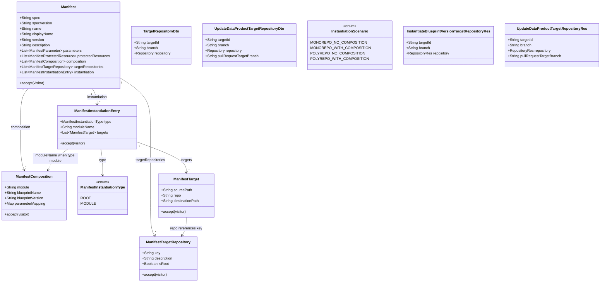

# Align Blueprint Manifest code to targetRepositories / typed instantiation specification

> Companion runtime for all four instantiate/update topologies: `BDMD-4820-202608261148` / `BDMD-4820-202608271455` and their analysis files. Authoritative schema: `src/main/java/org/opendatamesh/platform/pp/blueprint/manifest/README.md`.

## Requirements

- Align the Blueprint Manifest contract in **blueprint-server** and **blindata-ui** with the specification: top-level `targetRepositories[]` (exactly one `isRoot: true`), typed `instantiation[]` routing entries (`type: root` | `type: module`), and `composition[]` for module identity + `parameterMapping` only — replacing `strategy`, `compositionLayout`, and postfix/`createPolicy` targets.
- Keep authoring, parsing, validation, and the already-supported **single-repository, no-composition** instantiate/update path working so blueprints can be published and applied.
- Add minimal instantiate/update target key-mapping: request targets carry **`targetId`** (manifest `targetRepositories[].key`) and are reconciled with the sole repository key; do not carry a request `type` enum. Do not implement multi-repo UX or composition/polyrepo runtime.
- Hard cut: no dual-read/migration for old `strategy` manifests. Defer multi-key lineage-root designation and path-split render beyond today’s monorepo copy-all behavior.

## Entities



## Approach

1. Schema alignment (hard cut):
   - Java and JS models use top-level `targetRepositories[]` + typed `instantiation[]` + `composition[]` (module identity + `parameterMapping` only).
   - Remove obsolete types/fields: `InstantiationStrategy`, `compositionLayout`, `ManifestInstantiationCompositionLayout`, postfix/`createPolicy`/`targetPath` target fields.
   - Shared route shape (`ManifestTarget`): `sourcePath` (default `./`), `repo` (key ref), `destinationPath` (default `./`).
   - Root designation: exactly one `targetRepositories[]` entry sets `isRoot: true` (lineage / descriptor / registry primary pointer).
   - No dual-read of old manifests.

2. Validation and autofill:
   - Enforce unique `targetRepositories[].key`, exactly one `isRoot: true`, unique composition modules, `repo` refs resolve, composition/instantiation module alignment (every `composition[].module` has a matching `instantiation[]` entry with `type: module`), multi-entry targets require explicit `sourcePath`, relative paths only (reject absolute and `..`).
   - Autofill defaults for publish/register: if incomplete, seed one `targetRepositories` entry (`key: main-repository`, `isRoot: true`) and one `instantiation[]` root entry with a single target `./` → that key → `./`; default parameter `type` to `string` as today.
   - Each `instantiation[]` entry requires non-empty `targets`; exactly one entry must have `type: root`.

3. Runtime scenario + targets:
   - Derive `InstantiationScenario` from `targetRepositories` key cardinality + composition presence (not `strategy`).
   - Full four-topology runtime is specified in companion prompts `BDMD-4820-202608261148` / `BDMD-4820-202608271455`; this prompt’s delivery scope is schema alignment plus the already-supported single-key, no-composition path.
   - Monorepo render for that path remains copy-all via `BlueprintRenderService` (do not implement path-splitting render in this ticket).
   - Request targets: add `targetId`; remove `BlueprintRepositoryLogicalType` / request `type`. Reconcile `targetId` ↔ sole `targetRepositories[].key`. Accept exactly one target whose `targetId` equals the sole repository key. Root vs module role stays in the manifest (`instantiation[]` entry type / `composition[]`).

4. Blindata UI:
   - Mirror schema in `manifestSdk` (model, parser, serialize, traverse, visitors).
   - Repository step: branch on single vs multiple repository keys (not `InstantiationStrategy`); single-key → existing mono UI; multi-key → unsupported alert.
   - Submit payloads include `targetId` (not `type`) for instantiate/update.
   - Registration scaffolds emit new instantiation YAML.

5. Docs/fixtures:
   - Update example YAMLs, instantiate fixtures, `docs/service/blueprint-process.md` references away from `strategy`.

## Structure

### Inheritance Relationships

1. Manifest schema objects continue to extend `ManifestComponentBase` (Java) / `ManifestComponentBase` (JS) for `additionalProperties` / extensions.
2. `ManifestTargetRepository`, `ManifestInstantiationEntry`, and `ManifestTarget` extend the same base and participate in visitors.
3. `ManifestTarget` is the shared route type used by `instantiation[].targets[]` (both `type: root` and `type: module`).
4. `ManifestComposition` declares module identity and `parameterMapping` only; routing lives on matching `instantiation[]` module entries.
5. Remove `ManifestInstantiationCompositionLayout`, `InstantiationStrategy`, and `BlueprintRepositoryLogicalType` from the model/API.

### Dependencies

1. `ManifestParser` / extension visitor walk `targetRepositories`, `instantiation[]` entries and their targets, and `composition[]`.
2. `OdmBlueprintValidationVisitor` / `OdmBlueprintManifestAutoFillerVisitor` depend on the new model fields.
3. `InstantiateBlueprintVersion` and `UpdateDataProductFromBlueprintVersion` resolve scenario from `targetRepositories` cardinality + composition; validate targets via manifest outbound ports.
4. `BlueprintRenderService.isMonorepoNoComposition` uses `targetRepositories` cardinality + empty composition (not strategy).
5. REST `*TargetRepositoryRes` ↔ domain `*TargetRepositoryDto` mapped in use-cases services; UI API clients send `targetId`.
6. UI `ManifestParser` + repository step + registration templates depend on updated SDK.

### Layered Architecture

1. Manifest model/parser layer: schema types and Jackson/JS binding.
2. Validation/autofill visitors: publish-time structural rules.
3. Use-case layer: scenario resolution, target reconciliation, monorepo-no-composition orchestration (ports/adapters unchanged in shape).
4. REST adapter: command/result resources with `targetId` (no request `type`).
5. UI Manifest SDK + instantiation/registration flows: client-side parse and payload assembly.
6. Exception handling: existing `BadRequestException` / `UnsupportedOperationException` → global handler (no new handler).

## Operations

### Update Manifest Model (Java) — Target Repositories, Instantiation & Composition

1. Responsibility: Make the Java manifest model match the README schema for target repositories, typed instantiation routing, and composition.
2. Changes:
   - `Manifest`: add `List<ManifestTargetRepository> targetRepositories` and `List<ManifestInstantiationEntry> instantiation`; remove nested `ManifestInstantiation`.
   - Add `ManifestTargetRepository` (`key`, `description`, `isRoot`) under `model/instantiation`.
   - Add `ManifestInstantiationEntry` (`ManifestInstantiationType type`, optional `moduleName`, `List<ManifestTarget> targets`) and `ManifestInstantiationType` enum (`ROOT`, `MODULE`).
   - Shared route type `ManifestTarget`: fields `sourcePath`, `repo`, `destinationPath` only; remove postfix, createPolicy, module, targetPath / `repository` / `path` and nested create-policy enum.
   - `ManifestComposition`: module identity + `parameterMapping` only (routing lives on `instantiation[]` module entries).
   - Delete `ManifestInstantiationCompositionLayout.java` and `InstantiationStrategy` enum.
3. Visitors:
   - Update `ManifestVisitor` to visit `ManifestTargetRepository` and `ManifestInstantiationEntry`.
   - Add `ManifestInstantiationEntryVisitor` for shared `ManifestTarget` routes under each instantiation entry.
   - Update `ManifestExtensionVisitorImpl` and accept() wiring so instantiation entries visit their targets.
4. Constraints: Keep `ManifestComponentBase` extension behavior; unknown properties still land in `additionalProperties`.

### Update Manifest Validator — `OdmBlueprintValidationVisitor`

1. Responsibility: Enforce new structural rules; drop strategy/compositionLayout/postfix rules.
2. Logic on `visit(Manifest)` (post-pass after walking children):
   - Require non-null non-empty `targetRepositories`; each `key` non-empty; keys unique; exactly one entry with `isRoot: true`.
   - Require non-null non-empty `instantiation`; exactly one entry with `type: root`; every `instantiation[].targets` non-empty.
   - Align `composition[]` with `instantiation[]`: every composition module has a matching `type: module` entry (and vice versa).
   - Collect declared keys; validate every `instantiation[].targets[].repo` against that set; reject unused keys.
3. Logic on targets (via `ManifestInstantiationEntryVisitor`):
   - `repo` required and must match a declared key.
   - If targets list size > 1, each entry must have explicit non-blank `sourcePath`.
   - `sourcePath` / `destinationPath`: reject absolute paths and segments `..`; allow default `./` when single-entry or when explicitly set.
4. Logic on `visit(ManifestComposition)`:
   - Keep module / blueprintName / blueprintVersion required + unique modules.
   - Validate `parameterMapping` shape only (no targets on composition).
5. Remove all `InstantiationStrategy` / `compositionLayout` / postfix / createPolicy validation and related state fields; adjust `OdmBlueprintManifestValidatorState` accordingly.

### Update Manifest Autofiller — `OdmBlueprintManifestAutoFillerVisitor`

1. Responsibility: Seed minimal valid target repositories and root instantiation for incomplete manifests at publish/autofill time.
2. Logic:
   - If `targetRepositories` empty, add `{ key: "main-repository", description: optional, isRoot: true }`.
   - If `instantiation` empty, add one `{ type: root, targets: [{ sourcePath: "./", repo: <sole or first key>, destinationPath: "./" }] }`.
   - Do not invent composition, module instantiation entries, or multiple repositories.
   - Keep parameter type defaulting to `STRING` when key present and type null.

### Update Scenario Resolution & Target Validation (Instantiate / Update)

1. Responsibility: Drive supported vs unsupported paths from the new topology; reconcile `targetId` with the sole repository key.
2. Shared scenario helper (use in instantiate + update + render checks):
   - Let `repoCount = targetRepositories.size()` (distinct keys).
   - `hasComposition = composition non-empty`.
   - `repoCount == 1 && !hasComposition` → `MONOREPO_NO_COMPOSITION`.
   - `repoCount == 1 && hasComposition` → `MONOREPO_WITH_COMPOSITION`.
   - `repoCount > 1 && !hasComposition` → `POLYREPO_NO_COMPOSITION`.
   - `repoCount > 1 && hasComposition` → `POLYREPO_WITH_COMPOSITION`.
   - Missing/empty `targetRepositories` → `BadRequestException`.
3. `InstantiateBlueprintVersion` / `UpdateDataProductFromBlueprintVersion`: replace `getStrategy()` branching with the helper; keep unsupported cases throwing `UnsupportedOperationException` with the same messaging style.
4. Domain DTOs:
   - `TargetRepositoryDto`: use `String targetId` (replace unused `id` and remove `type`) + `branch` + `repository`.
   - `UpdateDataProductTargetRepositoryDto`: use `String targetId` (replace `type`).
5. Delete `BlueprintRepositoryLogicalType` (no longer used on request/result).
6. Manifest outbound port validation (instantiate + update):
   - For this prompt’s delivery scope: exactly one target; `targetId` non-blank and equals the sole `targetRepositories[].key`.
   - Reject multi-target lists here with clear BadRequest (multi-repo runtime is companion work).
7. REST resources: replace `type` with `targetId` on `InstantiateBlueprintVersionTargetRepositoryRes`, update-data-product target/result res types; map in use-cases services.
8. `BlueprintRenderService.isMonorepoNoComposition`: derive from single `targetRepositories` key + empty composition (remove `MONOREPO` strategy import).

### Update Tests & Fixtures (blueprint-server)

1. Rewrite `src/test/resources/manifest/example-2.*.yaml` and `instantiate/source-repo/manifest.yaml` to the README examples (`targetRepositories`, typed `instantiation[]`, composition without targets).
2. Update `ManifestParserTest` assertions for new fields; remove strategy/compositionLayout expectations.
3. Update instantiate/update ITs and any validator unit tests to send `targetId` and new manifest content (no `type` field).
4. Ensure monorepo-no-composition happy path still passes; multi-key / composition manifests fail as unsupported at use-case level after structural validation succeeds (or validation fails only on structural errors).
5. Replace obsolete “wrong type” ITs with “`targetId` must match sole repository key” coverage.

### Update Docs (blueprint-server)

1. `docs/service/blueprint-process.md` and `docs/README.md`: replace “strategy” wording with `targetRepositories` / typed `instantiation[]` topology.
2. Do not change the authoritative manifest README schema (already updated); only consumer docs.

### Update Manifest SDK (blindata-ui) — Model / Parser / Traverse

1. Responsibility: Mirror Java schema in `src/pages/dataops/blueprints/manifestSdk/`.
2. Model:
   - `Manifest`: `targetRepositories`, `instantiation[]`.
   - Add `ManifestTargetRepository.js`, `ManifestInstantiationEntry.js`, `ManifestInstantiationType.js`.
   - Shared route type `ManifestTarget`: `sourcePath`, `repo`, `destinationPath`.
   - `ManifestComposition`: module identity + `parameterMapping` only (no targets).
   - Remove `InstantiationStrategy` / `InstantiationTargetCreatePolicy` from `constants.js`; expose helpers that derive mono vs multi from `targetRepositories.length` (`isSingleRepositoryTopology`, `soleRepositoryKey`, `rootRepositoryKey` from `isRoot`).
3. `ManifestSerializationVisitor` / `parser.js`: serialize/deserialize the schema.
4. `traverseManifest.js`: walk `targetRepositories`, `instantiation[]` entries and their targets, and `composition[]`.
5. Update SDK README instantiation notes if they mention strategy.

### Update Instantiation UI Flows (blindata-ui)

1. Repository step (`repositories_step/BlueprintInstantiationModalRepositoriesStep`):
   - Deserialize manifest; if single repository key, render existing `MonoRepositoryConfiguration`.
   - If multiple repository keys, show unsupported alert (same UX intent as former polyrepo alert).
   - Validity: single key + secretMatched + repo configured; set `targetId` to that key on the target entry in parent state (no `type: 'root'`).
2. Instantiation submit / API payload builders: include `targetId` (not `type`) on each target repository sent to instantiate (and update wizard if it posts targets).
3. Delete the duplicate/re-export at `instantiation_modal/BlueprintInstantiationModalRepositoriesStep.jsx`; callers import from `repositories_step/`.

### Update Registration Scaffolds (blindata-ui)

1. `blueprintRepositoryInitTemplates.js` (and any other emitted manifest strings): replace `instantiation.strategy: monorepo` with:

```yaml
targetRepositories:
  - key: main-repository
    description: Target repository for all data product assets
    isRoot: true

instantiation:
  - type: root
    targets:
      - sourcePath: ./
        repo: main-repository
        destinationPath: ./
```

2. Adjust any README/help strings in templates that mention `instantiation.strategy`.

### Update API Client Types/Usage (blindata-ui)

1. Ensure `BlueprintsVersionsApi` (and callers) pass through `targetId` on instantiate/update bodies without stripping unknown fields; stop sending `type`.
2. Follow `spdd/norms/api-actions-reducer.md`: keep HTTP in `src/api`; no unnecessary Redux changes unless existing actions hardcode target shape.

## Norms

1. Use-case boundaries (blueprint-server): Follow `spdd/norms/USE_CASE_IMPLEMENTATION.md` — keep REST `*Res` out of use-case packages; map `targetId` in use-cases services; port impls remain plain classes constructed by factories; no new Spring stereotypes on port impls.
2. Exceptions: Continue using existing domain exceptions (`BadRequestException`, `UnsupportedOperationException` → NotSupported); do not invent a parallel GlobalExceptionHandler for this change.
3. Manifest package: Preserve `ManifestComponentBase` + extension visitor patterns already used by the parser; new nodes must participate in accept/visit consistently.
4. Blindata UI components: Follow `blindata-ui/spdd/norms/components.md` — colocate step helpers; prefer props/callbacks; do not introduce boolean feature-flag props for mono vs multi (branch on repository count instead).
5. Blindata UI API layer: Follow `blindata-ui/spdd/norms/api-actions-reducer.md` — API modules stay thin HTTP; payload field additions belong in request objects at the call site / API method args.
6. GENERIC-CRUD norms (`spdd/norms/GENERIC-CRUD-GUIDELINES.md`) do not apply to this change (no new CRUD aggregate).

## Safeguards

1. Functional Constraints:
   - Do not implement composition instantiation, polyrepo instantiate/update, or multi-repository selection UI.
   - Do not implement path-splitting render; monorepo-no-composition remains full-tree copy.
   - Do not implement multi-key lineage-root designation.
   - Do not add dual-read/migration for old `strategy` manifests.
   - Do not enable `schemaRef` parameter validation.
2. Business Rule Constraints:
   - Validator must reject duplicate repository keys, missing/extra `isRoot`, duplicate composition modules, composition/instantiation module misalignment, unknown `repo` refs, multi-target missing `sourcePath`, and absolute/`..` paths.
   - For this prompt’s delivery scope: exactly one target whose `targetId` matches the sole repository key.
   - Each `instantiation[]` entry requires non-empty `targets`; exactly one `type: root` entry.
3. API Constraints:
   - Instantiate and update target entries MUST include `targetId` (manifest `targetRepositories[].key`).
   - Do **not** include a request `type` / `BlueprintRepositoryLogicalType`; root vs module is defined by manifest `instantiation[]` entry type and `composition[]`.
   - List-based `targetRepositories` / `results` shapes retained for future expansion.
4. Integration Constraints:
   - Java and JS manifest models must accept the README examples 2.1–2.4 for parse/serialize round-trip (composition examples parse even if runtime unsupported).
   - Registration scaffolds must emit only the new instantiation shape.
5. Exception Handling Constraints:
   - Unsupported scenarios stay `UnsupportedOperationException` (mapped as today).
   - Structural/client errors stay `BadRequestException` with actionable messages (missing targetId, key mismatch, etc.).
6. Technical Constraints:
   - Remove obsolete Java/JS types rather than leaving dead strategy/`type` fields on the model/API.
   - Update all visitors/tests that reference removed types so the project compiles and tests pass.
7. Cross-repo Constraints:
   - Blueprint-server and blindata-ui changes ship together for this ticket; UI must not omit `targetId`.
