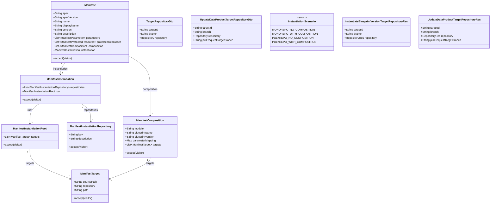

# Align Blueprint Manifest code to repositories / root / composition targets specification

## Requirements

- Align the Blueprint Manifest contract in **blueprint-server** and **blindata-ui** with the updated specification: logical `instantiation.repositories[]`, `instantiation.root.targets[]`, and co-located `composition[].targets[]` — replacing `strategy`, `compositionLayout`, and postfix/`createPolicy` targets.
- Keep authoring, parsing, validation, and the already-supported **single-repository, no-composition** instantiate/update path working against the new shape so blueprints can be published and applied without the obsolete vocabulary.
- Add minimal instantiate/update target key-mapping: request targets carry **`targetId`** (manifest repository key) and are reconciled with the sole `instantiation.repositories[].key`; do not carry a request `type` enum. Do not implement multi-repo UX or composition/polyrepo runtime.
- Treat legacy old-shape stored manifests as non-existent (hard cut; no migration/dual-read). Defer multi-key lineage-root designation and path-split render beyond today’s monorepo copy-all behavior.

## Entities



## Approach

1. Schema alignment (hard cut):
   - Replace Java and JS instantiation models with `repositories` + `root.targets` + `composition.targets`.
   - Delete obsolete types/fields: `InstantiationStrategy`, `compositionLayout`, `ManifestInstantiationCompositionLayout`, target `repositoryNamePostfix` / `createPolicy` / `module` / `targetPath`.
   - Shared route shape (`ManifestTarget`): `sourcePath` (default `./`), `repository` (key ref), `path` (default `./`, was `targetPath`).
   - No dual-read of old manifests.

2. Validation and autofill:
   - Enforce unique repository keys, unique composition modules, repository refs resolve, multi-entry targets require explicit `sourcePath`, relative paths only (reject absolute and `..`).
   - Autofill defaults for publish/register: if instantiation incomplete, seed one repository key (e.g. `main`) and a single root target `./` → that key → `./`; default parameter `type` to `string` as today.
   - Empty `root.targets` is structurally valid; runtime still rejects orchestration-only / composition scenarios as unsupported.

3. Runtime scenario + targets:
   - Derive `InstantiationScenario` from repository-key cardinality + composition presence (not `strategy`).
   - Phase-1 executes only `MONOREPO_NO_COMPOSITION`; others throw `UnsupportedOperationException` (HTTP 400 NotSupported) as today.
   - Monorepo render remains copy-all via `BlueprintRenderService` (do not implement path-splitting render in this ticket).
   - Request targets: add `targetId`; remove `BlueprintRepositoryLogicalType` / request `type`. Reconcile `targetId` ↔ sole `repositories[].key`. Phase-1 accepts exactly one target whose `targetId` equals the sole repository key. Root vs module role stays in the manifest (`instantiation.root` / `composition[]`).

4. Blindata UI:
   - Mirror schema in `manifestSdk` (model, parser, serialize, traverse, visitors).
   - Repository step: branch on single vs multiple repository keys (not `InstantiationStrategy`); single-key → existing mono UI; multi-key → unsupported alert.
   - Submit payloads include `targetId` (not `type`) for instantiate/update.
   - Registration scaffolds emit new instantiation YAML.

5. Docs/fixtures:
   - Update example YAMLs, instantiate fixtures, `docs/service/blueprint-process.md` references away from `strategy`.

## Structure

### Inheritance Relationships

1. Manifest schema objects continue to extend `ManifestComponentBase` (Java) / `ManifestComponentBase` (JS) for `additionalProperties` / extensions.
2. New `ManifestInstantiationRepository` and `ManifestInstantiationRoot` extend the same base and participate in visitors.
3. `ManifestTarget` is the shared route type used by both `root.targets` and `composition[].targets`.
4. Remove `ManifestInstantiationCompositionLayout`, `InstantiationStrategy`, and `BlueprintRepositoryLogicalType` from the model/API.

### Dependencies

1. `ManifestParser` / extension visitor walk the new instantiation tree (repositories, root, targets; composition targets).
2. `OdmBlueprintValidationVisitor` / `OdmBlueprintManifestAutoFillerVisitor` depend on the new model fields.
3. `InstantiateBlueprintVersion` and `UpdateDataProductFromBlueprintVersion` resolve scenario from repositories + composition; validate targets via manifest outbound ports.
4. `BlueprintRenderService.isMonorepoNoComposition` uses repository cardinality + empty composition (not strategy).
5. REST `*TargetRepositoryRes` ↔ domain `*TargetRepositoryDto` mapped in use-cases services; UI API clients send `targetId`.
6. UI `ManifestParser` + repository step + registration templates depend on updated SDK.

### Layered Architecture

1. Manifest model/parser layer: schema types and Jackson/JS binding.
2. Validation/autofill visitors: publish-time structural rules.
3. Use-case layer: scenario resolution, target reconciliation, monorepo-no-composition orchestration (ports/adapters unchanged in shape).
4. REST adapter: command/result resources with `targetId` (no request `type`).
5. UI Manifest SDK + instantiation/registration flows: client-side parse and payload assembly.
6. Exception handling: existing `BadRequestException` / `UnsupportedOperationException` → global handler (no new handler).

## Operations

### Update Manifest Model (Java) — Instantiation & Composition

1. Responsibility: Make the Java manifest model match the README schema for instantiation and composition routing.
2. Changes:
   - `ManifestInstantiation`: replace `strategy`, `compositionLayout`, `targets` with `List<ManifestInstantiationRepository> repositories` and `ManifestInstantiationRoot root`.
   - Add `ManifestInstantiationRepository` (`key`, `description`) under `model/instantiation`.
   - Add `ManifestInstantiationRoot` (`List<ManifestTarget> targets`).
   - Shared route type `ManifestTarget`: fields `sourcePath`, `repository`, `path` only; remove postfix, createPolicy, module, targetPath and nested create-policy enum (replaces old `ManifestInstantiationTarget`).
   - `ManifestComposition`: add `List<ManifestTarget> targets`.
   - Delete `ManifestInstantiationCompositionLayout.java` and `InstantiationStrategy` enum.
3. Visitors:
   - Update `ManifestInstantiationVisitor` to visit repository and root (remove compositionLayout / old target visit).
   - Add `ManifestInstantiationRootVisitor` / `ManifestCompositionVisitor` for shared `ManifestTarget` routes.
   - Update `ManifestVisitor` implementors, `ManifestExtensionVisitorImpl`, and any accept() wiring so composition visits its targets.
4. Constraints: Keep `ManifestComponentBase` extension behavior; unknown properties still land in `additionalProperties`.

### Update Manifest Validator — `OdmBlueprintValidationVisitor`

1. Responsibility: Enforce new structural rules; drop strategy/compositionLayout/postfix rules.
2. Logic on `visit(ManifestInstantiation)`:
   - Require non-null `repositories` with ≥1 entry; each `key` non-empty; keys unique.
   - Require non-null `root` (targets list may be empty).
   - Collect declared keys; validate every `root.targets[].repository` and later composition targets’ `repository` against that set.
3. Logic on targets (shared helper for root and composition targets):
   - `repository` required and must match a key.
   - If targets list size > 1, each entry must have explicit non-blank `sourcePath` (do not rely on default `./`).
   - `sourcePath` / `path`: reject absolute paths and segments `..`; allow default `./` when single-entry or when explicitly set.
4. Logic on `visit(ManifestComposition)`:
   - Keep module / blueprintName / blueprintVersion required + unique modules.
   - Require `targets` non-null and non-empty for composition entries (per spec Required).
   - Visit each composition target with the shared target rules.
5. Remove all `InstantiationStrategy` / `compositionLayout` / postfix / createPolicy validation and related state fields; adjust `OdmBlueprintManifestValidatorState` accordingly.

### Update Manifest Autofiller — `OdmBlueprintManifestAutoFillerVisitor`

1. Responsibility: Seed minimal valid instantiation for incomplete manifests at publish/autofill time.
2. Logic:
   - If `instantiation` is null, create one.
   - If `repositories` empty, add `{ key: "main", description: optional }`.
   - If `root` null or `root.targets` null, set root with one target `{ sourcePath: "./", repository: <sole or first key>, path: "./" }`.
   - Do not invent composition or multiple repositories.
   - Keep parameter type defaulting to `STRING` when key present and type null.

### Update Scenario Resolution & Target Validation (Instantiate / Update)

1. Responsibility: Drive supported vs unsupported paths from the new topology; reconcile `targetId` with the sole repository key.
2. Shared scenario helper (use in instantiate + update + render checks):
   - Let `repoCount = repositories.size()` (distinct keys).
   - `hasComposition = composition non-empty`.
   - `repoCount == 1 && !hasComposition` → `MONOREPO_NO_COMPOSITION`.
   - `repoCount == 1 && hasComposition` → `MONOREPO_WITH_COMPOSITION`.
   - `repoCount > 1 && !hasComposition` → `POLYREPO_NO_COMPOSITION`.
   - `repoCount > 1 && hasComposition` → `POLYREPO_WITH_COMPOSITION`.
   - Missing/empty repositories → `BadRequestException`.
3. `InstantiateBlueprintVersion` / `UpdateDataProductFromBlueprintVersion`: replace `getStrategy()` branching with the helper; keep unsupported cases throwing `UnsupportedOperationException` with the same messaging style.
4. Domain DTOs:
   - `TargetRepositoryDto`: use `String targetId` (replace unused `id` and remove `type`) + `branch` + `repository`.
   - `UpdateDataProductTargetRepositoryDto`: use `String targetId` (replace `type`).
5. Delete `BlueprintRepositoryLogicalType` (no longer used on request/result).
6. Manifest outbound port validation (instantiate + update):
   - Phase-1: exactly one target; `targetId` non-blank and equals the sole `repositories[].key`.
   - Reject multi-target lists for now with clear BadRequest (do not implement multi-repo runtime).
7. REST resources: replace `type` with `targetId` on `InstantiateBlueprintVersionTargetRepositoryRes`, update-data-product target/result res types; map in use-cases services.
8. `BlueprintRenderService.isMonorepoNoComposition`: derive from single repository key + empty composition (remove `MONOREPO` strategy import).

### Update Tests & Fixtures (blueprint-server)

1. Rewrite `src/test/resources/manifest/example-2.*.yaml` and `instantiate/source-repo/manifest.yaml` to the README examples (repositories + root ± composition targets).
2. Update `ManifestParserTest` assertions for new fields; remove strategy/compositionLayout expectations.
3. Update instantiate/update ITs and any validator unit tests to send `targetId` and new manifest content (no `type` field).
4. Ensure monorepo-no-composition happy path still passes; multi-key / composition manifests fail as unsupported at use-case level after structural validation succeeds (or validation fails only on structural errors).
5. Replace obsolete “wrong type” ITs with “`targetId` must match sole repository key” coverage.

### Update Docs (blueprint-server)

1. `docs/service/blueprint-process.md` and `docs/README.md`: replace “strategy” wording with repositories/root topology; keep phase-1 monorepo-no-composition limit.
2. Do not change the authoritative manifest README schema (already updated); only consumer docs.

### Update Manifest SDK (blindata-ui) — Model / Parser / Traverse

1. Responsibility: Mirror Java schema in `src/pages/dataops/blueprints/manifestSdk/`.
2. Model:
   - `ManifestInstantiation`: `repositories`, `root`; remove strategy/compositionLayout/targets.
   - Add `ManifestInstantiationRepository.js`, `ManifestInstantiationRoot.js`.
   - Shared route type `ManifestTarget`: `sourcePath`, `repository`, `path` (replaces `ManifestInstantiationTarget`).
   - `ManifestComposition`: include `targets` array of targets.
   - Remove `ManifestInstantiationCompositionLayout.js`; remove `InstantiationStrategy` / `InstantiationTargetCreatePolicy` from `constants.js`; expose helpers that derive mono vs multi from `repositories.length` (`isSingleRepositoryTopology`, `soleRepositoryKey`).
3. `ManifestSerializationVisitor` / `parser.js`: serialize/deserialize new shape.
4. `traverseManifest.js`: walk `instantiation.repositories`, `instantiation.root.targets`, and `composition[].targets`; stop walking compositionLayout.
5. Update SDK README instantiation notes if they mention strategy.

### Update Instantiation UI Flows (blindata-ui)

1. Repository step (`repositories_step/BlueprintInstantiationModalRepositoriesStep`):
   - Deserialize manifest; if single repository key, render existing `MonoRepositoryConfiguration`.
   - If multiple repository keys, show unsupported alert (same UX intent as former polyrepo alert).
   - Validity: single key + secretMatched + repo configured; set `targetId` to that key on the target entry in parent state (no `type: 'root'`).
2. Instantiation submit / API payload builders: include `targetId` (not `type`) on each target repository sent to instantiate (and update wizard if it posts targets).
3. Delete the duplicate/re-export at `instantiation_modal/BlueprintInstantiationModalRepositoriesStep.jsx`; callers import from `repositories_step/`.

### Update Registration Scaffolds (blindata-ui)

1. `blueprintRepositoryInitTemplates.js` (and any other emitted manifest strings): replace `instantiation.strategy: monorepo` with:

```yaml
instantiation:
  repositories:
    - key: main
      description: Target repository for all data product assets
  root:
    targets:
      - sourcePath: ./
        repository: main
        path: ./
```

2. Adjust any README/help strings in templates that mention `instantiation.strategy`.

### Update API Client Types/Usage (blindata-ui)

1. Ensure `BlueprintsVersionsApi` (and callers) pass through `targetId` on instantiate/update bodies without stripping unknown fields; stop sending `type`.
2. Follow `spdd/norms/api-actions-reducer.md`: keep HTTP in `src/api`; no unnecessary Redux changes unless existing actions hardcode target shape.

## Norms

1. Use-case boundaries (blueprint-server): Follow `spdd/norms/USE_CASE_IMPLEMENTATION.md` — keep REST `*Res` out of use-case packages; map `targetId` in use-cases services; port impls remain plain classes constructed by factories; no new Spring stereotypes on port impls.
2. Exceptions: Continue using existing domain exceptions (`BadRequestException`, `UnsupportedOperationException` → NotSupported); do not invent a parallel GlobalExceptionHandler for this change.
3. Manifest package: Preserve `ManifestComponentBase` + extension visitor patterns already used by the parser; new nodes must participate in accept/visit consistently.
4. Blindata UI components: Follow `blindata-ui/spdd/norms/components.md` — colocate step helpers; prefer props/callbacks; do not introduce boolean feature-flag props for mono vs multi (branch on repository count instead).
5. Blindata UI API layer: Follow `blindata-ui/spdd/norms/api-actions-reducer.md` — API modules stay thin HTTP; payload field additions belong in request objects at the call site / API method args.
6. GENERIC-CRUD norms (`spdd/norms/GENERIC-CRUD-GUIDELINES.md`) do not apply to this change (no new CRUD aggregate).

## Safeguards

1. Functional Constraints:
   - Do not implement composition instantiation, polyrepo instantiate/update, or multi-repository selection UI.
   - Do not implement path-splitting render; monorepo-no-composition remains full-tree copy.
   - Do not implement multi-key lineage-root designation.
   - Do not add dual-read/migration for old `strategy` manifests.
   - Do not enable `schemaRef` parameter validation.
2. Business Rule Constraints:
   - Validator must reject duplicate repository keys, duplicate composition modules, unknown repository refs, multi-target missing `sourcePath`, and absolute/`..` paths.
   - Phase-1 runtime: exactly one target whose `targetId` matches the sole repository key.
   - Empty `root.targets` validates but does not become a supported runtime scenario by itself.
3. API Constraints:
   - Instantiate and update target entries MUST include `targetId` (manifest repository key).
   - Do **not** include a request `type` / `BlueprintRepositoryLogicalType`; root vs module is defined by manifest `instantiation.root` / `composition[]`.
   - List-based `targetRepositories` / `results` shapes retained for future expansion.
4. Integration Constraints:
   - Java and JS manifest models must accept the README examples 2.1–2.4 for parse/serialize round-trip (composition examples parse even if runtime unsupported).
   - Registration scaffolds must emit only the new instantiation shape.
5. Exception Handling Constraints:
   - Unsupported scenarios stay `UnsupportedOperationException` (mapped as today).
   - Structural/client errors stay `BadRequestException` with actionable messages (missing targetId, key mismatch, etc.).
6. Technical Constraints:
   - Remove obsolete Java/JS types rather than leaving dead strategy/`type` fields on the model/API.
   - Update all visitors/tests that reference removed types so the project compiles and tests pass.
7. Cross-repo Constraints:
   - Blueprint-server and blindata-ui changes ship together for this ticket; UI must not send old strategy-era manifests or omit `targetId`.
