# Support all blueprint instantiation repository scenarios

## Requirements

Enable authors and orchestrators to instantiate a published parent blueprint into every valid Git topology derived from repository-key cardinality and composition presence: **1→1** (monorepo, no composition), **N→1** (monorepo + composition), **1→N** (polyrepo, no composition), and **N→N** (polyrepo + composition).

Create a single instantiate pipeline that routes files by `instantiation.root.targets` and `composition[].targets`, records **parent-only** lineage on the **explicitly designated** parent root repository (`instantiation.root.repository`), and establishes a pure Git checkpoint on **every** mapped target. Extend the data-product registry model so additional Git remotes can be stored with their manifest keys beside the unchanged root `dataProductRepo` pointer (that pointer always corresponds to `instantiation.root.repository`; other keys are additional repos).

Apply the same structural manifest rules at **publication** and **instantiation** (separate implementations, shared rules), report **every** validation problem with a **fix hint**, and reject missing or undeclared `root.repository`, empty `root.targets`, unused keys, overlapping destinations, nested path-prefix destinations on the same key, and composition modules that are not themselves monorepo with no composition.

Do not implement UI or blueprint **update**. Instantiate must not write the registry.

## Entities

```mermaid
classDiagram
  direction TB

  class Manifest {
    +List~ManifestParameter~ parameters
    +ManifestInstantiation instantiation
    +List~ManifestComposition~ composition
  }

  class ManifestInstantiation {
    +List~ManifestInstantiationRepository~ repositories
    +ManifestInstantiationRoot root
  }

  class ManifestInstantiationRepository {
    +String key
  }

  class ManifestInstantiationRoot {
    +String repository
    +List~ManifestTarget~ targets
  }

  class ManifestTarget {
    +String sourcePath
    +String repository
    +String path
  }

  class ManifestComposition {
    +String module
    +String blueprintName
    +String blueprintVersion
    +Map~String,JsonNode~ parameterMapping
    +List~ManifestTarget~ targets
  }

  class InstantiationScenario {
    <<enumeration>>
    MONOREPO_NO_COMPOSITION
    MONOREPO_WITH_COMPOSITION
    POLYREPO_NO_COMPOSITION
    POLYREPO_WITH_COMPOSITION
  }

  class InstantiateBlueprintVersionCommand {
    +String blueprintName
    +String blueprintVersion
    +Map~String,JsonNode~ blueprintParameters
    +List~TargetRepositoryDto~ targetRepositories
    +String commitAuthorName
    +String commitAuthorEmail
  }

  class TargetRepositoryDto {
    +String targetId
    +String branch
    +Repository repository
  }

  class SourceRepositoryDto {
    +String id
    +String tag
    +Repository repository
  }

  class InstantiationRoute {
    +String sourceId
    +String sourcePath
    +String repositoryKey
    +String destinationPath
    +boolean fromParent
  }

  class InstantiationValidationIssue {
    +String fieldPath
    +String problem
    +String hint
  }

  class PublishCompositionIdentity {
    +String moduleAlias
    +String blueprintName
    +String blueprintVersion
    +String fieldPath
  }

  class BlueprintVersion {
    +String name
    +String versionNumber
    +String tag
    +JsonNode content
    +Blueprint blueprint
  }

  class DataProduct {
    +String uuid
    +DataProductRepo dataProductRepo
    +List~DataProductAdditionalRepo~ additionalDataProductRepos
  }

  class DataProductRepo {
    +String uuid
    +String remoteUrlHttp
    +String descriptorRootPath
  }

  class DataProductAdditionalRepo {
    +String uuid
    +String manifestKey
    +String remoteUrlHttp
    +String remoteUrlSsh
    +String providerType
    +String providerBaseUrl
    +String ownerId
    +String defaultBranch
  }

  Manifest "1" --> "1" ManifestInstantiation
  Manifest "1" --> "*" ManifestComposition
  ManifestInstantiation "1" --> "*" ManifestInstantiationRepository
  ManifestInstantiation "1" --> "1" ManifestInstantiationRoot
  ManifestInstantiationRoot "1" --> "*" ManifestTarget : root.targets
  ManifestInstantiationRoot --> ManifestInstantiationRepository : root.repository is a declared key
  ManifestComposition "1" --> "*" ManifestTarget : composition.targets
  InstantiationScenarioResolver ..> InstantiationScenario : 1 key vs 2+ keys x composition
  InstantiateBlueprintVersionCommand "1" --> "*" TargetRepositoryDto
  InstantiateBlueprintVersion ..> InstantiationRoute : via manifest port
  InstantiateBlueprintVersion ..> InstantiationValidationIssue : collects
  PublishBlueprintVersion ..> PublishCompositionIdentity : via publish manifest port
  DataProduct "1" --> "0..1" DataProductRepo : root pointer unchanged
  DataProduct "1" --> "*" DataProductAdditionalRepo : keyed extras
```



Existing types (`Manifest*`, `TargetRepositoryDto`, `SourceRepositoryDto`, `InstantiateBlueprintVersionCommand`, `DataProduct`, `DataProductRepo`) stay. Extend `ManifestInstantiationRoot` with required `repository` (declared key). Add only `InstantiationRoute` (or equivalent small record in the instantiate package), `InstantiationValidationIssue` (instantiate package; publish keeps its visitor error context with the same problem+hint contract), `PublishCompositionIdentity` (package-local record in the publish package, mirroring `InstantiationCompositionIdentity`, so the publish use case can look up module versions without touching the spec model — packages do not share these records), and registry `DataProductAdditionalRepo` (new collection; do **not** fold the root pointer into it).

## Approach

1. Instantiation pipeline:
   - Keep one use case (`InstantiateBlueprintVersion`) for all four topologies. Derive `InstantiationScenario` for logging and tests; do **not** implement four Git scripts.
   - Drive work from a flattened **route list** (parent `root.targets` plus each `composition[].targets`). For each distinct `repository` key that has at least one route, run the existing checkpoint policy: open target at integration branch → orphan/pure workspace → apply routes → parent lineage if designated root → commit / checkpoint tag / merge / push.
   - Honor `sourcePath` → destination `path` on every route, including 1→1 path splits. Default omitted paths remain `./` → `./` (whole-tree). Nested destinations on the same key are forbidden, so no copy-order policy is required.
   - Designate the **root** target from **`instantiation.root.repository`** (required on the parent routing block). It must equal a declared `instantiation.repositories[].key`. This field exists **only** on parent `instantiation.root` — never on `composition[].targets` and never as a reserved key name such as `"main"`. Lineage (descriptor `blueprint` block and `.odm/blueprint/` snapshot / README relocate from **parent** `BlueprintRepo`) runs **only** on that designated key’s working tree. Other mapped keys are additional repos (registry extras), never the primary pointer. When parent `BlueprintRepo.descriptorTemplatePath` is configured, the platform **always** Velocity-renders that template from the parent blueprint source into the designated root target workspace at the path derived from `descriptorTemplatePath` (same repository-relative path with `.vm` stripped). Authors do **not** declare a `root.targets` route for the descriptor; `root.targets` routes **other** parent content only.

2. Technical implementation:
   - Hexagonal instantiate use case: command + presenter; outbound ports for persistency, validation, source/target workspaces, route rendering, parent lineage. REST stays on `BlueprintVersionsUseCasesService` / instantiate `*CommandRes`.
   - Evolve Git port away from `init` as a use-case step and away from a single-source `withClonedSourceAndTarget`. Provider selection happens when materializing the first workspace (adapter). Expose intent-revealing policy steps already present (`createAndCheckoutOrphanBranch`, `commitAll`, `createCheckpointTag`, `mergeBranch`, `pushBranch`, `pushTag`) plus a lifecycle that can hold **several sources** (parent + modules that route into the current target) and **one target** at a time. Fail-fast after the first Git failure; earlier targets may already be pushed.
   - Bind required `instantiation.root.repository` on existing `ManifestInstantiationRoot` (parser + visitor). Do not add a `primary` field on `ManifestTarget`.
   - Replace `monorepoNoCompositionRenderAndCopy` as the use-case render verb with **apply this route into this target workspace**. Keep `BlueprintRenderService` as the shared Velocity/tree-copy engine; extend it to copy a **source subtree** into a **destination path** with per-source parameter context. Blueprint **update** for all four topologies is implemented in the companion update prompt (`BDMD-4820-202608271455`).
   - Child sources: persistency locates published versions by `composition[].blueprintName` + `blueprintVersion`. Child `BlueprintRepo` provider type and base URL **must match the parent**. When used as a module, **ignore** the child’s `instantiation` for file placement; use parent `composition[].targets` with paths relative to the child repo. Child standalone topology must still be 1→1.
   - The stored blueprint **Manifest** is a specification model (parser + `Manifest*` types). The instantiate use case **must not** deserialize it, import `Manifest*` / `ManifestParserFactory`, or walk `root.targets` / `composition[]` itself. That is a low-level spec leak. All read/derive operations on parent or child content go through `InstantiateBlueprintVersionManifestOutboundPort` (intent-revealing methods that return domain records such as `InstantiationRoute`).
   - The same separation applies to **publish**: checking that every declared composition module resolves to a published 1→1 blueprint version is **business logic and belongs on `PublishBlueprintVersion`**, not on the manifest adapter. Remove `validateCompositionModules` from `PublishBlueprintVersionManifestOutboundPort` (and the version lookup it performs inside the adapter). The publish manifest port instead exposes spec-derived facts — list composition identities from the parent content, and report whether a given child content is monorepo with no composition — while the module version lookup moves to the publish **persistence** port. The publish use case orchestrates list → look up → check topology → collect issues → throw one `BadRequestException`, exactly as `InstantiateBlueprintVersion` does. `PublishBlueprintVersion` must not import `Manifest*` / `ManifestParserFactory` / `InstantiationScenarioResolver`.
   - Module parameters: validate `parameterMapping` shape in `collectValidationIssues`, then use the instantiate manifest outbound port to collect unresolved `$param` references against the parent resolved set and build one module-local context per alias. `{ $param: parentKey }` maps the child key to the resolved parent value; `{ value: actualValue }` copies the literal. Empty mapping produces an empty child context. Do **not** pass the complete parent parameter map to modules.
   - **No new helper / utility classes**: do not introduce `*Helper`, `*Util`, `*Resolver` (beyond the existing `InstantiationScenarioResolver`, used **inside** the manifest adapter, not from the use case), or other extracted “small domain” types for routing, `$param`/`value` resolution, root designation, or validation. Keep that logic as private methods on the outbound port impl that already owns the specification. Prefer extending existing classes (`BlueprintRenderService`, port impls, publish visitor) over adding new ones.
   - Exceptions: `BadRequestException` for validation (message concatenates **all** issues, each with problem + hint); `NotFoundException` for missing parent/module versions; Git failures through existing `ResponseExceptionHandler`. Do not introduce a new `GlobalExceptionHandler`; extend `ResponseExceptionHandler` only if a new exception type is strictly required.
   - Registry (odm-platform-pp-registry-server): keep `dataProductRepo` 1:1. Add `DataProductAdditionalRepo` table (cascade from `DataProduct`; FK to the product only—**no** DB unique constraint on `(data_product_uuid, manifest_key)`). Expose on `DataProductRes` as an optional list. Uniqueness of `manifestKey` within a product’s additional repos is enforced in the **DataProduct core service** (root aggregate `validate` / create-overwrite hooks), not by a fixed schema constraint. Instantiate does **not** call registry. CRUD/mapping follows registry generic CRUD patterns.

3. Business logic:
   - Topology = unique `instantiation.repositories[].key` count (1 vs ≥2) × composition presence.
   - `instantiation.root.repository` is **required**, must match a declared `repositories[].key`, and appears only on the parent `root` block (not on composition targets, not as `primary` on a target entry).
   - `instantiation.root.targets` must be non-empty and reference at least one declared key (reject pure-orchestration `[]` at publish and instantiate).
   - Every declared key must appear on at least one route (root or composition).
   - Exact duplicate `(repository, normalized path)` and path-prefix nesting on the **same** key → 400.
   - Composition modules must be registered published 1→1 versions; check at parent **publish** (lookup) and parent **instantiate**. Both gates run this check **in their use case** (module identities and child topology come from their own manifest port; the version lookup comes from their own persistence port); neither gate delegates the whole rule to a manifest adapter method.
   - Request `targetRepositories` must be a complete, unique map of every declared key (`targetId` = key). Incomplete, duplicate, or unknown `targetId` → 400 before Git.
   - Structural rules are the same at both gates; **do not** extract a shared validator class. Instantiate also validates parameters and the target map. Collect **all** problems in that gate; each entry names field/path when possible and includes a short how-to-fix hint.
   - Descriptor placement is **platform-owned**, not manifest-routed: when `descriptorTemplatePath` is set, instantiate renders it onto the root target before lineage enrichment. Missing template file in the parent source after render → `InternalException` at instantiate (not a publish-time structural 400). When `descriptorTemplatePath` is blank, skip implicit descriptor copy and lineage enrichment (info log, unchanged).
   - Update the manifest specification (README, parser/examples) for required `instantiation.root.repository`, `{ $param }` / `{ value }`, non-empty `root.targets`, sibling (non-nested) destinations, and implicit descriptor placement on the root target. Current README text allowing `[]`, bare-string parameter references, unwrapped literals, and “a parent route must cover the descriptor onto root.repository” is superseded. Do **not** infer root from first `root.targets[]` entry or from a reserved key.

## Structure

### Inheritance Relationships

1. `UseCase` interface defines `execute()` for instantiate and publish.
2. `InstantiateBlueprintVersion` implements `UseCase` (package-private).
3. `PublishBlueprintVersion` implements `UseCase` (package-private).
4. `BadRequestException` / `NotFoundException` / `InternalException` extend `BlueprintApiException`.
5. `ResponseExceptionHandler` extends `ResponseEntityExceptionHandler` (`@ControllerAdvice`).
6. Registry `DataProductAdditionalRepo` is a JPA entity; `DataProduct` remains `VersionedEntity`. Additional repos cascade via `DataProduct` mapping. Uniqueness of `manifestKey` per product is validated on the root aggregate in `DataProductsServiceImpl` (or equivalent Generic CRUD `validate` / `beforeCreation` / `beforeOverwrite`), not via a JPA `@UniqueConstraint` or Flyway unique index.

### Dependencies

1. `BlueprintVersionsUseCaseController` calls `BlueprintVersionsUseCasesService` for instantiate and publish.
2. `InstantiateBlueprintVersionFactory` constructs persistency, validation, git, and templating port impls with `new` and injects `BlueprintService`, `BlueprintVersionCrudService`, `GitProviderFactory`, `BlueprintRenderService`, `BlueprintDataProductDescriptorService`.
3. `InstantiateBlueprintVersion` calls persistency (locate parent and modules), the **manifest outbound port** (collect all issues; derive scenario, routes, designated root key from `instantiation.root.repository`, parent resolved parameters, composition identities, module parameter maps, child 1→1 check), git (materialize / checkpoint policy), templating (apply routes; on the root target only, render descriptor from `descriptorTemplatePath` when configured; then enrich descriptor and record lineage). The use case never holds a `Manifest` instance.
4. Instantiate templating impl delegates Velocity/copy to `BlueprintRenderService` and descriptor enrichment to `BlueprintDataProductDescriptorService`.
5. Publish validation visitor (`OdmBlueprintValidationVisitor`) enforces structural rules independently of instantiate’s validation port.
6. `PublishBlueprintVersion` owns the composition-module rule: it asks the publish manifest port for composition identities and for the child topology verdict, and asks the publish **persistence** port (`PublishBlueprintVersionPersistenceOutboundPort`) to locate each published module version. The publish manifest port no longer depends on `BlueprintService` / `BlueprintVersionCrudService` for this rule and no longer exposes `validateCompositionModules`.
7. Registry `DataProductController` / mapped CRUD maps `additionalDataProductRepos` without changing descriptor Git ops that use `dataProductRepo` only.
8. Instantiate **does not** depend on registry clients.

### Layered Architecture

1. Controller Layer: HTTP mapping for `POST` instantiate and publish; OpenAPI; no routing rules.
2. Use cases service Layer: `*CommandRes` → domain command; presenter holder; `factory.build…().execute()`; map to `*ResponseRes`.
3. Use case Layer: orchestration sequence — instantiate (locate → collect validation → ask the manifest port for routes/root/params/composition identities → locate modules → per-target checkpoint) and publish (autofill → structural validate → ask the manifest port for composition identities → locate each module version → check child topology → extract version/spec → create). No REST types, no Spring, **no specification `Manifest` types** on either use case class.
4. Outbound adapter Layer: Git clone/commit/tag/merge/push; Velocity render; JPA lookup; manifest parse/validate/derive (instantiate manifest port).
5. Exception Handling Layer: `ResponseExceptionHandler` maps `BlueprintApiException` and Git exceptions to `ErrorRes`.

## Operations

### Update Use Case - InstantiateBlueprintVersion

1. Responsibility: Orchestrate instantiation for all four topologies as one route-driven pipeline; stop before Git if validation collected any issue.
2. Methods:
   - `execute()`: void
     - Logic:
       - Validate command required fields (name, version, non-empty `targetRepositories`, non-null parameters, each `targetId` + repository).
       - Locate published parent via persistency (`findByBlueprintNameAndVersion`); missing → `NotFoundException`.
       - `manifestPort.collectValidationIssues(spec, specVersion, content, parameters, targetRepositories)` — **stop** if any; throw `BadRequestException` listing every `InstantiationValidationIssue.format()` line (prefix: `Blueprint instantiation validation failed:`).
       - Enrich parent parameters via manifest port (`enrichRequestParametersWithDefaultsIfNeeded`).
       - Locate composition modules via persistency (`findModuleBlueprintVersion`); collect not-found and non-1→1 module issues; stop if any.
       - `manifestPort.collectModuleParameterResolutionIssues(content, parentResolvedParameters)` — stop if any `$param` cannot be resolved after request values and defaults.
       - `manifestPort.resolveModuleParameters(content, parentResolvedParameters)` — build a child-local map per alias from `{ $param }` / `{ value }`; do not leak unmapped parent keys.
       - Derive routes grouped by target key; designated root key from `instantiation.root.repository`.
       - Filter `retrieveAllSourceRepositories` to sources referenced by routes (parent id `__parent__`, module alias ids).
       - `gitPort.openSources(parentBlueprint, sources, sourcePaths -> { for each target key with routes: instantiateTargetRepository(...) })`.
       - Inside each target: `gitPort.openTarget` at integration branch → orphan branch → `applyRoute` for each route → if root and `descriptorTemplatePath` set, `renderDescriptorToRoot` then `recordParentLineage` → commit / checkpoint tag / merge / push branch + tag.
       - `presenter.presentResults(new InstantiateBlueprintVersionResult())`.
       - Do **not** call `gitPort.init` as a business step; do **not** switch on scenario for four Git implementations; do **not** write the registry.
3. Constraints: Package-private class; ports only; existing `BlueprintGitNamingConventions` for orphan branch and checkpoint tag. Do **not** call `ManifestParserFactory` or operate on `Manifest` / `ManifestComposition` / `ManifestTarget` from this class. Route flattening, root-key designation, parent parameter merge, composition listing, child 1→1 check, and `parameterMapping` resolution live as **private methods on the instantiate manifest outbound port impl** — do not extract them into new helper/utility types.

### Update Outbound Port - InstantiateBlueprintVersionManifestOutboundPort

1. Responsibility: Own all **specification Manifest** work for instantiate: deserialize stored content, structural + request validation (separate code from the publish visitor), and derivation of routes / root key / parameters / composition identities so the use case never touches the spec model.
2. Methods:
   - `collectValidationIssues(spec, specVersion, content, parameters, targetRepositories): List<InstantiationValidationIssue>`
     - Logic: deserialize manifest; run the **same structural rule set** as publish (unique keys, relative paths, required `instantiation.root.repository` matching a declared key, non-empty `root.targets`, unused keys, unknown repository on routes, exact destination duplicates, nested path-prefix on same key, `parameterMapping` `{ $param }` / `{ value }` object shape, unique composition module aliases, required composition identity fields). Do **not** pass `descriptorTemplatePath` into structural validation — descriptor placement is not a manifest routing rule. Then instantiate-only: parameter types/constraints/required+default; every `instantiation.repositories[].key` appears exactly once as `targetId`; no unknown `targetId`.
     - Do not throw on the first error. Return the full list.
   - Intent-revealing **derive** methods (names may vary; keep business language). Each deserializes internally; none return `Manifest`:
     - Derive `InstantiationScenario` from parent content (logging/tests).
     - Flatten parent `root.targets` plus each `composition[].targets` into `List<InstantiationRoute>` (parent source id vs module alias; omitted paths default `./`).
     - Designate the root repository key as `instantiation.root.repository` from parent content (do **not** infer from the first `root.targets[]` entry or from a reserved key).
     - Merge parent parameter values for lineage and `$param` resolution (request then default).
     - List composition identities: module alias, blueprint name, blueprint version, field path (so the use case can look up versions without walking `composition[]`).
     - Given a child version’s content, report whether it is monorepo with no composition (issues/hints stay on the caller’s collect-all list).
     - `collectModuleParameterResolutionIssues(content, parentResolvedParameters)` reports every well-formed `$param` whose parent value is still absent after request/default enrichment.
     - `resolveModuleParameters(content, parentResolvedParameters)` returns `Map<alias, Map<childKey, JsonNode>>`; `$param` copies the resolved parent value, `value` copies the literal, and empty mapping yields an empty child map. Extra properties besides `$param` or `value` are ignored.
   - Keep `retrieveAllSourceRepositories` returning **parent plus modules** (id = `__parent__` or module alias; tag from the version; repository from that version’s `BlueprintRepo`). Child provider type + base URL mismatch throws `BadRequestException` from this method (fail-fast, not collect-all) with a hint naming the child.
   - Replace `validateTargetRepositories` “exactly one matching sole key” with the complete-map rule inside `collectValidationIssues`.
3. Error format: each issue has `fieldPath`, `problem`, `hint` (example hint: “Declare a route in instantiation.root.targets or composition[].targets that uses this key, or remove the unused key.”).
4. Constraints: `InstantiationScenarioResolver` may be called **only** from this adapter (and from update, unchanged). Do not add a new helper type for flattening or `$param`/`value` resolution.

### Update Outbound Port - InstantiateBlueprintVersionPersistencyOutboundPort

1. Responsibility: Locate published blueprint versions.
2. Methods:
   - `findByBlueprintNameAndVersion(name, version): BlueprintVersion` (existing).
   - `findPublishedModule(blueprintName, blueprintVersion): BlueprintVersion` — same lookup; not-found is reported as a validation-style issue when called from the collect-modules pass.

### Update Outbound Port - InstantiateBlueprintVersionGitOutboundPort

1. Responsibility: Git I/O and workspace lifetime; use case still **orders** checkpoint policy.
2. Methods (intent-revealing; adapters hide clone/provider):
   - Remove use-case-visible `init`.
   - `openSources(Blueprint parentBlueprint, List<SourceRepositoryDto> sources, Consumer<Map<String, Path>> operation)` — clone each unique source at its release tag once; invoke callback with source id → path map; always clean temp dirs. Binds Git provider from parent `BlueprintRepo` on first use.
   - `openTarget(TargetRepositoryDto target, String integrationBranch, Consumer<Path> operation)` — clone target at integration branch for one target loop iteration; always clean temp dir.
   - Keep granular: `createAndCheckoutOrphanBranch`, `commitAll`, `createCheckpointTag`, `mergeBranch`, `pushBranch`, `pushTag`.

### Update Outbound Port - InstantiateBlueprintVersionTemplatingOutboundPort

1. Responsibility: Apply one route into a target workspace; render the data-product descriptor onto the root target when configured; record parent lineage on the root target.
2. Methods:
   - `applyRoute(sourceRoot, sourcePath, targetRoot, destinationPath, parameters): void` — Velocity-render the source subtree and copy into the destination path; skip `.git`; do not copy lineage sidecar here.
   - `renderDescriptorToRoot(parentSourceRoot, descriptorTemplatePath, rootTarget, parameters): void` — when `descriptorTemplatePath` is non-blank, Velocity-render that template from the parent source into `rootTarget` at the rendered relative path (strip `.vm`, normalize slashes). Fail with `InternalException` if the rendered file is missing. Skip when path is blank.
   - `recordParentLineage(rootTarget, parentVersion, parentResolvedParameters): void` — descriptor enrichment + parent manifest snapshot / README relocate on the root tree. Descriptor path resolution uses fixed `./` → `./` mapping (same as `BlueprintDataProductDescriptorService` defaults); do **not** require a covering `root.targets` route.
3. Remove use-case calls to `monorepoNoCompositionRenderAndCopy`. `BlueprintRenderService.renderAndCopySubtree` / `renderDescriptorTemplate` are used by the templating port impl.

### Update Shared Service - BlueprintRenderService

1. Responsibility: Path-aware Velocity render and tree copy used by instantiate and update templating port impls.
2. Methods:
   - `renderAndCopySubtree(sourceRoot, sourcePath, targetRoot, destinationPath, parameters)`.
   - `renderDescriptorTemplate(sourceRoot, descriptorTemplatePath, targetRoot, parameters)` for implicit root descriptor placement.
   - Relocate parent README/manifest only when recording lineage on the root target, not on every subtree copy.
3. Constraints: Stay a Spring `@Service` under `…services.usecases`; use cases never inject it directly.

### Update Use Case validation - PublishBlueprintVersion

1. Responsibility: Same structural rules as instantiate, implemented in `OdmBlueprintValidationVisitor` / publish manifest outbound port — **not** by calling instantiate’s validator class. Additionally, the use case itself orchestrates the composition-module rule (module version must exist and be 1→1), because that rule crosses the specification and the persistence boundary and is therefore business logic.

2. Composition-module orchestration on `execute()` (replaces the single `manifestOutboundPort.validateCompositionModules(content)` call, kept at the same point in the sequence — after structural manifest validation, before version-number extraction and creation):
   - Ask the manifest port for `List<PublishCompositionIdentity>` from the manifest content just validated. Empty list → skip the rest.
   - For each identity, ask the persistence port for the published module version by blueprint name + version. Not found → collect an issue on that identity’s `fieldPath` with the hint “Publish the module version first.”
   - For each module actually found, ask the manifest port whether that stored child content is monorepo with no composition. Negative → collect an issue on the same `fieldPath` naming the module alias and `name@version`, with the hint that composition modules must be monorepo with no composition (one repository key, empty composition).
   - Do not fail fast: collect every module problem across all identities, then throw a single `BadRequestException` whose message enumerates each `fieldPath: problem. Hint: hint`, matching the existing publish message prefix so current publish ITs keep their assertions.
   - Constraints: no `Manifest*` / `ManifestParserFactory` / `InstantiationScenarioResolver` import on this class; no new `*Validator` / `*Helper` type for this loop — private methods on the use case, mirroring `retrieveModulesBlueprintVersions` / `validateModulesBlueprintVersions` on `InstantiateBlueprintVersion`. Publish keeps its own record and private methods; do **not** import the instantiate package.
3. Logic additions to the visitor (accumulate via existing `context.addError`; extend messages with hints):
   - Reject missing, blank, or undeclared `instantiation.root.repository` (must equal a `repositories[].key`). Do not accept `primary` on `root.targets[]` as a substitute.
   - Reject empty `root.targets`.
   - Do **not** validate descriptor placement against `root.targets` — remove any `validateDescriptorCoversDesignatedRoot` / `descriptorTemplatePath` parameter from publish manifest validation.
   - Reject unused `instantiation.repositories[].key`.
   - Reject exact duplicate `(repository, normalized path)` across **all** routes (root + composition).
   - Reject nested path-prefix on the same repository key.
   - Validate `parameterMapping` object shape: each entry is an object with **exactly one** of `$param` (string parent key) or `value` (any JSON type). Extra keys besides the discriminant are ignored at resolution. Bare scalars, both discriminants, or neither fail at both gates.
   - The visitor stays **purely structural**: it does no persistency lookup and does not resolve module versions. “Each composition module must exist as a published 1→1 version (one repository key, empty/absent composition), missing or wrong topology → error with hint” is enforced by the use case step described in operation 2, after the structural visit.
4. Keep collecting **all** visitor errors; do not fail-fast inside the visitor.

### Update Outbound Port - PublishBlueprintVersionManifestOutboundPort

1. Responsibility: Own **specification Manifest** work for publish (autofill, structural validation, field extraction, spec-derived facts). It must not reach into persistence and must not own multi-step business rules.
2. Methods:
   - Remove `validateCompositionModules(content)` and the `BlueprintService` / `BlueprintVersionCrudService` collaborators it needed; drop them from `PublishBlueprintVersionFactory` wiring for this port unless another method still requires them.
   - Add: list composition identities from parent content, returning `List<PublishCompositionIdentity>` (module alias, blueprint name, blueprint version, field path such as `composition[i]`). Entries with blank name or version are skipped here — the structural visitor already reports missing identity fields, so this method never duplicates that error.
   - Add: given a stored child content, report whether it is monorepo with no composition (boolean). `InstantiationScenarioResolver` may be called **only** from inside this adapter, never from the use case. Unparseable child content surfaces as `BadRequestException` from the adapter, translated by the use case into a collected issue on that module’s field path.
   - Keep `autofillManifest`, `validateManifest`, `extractVersionNumber`, `extractSpecNumber`, `extractSpecVersion` unchanged.
3. Constraints: Plain class, no Spring stereotype; methods are intent-revealing and return domain values (identities, booleans, strings), never `Manifest` / `ManifestComposition`.

### Update Outbound Port - PublishBlueprintVersionPersistenceOutboundPort

1. Responsibility: All blueprint-version persistence for publish, including module lookups previously performed inside the manifest adapter.
2. Methods:
   - `createBlueprintVersion(BlueprintVersion)` and `findByBlueprintUuidAndVersionNumber(blueprintUuid, versionNumber)` (existing).
   - Add a module lookup by blueprint name + version number that returns the published `BlueprintVersion` (same semantics as instantiate’s `findModuleBlueprintVersion`): resolve the blueprint by name, then the version by number; missing blueprint or version → `NotFoundException` with the existing messages, which the use case converts into a collected issue.
3. Constraints: Implementation uses `BlueprintService` / `BlueprintVersionCrudService` (moved from the manifest adapter); wiring is adjusted in `PublishBlueprintVersionFactory`. No shared implementation with the instantiate persistency port.

### Update Manifest specification

1. Responsibility: Align README, parser, and example YAML (2.1–2.4) with required `instantiation.root.repository` (declared key; parent `root` only), `{ $param: key }` vs `{ value: actualValue }`; document that empty `root.targets` is invalid, that root is never inferred from first target or a reserved key, that bare mapping scalars are invalid, and that when `descriptorTemplatePath` is configured the platform always places the rendered descriptor on the designated root target (authors need not route it in `root.targets`). Example polyrepo YAML must set `root.repository` to the data-product root key; `root.targets` may route only non-descriptor parent subtrees (e.g. `application/` → `app-repo`) without a separate route for the descriptor template path.

### Blueprint update (companion prompt)

Multi-repository **update** is **not** in this instantiate prompt. It is specified in `BDMD-4820-202608271455-[Feat]-service-all-update-repository-scenarios.md` and implemented in `UpdateDataProductFromBlueprintVersion`.

### Create Entity / API - DataProductAdditionalRepo (registry-server)

1. Responsibility: Persist additional keyed Git remotes beside the root pointer.
2. Attributes:
   - `uuid`: String — PK
   - `manifestKey`: String — `instantiation.repositories[].key` (not the root row)
   - Git metadata mirroring `DataProductRepo` fields needed for later reconciliation (urls, provider, owner, default branch). Do **not** require `descriptorRootPath` on additional rows unless already present on the root model for consistency; descriptor ops keep using `dataProductRepo` only.
3. Mapping: `DataProduct` `@OneToMany` additional repos; cascade persist/delete with product; FK `data_product_uuid` only. **Do not** add a DB unique constraint, unique index, or JPA `@UniqueConstraint` / `@Table(uniqueConstraints=…)` on `(data_product_uuid, manifest_key)`.
4. Domain validation (root aggregate): In the DataProduct **core service** (`DataProductsServiceImpl` `validate` and create/overwrite hooks), reject duplicate `manifestKey` values within the same product’s `additionalDataProductRepos` list (case rules consistent with other registry string keys). Surface as the registry’s usual bad-request / conflict mapping. This is the **only** uniqueness enforcement for additional-repo keys in this ticket.
5. API: optional list on `DataProductRes` / create-update payloads; empty list valid; existing single-repo products omit extras. Do not invent a default key for historical root rows.
6. Tests: `DataProductControllerIT` create/update/read with extras; duplicate `manifestKey` rejected by the core service (not by a DB constraint violation); root pointer unchanged.

### High-level tests (Gherkin)

These scenarios are the acceptance contract. Each must be implemented as a Java integration test (see mapping below). Background unless stated: authenticated REST against blueprint-server (and registry-server where noted); Git provider mocked as in `BlueprintInstantiationControllerIT`; module and parent versions published from fixtures.

```gherkin
Feature: Instantiate 1→1 monorepo without composition
  As an orchestrator
  I want to instantiate a parent with one repository key and no composition
  So that one existing target receives routed files and parent lineage

  Scenario: Whole-tree default route still instantiates
    Given a published parent blueprint with one instantiation.repositories key "prod"
    And instantiation.root.repository is "prod"
    And instantiation.root.targets maps sourcePath "./" to repository "prod" path "./"
    And the instantiate request maps targetId "prod" to an existing Git repository
    When the client POSTs instantiate
    Then the response status is 200
    And the target receives a pure checkpoint (orphan, commit, checkpoint tag, merge, push branch and tag)
    And the designated root working tree contains parent lineage on the descriptor and under .odm/blueprint/

  Scenario: Path-split routes into the same key
    Given a published parent with one key "prod"
    And instantiation.root.repository is "prod"
    And two root.targets into "prod" with sibling destinations "core/" and "docs/" (not nested)
    When the client instantiates with a complete target map
    Then files from each sourcePath appear only under the matching destination path
    And lineage is written only once on that single root target

  Scenario: Existing 1→1 products remain compatible
    Given the current example-2.1 monorepo-no-composition fixture
    When instantiate runs as today
    Then behavior matches the existing happy-path IT (checkpoint + descriptor blueprint block)
```

```gherkin
Feature: Instantiate N→1 monorepo with composition
  As an author of a composed parent
  I want parent and 1→1 modules copied into one target at sibling paths
  So that a single Git repo holds the assembled product without nested overwrites

  Scenario: Parent and modules land on distinct paths in one target
    Given a published parent with one repository key "main"
    And instantiation.root.repository is "main"
    And composition modules "storage" and "serving" that are published 1→1 versions
    And parent root.targets writes to "core/" on "main"
    And modules write to "data-plane/storage" and "app/serving" on "main"
    And parameterMapping uses { $param: projectSlug } and { value: eu-west-1 }
    When the client instantiates mapping "main" to one Git repo
    Then the response status is 200
    And the target tree contains rendered parent files under core/ and module files under the composition destination paths
    And Velocity for each module uses the resolved module parameter set
    And lineage on the root target records only the parent version and parent parameters

  Scenario: Child instantiation block does not place files
    Given a module whose own instantiation.root.targets would copy to "./"
    And the parent composition.targets place that module at "pipelines/batch"
    When instantiate runs
    Then module files appear under pipelines/batch not at the target root from the child manifest
```

```gherkin
Feature: Instantiate 1→N polyrepo without composition
  As an orchestrator
  I want one parent split across several existing Git remotes
  So that each repository key receives only its routes and a checkpoint

  Scenario: Parent routes to two keys with lineage only on the designated root
    Given a published parent with keys "infra-repo" and "app-repo"
    And instantiation.root.repository is "app-repo"
    And root.targets send terraform/ and policies/ to "infra-repo" at sibling destinations
    And root.targets send application/ to "app-repo" at "./"
    And parent BlueprintRepo has descriptorTemplatePath configured
    And no root.targets route explicitly covers the descriptor template path
    And the request maps both targetIds to distinct existing Git repositories
    When the client POSTs instantiate
    Then both targets are cloned, checkpointed, merged, and pushed independently
    And infra-repo contains only infra routes and has no .odm/blueprint/ lineage copy
    And app-repo is the designated root (instantiation.root.repository) and contains the rendered descriptor at the path derived from descriptorTemplatePath plus descriptor enrichment and .odm/blueprint/

  Scenario: First root.targets entry is not used as root when root.repository names another key
    Given a published parent with keys "infra-repo" and "app-repo"
    And the first root.targets entry maps to "infra-repo"
    And instantiation.root.repository is "app-repo"
    When instantiate succeeds
    Then lineage is written only on app-repo
    And infra-repo is treated as an additional repo

  Scenario: Incomplete target map is rejected before Git
    Given a polyrepo parent with keys "infra-repo" and "app-repo"
    And the request maps only "app-repo"
    When the client POSTs instantiate
    Then the response status is 400
    And the message names the missing key and a hint to supply targetRepositories for every instantiation.repositories[].key
    And no Git mutation runs
```

```gherkin
Feature: Instantiate N→N polyrepo with composition
  As an author
  I want parent and modules independently routed across several keys
  So that a multi-repo product can be instantiated in one request

  Scenario: Mixed parent and module routes across two targets
    Given a published parent with keys "pipeline-repo" and "api-repo"
    And instantiation.root.repository is "pipeline-repo"
    And 1→1 modules "ingest" and "consume"
    And parent routes "./core" to "pipeline-repo"
    And ingest routes to "pipeline-repo" at "./pipelines/batch"
    And consume routes to "api-repo" at "./services/consumer"
    When instantiate maps both keys
    Then pipeline-repo contains parent core and ingest files plus parent lineage
    And api-repo contains consume files and no parent lineage sidecar
    And each target has its own checkpoint tag and push
```

```gherkin
Feature: Parent-only lineage
  As a platform
  I want provenance only for the root blueprint and parent parameters
  So that module identities never appear as lineage on secondary repos

  Scenario: Modules and secondary repos do not receive lineage
    Given any successful N→1, 1→N, or N→N instantiate
    Then only the designated root target has descriptor.blueprint and .odm/blueprint/
    And that metadata identifies the parent BlueprintVersion and parent resolved parameters only
    And README/manifest relocate from parent BlueprintRepo metadata runs only on the root tree
```

```gherkin
Feature: Structural validation at publish and instantiate
  As an author
  I want the same structural rules before publish and before instantiate
  So that invalid routing never reaches Git and every problem is listed with a hint

  Background:
    Given the same invalid manifest fixture is used against both gates

  Scenario: Empty root.targets is rejected at both gates
    Given instantiation.root.targets is []
    When the client publishes the version
    Then the response status is 400
    And the message states root.targets must be non-empty and includes a hint
    When a previously stored invalid content is instantiated (or instantiate validates equivalent content)
    Then instantiate also returns 400 with the same rule and a hint
    And no Git mutation runs

  Scenario: Missing instantiation.root.repository is rejected at both gates
    Given instantiation.root.repository is absent or blank
    When publish or instantiate validates
    Then 400 names instantiation.root.repository and hints to set it to a declared repositories[].key
    And no Git mutation runs

  Scenario: instantiation.root.repository that is not a declared key is rejected at both gates
    Given instantiation.root.repository is "unknown-repo"
    When publish or instantiate validates
    Then 400 names the field and hints to use a declared instantiation.repositories[].key

  Scenario: Implicit descriptor on root without a covering root.targets route succeeds at instantiate
    Given parent descriptorTemplatePath is set
    And instantiation.root.repository is a declared key
    And no parent root.targets route covers the descriptor template path
    When publish validates the manifest
    Then the response status is success (no descriptor-route structural error)
    When the client POSTs instantiate with a complete target map
    Then the response status is 200
    And the designated root target contains the rendered descriptor at the path derived from descriptorTemplatePath

  Scenario: Unused repository key is rejected at both gates
    Given a key "orphan" with no root or composition target referencing it
    When publish or instantiate validates
    Then 400 lists the unused key and a hint to add a route or remove the key

  Scenario: Exact overlapping destinations on the same key are rejected at both gates
    Given two routes with the same repository key and the same normalized path
    When publish or instantiate validates
    Then 400 lists the duplicate (repository, path) and a hint to make destinations unique

  Scenario: Nested path-prefix on the same key is rejected at both gates
    Given a route with path "./" and another with path "data-plane/storage" on the same key
    When publish or instantiate validates
    Then 400 explains nested path coverage is forbidden and hints to use sibling destinations

  Scenario: Unknown repository on a route is rejected at both gates
    Given a target.repository that is not in instantiation.repositories[].key
    Then 400 names the field and hints to use a declared key

  Scenario: Multiple structural problems are all reported
    Given a manifest with unused key AND nested destinations AND an invalid parameterMapping entry (bare scalar or object with neither $param nor value)
    When publish or instantiate validates
    Then the 400 message contains every problem
    And each problem includes a how-to-fix hint
    And validation does not stop at the first error

  Scenario: Relative path rules remain
    Given sourcePath or path starting with "/" or containing ".."
    Then 400 at both gates with a hint to use a relative path
```

```gherkin
Feature: Composition modules must be monorepo without composition
  As a platform
  I want to forbid polyrepo or nested-composition children
  So that routing stays a single vocabulary

  Scenario: Publishing a parent that references a polyrepo module fails
    Given module "ingest" is published with two repository keys
    When the parent listing that module is published
    Then 400 names the module and hints that composition modules must be 1→1

  Scenario: Publishing a parent that references a composed module fails
    Given module "ingest" itself has composition
    When the parent is published
    Then 400 with a 1→1 hint

  Scenario: Publishing a parent that references a missing module version fails
    Given composition.blueprintName and blueprintVersion do not exist
    When the parent is published
    Then 400 or 404 with a hint to publish the module version first

  Scenario: Instantiating a parent whose module is not 1→1 fails before Git
    Given the parent was somehow stored with a bad module reference
    When instantiate runs
    Then 400 lists the module topology problem with a hint and does not clone targets

  Scenario: Instantiating when a module version is missing fails before Git
    Given composition points at an unpublished name/version
    When instantiate runs
    Then not-found or 400 with a hint; no Git mutation
```

```gherkin
Feature: Module parameterMapping contract
  As an author
  I want every mapping entry to be { $param: key } or { value: actualValue }
  So that parent references are dynamic and literals stay fixed in the manifest

  Scenario: $param resolves from request then default
    Given parent parameter projectSlug with a request value
    And parameterMapping bucketPrefix: { $param: projectSlug }
    When instantiate succeeds
    Then the module render context has bucketPrefix equal to the request value

  Scenario: $param uses parent default when request omits the key
    Given projectSlug has a default and is omitted on the request
    When instantiate succeeds
    Then the module context uses the default

  Scenario: $param fails when parent key is not declared
    Given { $param: unknownKey }
    When publish or instantiate validates
    Then 400 states the parent key is not declared and hints to fix the mapping or declare the parameter

  Scenario: $param fails when no request value and no default
    Given a declared parent key with no default omitted on the request
    And a module maps { $param: thatKey }
    When instantiate validates
    Then 400 with a hint to supply the parameter or a default

  Scenario: Extra properties on the $param object are ignored
    Given { $param: projectSlug, extra: 1 }
    When instantiate succeeds
    Then projectSlug is resolved and extra is ignored

  Scenario: value copies a fixed string from the manifest
    Given a parent parameter named "eu-west-1"
    And parameterMapping region: { value: eu-west-1 }
    When instantiate succeeds
    Then module region is the literal string "eu-west-1" not the parent parameter value

  Scenario: value accepts object, number, and boolean literals
    Given parameterMapping tags: { value: { env: prod } } and replicas: { value: 3 } and enabled: { value: true }
    When instantiate succeeds
    Then the module render context receives those JSON values unchanged

  Scenario: Extra properties on the value object are ignored
    Given { value: eu-west-1, extra: 1 }
    When instantiate succeeds
    Then the module receives "eu-west-1" and extra is ignored

  Scenario: Bare scalar mapping entry is rejected at both gates
    Given parameterMapping region: eu-west-1
    When publish or instantiate validates
    Then 400 states the entry must be an object and hints to use { value: eu-west-1 } or { $param: ... }

  Scenario: Object with both $param and value is rejected at both gates
    Given { $param: projectSlug, value: ignored }
    When publish or instantiate validates
    Then 400 states the discriminants are mutually exclusive and hints to keep only one

  Scenario: Object with neither $param nor value is rejected at both gates
    Given { extra: 1 }
    When publish or instantiate validates
    Then 400 hints to use { $param: key } or { value: actualValue }
```

```gherkin
Feature: Target mapping and Git constraints
  As an orchestrator
  I want a complete unique key-to-repo map and a single Git host
  So that every declared key gets a checkpoint on a supported provider

  Scenario: Duplicate targetId is rejected
    Given two targetRepositories entries with the same targetId
    When instantiate runs
    Then 400 with a hint to send each key once

  Scenario: Unknown targetId is rejected
    Given a targetId that is not a declared repository key
    Then 400 with a hint to match instantiation.repositories[].key

  Scenario: Child Git provider type or base URL differs from parent
    Given a 1→1 module whose BlueprintRepo provider does not match the parent
    When instantiate validates modules
    Then 400 names the child and hints that mixed Git hosts are not supported
    And no Git mutation runs

  Scenario: First Git failure stops later targets
    Given a valid 1→N request
    And push of the first target fails
    When instantiate runs
    Then the error is a Git/API error
    And later targets are not pushed (fail-fast)
```

```gherkin
Feature: Registry stores additional keyed repositories
  As a registry client
  I want to persist extra Git remotes with manifest keys
  So that later processes can reconcile non-root repos
  (This feature is implemented in odm-platform-pp-registry-server; instantiate never writes it.)

  Scenario: Create data product with root pointer only
    Given a create payload with dataProductRepo and no additional repositories
    When the client creates the data product
    Then dataProductRepo is stored as today
    And additionalDataProductRepos is empty or absent

  Scenario: Create or update with additional keyed repos
    Given a payload with dataProductRepo plus additionalDataProductRepos entries keyed "infra-repo" and "app-repo"
    When the client saves the data product
    Then both extra rows persist with their manifest keys and Git metadata
    And dataProductRepo remains the descriptor-bearing root pointer

  Scenario: Duplicate manifest key on additional repos is rejected
    Given two additionalDataProductRepos with the same manifestKey
    When the client saves
    Then 400 or conflict according to existing registry error mapping
    And uniqueness is enforced by the DataProduct core service (root aggregate validation), not by a database unique constraint

  Scenario: Instantiate does not persist registry repos
    Given a successful polyrepo instantiate in blueprint-server
    Then no registry HTTP call is made
    And keyed remotes appear in the registry only when a registry client writes them
```

```gherkin
Feature: Out of scope remains out of scope
  Scenario: UI is not changed
    Then no UI repository work is delivered in this ticket
```

### Translate Gherkin to IT tests

Implement each scenario as an IT method (JUnit 5, extend `BlueprintApplicationIT` / registry `*IT`). Prefer one method per Scenario. Reuse `GitProviderFactoryMock` and temp dirs. **Synced mapping** (method names as implemented on branch `16-feature-multi-repository-support`):

| Gherkin Feature / Scenario | IT class | Method |
| --- | --- | --- |
| 1→1 whole-tree | `BlueprintInstantiationControllerIT` | `whenInstantiateMonorepoThenReturn200` |
| 1→1 path-split | `BlueprintInstantiationControllerIT` | `whenInstantiateMonorepoPathSplitThenFilesLandOnSiblingPaths` |
| N→1 distinct paths + lineage | `BlueprintInstantiationControllerIT` | `whenInstantiateMonorepoWithCompositionThenReturn200AndParentLineageOnly` |
| N→1 ignore child instantiation | `BlueprintInstantiationControllerIT` | `whenModuleHasOwnRootTargetsThenParentCompositionTargetsWin` |
| 1→N two targets lineage on root | `BlueprintInstantiationControllerIT` | `whenInstantiatePolyrepoNoCompositionThenCheckpointEachTargetAndLineageOnRoot` |
| 1→N explicit root ≠ first targets entry | `BlueprintInstantiationControllerIT` | `whenRootRepositoryDiffersFromFirstTargetThenLineageUsesDeclaredRoot` |
| 1→N incomplete map | `BlueprintInstantiationControllerIT` | `whenPolyrepoInstantiateOmitsAKeyThenReturn400AndNoGit` |
| N→N mixed routes | `BlueprintInstantiationControllerIT` | `whenInstantiatePolyrepoWithCompositionThenRouteAcrossTargets` |
| Implicit descriptor on root | `BlueprintInstantiationControllerIT` | `whenDescriptorTemplatePathSetThenRootReceivesDescriptorWithoutCoveringRoute` |
| Structural validation (instantiate) | `BlueprintInstantiationControllerIT` | `whenInstantiateEmptyRootTargetsThenReturn400WithHint`; `whenInstantiateMissingRootRepositoryThenReturn400WithHint`; `whenInstantiateUnknownRootRepositoryThenReturn400WithHint`; `whenInstantiateUnusedRepositoryKeyThenReturn400WithHint`; `whenInstantiateNestedDestinationsThenReturn400WithHint`; `whenInstantiateBareParameterMappingThenReturn400WithHint`; `whenInstantiateExactOverlapThenReturn400WithHint`; `whenInstantiateMultipleStructuralErrorsThenAllListedWithHints` |
| Structural validation (publish) | `BlueprintVersionsUseCaseControllerIT` | `whenPublishEmptyRootTargetsThenReturn400WithHint`; `whenPublishMissingRootRepositoryThenReturn400WithHint`; `whenPublishUnknownRootRepositoryThenReturn400WithHint`; `whenPublishUnusedRepositoryKeyThenReturn400WithHint`; `whenPublishNestedDestinationsThenReturn400WithHint`; `whenPublishBareParameterMappingThenReturn400WithHint`; `whenPublishExactOverlapThenReturn400WithHint`; `whenPublishMultipleStructuralErrorsThenAllListedWithHints` |
| Module topology (publish + instantiate) | `BlueprintVersionsUseCaseControllerIT` / `BlueprintInstantiationControllerIT` | `whenPublishParentWithPolyrepoModuleThenReturn400`; `whenPublishParentWithComposedModuleThenReturn400`; `whenPublishParentWithMissingModuleThenReturn404`; `whenInstantiateModuleNotMonorepoNoCompositionThenReturn400`; `whenInstantiateMissingModuleThenReturn404Or400` |
| `$param` resolution (instantiate) | `BlueprintInstantiationControllerIT` | `whenInstantiateParameterMappingUnknownParentKeyThenReturn400`; `whenInstantiateParameterMappingMissingParentValueThenReturn400` |
| Duplicate / unknown `targetId` | `BlueprintInstantiationControllerIT` | `whenDuplicateTargetIdThenReturn400`; `whenUnknownTargetIdThenReturn400` |
| Mixed Git provider | `BlueprintInstantiationControllerIT` | `whenModuleGitProviderDiffersThenReturn400` |
| Git fail-fast (polyrepo) | `BlueprintInstantiationControllerIT` | `whenFirstTargetPushFailsThenLaterTargetsNotPushed` |
| Git fail-fast (1→1) | `BlueprintInstantiationControllerIT` | `whenGitPushFailsThenResponseReflectsGlobalExceptionHandling` |
| Lineage sidecar / README relocate | `BlueprintInstantiationControllerIT` | `whenPopulateThenManifestSnapshotIsWrittenUnderDotOdmBlueprint`; `whenPopulateThenReadmeIsRelocatedUnderDotOdmBlueprint` |
| Registry additional repos | `DataProductControllerIT` (registry-server) | `whenCreateDataProductWithAdditionalRepositoriesThenReturnCreatedWithExtras`; `whenCreateDataProductWithDuplicateManifestKeyThenReturnBadRequest` |

Unit coverage in `InstantiateBlueprintVersionOdmBlueprintManifestOutboundPortTest` verifies module-local contexts for `$param` and `{ value }`, and hinted issues for unresolved parent values.

Remaining optional IT depth (not required for topology coverage): `{ value }` object/number/boolean render assertions, extra-property ignore matrix, and every Gherkin `$param` default/request permutation as separate methods.

Moving the composition-module check from the publish manifest adapter to `PublishBlueprintVersion` is **behavior-preserving**: the publish ITs for polyrepo / composed / missing modules keep their current status codes and message shape, so they must pass unchanged after the refactor.

Fixtures: add module source repos under `src/test/resources/instantiate/`; rewrite example YAML 2.1–2.4 to include `instantiation.root.repository` and sibling destinations; share invalid manifests between publish and instantiate ITs so rule drift is visible.

## Norms

1. Annotation Standards: Controllers `@RestController`, `@RequestMapping`, OpenAPI `@Tag` / `@Operation` / `@ApiResponses`. Use case factory is the only `@Component` in the instantiate package. Port impls have **no** Spring stereotypes. `BlueprintRenderService` remains `@Service`. Registry additional-repo mapping uses entity annotations consistent with `DataProductRepo`.
2. Dependency Injection: Factory constructor-injects core services, `GitProviderFactory`, shared render/descriptor services; constructs port impls with `new`. Use case constructor receives command, presenter, ports only. Auth `HttpHeaders` stay factory → git adapter, never on the domain command.
3. Exception Handling:
   - Use existing `BadRequestException`, `NotFoundException`, `InternalException` (`BlueprintApiException`).
   - Do not add a parallel `GlobalExceptionHandler`; `ResponseExceptionHandler` (`@ControllerAdvice`) remains the HTTP mapper to `ErrorRes` (`status`, `error`, `message`, `path`).
   - Validation: collect all issues then throw one `BadRequestException` whose `message` enumerates every problem **and** hint. Do not expose stack traces or temp paths in client messages.
   - Git failures remain mapped by existing Git exception handlers; fail-fast after first mutation failure.
4. Data Validation: Publish visitor and instantiate validation port implement the **same structural rules** independently (`spdd/norms/USE_CASE_IMPLEMENTATION.md`: use cases do not share a validator class across packages). Rules that need a persistence lookup (composition module exists and is 1→1) are not visitor/adapter rules at all: each use case runs them itself over its own ports, collecting all problems before throwing. Instantiate additionally validates parameters and `targetRepositories`. Commands stay domain records (`TargetRepositoryDto`, `SourceRepositoryDto`), never `*Res`.
5. Logging: Info for expected 4xx via existing handler; error for 5xx. Scenario may be logged at info for supportability.
6. Documentation Standards: Update manifest README examples for required `instantiation.root.repository` (parent `root` only; declared key), `{ $param: key }`, and `{ value: actualValue }`. Javadoc on new port methods states intent (business language). REST resources keep `@Schema` where lists/keys are easy to misuse.
7. Architecture (`spdd/norms/USE_CASE_IMPLEMENTATION.md`): HTTP → `*UseCaseController` → `*UseCasesService` → `*Factory` → package-private `UseCase` → outbound ports → plain `*OutboundPortImpl`. Presenters use domain types. REST `*CommandRes` / `*ResponseRes` stay outside `…services.usecases.*`. Port method names remain intent-revealing (`openSources`, `openTarget`, `applyRoute`, `recordParentLineage`, `collectValidationIssues`, plus derive-route / designate-root verbs) rather than `clone` / `evaluate Velocity` / `deserialize Manifest`.
8. Keep logic local: place **orchestration and business rules that combine specification facts with persistence lookups** (including “every declared composition module resolves to a published 1→1 version”) on the use case — instantiate **and** publish alike; place **all Manifest specification operations** (parse, structural checks, route flattening, root designation, `parameterMapping` resolution, composition listing, child topology from content) on that use case’s manifest outbound port; put version lookups on that use case’s persistence port; Git/render on their existing adapters/services. **Do not** add new `*Helper`, `*Util`, `*Resolver`, or standalone “domain helper” classes for this feature. Small private methods on the use case / port impl and package-local records (e.g. `InstantiationRoute`, `InstantiationCompositionIdentity`, `PublishCompositionIdentity`) are fine; extracted utility types are not. Neither use case may import the spec model, and the publish and instantiate packages do not import each other.
9. CRUD (`spdd/norms/GENERIC-CRUD-GUIDELINES.md`): Additional repositories cascade on `DataProduct` (same style as nested `dataProductRepo`). Enforce unique `manifestKey` per product in the DataProduct core service `validate` / `beforeCreation` / `beforeOverwrite` — **not** with a Flyway unique index or JPA unique constraint. Blueprint-server instantiate does **not** use Generic CRUD for Git work.
10. Testing (`spdd/norms/USE_CASE_IMPLEMENTATION.md` §10): Every Gherkin scenario above becomes an IT. Publish and instantiate ITs must share invalid fixtures. Do not implement until this prompt is confirmed.

## Safeguards

1. Functional Constraints: All four topologies instantiate when the request maps every declared key. Modules used in composition must be published 1→1. UI is out of scope; instantiate does not write registry. Blueprint update for all topologies is a companion feature. `instantiation.root.repository` is required and must be a declared key. Empty `root.targets` is invalid. Unused keys, overlapping paths, and nested path-prefix on the same key are 400 at publish and instantiate.
2. Performance Constraints: Do not hold all remotes open unbounded; clone per target the sources that target needs (or clone unique sources once per target loop and always delete temp dirs). No requirement for distributed transactions across pushes.
3. Security Constraints: Git credentials remain HTTP headers into the git adapter only. Error messages must not dump tokens, private keys, or full server filesystem paths. Extra properties on `{ $param }` / `{ value }` objects are ignored, not executed.
4. Integration Constraints: Child `BlueprintRepo` provider type and base URL must match the parent. Mixed GitLab/GitHub in one run is out of scope. Targets must already exist; the service does not provision repositories. Registry JSON keeps `dataProductRepo` semantics so existing clients keep working; additional list may be empty.
5. Business Rule Constraints: Lineage = parent version + parent parameters on `instantiation.root.repository` only. Other keys map to additional registry repos, never the primary `dataProductRepo` pointer. `parameterMapping` entries are `{ $param: key }` (dynamic parent reference) or `{ value: actualValue }` (fixed literal; any JSON type). Bare scalars are invalid. Root designation is **explicit** (`root.repository`); do not infer from first `root.targets[]` or a reserved key. When `descriptorTemplatePath` is set, the platform **always** renders the descriptor onto the designated root target at the path derived from that template path; authors do not declare a descriptor route in `root.targets`. Every declared key has at least one route, therefore every key gets a checkpoint.
6. Exception Handling Constraints: All validation problems for a gate returned together, each with a hint. Business exceptions stay `BlueprintApiException` subclasses handled by `ResponseExceptionHandler`. Git/runtime after a valid request may fail on the first operation; document that earlier targets may already be pushed.
7. Technical Constraints: No shared validator class between publish and instantiate. No four-way copy of Git policy in the use case. **No Manifest specification types on the instantiate or publish use case** — deserialize and walk `Manifest*` only inside the instantiate (and publish) outbound adapters; the composition-module rule on publish is orchestrated by the use case over port-returned identities and booleans, never by a manifest adapter that queries persistence itself. **No new helper/utility/resolver classes** — keep routing derivation, root designation, and `{ $param }` / `{ value }` resolution as private methods on the instantiate manifest outbound port impl; extend `BlueprintRenderService` / existing port impls instead of extracting new utilities. Do not rename REST `targetRepositories` list contract. Do not put REST types in the use case package. Do not call `gitPort.init` from the use case. Do not implement update merge policy beyond reusing instantiate’s existing per-target checkpoint steps.
8. Data Constraints: Unique repository keys; unique composition `module` aliases; unique `manifestKey` within a data product’s `additionalDataProductRepos` (enforced in DataProduct core service only—no fixed DB unique constraint); relative `sourcePath`/`path` without `..`; `instantiation.root.repository` required and in the declared key set.
9. API Constraints: Instantiate request remains a list of `{ targetId, branch?, repository }`. Success response stays the current instantiate result shape unless a minimal completed-`targetId` list is already supported—do not invent a breaking response. Registry additional repos are additive JSON.
10. Test Constraints: The Gherkin scenarios in Operations are mandatory ITs. Structural-rule fixtures must be executed on **both** publish and instantiate endpoints.
