# Support all blueprint update repository scenarios

## Requirements

Enable orchestrators to roll a published parent blueprint **forward** from a current checkpoint to a **next** version on every valid Git topology: **1→1** (monorepo, no composition), **N→1** (monorepo + composition), **1→N** (polyrepo, no composition), and **N→N** (polyrepo + composition).

Keep one **update** pipeline that re-renders **next** content through a **frozen** layout (same repository keys, `instantiation.root.repository`, routes, composition slots), applying `root.targets` and `composition[].targets` per mapped remote that already holds `blueprint-v{current}`. Record **parent-only** lineage on the designated root key. Preserve tag-based 3-way merge: clean working tree, commit a pure next tree on `update/blueprint-v{next}`, tag `blueprint-v{next}`, optional global PR.

Support **content-only** deltas (source files, request parameter values, next `parameterMapping`, same-slot module `blueprintVersion`). Reject **structural** current→next deltas with collect-all 400 and a fix hint. Do not implement UI, do not call the instantiate use case, and do not read or write the data-product registry.

## Entities

```mermaid
classDiagram
  direction TB

  class Manifest {
    +List~ManifestParameter~ parameters
    +ManifestInstantiation instantiation
    +List~ManifestComposition~ composition
  }

  class ManifestInstantiation {
    +List~ManifestInstantiationRepository~ repositories
    +ManifestInstantiationRoot root
  }

  class ManifestInstantiationRoot {
    +String repository
    +List~ManifestTarget~ targets
  }

  class ManifestTarget {
    +String sourcePath
    +String repository
    +String path
  }

  class ManifestComposition {
    +String module
    +String blueprintName
    +String blueprintVersion
    +Map~String,JsonNode~ parameterMapping
    +List~ManifestTarget~ targets
  }

  class InstantiationScenario {
    <<enumeration>>
    MONOREPO_NO_COMPOSITION
    MONOREPO_WITH_COMPOSITION
    POLYREPO_NO_COMPOSITION
    POLYREPO_WITH_COMPOSITION
  }

  class UpdateDataProductCommand {
    +String blueprintName
    +String currentVersionNumber
    +String nextVersionNumber
    +Map~String,JsonNode~ parameters
    +List~UpdateDataProductTargetRepositoryDto~ targetRepositories
    +String commitAuthorName
    +String commitAuthorEmail
    +boolean createPullRequest
  }

  class UpdateDataProductTargetRepositoryDto {
    +String targetId
    +Repository repository
    +String pullRequestTargetBranch
  }

  class SourceRepositoryDto {
    +String id
    +String tag
    +Repository repository
  }

  class UpdateRoute {
    +String sourceId
    +String sourcePath
    +String repositoryKey
    +String destinationPath
    +boolean fromParent
  }

  class UpdateValidationIssue {
    +String fieldPath
    +String problem
    +String hint
  }

  class UpdateCompositionIdentity {
    +String moduleAlias
    +String blueprintName
    +String blueprintVersion
    +String fieldPath
  }

  class BlueprintLayoutFingerprint {
    <<internal to manifest port>>
    +Set~String~ repositoryKeys
    +String rootRepositoryKey
    +InstantiationScenario topology
    +List~NormalizedRoute~ rootTargets
    +List~CompositionSlot~ compositionSlots
  }

  class CompositionSlot {
    +String alias
    +String blueprintName
    +List~NormalizedRoute~ targets
  }

  class NormalizedRoute {
    +String sourcePath
    +String repository
    +String path
  }

  class BlueprintVersion {
    +String name
    +String versionNumber
    +String tag
    +JsonNode content
    +Blueprint blueprint
  }

  class UpdateDataProductResult {
    +List~UpdateDataProductTargetResult~ results
    +List~String~ warnings
  }

  class UpdateDataProductTargetResult {
    +String targetId
    +Repository repository
    +String updateBranchName
    +String checkpointTag
    +String commitHash
    +String pullRequestWebUrl
  }

  UpdateDataProductCommand --> UpdateDataProductTargetRepositoryDto : maps remotes
  Manifest --> ManifestInstantiation
  Manifest --> ManifestComposition
  ManifestInstantiation --> ManifestInstantiationRoot : root.repository
  UpdateRoute --> SourceRepositoryDto : sourceId
  UpdateRoute --> UpdateDataProductTargetRepositoryDto : repositoryKey = targetId
  BlueprintLayoutFingerprint --> CompositionSlot : slots without parameterMapping
  UpdateDataProductFromBlueprintVersion --> UpdateDataProductResult : presents
  UpdateDataProductResult --> UpdateDataProductTargetResult : one per processed key
```

Existing list-shaped REST DTOs (`UpdateDataProductCommandRes.targetRepositories`, `UpdateDataProductResultRes.results`) stay. Do not add registry entities to this use case. Do not wrap `List<String>` or parameter maps in new types. Reuse `SourceRepositoryDto` from the instantiate package (already imported). Keep `UpdateRoute`, `UpdateValidationIssue`, and `UpdateCompositionIdentity` in the **update** package so validation/routing code is **not** shared with instantiate's validator class.

## Approach

1. Solution category — one update pipeline for four topologies:
   - Replace the scenario `switch` that throws `UnsupportedOperationException` for N→1 / 1→N / N→N with a single per-target loop driven by **next** flattened routes.
   - `InstantiationScenario` remains taxonomy for logging/tests, not four Git scripts.
   - Git **policy** stays update-specific: open each mapped remote at `blueprint-v{current}`, create `update/blueprint-v{next}`, **clean** (preserve `.git`), apply next routes, root descriptor + parent lineage, commit, tag `blueprint-v{next}`, push branch + tag, optional PR.
   - Do **not** call `InstantiateBlueprintVersion`. Do **not** merge to the integration branch. Do **not** orphan-init a new remote (that remains instantiate).

2. Technical implementation:
   - Keep hexagonal slice `...usecases.updatedataproduct`: command, presenter, persistency / manifest / templating / git ports, factory.
   - Evolve Git port like instantiate's multi-source callback, but check out the **target at the current checkpoint tag** (`RepositoryPointerTag`), not the integration branch. Bind the Git provider from the **parent** `BlueprintRepo` on first workspace open; remove `gitPort.init` as a visible business step.
   - Templating port drops `monorepoNoCompositionRenderAndCopy` / whole-tree copy. Mirror instantiate intents: `applyRoute`, `renderDescriptorToRoot`, `recordParentLineage`, each delegating to existing `BlueprintRenderService` / `BlueprintDataProductDescriptorService` (same collaborators, **separate** port impl).
   - Manifest port collects **all** next-version structural + request issues (same **rules** as instantiate, **separate code**), plus **structure freeze** vs current layout fingerprint. `parameterMapping` is **not** in the fingerprint; next mapping shape/`$param` resolution is validated against **next** parent parameters.
   - Exceptions: `BadRequestException` for collect-all validation (message lists every issue with hint); `NotFoundException` when current/next parent versions are missing; Git/runtime failures after a valid request fail-fast (`GitException` / `InternalException` as today). Existing global exception handling maps these to HTTP.
   - No registry client. No new REST path: still `POST /api/v2/pp/blueprint/blueprints-versions/update-data-product`.

3. Business logic:
   - Command: same blueprint, current ≠ next, parameters required, complete unique `targetId` map matching **next** `instantiation.repositories[].key`.
   - Next manifest: non-empty `root.targets`, explicit `instantiation.root.repository` (declared key), unused keys rejected, exact and nested destination conflicts rejected, modules 1→1, `{ $param }` / `{ value }` only (bare scalars invalid).
   - Structure freeze: current and next share repository keys, root key, topology, normalized `root.targets`, composition slots (`alias` + `blueprintName` + composition `targets`). Allowed: files, request parameter values, `parameterMapping` rewires, same-slot `blueprintVersion` bump, parent parameter key set growth/shrink (next `$param` must still resolve).
   - Lineage: next parent version + next parent resolved parameters only, only on `instantiation.root.repository`. Descriptor rendered there when `descriptorTemplatePath` is set (platform-owned; not a manifest route). README/manifest sidecar relocate only on that root target after routes.
   - Module parameters: resolve **next** `parameterMapping`; do **not** copy instantiate's current shortcut of reusing the parent map as the module map.
   - Child Git provider type and base URL must match the parent.
   - Missing current checkpoint: fail that target at Git open; never fall back to default branch.
   - Next tag or update branch already exists: reject (collision), same as today's 1→1.
   - `createPullRequest` global; per-target `pullRequestTargetBranch` (else default branch). PR failure after successful push → request-level **warning**, continue later targets. Git failure stops later targets (partial remotes may already be mutated; throwing is acceptable).
   - Checkpoint names unchanged: `blueprint-v{version}` / `update/blueprint-v{next}` with **no** key suffix.

## Structure

### Inheritance Relationships

1. `UseCase` interface defines `execute()`.
2. `UpdateDataProductFromBlueprintVersion` implements `UseCase` (package-private).
3. `UpdateDataProductPresenter` is the output boundary (`presentResult(UpdateDataProductResult)`).
4. Outbound ports remain interfaces; `*OutboundPortImpl` remain plain Java classes constructed by `UpdateDataProductFromBlueprintVersionFactory`.
5. Domain/API exceptions stay `BadRequestException`, `NotFoundException`, `InternalException`, `GitException` — no new exception type unless existing mapping cannot carry collect-all messages.

### Dependencies

1. `BlueprintVersionsUseCaseController` calls `BlueprintVersionUseCasesService.updateDataProduct`.
2. Use cases service maps `UpdateDataProductCommandRes` → `UpdateDataProductCommand`, builds presenter, factory `buildUpdateDataProduct`, maps domain result → `UpdateDataProductResultRes`.
3. Use case calls persistency, manifest, templating, git ports only.
4. Persistency adapter delegates to `BlueprintVersionCrudService` (generic CRUD) for parent and module version lookup.
5. Manifest adapter parses `Manifest` via `ManifestParserFactory`; does not call instantiate's `InstantiateBlueprintVersionOdmBlueprintManifestOutboundPortImpl`.
6. Templating adapter delegates to `BlueprintRenderService.renderAndCopySubtree` / `renderDescriptorTemplate` / `relocateParentLineageSidecar` and `BlueprintDataProductDescriptorService.enrichDescriptorWithBlueprintMetadata`.
7. Git adapter uses `GitProviderFactory` + `GitProvider` (`readRepository` with tag pointers, branch, clean, commit, tag, push, `openPullRequest`).

### Layered Architecture

1. Controller layer: HTTP mapping for `POST .../update-data-product`; no business rules.
2. Use cases service: REST ↔ domain command/result mapping; factory invocation.
3. Use case layer: procedure — locate versions, collect-all validation (including freeze), locate modules, resolve next mappings, per-target update Git policy, present results/warnings.
4. Outbound adapters: parsing, path normalization, layout fingerprint compare, Velocity render, Git I/O.
5. Core: `BlueprintVersionCrudService`, `BlueprintRenderService`, `BlueprintDataProductDescriptorService`.
6. Exception handling: existing global handler; validation always `BadRequestException` with aggregated hinted messages.

## Operations

### Update REST resources — `UpdateDataProductCommandRes`

1. Responsibility: keep list `targetRepositories`; stop documenting phase-1 "exactly one root".
2. Attributes: unchanged fields; update `@Schema` on `targetRepositories` to "one entry per `instantiation.repositories[].key` of the **next** version".
3. Constraints: no breaking JSON shape change.

### Update use case class — `UpdateDataProductFromBlueprintVersion`

1. Responsibility: orchestrate content-only update for all four topologies.
2. Methods:
   - `execute()`: `Void`
     - Logic:
       - Validate command (required fields, current ≠ next, non-empty unique-enough target list at command level).
       - Locate current and next parent versions via persistency (`findByBlueprintNameAndVersion`). Same blueprint UUID or 400.
       - `manifestPort.collectValidationIssues(current, next, parameters, targetRepositories)` — **stop** if any; throw `BadRequestException` listing **all** `UpdateValidationIssue.format()` lines (prefix analogous to instantiate: `Blueprint update validation failed:`).
       - Enrich next parent parameters via manifest port (request + defaults).
       - Locate next composition modules; collect not-found and non-1→1 module issues; stop if any.
       - `manifestPort.collectProviderMismatchIssues(next, modulesByAlias)` — stop if any.
       - `manifestPort.collectModuleParameterResolutionIssues(next.content, nextParentParameters)` — stop if any.
       - `manifestPort.resolveModuleParameters(next.content, nextParentParameters)` for render contexts.
       - Derive next routes grouped by target key; designated root key from next `instantiation.root.repository`.
       - Filter `retrieveAllSourceRepositories` to sources referenced by routes (parent id `__parent__`, module alias ids).
       - `gitPort.openSources(nextVersion.blueprint, sources, sourcePaths -> { for each target key with routes: updateTargetRepository(...) })`.
       - Inside each target: `gitPort.openTargetAtCheckpoint(target, blueprint-v{current}, targetPath -> { create update branch; clean; applyRoute for each route; if root + descriptorTemplatePath, renderDescriptorToRoot + recordParentLineage; commit; tag; push branch + tag })`.
       - If `createPullRequest`: `tryOpenPullRequest` — catch provider failure, append warning, continue other targets.
       - Append `UpdateDataProductTargetResult` per processed key.
       - `presenter.presentResult(new UpdateDataProductResult(results, warnings))`.
   - Do **not** parse `Manifest` in the use case.
   - Do **not** keep `updateMonorepoNoComposition` as a special Git path; 1→1 is the loop with one key.
   - Do **not** call `gitPort.init`.
3. Constraints: composed-method step-down; intent-revealing port names.

### Update persistency port — `UpdateDataProductPersistencyOutboundPort`

1. Add `findModuleBlueprintVersion(String blueprintName, String blueprintVersion)` (same lookup as parent; callers map `NotFoundException` to a collected issue with hint "Publish the module version first.").
2. Keep `findByBlueprintNameAndVersion` for current and next parent.

### Update manifest port — `UpdateDataProductManifestOutboundPort` / `UpdateDataProductOdmBlueprintManifestOutboundPortImpl`

1. Replace fail-fast `validateManifestAndParameters` + `validateTargetRepositories` (exactly one key) with collect-all APIs. Remove `resolveSourceRepository` as the sole 1×1 source resolver.
2. Methods:
   - `collectValidationIssues(BlueprintVersion current, BlueprintVersion next, Map<String, JsonNode> parameters, List<UpdateDataProductTargetRepositoryDto> targets): List<UpdateValidationIssue>`
     - Next spec/specVersion support (same VERSION regex as instantiate).
     - Deserialize current and next; parse failures are issues.
     - Next structural rules (separate implementation, same meaning as instantiate):
       - `instantiation.repositories` required, unique non-empty keys.
       - `instantiation.root.repository` required and a declared key.
       - `instantiation.root.targets` non-empty.
       - All `root.targets` / `composition[].targets` keys declared; unused declared keys rejected.
       - Relative paths (no `..`, no leading `/`).
       - Duplicate destination (repository, normalized path) and nested path-prefix on the same key rejected.
       - Next `parameterMapping` shape `{ $param }` xor `{ value }`; `$param` must be a declared **next** parent parameter key. Do **not** compare mappings to current.
       - Next parent parameter types/constraints vs request (required without default, type, allowedValues, pattern, format, min/max) — collect all.
       - Complete unique `targetId` map vs next keys (missing, unknown, duplicate `targetId`).
     - Structure freeze vs current (layout fingerprint; **exclude** `parameterMapping` and composition `blueprintVersion`):
       - Same set of repository keys.
       - Same `instantiation.root.repository`.
       - Same topology (`InstantiationScenarioResolver.resolve`).
       - Same normalized `root.targets` as ordered identity of (`sourcePath`, `repository`, `path`) with the same path normalization as structural path checks (`./` vs `""`).
       - Same composition **slots** compared **by alias**: same `blueprintName`, same composition `targets` identities. Extra/missing alias, different `blueprintName`, or different composition targets → issue. Hint: update is content-only; keep keys/root/routes/slots stable or instantiate new remotes.
     - Do **not** validate descriptor placement against `root.targets`.
   - `flattenRoutes(JsonNode nextContent): List<UpdateRoute>` — parent `root.targets` (`fromParent=true`, parent source id) plus `composition[].targets` (`sourceId` = module alias).
   - `retrieveRootTargetRepositoryKey(JsonNode nextContent): String`
   - `enrichRequestParametersWithDefaultsIfNeeded(JsonNode nextContent, Map<String, JsonNode> requestParameters): Map<String, JsonNode>`
   - `listCompositionIdentities(JsonNode nextContent): List<UpdateCompositionIdentity>`
   - `isMonorepoNoComposition(JsonNode moduleContent): boolean`
   - `collectProviderMismatchIssues(BlueprintVersion nextParent, Map<String, BlueprintVersion> modulesByAlias): List<UpdateValidationIssue>` — child Git provider type/base URL must match parent; collect-all.
   - `collectModuleParameterResolutionIssues(JsonNode nextContent, Map<String, JsonNode> nextParentResolvedParameters): List<UpdateValidationIssue>` — resolve next `parameterMapping` shape against next parent parameters; collect-all before Git.
   - `resolveModuleParameters(JsonNode nextContent, Map<String, JsonNode> nextParentResolvedParameters): Map<String, Map<String, JsonNode>>` — for each composition alias, build child param map from **next** `parameterMapping` (`$param` → parent value; `value` → literal). Empty mapping → empty child map (do not dump parent keys into the module).
   - `retrieveAllSourceRepositories(BlueprintVersion nextParent, JsonNode nextContent, Map<String, BlueprintVersion> modulesByAlias): List<SourceRepositoryDto>` — parent at next release tag + modules; used after validation (provider mismatch already collected).
3. Constraints: path normalization for fingerprint **must** match publish/instantiate path rules to avoid false mismatch/pass.

### Update Git port — `UpdateDataProductGitOutboundPort` / `Impl`

1. Remove `init`, `withClonedSourceAndTargetAtCheckpoint`, and `monorepoNoCompositionRenderAndCopy` from the use-case-visible contract.
2. Add:
   - `openSources(Blueprint parentBlueprint, List<SourceRepositoryDto> sources, Consumer<Map<String, Path>> operation)` — bind provider from parent `BlueprintRepo` on first use; clone each unique source at its release tag once; callback receives source id → path map (`__parent__` for parent); always clean temp dirs after callback.
   - `openTargetAtCheckpoint(UpdateDataProductTargetRepositoryDto target, String currentCheckpointTag, Consumer<Path> operation)` — clone **target** at `currentCheckpointTag` (not default branch). Missing tag → Git failure with a message to instantiate first or check version numbers. Always clean temp dir after callback.
3. Keep: `createAndCheckoutBranch`, `cleanWorkingTreePreservingGit`, `commitAll`, `createCheckpointTag`, `pushBranch`, `pushTag`, `openPullRequest`.
4. Collision of existing next tag / update branch: keep current Git-layer rejection behavior.

### Update templating port — `UpdateDataProductTemplatingOutboundPort` / `Impl`

1. Remove `monorepoNoCompositionRenderAndCopy` and `enrichDescriptorWithBlueprintMetadata` as the 1→1-only API.
2. Add the same three intents as instantiate (separate impl):
   - `applyRoute(sourceRoot, sourcePath, targetRoot, destinationPath, parameters)` → `blueprintRenderService.renderAndCopySubtree` (skip `.git`; no lineage sidecar).
   - `renderDescriptorToRoot(parentSourceRoot, descriptorTemplatePath, rootTarget, parameters)` → `renderDescriptorTemplate`.
   - `recordParentLineage(rootTarget, nextParentVersion, nextParentResolvedParameters)` → enrich descriptor + `relocateParentLineageSidecar`.
3. Use case invokes descriptor + lineage **only** when the processed key equals next `instantiation.root.repository` **and** `descriptorTemplatePath` is non-blank (both conditions required — if template path is blank, skip descriptor render and lineage even on root key).

### Factory — `UpdateDataProductFromBlueprintVersionFactory`

1. Still the only `@Component` in the package; `new` port impls; inject CRUD, render, descriptor, `GitProviderFactory`.
2. No Spring on port impls.

### High-level tests (Gherkin)

Cover: main requirement/feature paths, important edge cases, important user decisions/clarifications.

Feature: Content-only blueprint update across Git topologies
  Scenario: Monorepo without composition updates one target from the current checkpoint
    Given a published parent with one repository key and no composition
    And the mapped remote already has checkpoint tag blueprint-v{current}
    When the client posts update-data-product with that key and next version content
    Then the server creates update/blueprint-v{next} from the current checkpoint, cleans, applies next root.targets, tags blueprint-v{next}, and returns one result

  Scenario: Monorepo with composition updates one target from parent and modules
    Given a next parent composing published 1→1 modules into one key at non-nested paths
    And the remote has blueprint-v{current}
    When update-data-product runs with next parameterMapping
    Then parent and module routes are re-rendered into that one remote and lineage is parent-only

  Scenario: Polyrepo without composition updates each remote independently
    Given a next parent with two or more keys and no composition
    And each mapped remote has blueprint-v{current}
    When update-data-product supplies a complete targetId map
    Then each remote gets its own update branch and next checkpoint tag of the same name
    And lineage and descriptor exist only on instantiation.root.repository

  Scenario: Polyrepo with composition routes parent and modules across remotes
    Given next composition targets pointing at different declared keys
    When update-data-product runs
    Then each key that receives routes is updated from its own current checkpoint
    And module Git provider type and base URL match the parent

Feature: Structure freeze and content-only policy
  Scenario: Next version with extra or renamed repository key is rejected
    Given current and next parent versions of the same blueprint
    When next instantiation.repositories keys differ from current
    Then the API returns 400 listing the structural delta with a hint to keep keys stable or instantiate new remotes
    And no Git mutation occurs

  Scenario: Root key or topology change is rejected
    Given current 1→1 and next N→1 or a different instantiation.root.repository
    When update-data-product is called
    Then validation fails with a structure-change hint before Git

  Scenario: Route or composition slot change is rejected
    Given next root.targets or composition alias/blueprintName/targets differ from current
    When update-data-product is called
    Then 400 collect-all includes those layout mismatches

  Scenario: parameterMapping change is applied from next
    Given the same composition slot and keys
    And next parameterMapping rewires $param or value entries
    When update-data-product runs
    Then module files render with the next mapping and the request succeeds

  Scenario: Same-slot module blueprintVersion bump is allowed
    Given composition alias and blueprintName and targets unchanged
    And blueprintVersion points at a newer published 1→1 module
    When update-data-product runs
    Then the newer module sources are materialized at their release tag

Feature: Validation collect-all and Git policy
  Scenario: Next structural problems are all reported with hints
    Given a next manifest missing root.repository, with empty root.targets, unused keys, and overlapping destinations
    When update-data-product is called
    Then the 400 body lists every problem and a hint for each
    And Git is not invoked

  Scenario: Missing current checkpoint does not fall back to the default branch
    Given a valid content-only next version
    And one mapped remote lacks blueprint-v{current}
    When update-data-product reaches that target
    Then the operation fails with a message to instantiate first or check versions

  Scenario: Global pull request failure is a warning
    Given createPullRequest is true and Git push for a target succeeds
    When opening the PR fails
    Then HTTP 200 includes that warning and later targets still run

  Scenario: Git failure stops later targets
    Given two polyrepo remotes
    When the first target Git operation fails after a valid request
    Then later targets are not processed and the request fails

| Feature / Scenario | Test class | Method |
| --- | --- | --- |
| Content-only blueprint update across Git topologies / Monorepo without composition updates one target from the current checkpoint | `BlueprintUpdateDataProductControllerIT` | `whenMonorepoNoCompositionUpdateThenHonorRootTargetsAndCheckpoint` |
| Content-only blueprint update across Git topologies / Monorepo with composition updates one target from parent and modules | `BlueprintUpdateDataProductControllerIT` | `whenMonorepoWithCompositionUpdateThenRenderParentAndModulesIntoOneTarget` |
| Content-only blueprint update across Git topologies / Polyrepo without composition updates each remote independently | `BlueprintUpdateDataProductControllerIT` | `whenPolyrepoNoCompositionUpdateThenFanOutResultsAndRootLineageOnly` |
| Content-only blueprint update across Git topologies / Polyrepo with composition routes parent and modules across remotes | `BlueprintUpdateDataProductControllerIT` | `whenPolyrepoWithCompositionUpdateThenRouteModulesAndMatchGitProvider` |
| Structure freeze and content-only policy / Next version with extra or renamed repository key is rejected | `BlueprintUpdateDataProductControllerIT` | `whenNextRepositoryKeysDifferThenReturn400WithoutGit` |
| Structure freeze and content-only policy / Root key or topology change is rejected | `BlueprintUpdateDataProductControllerIT` | `whenRootKeyOrTopologyDiffersThenReturn400` |
| Structure freeze and content-only policy / Route or composition slot change is rejected | `BlueprintUpdateDataProductControllerIT` | `whenRoutesOrCompositionSlotsDifferThenReturn400` |
| Structure freeze and content-only policy / parameterMapping change is applied from next | `BlueprintUpdateDataProductControllerIT` | `whenNextParameterMappingDiffersThenUpdateSucceeds` |
| Structure freeze and content-only policy / Same-slot module blueprintVersion bump is allowed | `BlueprintUpdateDataProductControllerIT` | `whenSameSlotModuleVersionBumpsThenUpdateUsesNextModuleTag` |
| Validation collect-all and Git policy / Next structural problems are all reported with hints | `BlueprintUpdateDataProductControllerIT` | `whenNextManifestHasMultipleStructuralProblemsThenListAllWithHints` |
| Validation collect-all and Git policy / Missing current checkpoint does not fall back to the default branch | `BlueprintUpdateDataProductControllerIT` | `whenCurrentCheckpointMissingThenFailWithoutDefaultBranchCheckout` |
| Validation collect-all and Git policy / Global pull request failure is a warning | `BlueprintUpdateDataProductControllerIT` | `whenPullRequestOpenFailsThenReturn200WithWarningAndContinueTargets` |
| Validation collect-all and Git policy / Git failure stops later targets | `BlueprintUpdateDataProductControllerIT` | `whenFirstTargetGitFailsThenDoNotProcessLaterTargets` |

Implement each Gherkin scenario as the listed test method; copy the Scenario sentence into that method's Javadoc. Keep existing 1→1 PR/warning/collision tests. Additional IT methods on the same class: `whenUpdateWithPullRequestThenReturnWebUrl`, `whenCompositionModuleIsNotMonorepoNoCompositionThenReturn400`, `whenCompositionModuleProviderMismatchesParentThenReturn400`.

Add unit test class `UpdateDataProductOdmBlueprintManifestOutboundPortTest` for fingerprint path normalization (`./` vs `""`) and exclusion of `parameterMapping` from the freeze (methods: `whenRootTargetPathNormalizationDiffersOnlyByDotSlashThenNoStructureFreezeIssue`, `whenParameterMappingDiffersThenNoStructureFreezeIssue`).

## Norms

1. Annotation standards: factory `@Component` only in the use-case package; controller `@RestController` / `@RequestMapping` / OpenAPI stay on `BlueprintVersionsUseCaseController`; port impls have **no** Spring stereotypes (`spdd/norms/USE_CASE_IMPLEMENTATION.md`).
2. Dependency injection: factory injects `BlueprintVersionCrudService`, `BlueprintRenderService`, `BlueprintDataProductDescriptorService`, `GitProviderFactory`; constructs port impls with `new` (`spdd/norms/USE_CASE_IMPLEMENTATION.md` §7–8).
3. Exception handling: collect validation into `UpdateValidationIssue` then one `BadRequestException`; Git after validation is fail-fast; PR mapped to warnings inside the use case. Do not invent a new `GlobalExceptionHandler`. Use existing `BadRequestException` / `NotFoundException` / `InternalException` / `GitException`.
4. Data validation: collect-all with fieldPath + problem + hint; never stop at first structural error. Structure freeze is update-specific; next structural rules match instantiate **meaning**, implemented in **update** adapter only — no shared validator class (`spdd/analysis` decision).
5. Logging: optional scenario enum log at info; no PII. Prefer issue messages over debug dumps of manifests.
6. Documentation: Javadoc on new public/port methods restates procedure; Gherkin Scenario text on new IT methods.
7. Hexagonal boundaries: no `*Res` in the use-case package; command stays a domain record; use case does not call CRUD or Git provider APIs directly (`spdd/norms/USE_CASE_IMPLEMENTATION.md` §5, hard boundaries).
8. Business vs implementation: use case owns when/why (freeze gate, per-target Git policy, lineage only on root, PR warnings); adapters own path math, Velocity, clone nesting (`spdd/norms/USE_CASE_IMPLEMENTATION.md` §5 composed method).
9. CRUD: no new `GenericCrud*` subclass. Version lookup remains `UpdateDataProductPersistencyOutboundPortImpl` → `BlueprintVersionCrudService.findAllFiltered` (`spdd/norms/GENERIC-CRUD-GUIDELINES.md`).
10. Do not call instantiate's use case or its validator class. Reuse `SourceRepositoryDto` and `BlueprintGitNamingConventions` / `InstantiationScenarioResolver` only as existing shared taxonomy/helpers.

## Safeguards

1. Functional constraints: all four topologies must succeed for content-only next versions when every next key is mapped to a remote that already has `blueprint-v{current}`. Structural current→next deltas (keys, root key, topology, `root.targets`, composition slots) are 400. `parameterMapping` and same-slot module version are content.
2. Performance constraints: sequential per-target loop; no new parallelism. Temp clone directories always cleaned after each target callback.
3. Security constraints: Git provider bound from parent blueprint credentials/headers as today; do not log tokens. PR title/body contain blueprint name/version only.
4. Integration constraints: update does **not** read/write the registry. Clients may still assemble `targetRepositories` from keyed additional repos. Instantiate contracts unchanged. UI out of scope. Nested composition / polyrepo modules out of scope. First apply of a new remote is instantiate only.
5. Business rule constraints: parent-only lineage on `instantiation.root.repository`. Modules must be monorepo no composition. Child `composition[].targets` win for placement. Parent parameter bag is the request contract. Version adjacency/semver order is **not** checked beyond existence and current ≠ next.
6. Exception handling constraints: validation messages include hints and must not dump stack traces or credentials. Collect-all only for the validation gate; Git fail-fast after that.
7. Technical constraints: no shared validator class with publish/instantiate. No `monorepoNoCompositionRenderAndCopy` on the update path. No `gitPort.init` as a business step. No key suffix on checkpoint tags. No default-branch fallback when the current checkpoint is missing. Same physical URL mapped to two keys remains unsupported.
8. Data constraints: next `parameterMapping` entries are objects with exactly one of `$param` or `value`. Fingerprint comparison uses normalized paths and composition compared **by alias**. Parent parameter keys may grow/shrink; unresolved `$param` is 400.
9. API constraints: keep `POST /api/v2/pp/blueprint/blueprints-versions/update-data-product`; list `targetRepositories` / `results` / `warnings`; HTTP 200 when Git succeeded even if PR warnings exist; 400 for validation; Git errors keep existing status mapping. No breaking DTO field removals.
