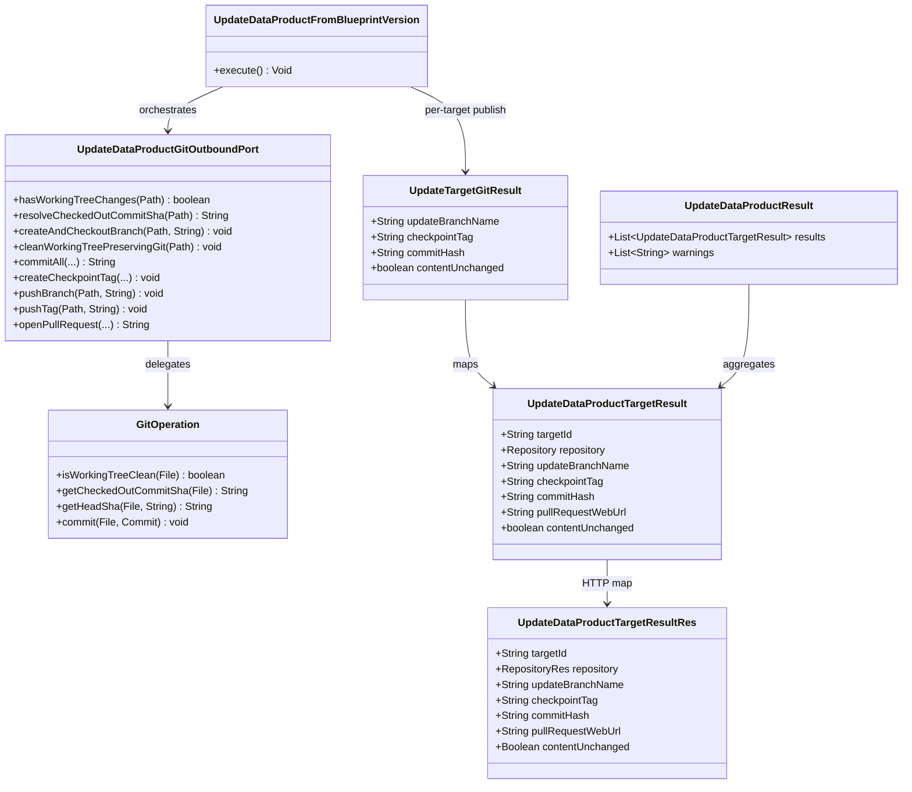

# Handle unchanged repositories on multi-repository blueprint update

## Requirements

Stop failing blueprint data-product updates when one or more mapped remotes have no content delta after the next pure render. Treat a clean working tree as a successful per-target no-op: publish the next checkpoint tag on the existing pure commit, skip empty commit / update branch / PR, continue other remotes, and tell the client which targets were unchanged — while keeping tag-based 3-way merge and empty-commit refusal in git-utils intact for other callers.

## Entities

Reuse existing list-shaped command/result contracts. Do not wrap `warnings` in a new type. Extend `UpdateTargetGitResult` / `UpdateDataProductTargetResult` / `UpdateDataProductTargetResultRes` with a non-breaking `contentUnchanged` flag (default `false` for dirty targets). When unchanged, `updateBranchName` and `pullRequestWebUrl` are null; `checkpointTag` and `commitHash` remain populated.

## Approach

1. Solution category — per-target content no-op on update:
   - After clean + next render (+ root descriptor/lineage when applicable), ask the Git port whether the working tree has changes.
   - **Dirty:** create update branch from HEAD, commit, tag `blueprint-v{next}` on the new SHA, push branch + tag, optional PR (unchanged from today).
   - **Clean:** do **not** commit, do **not** create/push the update branch, do **not** open a PR; resolve the currently checked-out commit SHA (the current checkpoint, typically detached HEAD after tag checkout), create and push tag `blueprint-v{next}` on that SHA; append a `results[]` row with `contentUnchanged=true` and a request-level warning naming the target key; continue later targets.
   - Unchanged is **not** a Git failure and must not fail-fast the loop. Real Git errors (missing current tag, next-tag collision, push rejection) still fail-fast.
   - Do **not** catch `No changes to commit` as control flow. Do **not** allow empty commits in git-utils. Do **not** call instantiate. Do **not** change registry or UI in this ticket.

2. Technical implementation:
   - **git-utils (additive):** add `isWorkingTreeClean(File)` (or equivalent) and `getCheckedOutCommitSha(File)` for the commit currently checked out (works on detached HEAD after tag checkout; do not overload the branch-scoped `getHeadSha(File, String)`). Leave `commit` throwing on clean trees. Bump version; publish/install for blueprint-server.
   - **blueprint-server:** bump `git-utils` dependency; extend `UpdateDataProductGitOutboundPort` with `hasWorkingTreeChanges` and `resolveCheckedOutCommitSha`; reorder per-target publish so branch creation happens **only** on the dirty path (after cleanliness check), so no-ops do not require a free `update/blueprint-v{next}` remote name.
   - REST: keep `POST .../update-data-product`; add optional `contentUnchanged` on each result row; map through `BlueprintVersionUseCasesService`. Existing `ResponseExceptionHandler` for `GitOperationException` stays for real Git failures.
   - Hexagonal boundaries: use case owns when to skip publish vs commit; Git port owns status/SHA/I/O (`spdd/norms/USE_CASE_IMPLEMENTATION.md`).

3. Business logic:
   - Detection is post-render working-tree truth (includes lineage/descriptor on root). Manifest pre-compare is insufficient.
   - Every processed target — dirty or clean — must leave `blueprint-v{next}` on the remote after a successful request.
   - Same policy for 1→1 / N→1 / 1→N / N→N.
   - Warning text must state content was identical and the next checkpoint reuses the existing commit (two tags, one SHA).
   - `createPullRequest` applies only to targets that produced an update branch.
   - Next-tag collision on a clean remote remains a Git failure (no overwrite).

## Structure

### Inheritance Relationships

1. `UseCase` defines `execute()`.
2. `UpdateDataProductFromBlueprintVersion` implements `UseCase` (package-private).
3. `UpdateDataProductGitOutboundPort` remains the Git capability interface; `UpdateDataProductGitOutboundPortImpl` implements it (plain Java, factory-constructed).
4. `GitOperation` / `GitOperationImpl` (git-utils) gain additive cleanliness and checked-out-commit SHA methods; no new exception types.
5. Domain/API exceptions stay `BadRequestException`, `NotFoundException`, `InternalException`, `GitOperationException` — no new type for no-ops.

### Dependencies

1. `BlueprintVersionsUseCaseController` → `BlueprintVersionUseCasesService.updateDataProduct` (unchanged route).
2. Use cases service maps command/result including new `contentUnchanged`.
3. Use case calls Git port for cleanliness / checked-out commit SHA / conditional publish; does not call JGit or parse exception messages.
4. Git port impl delegates to git-utils `GitOperation`.
5. Factory remains the only `@Component` in the update package.

### Layered Architecture

1. Controller: HTTP mapping only.
2. Use cases service: REST ↔ domain mapping (including `contentUnchanged`).
3. Use case: locate/validate/render orchestration; **branch on working-tree changes** before publish.
4. Git outbound adapter: status, checked-out commit SHA, commit/tag/push.
5. git-utils: additive status/HEAD APIs; commit still refuses empty trees.
6. Exception handling: existing global handler; no-ops never throw for cleanliness alone.

## Operations

### Update git-utils — `GitOperation` / `GitOperationImpl`

1. Responsibility: expose working-tree cleanliness and the SHA of the currently checked-out commit without weakening empty-commit refusal.
2. Methods:
   - `isWorkingTreeClean(File repoDir): boolean`
     - Logic: open repo; `git.status().call().isClean()`; throw `GitOperationException` on I/O/API failure (not when dirty).
   - `getCheckedOutCommitSha(File repoDir): String`
     - Logic: resolve `Constants.HEAD` to ObjectId name (the commit currently checked out — branch tip or detached HEAD after a tag checkout). Fail if HEAD cannot be resolved (e.g. unborn). Keep existing branch-scoped `getHeadSha(File, String branchName)` unchanged; do not overload it.
3. Constraints: do **not** change `commit` to allow empty commits; registry and existing git-utils tests that assert the throw must keep passing.
4. Version: bump git-utils beyond `1.1.0` for consumption by blueprint-server.
5. Tests: unit tests for clean vs dirty trees; `getCheckedOutCommitSha` on detached HEAD after tag checkout; existing clean-commit throw test remains.

### Update Git port — `UpdateDataProductGitOutboundPort` / `Impl`

1. Responsibility: surface cleanliness and the currently checked-out commit SHA to the use case in intent-revealing terms.
2. Methods:
   - `hasWorkingTreeChanges(Path targetRepository): boolean` → `!gitOperation.isWorkingTreeClean(...)`.
   - `resolveCheckedOutCommitSha(Path targetRepository): String` → `gitOperation.getCheckedOutCommitSha(repoDir)` (no branch required).
3. Keep existing `createAndCheckoutBranch`, `cleanWorkingTreePreservingGit`, `commitAll`, `createCheckpointTag`, `pushBranch`, `pushTag`, `openPullRequest`.
4. Constraints: do not catch commit-empty exceptions inside `commitAll` to simulate no-op.

### Update use case — `UpdateDataProductFromBlueprintVersion`

1. Responsibility: after render, choose dirty publish vs clean retag per target.
2. Methods:
   - Reorder `updateTargetRepository` publish sequence:
     1. `openTargetAtCheckpoint` (current tag).
     2. `cleanWorkingTreePreservingGit`.
     3. Apply routes / relocate module files / root descriptor + lineage (unchanged).
     4. If `gitPort.hasWorkingTreeChanges(targetPath)`:
        - `createAndCheckoutBranch(update/blueprint-v{next})`.
        - `commitAll` → new SHA.
        - `createCheckpointTag(next, newSha)` → `pushBranch` → `pushTag`.
        - Optional PR when `createPullRequest`.
        - `UpdateTargetGitResult(branch, nextTag, newSha, contentUnchanged=false)`.
     5. Else:
        - `existingSha = gitPort.resolveCheckedOutCommitSha(targetPath)`.
        - `createCheckpointTag(next, existingSha)` → `pushTag` only.
        - Append warning: content for target key was identical to the current checkpoint; next checkpoint reuses commit `{existingSha}`; no update branch or PR.
        - `UpdateTargetGitResult(null, nextTag, existingSha, contentUnchanged=true)`.
        - Do **not** call `createAndCheckoutBranch`, `commitAll`, `pushBranch`, or `openPullRequest`.
   - Map to `UpdateDataProductTargetResult` including `contentUnchanged`; null branch/PR URL when unchanged.
3. Constraints: composed-method step-down; policy stays in the use case (`spdd/norms/USE_CASE_IMPLEMENTATION.md` §5). No-op must not stop later targets.

### Update domain / REST results

1. `UpdateTargetGitResult`: add `boolean contentUnchanged`.
2. `UpdateDataProductTargetResult`: add `boolean contentUnchanged`.
3. `UpdateDataProductTargetResultRes`: add `Boolean contentUnchanged` with `@Schema` describing “true when next render matched the current checkpoint; update branch and PR were skipped; checkpoint tag still advanced.”
4. `BlueprintVersionUseCasesService.mapUpdateDataProductResult`: map the new field.
5. Constraints: non-breaking JSON (new optional field); omit/null branch and PR fields when unchanged.

### Dependency bump — blueprint-server `pom.xml`

1. Raise `git-utils` version to the published/installable version that includes the new APIs.
2. Constraints: no other dependency churn.

### High-level tests (Gherkin)

Cover: main requirement/feature paths, important edge cases, important user decisions/clarifications.

Feature: Unchanged targets on blueprint update
  Scenario: Polyrepo update succeeds when a secondary remote has no content delta
    Given a next parent with two or more repository keys
    And each mapped remote has checkpoint blueprint-v{current}
    And after clean and next render one secondary remote working tree is clean and the root remote has changes
    When update-data-product runs
    Then the request returns HTTP 200
    And the dirty remote gets an update branch, next checkpoint tag on a new commit, and optional PR when requested
    And the clean remote gets blueprint-v{next} on the existing checkpoint SHA with no commit, no branch push, and no PR
    And results include contentUnchanged true for the clean remote and a warning naming that target

  Scenario: Single-target identical render is a successful no-op
    Given a monorepo no-composition target whose next pure render matches the current checkpoint
    When update-data-product runs
    Then HTTP 200 is returned with one result row contentUnchanged true
    And blueprint-v{next} is pushed on the existing SHA
    And commit, pushBranch, and openPullRequest are not invoked

  Scenario: All targets unchanged still succeed
    Given every mapped remote has an identical next render
    When update-data-product runs
    Then HTTP 200 returns a results row per key all contentUnchanged true
    And each remote receives only the next checkpoint tag push

Feature: Dirty path and real Git failures remain unchanged
  Scenario: Dirty remote still commits and can open a pull request
    Given a target whose next render differs from the current checkpoint
    And createPullRequest is true
    When update-data-product runs
    Then the server creates the update branch, commits, tags the new SHA, pushes branch and tag, and opens a PR

  Scenario: Next checkpoint tag collision on an unchanged remote still fails
    Given a clean working tree after render
    And blueprint-v{next} already exists on that remote
    When the no-op path tries to create the next tag
    Then the request fails with a Git error and later targets are not processed

  Scenario: Missing current checkpoint is not treated as unchanged
    Given a mapped remote lacks blueprint-v{current}
    When update-data-product reaches that target
    Then the operation fails at open-target without classifying the remote as contentUnchanged

| Feature / Scenario | Test class | Method |
| --- | --- | --- |
| Unchanged targets on blueprint update / Polyrepo update succeeds when a secondary remote has no content delta | `BlueprintUpdateDataProductControllerIT` | `whenPolyrepoSecondaryRemoteUnchangedThenRetagOnlyAndContinueDirtyTargets` |
| Unchanged targets on blueprint update / Single-target identical render is a successful no-op | `BlueprintUpdateDataProductControllerIT` | `whenMonorepoNextRenderMatchesCheckpointThenRetagWithoutCommitOrBranch` |
| Unchanged targets on blueprint update / All targets unchanged still succeed | `BlueprintUpdateDataProductControllerIT` | `whenAllTargetsUnchangedThenReturn200WithContentUnchangedResults` |
| Dirty path and real Git failures remain unchanged / Dirty remote still commits and can open a pull request | `BlueprintUpdateDataProductControllerIT` | `whenTargetHasContentDeltaThenCommitTagPushAndOptionalPullRequest` |
| Dirty path and real Git failures remain unchanged / Next checkpoint tag collision on an unchanged remote still fails | `BlueprintUpdateDataProductControllerIT` | `whenUnchangedRemoteNextTagAlreadyExistsThenFailFast` |
| Dirty path and real Git failures remain unchanged / Missing current checkpoint is not treated as unchanged | `BlueprintUpdateDataProductControllerIT` | `whenCurrentCheckpointMissingThenFailWithoutContentUnchanged` |

Implement each Gherkin scenario as the listed test method; copy the Scenario sentence into that method's Javadoc. Prefer stubbing `isWorkingTreeClean` / Git status per target over rewriting fixtures when mocks already drive the IT Git layer. Add git-utils unit tests for the new `GitOperation` methods (class `GitOperationImplTest`).

## Norms

1. Annotation standards: factory `@Component` only in the update use-case package; port impls have no Spring stereotypes (`spdd/norms/USE_CASE_IMPLEMENTATION.md`).
2. Dependency injection: factory injects collaborators and constructs port impls with `new` (`spdd/norms/USE_CASE_IMPLEMENTATION.md` §7–8).
3. Exception handling: no-ops are success + warnings, not exceptions. Real Git failures keep existing `GitOperationException` → HTTP 400 mapping. Do not invent a new exception type or catch empty-commit messages as control flow.
4. Data validation: unchanged detection is a post-render Git fact, not a manifest validation gate. Collect-all structural validation remains as today before any Git mutation.
5. Logging: optional info when a target is content-unchanged (include target key); no PII/tokens.
6. Documentation: Javadoc on new port/git-utils methods; Gherkin Scenario text on new IT methods.
7. Hexagonal boundaries: use case owns skip-vs-commit policy; adapters own JGit status and checked-out commit SHA resolution (`spdd/norms/USE_CASE_IMPLEMENTATION.md` §5). No `*Res` in the use-case package.
8. Business vs implementation: reorder so branch creation is conditional on dirty tree — that reorder is business policy (no-op must not require a free remote branch name).
9. CRUD: no new `GenericCrud*` work (`spdd/norms/GENERIC-CRUD-GUIDELINES.md` not applicable beyond “do not add CRUD for this fix”).
10. Shared libraries: additive git-utils APIs only; do not relax `commit` empty-tree refusal used by registry and other callers.

## Safeguards

1. Functional constraints: clean working tree after next render must not fail the update. Dirty targets keep commit/branch/tag/PR behavior. Every successful processed target has `blueprint-v{next}` on the remote. Unchanged targets skip commit, branch push, and PR.
2. Performance constraints: no extra clone beyond today’s per-target open; cleanliness is one status call after render. Sequential per-target loop unchanged.
3. Security constraints: do not log credentials; PR/warning text contain blueprint name/version and target key only.
4. Integration constraints: instantiate, registry, and UI implementation out of scope. Response remains list-compatible; `contentUnchanged` is additive. Misleading UI “merge update branch” CTA for no-ops is a known follow-up (backend omits `updateBranchName`).
5. Business rule constraints: retag existing SHA as next checkpoint; do not skip the target entirely; do not fall back to the integration branch; do not allow empty commits; same policy for all four topologies; `createPullRequest` only for dirty targets.
6. Exception handling constraints: no-op must not throw; next-tag collision and missing current checkpoint remain hard failures; fail-fast after real Git errors; partial earlier tag pushes may already exist (document via warnings/results, no distributed rollback).
7. Technical constraints: detect cleanliness via git-utils API, not exception message parsing; create update branch only on dirty path; resolve commit SHA without requiring the update branch on the clean path; bump git-utils before relying on new methods in blueprint-server.
8. Data constraints: `contentUnchanged=true` implies null/absent `updateBranchName` and `pullRequestWebUrl`; `checkpointTag` is `blueprint-v{next}`; `commitHash` is the existing pure SHA.
9. API constraints: keep `POST /api/v2/pp/blueprint/blueprints-versions/update-data-product`; HTTP 200 when all processed targets completed (dirty and/or clean) even with no-op warnings; no breaking DTO field removals.
