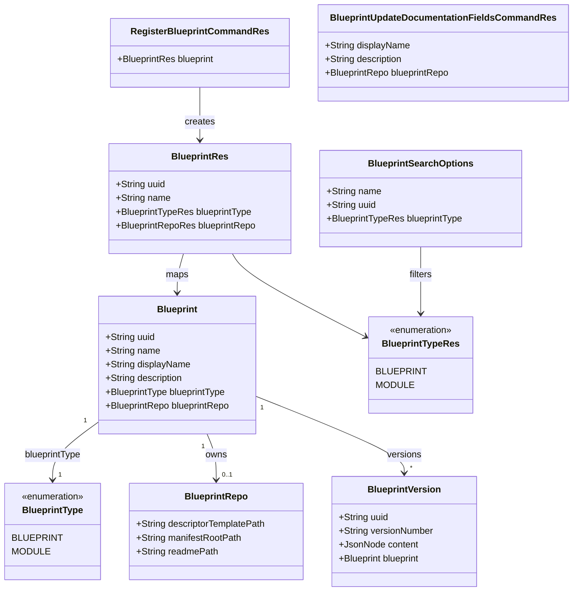

# Explicit Blueprint vs Blueprint module (`blueprintType`)

## Requirements

Make the catalog distinguish a **Blueprint** (the root, which may own a data-product descriptor and be instantiated) from a **Blueprint module** (the component, which may only be composed by a Blueprint).

Replace today’s implicit discriminator (`BlueprintRepo.descriptorTemplatePath` present vs blank) with an explicit required **blueprintType** on the Blueprint catalog identity so publish, instantiate, and update-data-product enforce the two populations by blueprintType, not by a Git file path.

Do not split the aggregate, do not change the manifest specification, and do not implement UI.

## Entities

`BlueprintType.BLUEPRINT` is the official **Blueprint** (root). `BlueprintType.MODULE` is the official **Blueprint module** (component). Do not name the catalog enum `COMPONENT` (collides with `ManifestComponentBase`). Do not use a boolean `isRoot` (collides with `targetRepositories[].isRoot`).

`descriptorTemplatePath` stays on `BlueprintRepo`. Blueprint type stays on `Blueprint`, not on `BlueprintRepo` or `BlueprintVersion`.

`BlueprintUpdateDocumentationFieldsCommandRes` must **not** gain a blueprintType field.

## Approach

1. Catalog model:
   - Add Flyway column `blueprints.blueprint_type` (`varchar`, `NOT NULL`, default `'BLUEPRINT'`). Do **not** backfill from `descriptorTemplatePath`. Do **not** invent descriptor paths for blank-path rows.
   - Add `BlueprintType` (entity) and `BlueprintTypeRes` (REST) with values `BLUEPRINT` and `MODULE`, same pattern as `BlueprintRepoProviderType` / `BlueprintRepoProviderTypeRes`.
   - MapStruct `BlueprintMapper` maps blueprintType by matching field names. `BlueprintRepoMapper` is unchanged aside from path validation callers.

2. Write paths:
   - Hidden CRUD create and register: blueprintType **required**; omit → 400; never infer from path.
   - Hidden CRUD overwrite: **may** change blueprintType. If PUT omits blueprintType, keep the stored value (load existing in `overwriteResource` before `toEntity`). If PUT sends a different blueprintType, persist it after blueprintType↔path validation of the **incoming** aggregate. Inconsistent blueprintType+path → 400, no partial persist.
   - Public update-documentation-fields: do not expose or mutate blueprintType. Path rules follow the **stored** blueprintType after the repo merge.
   - Reuse existing `BadRequestException` / `ResponseExceptionHandler`. Do **not** add a `GlobalExceptionHandler`.

3. Blueprint type ↔ path:
   - `BLUEPRINT`: `blueprintRepo` required; `descriptorTemplatePath` required and non-blank.
   - `MODULE`: `blueprintRepo` required; `descriptorTemplatePath` must be null or blank. Other repo required fields stay as today.
   - Duplicate these checks in `BlueprintServiceImpl.validate` and `UpdateBlueprintDocumentationFieldsStructuralValidationOutboundPortImpl` (same logic, no shared validator class — matches the existing documentation-fields split).

4. Use-case policy (keyed off blueprintType, not path):
   - **Instantiate** and **update-data-product**: requested parent must be `BLUEPRINT` and must have a non-blank `descriptorTemplatePath` (fail before Git; do not skip descriptor render for a blank-path Blueprint).
   - **Instantiate** / **update-data-product** / **parent publish**: each `composition[]` child must be `MODULE`. Composing a `BLUEPRINT` is always illegal, including blank path. Keep a secondary collected issue if a `MODULE` still has a descriptor path.
   - **Module publish**: when the version’s blueprintType is `MODULE`, its content must be monorepo with empty composition (`isMonorepoNoComposition`) **before** create. Parent publish still checks each child is `MODULE` and 1→1.
   - A `MODULE` may still be registered and published so parents can reference `name@version`. It must not be the parent of instantiate or update-data-product.

5. Search:
   - Expose blueprintType on `BlueprintRes` (GET one, GET list, register/update-documentation-fields responses that already return `BlueprintRes`).
   - Optional filter `BlueprintSearchOptions.blueprintType` via `BlueprintsRepository.Specs.hasBlueprintType`. UI is out of scope.

## Structure

### Inheritance Relationships

1. `BlueprintService` continues to extend `GenericMappedAndFilteredCrudService`.
2. `BlueprintServiceImpl` continues to extend `GenericMappedAndFilteredCrudServiceImpl` and supplies `validate`, `reconcile`, `getSpecFromFilters`, `beforeCreation`, `beforeOverwrite`, `overwriteResource`.
3. `BlueprintType` / `BlueprintTypeRes` follow `BlueprintRepoProviderType` / `BlueprintRepoProviderTypeRes` (`fromString`, `EnumType.STRING`).
4. `Blueprint` continues to extend `VersionedEntity`.
5. Existing use cases (`RegisterBlueprint`, `UpdateBlueprintDocumentationFields`, `PublishBlueprintVersion`, `InstantiateBlueprintVersion`, `UpdateDataProductFromBlueprintVersion`) stay package-private `UseCase` implementations; no new use-case package.

### Dependencies

1. `BlueprintController` already injects `BlueprintService` — hidden POST/PUT pick up blueprintType via `BlueprintRes`.
2. `RegisterBlueprint` persistence already calls `BlueprintService.create` — CRUD `validate` covers register.
3. `UpdateBlueprintDocumentationFields` loads the entity, mutates display/description/repo only, then structural+semantic ports.
4. `PublishBlueprintVersion` uses `PublishBlueprintVersionManifestOutboundPort.isMonorepoNoComposition` for module self-check and child checks; persistence already returns `BlueprintVersion` with `blueprint` loaded.
5. `InstantiateBlueprintVersion` / `UpdateDataProductFromBlueprintVersion` already load parent and children via persistency ports; add blueprintType checks next to today’s `hasDescriptorTemplatePath` child checks.

### Layered Architecture

1. Controller layer: unchanged routes. Search binds optional `blueprintType`. Hidden CRUD remains `@Hidden`.
2. Use-case layer: policy (parent must be Blueprint; children must be modules; module publish topology; no standalone module instantiate).
3. Core CRUD layer: blueprintType required, blueprintType↔path, omit-blueprintType on overwrite, search spec.
4. Persistence: Flyway `V2__blueprint_type.sql`; JPA `ddl-auto: validate`.
5. Exception handling: existing `ResponseExceptionHandler` + `BadRequestException` → 400.

## Operations

### Create Flyway migration - `V2__blueprint_type.sql`

1. Responsibility: Add catalog blueprint type with default Blueprint for existing rows; do not derive from `descriptorTemplatePath`.
2. SQL:
   - `alter table blueprints add column if not exists blueprint_type varchar(32) not null default 'BLUEPRINT';`
3. Constraints: values used by JPA are `BLUEPRINT` and `MODULE`. No backfill of `descriptor_template_path`.

### Create enum - `BlueprintType`

1. Responsibility: Catalog discriminant on the entity.
2. Values: `BLUEPRINT`, `MODULE`.
3. Methods: `fromString(String)` like `BlueprintRepoProviderType` (upper-case `valueOf`).
4. Package: `org.opendatamesh.platform.pp.blueprint.blueprint.entities`.

### Create enum - `BlueprintTypeRes`

1. Responsibility: REST/OpenAPI twin of `BlueprintType`.
2. Values: `BLUEPRINT`, `MODULE`.
3. Methods: `fromString(String)` like `BlueprintRepoProviderTypeRes`.
4. Package: `org.opendatamesh.platform.pp.blueprint.rest.v2.resources.blueprint`.
5. `@Schema` on `BlueprintRes.blueprintType`: description that `BLUEPRINT` is the root Blueprint and `MODULE` is the Blueprint module (component); `allowableValues` those two tokens.

### Update entity - `Blueprint`

1. Responsibility: Persist `blueprintType` on the catalog row.
2. Attributes:
   - `blueprintType`: `BlueprintType` — `@Enumerated(EnumType.STRING)` `@Column(name = "blueprint_type", nullable = false)`.
3. Getters/setters matching existing JavaBean style.

### Update resource - `BlueprintRes`

1. Responsibility: Expose blueprintType on every Blueprint JSON body.
2. Attributes:
   - `blueprintType`: `BlueprintTypeRes` — required on create; documented as above.
3. MapStruct `BlueprintMapper` maps `blueprintType` automatically; add an explicit mapping only if compilation requires enum conversion (prefer same-name enums + default MapStruct enum mapping, or a small default method like `BlueprintRepoMapper`).

### Update search - `BlueprintSearchOptions` + `BlueprintsRepository.Specs`

1. Responsibility: Optional exact filter by blueprintType.
2. Attributes:
   - `blueprintType`: `BlueprintTypeRes` (query parameter).
3. `BlueprintServiceImpl.getSpecFromFilters`: if `filters.getBlueprintType() != null`, AND `BlueprintsRepository.Specs.hasBlueprintType(BlueprintType.valueOf(filters.getBlueprintType().name()))`.
4. Spec predicate: `cb.equal(root.get(Blueprint_.blueprintType), blueprintType)`.
5. Document search OpenAPI on `BlueprintController.searchBlueprints` that `blueprintType` is a valid filter (sort properties stay as today; do not add `blueprintType` as a required sort field).

### Update core service - `BlueprintServiceImpl`

1. Responsibility: Blueprint type required on create; blueprintType↔path; hidden overwrite may change blueprintType; omit blueprintType on PUT keeps stored.
2. `overwriteResource(String uuid, BlueprintRes resource)`:
   - `resource.setUuid(uuid)` (already).
   - If `resource.getBlueprintType() == null`, `findOne(uuid)` and set `resource.setBlueprintType` from the stored entity mapped to `BlueprintTypeRes` (or set on the entity after `toEntity` **before** `validate` — the generic `overwrite` validates first, so merge on the **resource** before `super.overwriteResource`).
   - Then `super.overwriteResource(uuid, resource)`.
3. `validate(Blueprint)`:
   - Existing null/required/length/repo checks.
   - Blueprint type is required: null → `BadRequestException("Blueprint type is required")`.
   - `blueprintRepo` is required when blueprintType is set (both blueprint types need a repo).
   - If blueprintType is `BLUEPRINT` and `descriptorTemplatePath` is blank → `BadRequestException("Descriptor template path is required for a Blueprint")`.
   - If blueprintType is `MODULE` and `descriptorTemplatePath` is non-blank → `BadRequestException("A Blueprint module must not have descriptorTemplatePath; remove it from the module.")`.
4. Constraints: do not infer blueprintType from path. Invalid enum from JSON is Jackson/400 as for provider type.

### Update use case validation - `UpdateBlueprintDocumentationFieldsStructuralValidationOutboundPortImpl`

1. Responsibility: Same blueprintType↔path rules as CRUD `validate`, using the **stored** blueprintType (the use case never assigns blueprintType from the command).
2. After existing field checks, apply the same Blueprint vs module path rules as `BlueprintServiceImpl.validate`.
3. Do not add blueprintType to `UpdateBlueprintDocumentationFieldsCommand` or `BlueprintUpdateDocumentationFieldsCommandRes`.

### Update use case - `PublishBlueprintVersion`

1. Responsibility: Module self-topology at module publish; composition children keyed by blueprintType, not path.
2. After `blueprint` is loaded and structural manifest validation succeeds, before version-number extract:
   - If `blueprint.getBlueprintType() == MODULE` and `!manifestOutboundPort.isMonorepoNoComposition(blueprintVersion.getContent())` → `BadRequestException` with problem that a Blueprint module must be a monorepo with no composition and hint `(one repository key, empty composition)`.
3. In `validateCompositionModules`, for each child:
   - If child blueprintType is not `MODULE` → collected issue: composing a Blueprint (root) is forbidden; hint that only a Blueprint module may be composed.
   - If child blueprintType is `MODULE` and `hasDescriptorTemplatePath` → keep a collected issue (defense in depth) with hint to remove the path from the module.
   - Keep existing 1→1 and parameter-mapping collection.
4. A `BLUEPRINT` parent may still have composition; a `MODULE` being published must have empty composition (enforced by `isMonorepoNoComposition` on **its** content).

### Update use case - `InstantiateBlueprintVersion`

1. Responsibility: Refuse standalone instantiate of a module; require parent Blueprint + descriptor path; composition children must be modules.
2. After `findByBlueprintNameAndVersion`, before Git:
   - If parent blueprintType is `MODULE` → `BadRequestException` that a Blueprint module cannot be instantiated alone; hint that it can only be used when composed by a Blueprint.
   - If parent blueprintType is `BLUEPRINT` and `descriptorTemplatePath` is blank → `BadRequestException("Descriptor template path is required for a Blueprint")` (do not skip descriptor render).
3. In `validateModulesBlueprintVersions`, replace the path-as-type check as the **primary** rule with blueprintType `MODULE`; keep secondary path-on-module issue. Composing a `BLUEPRINT` child is a collected issue with a fix hint.

### Update use case - `UpdateDataProductFromBlueprintVersion`

1. Responsibility: Same parent and child blueprintType rules as instantiate, applied to the shared catalog row (`current` and `next` already must share uuid).
2. After loading current/next and confirming same blueprint:
   - If blueprintType is `MODULE` → 400, cannot update a data product from a Blueprint module alone.
   - If blueprintType is `BLUEPRINT` and next parent `descriptorTemplatePath` is blank → 400 path required.
3. In `validateModulesBlueprintVersions`, same child blueprintType rules as instantiate/publish.

### Update existing tests and helpers

1. Responsibility: Every fixture that creates/registers a catalog row must set blueprintType; parents are `BLUEPRINT` with a descriptor path; composition children are `MODULE` with blank path.
2. Update `BlueprintControllerIT` create-without-repo happy path: it becomes 400 unless blueprintType+repo+path are supplied for `BLUEPRINT` (or blueprintType+repo without path for `MODULE`). Add dedicated scenarios listed below rather than silently weakening the old repo-less create.
3. Replace composition tests that rely on “child has `descriptorTemplatePath`” as the type signal with blueprintType-based scenarios (`BlueprintInstantiationControllerIT`, `BlueprintVersionsUseCaseControllerIT`, `BlueprintUpdateDataProductControllerIT`). Keep a remaining test that a `MODULE` with a path still 400s.
4. Register / update-documentation-fields ITs: register sends blueprintType; update-documentation-fields does not change blueprintType; updating a Blueprint repo without a path 400s; updating a module repo with a path 400s.

### High-level tests (Gherkin)

Feature: Catalog blueprint type on Blueprint create and read
  Scenario: Hidden CRUD create of a Blueprint requires blueprintType and descriptorTemplatePath
    Given a valid repository payload with a non-blank descriptorTemplatePath
    And blueprintType is BLUEPRINT
    When the client POSTs to "/api/v2/pp/blueprint/blueprints"
    Then the response status is 201
    And GET by uuid returns blueprintType BLUEPRINT and the same descriptorTemplatePath

  Scenario: Hidden CRUD create without blueprintType returns 400
    Given a valid blueprint payload with repository and descriptorTemplatePath
    And blueprintType is omitted
    When the client POSTs to "/api/v2/pp/blueprint/blueprints"
    Then the response status is 400
    And the message states that blueprint type is required

  Scenario: Hidden CRUD create of a Blueprint without descriptorTemplatePath returns 400
    Given blueprintType is BLUEPRINT
    And the repository has a blank descriptorTemplatePath
    When the client POSTs to "/api/v2/pp/blueprint/blueprints"
    Then the response status is 400
    And the message states that descriptor template path is required for a Blueprint

  Scenario: Hidden CRUD create of a Blueprint module forbids descriptorTemplatePath
    Given blueprintType is MODULE
    And the repository has a non-blank descriptorTemplatePath
    When the client POSTs to "/api/v2/pp/blueprint/blueprints"
    Then the response status is 400
    And the message states that a Blueprint module must not have descriptorTemplatePath

  Scenario: Hidden CRUD create of a Blueprint module with blank descriptorTemplatePath succeeds
    Given blueprintType is MODULE
    And a valid repository payload with blank descriptorTemplatePath
    When the client POSTs to "/api/v2/pp/blueprint/blueprints"
    Then the response status is 201
    And GET by uuid returns blueprintType MODULE

  Scenario: Register requires blueprintType
    Given a register command whose nested blueprint omits blueprintType
    When the client POSTs to the register use-case endpoint
    Then the response status is 400

  Scenario: Search filters by blueprintType
    Given one BLUEPRINT and one MODULE exist
    When the client GETs "/api/v2/pp/blueprint/blueprints" with blueprintType=MODULE
    Then the response contains only the MODULE row

Feature: Blueprint type mutability
  Scenario: Public update-documentation-fields does not change blueprintType
    Given a MODULE exists
    When the client POSTs update-documentation-fields with a new displayName and a complete repo without descriptorTemplatePath
    Then the response status is 200
    And GET still returns blueprintType MODULE

  Scenario: Hidden CRUD overwrite can change blueprintType when path matches the new blueprintType
    Given a MODULE exists with blank descriptorTemplatePath
    When the client BLUEPRINT and a non-blank descriptorTemplatePath
    Then the response status is 200
    And GET returns blueprintType BLUEPRINT and that path

  Scenario: Hidden CRUD overwrite that changes blueprintType without a matching path returns 400
    Given a MODULE exists
    When the client BLUEPRINT but leaves descriptorTemplatePath blank
    Then the response status is 400
    And blueprintType on GET is still MODULE

  Scenario: Hidden CRUD overwrite that omits blueprintType keeps the stored blueprintType
    Given a MODULE exists
    When the client PUTs an otherwise valid body without blueprintType
    Then the response status is 200
    And GET still returns blueprintType MODULE

Feature: Composition and instantiate by blueprintType
  Scenario: Instantiating a Blueprint module alone returns 400
    Given a published MODULE version
    When the client instantiates that name@version as the parent
    Then the response status is 400
    And the message states that a Blueprint module cannot be instantiated alone

  Scenario: Updating a data product from a Blueprint module alone returns 400
    Given a published MODULE with two versions
    When the client POSTs update-data-product using that module as parent
    Then the response status is 400

  Scenario: Publishing a parent that composes a catalog Blueprint returns 400
    Given a published BLUEPRINT version (even with a descriptor path)
    When a parent manifest composition[] references that name@version
    And the client publishes the parent
    Then the response status is 400
    And the message states that only a Blueprint module may be composed

  Scenario: Publishing a parent that composes a MODULE succeeds when the module is 1→1 empty composition
    Given a published MODULE version whose content is monorepo with empty composition
    When a parent BLUEPRINT composes that module with valid parameterMapping
    And the client publishes the parent
    Then the response status is 201 or the documented success status for publish

  Scenario: Publishing a Blueprint module whose content is not 1→1 empty composition returns 400
    Given a catalog row with blueprintType MODULE
    And the version content has composition or more than one repository key
    When the client publishes that module version
    Then the response status is 400
    And the message states that a Blueprint module must be a monorepo with no composition

Notes (not HTTP-IT; defense-in-depth / migration only — do not seed illegal states via JDBC):
- Instantiating a BLUEPRINT with blank `descriptorTemplatePath` returns 400 (migrated blank-path rows).
- Composing a MODULE that still has `descriptorTemplatePath` returns 400 (corrupt/legacy rows). Catalog create/overwrite already rejects both combinations.

| Feature / Scenario | Test class | Method |
| --- | --- | --- |
| Catalog blueprint type / Hidden CRUD create of a Blueprint requires blueprintType and descriptorTemplatePath | `BlueprintControllerIT` | `whenCreateBlueprintWithBlueprintTypeBlueprintThenReturnCreatedBlueprint` |
| Catalog blueprint type / Hidden CRUD create without blueprintType returns 400 | `BlueprintControllerIT` | `whenCreateBlueprintWithoutBlueprintTypeThenReturnBadRequest` |
| Catalog blueprint type / Hidden CRUD create of a Blueprint without descriptorTemplatePath returns 400 | `BlueprintControllerIT` | `whenCreateBlueprintWithoutDescriptorTemplatePathThenReturnBadRequest` |
| Catalog blueprint type / Hidden CRUD create of a Blueprint module forbids descriptorTemplatePath | `BlueprintControllerIT` | `whenCreateBlueprintModuleWithDescriptorTemplatePathThenReturnBadRequest` |
| Catalog blueprint type / Hidden CRUD create of a Blueprint module with blank descriptorTemplatePath succeeds | `BlueprintControllerIT` | `whenCreateBlueprintModuleThenReturnCreatedBlueprint` |
| Catalog blueprint type / Register requires blueprintType | `BlueprintUseCaseControllerIT` | `whenRegisterBlueprintWithoutBlueprintTypeThenReturnBadRequest` |
| Catalog blueprint type / Search filters by blueprintType | `BlueprintControllerIT` | `whenSearchBlueprintsByBlueprintTypeThenReturnFilteredResults` |
| Blueprint type mutability / Public update-documentation-fields does not change blueprintType | `BlueprintUseCaseControllerIT` | `whenUpdateDocumentationFieldsThenBlueprintTypeUnchanged` |
| Blueprint type mutability / Hidden CRUD overwrite can change blueprintType when path matches the new blueprintType | `BlueprintControllerIT` | `whenOverwriteBlueprintTypeWithMatchingPathThenReturnUpdatedBlueprintType` |
| Blueprint type mutability / Hidden CRUD overwrite that changes blueprintType without a matching path returns 400 | `BlueprintControllerIT` | `whenOverwriteBlueprintTypeWithMismatchedPathThenReturnBadRequest` |
| Blueprint type mutability / Hidden CRUD overwrite that omits blueprintType keeps the stored blueprintType | `BlueprintControllerIT` | `whenOverwriteBlueprintOmittingBlueprintTypeThenKeepStoredBlueprintType` |
| Composition and instantiate / Instantiating a Blueprint module alone returns 400 | `BlueprintInstantiationControllerIT` | `whenInstantiateBlueprintModuleAloneThenReturn400` |
| Composition and instantiate / Updating a data product from a Blueprint module alone returns 400 | `BlueprintUpdateDataProductControllerIT` | `whenUpdateDataProductFromBlueprintModuleThenReturn400` |
| Composition and instantiate / Publishing a parent that composes a catalog Blueprint returns 400 | `BlueprintVersionsUseCaseControllerIT` | `whenPublishParentComposingBlueprintThenReturn400` |
| Composition and instantiate / Publishing a parent that composes a MODULE succeeds when the module is 1→1 empty composition | `BlueprintVersionsUseCaseControllerIT` | `whenPublishParentComposingModuleThenSucceed` |
| Composition and instantiate / Publishing a Blueprint module whose content is not 1→1 empty composition returns 400 | `BlueprintVersionsUseCaseControllerIT` | `whenPublishModuleThatIsNotMonorepoNoCompositionThenReturn400` |

Each new/updated test method’s Javadoc copies its Scenario verbatim (existing project style).

## Norms

1. Use-case layout: `spdd/norms/USE_CASE_IMPLEMENTATION.md` — no new use-case package; extend existing publish/instantiate/update-data-product/register/update-documentation-fields. Business policy (who may be instantiated, who may be composed, module publish topology) stays in the use case class; persistence and manifest parsing stay in outbound ports. REST `*Res` types stay out of use-case packages. Port impls remain plain Java constructed by the factory. Controllers stay thin.
2. CRUD: `spdd/norms/GENERIC-CRUD-GUIDELINES.md` — put blueprintType required, enum, and blueprintType↔path in `BlueprintServiceImpl.validate`; uniqueness stays in `beforeCreation` / `beforeOverwrite`; blueprintType filter in `getSpecFromFilters` + repository `Specs`; path-id vs body in `overwriteResource` (also the omit-blueprintType merge). Do not implement blueprintType policy inside generic base classes.
3. Duplicate documentation-fields structural checks with CRUD `validate` (same logic, separate class) as already done for repo required/length/enum.
4. Exceptions: throw existing `BadRequestException`; `ResponseExceptionHandler` maps `BlueprintApiException` to HTTP status. Do not introduce `GlobalExceptionHandler` or a new exception type for blueprintType.
5. Persistence: Flyway under `src/main/resources/db/migration/postgresql`; JPA `ddl-auto: validate`; enum stored as `STRING`.
6. Tests: integration tests under `src/test/java/.../rest/v2/controllers`, extend `BlueprintApplicationIT`, Javadoc Gherkin on each method.
7. UI is out of scope; do not change Blindata UI or init-repository file templates on the server beyond blueprintType-aware validation of catalog metadata.

## Safeguards

1. Functional Constraints:
   - Blueprint type is required on hidden CRUD create and register; omission is 400; never inferred from `descriptorTemplatePath`.
   - Public update-documentation-fields cannot change blueprintType (no field on the command).
   - Hidden CRUD PUT is the only blueprintType mutation; omit keeps stored; new blueprintType must satisfy path rules in the same payload.
   - `BLUEPRINT` requires non-blank `descriptorTemplatePath`; `MODULE` forbids it.
   - `MODULE` cannot be instantiate or update-data-product parent.
   - Only `MODULE` may appear in `composition[]`; composing a `BLUEPRINT` is always 400.
   - `MODULE` publish requires 1→1 empty composition on **that** version’s content.
   - UI is deferred.
2. Performance Constraints: blueprintType filter is an equality predicate on `blueprints.blueprint_type`; no extra round-trips beyond the existing overwrite `findOne` used to fill omitted blueprintType.
3. Security Constraints: hidden CRUD remains `@Hidden`; blueprintType change is not a public product API.
4. Integration Constraints: no registry, git-utils, or DPDS parser API changes. Manifest `instantiation` `root`/`module` and `isRoot` are unchanged.
5. Business Rule Constraints:
   - Existing rows become `BLUEPRINT` via column default; blank paths are not backfilled; instantiate of those rows 400s until a path is set (or hidden CRUD reclassifies to `MODULE` and clears the path).
   - Blueprint type flip via hidden CRUD applies to all versions of that name on the next parent use-case; no cascade rewrite of parent manifests.
6. Exception Handling Constraints: 400 with a clear message and, for collected composition issues, existing problem+hint format. Do not leak internals. Use `ResponseExceptionHandler` only.
7. Technical Constraints: no second Blueprint table; no blueprintType on `BlueprintRepo` or `BlueprintVersion`; no `ManifestComponentBase` reuse; no boolean `isRoot`/`isModule` on the catalog entity; no new Spring beans for port impls.
8. Data Constraints: `blueprint_type` `NOT NULL`; Java create rejects null even though the DB default is `'BLUEPRINT'` (required on the API). Path length limits stay 500 characters.
9. API Constraints: JSON tokens `BLUEPRINT` and `MODULE`. Search query `blueprintType`. Register body nested `blueprint.blueprintType`. Update-documentation-fields body has no blueprintType. GET list/one return blueprintType.
