# Protected-resources integrity policy adapter

## Requirements

- Implement **protected-resources integrity evaluation** inside Blueprint Server so that, during data product **version publication**, this service can act as a **Policy adapter** (same role as Observer’s validator) and tell Policy whether immutable generated artifacts still match a fresh local re-instantiation.
- Expose the Policy Validator Adapter evaluate API. **Policy subscription, Policy DTOs/clients, evaluate controller, and `ProtectedResourcesPolicyValidatorService`** live in the removable `old/v1` adapter (see `spdd/prompt/BDMD-5124-202608241546-[Feat]-service-v1-protected-resources-policy-adapter.md`, event `DATA_PRODUCT_VERSION_CREATION`). This canvas owns the **lasting integrity contract**: V2-shaped `objectToEvaluate`, skip/fail matrix, clone, local re-instantiate, compare.
- Given a Policy evaluation object that already contains the nested V2 version resource (`tag` + `dataProduct.dataProductRepo` + descriptor `content` with blueprint lineage): **pass not-applicable** when there is no lineage or no protected paths (or unsupported strategy); otherwise **clone the product repo at the publication tag**, **clone the blueprint source** from stored pointers, **re-instantiate locally** with recorded parameters using **`InstantiateBlueprintVersion`** and a **local/no-push Git outbound port**, **SHA-256** each protected path on both trees, and **fail** with **path-level reasons** if anything is missing or differs.
- Keep **policy evaluation mapping** (adapter) separate from **integrity** (hash/clone/re-instantiate). Do not call Registry from integrity. Do not push branches or tags. Do not persist hashes. First slice: **monorepo, no composition** only.

## Entities

```mermaid
classDiagram
  direction TB

  class PolicyEvaluationRequestRes {
    <<old.v1.resources>>
    +Long policyEvaluationId
    +JsonNode policy
    +JsonNode objectToEvaluate
  }

  class PolicyEvaluationResultRes {
    <<old.v1.resources>>
    +Long policyEvaluationId
    +Boolean evaluationResult
    +OutputObject outputObject
  }

  class OutputObject {
    +String message
    +JsonNode rawError
  }

  class NestedVersionResource {
    +String tag
    +JsonNode content
    +ProductRepoLocator dataProductRepo
  }

  class ProductRepoLocator {
    <<record>>
    +String remoteUrlHttp
    +String providerType
    +String providerBaseUrl
    +String name
    +String defaultBranch
    +String ownerId
    +String externalIdentifier
  }

  class BlueprintLineage {
    +String blueprintName
    +String blueprintVersionNumber
    +Map parameters
  }

  class BlueprintVersion {
    +String uuid
    +String versionNumber
    +String tag
    +JsonNode content
    +Blueprint blueprint
  }

  class ManifestProtectedResource {
    +String path
    +String integrityAlgorithm
  }

  class EvaluateProtectedResourcesIntegrityCommand {
    <<record>>
    +String publicationTag
    +ProductRepoLocator productRepo
    +String blueprintName
    +String blueprintVersionNumber
    +Map lineageParameters
  }

  class ProtectedResourceMismatch {
    <<record>>
    +String declaredPath
    +MismatchKind kind
    +List affectedFiles
    +String detail
  }

  class IntegrityOutcome {
    <<record>>
    +OutcomeKind kind
    +String message
    +List mismatches
  }

  class OutcomeKind {
    <<enum>>
    NOT_APPLICABLE
    PASSED
    FAILED
    INFRASTRUCTURE_FAILED
  }

  class WorkingTree {
    <<AutoCloseable>>
    +Path path()
    +close()
  }

  class DigestResult {
    <<record>>
    +MismatchKind error
    +String detail
    +Map fileDigests
  }

  class EvaluateProtectedResourcesIntegrity {
    <<use case / package-private>>
    +execute()
  }

  class EvaluateProtectedResourcesIntegrityFactory {
    <<@Component>>
    +buildEvaluateProtectedResourcesIntegrity(command, presenter)
  }

  class EvaluateProtectedResourcesIntegrityGitOutboundPort {
    <<outbound port>>
    +clonePublishedDataProductVersion(repo, tag) WorkingTree
  }

  class EvaluateProtectedResourcesIntegrityInstantiateOutboundPort {
    <<outbound port>>
    +reinstantiateBlueprintLocally(version, command) WorkingTree
  }

  class EvaluateProtectedResourcesIntegrityDigestOutboundPort {
    <<outbound port>>
    +computeDigest(tree, declaredPath) DigestResult
  }

  class InstantiateBlueprintVersion {
    <<use case>>
    +execute()
  }

  class InstantiateBlueprintVersionGitOutboundPort {
    <<outbound port>>
    +init(blueprint)
    +withClonedSourceAndTarget(...)
    +pushBranch(path, branch)
    +pushTag(path, tag)
  }

  class InstantiateBlueprintVersionLocalGitOutboundPort {
    <<local / no-push>>
    +pushBranch() no-op
    +pushTag() no-op
  }

  class RenderedTreeSnapshot {
    <<instantiate package>>
    +Path expectedTreeRoot
  }

  class ProtectedResourcesPolicyValidatorService {
    <<old.v1 @Service>>
    +evaluate(document)
    +executeIntegrity(command, holder) CompletableFuture
  }

  PolicyEvaluationRequestRes --> NestedVersionResource : extracts from objectToEvaluate
  NestedVersionResource --> ProductRepoLocator : dataProduct.dataProductRepo
  NestedVersionResource --> BlueprintLineage : content.blueprint
  EvaluateProtectedResourcesIntegrityCommand --> NestedVersionResource : built from
  ProtectedResourcesPolicyValidatorService --> EvaluateProtectedResourcesIntegrityCommand : maps
  ProtectedResourcesPolicyValidatorService --> EvaluateProtectedResourcesIntegrityFactory : @Async
  EvaluateProtectedResourcesIntegrityFactory --> EvaluateProtectedResourcesIntegrity : new
  EvaluateProtectedResourcesIntegrity --> EvaluateProtectedResourcesIntegrityCommand : consumes
  EvaluateProtectedResourcesIntegrity --> BlueprintVersion : loads stored version
  BlueprintVersion --> ManifestProtectedResource : protectedResources
  EvaluateProtectedResourcesIntegrity --> EvaluateProtectedResourcesIntegrityGitOutboundPort : published tree
  EvaluateProtectedResourcesIntegrity --> EvaluateProtectedResourcesIntegrityInstantiateOutboundPort : expected tree
  EvaluateProtectedResourcesIntegrity --> EvaluateProtectedResourcesIntegrityDigestOutboundPort : hash
  EvaluateProtectedResourcesIntegrityGitOutboundPort --> WorkingTree
  EvaluateProtectedResourcesIntegrityInstantiateOutboundPort --> WorkingTree
  EvaluateProtectedResourcesIntegrityInstantiateOutboundPort --> InstantiateBlueprintVersion : local factory
  EvaluateProtectedResourcesIntegrityDigestOutboundPort --> DigestResult
  InstantiateBlueprintVersion --> InstantiateBlueprintVersionGitOutboundPort : production path
  InstantiateBlueprintVersion --> InstantiateBlueprintVersionLocalGitOutboundPort : validation path
  InstantiateBlueprintVersionLocalGitOutboundPort ..|> InstantiateBlueprintVersionGitOutboundPort
  InstantiateBlueprintVersionLocalGitOutboundPort --> RenderedTreeSnapshot : expected tree
  EvaluateProtectedResourcesIntegrity --> IntegrityOutcome : presents
  IntegrityOutcome --> OutcomeKind
  IntegrityOutcome "0..*" --> ProtectedResourceMismatch : on fail
  ProtectedResourcesPolicyValidatorService --> PolicyEvaluationResultRes : maps outcome
```



## Approach

1. Two packages (adapter vs integrity):
   - **Adapter** (`...pp.blueprint.old.v1`): Observer-validator shape — inbound evaluate API matching the Policy Validator Adapter contract. HTTP → `ReconstructPublicationRequestedService` (V1 canvas) → `ProtectedResourcesPolicyValidatorService.evaluate()`: require readable payload → map V2-shaped `objectToEvaluate` → integrity command → `@Async executeIntegrity` with timeout (`OutcomeHolder`, `@Lazy` self) → map `IntegrityOutcome` → Policy result. Never hashes, never clones. Startup Policy registration is in the same package (V1 canvas).
   - **Integrity** (`...blueprintversion.services.usecases.evaluateprotectedresources`): hexagonal use case per `spdd/norms/USE_CASE_IMPLEMENTATION.md`. `execute()` is load → `readManifest` → `refuseIfNotEvaluable` → clone published product → re-instantiate locally → compare. Adapters own Git credentials and `WorkingTree` close. Never talks to Policy Service or Registry.

2. Consume the Registry V2 nested contract (already on the event):
   - Policy `objectToEvaluate` is the V2 publication event (or a wrapper that still contains it). Canonical path: `eventContent.dataProductVersion`.
   - Product clone coordinates: `dataProductVersion.tag` + `dataProductVersion.dataProduct.dataProductRepo` (`remoteUrlHttp`, provider type, `providerBaseUrl`, clone identity fields).
   - Blueprint identity / parameters: DPDS lineage on `dataProductVersion.content.blueprint` (`blueprintName`, `blueprintVersionNumber`, `parameters`). Blueprint clone coordinates, manifest, and `protectedResources` come from **this service’s store**, not extra event fields.
   - Tolerate extra wrapping (`eventContent` at root, or the version resource itself). Do **not** read Policy V1 `afterState` as the contract. Do **not** call Registry if nested repo/tag is missing.

3. Reuse `InstantiateBlueprintVersion` with a local Git port (original “mock push”):
   - Production `InstantiateBlueprintVersionFactory.buildInstantiateBlueprintVersion(command, presenter, headers)` is **unchanged** (live product integration branch + merge + push).
   - Add a **second factory method** that wires the **same** persistency / manifest / templating ports and a new **`InstantiateBlueprintVersionLocalGitOutboundPort`**: `pushBranch` / `pushTag` are no-ops; target is a **throwaway empty Git repo**, not a clone of the live product integration branch. The port creates the throwaway first (`Git.init` + empty commit on the integration branch), clones **source** at `source.tag()`, runs the instantiate callback, and **snapshots the rendered working tree inside that callback** (regular files, skip `.git`, do not follow symlinks) into `RenderedTreeSnapshot`. `createAndCheckoutOrphanBranch` uses local JGit (the throwaway has no origin; git-utils would `ls-remote`).
   - Integrity clones the **published product tree separately** at the publication tag via its own Git outbound port (`readRepository` + `RepositoryPointerTag`).
   - Do **not** reimplement Velocity or lineage enrichment beside `InstantiateBlueprintVersion`.

4. Canonical digest (JDK SHA-256, lowercase hex; no new hashing library):
   - **File:** SHA-256 of raw working-tree bytes.
   - **Directory or glob:** resolve matches under repo root, exclude `.git`, regular files only, do not follow symlinks (symlink in a match **fails that protected path**), sort by relative path (`/` separators), digest concatenation of `relativePath + NUL + sha256(fileBytes)` for each file. Empty resolved set → **fail** (declared path not present), not equal empty hashes.
   - If `integrity.algorithm` is present and not `sha256` (case-insensitive) → fail that path. Ignore stored `integrity.value`.
   - Same algorithm on both trees.

5. Configuration (Observer-like, one surface):
   - `blueprint.validator.active` (default `false`) — register engine/policy only when true.
   - `blueprint.validator.policy-engine.name` default `blueprint-service-validator`; `display-name` default `Blueprint Service Validator`.
   - `blueprint.validator.policy.blocking` — Policy `blockingFlag` at create time. `blueprint.validator.policy.name` default `Protected Resources Integrity`.
   - Service Git credentials in Blueprint config; synthesized into the same `x-odm-gpauth-*` headers `GitProviderFactory` already understands. Never on the event. Select by **provider type** + optional **provider-base-url**. Product clone uses nested event repo’s provider; blueprint clone uses stored blueprint repo’s provider (two clients if needed). Missing creds → fail closed (`Cannot check protected resources: Git access is not configured for provider {type}`).
   - `@EnableAsync` on `BlueprintApplication` so the adapter’s `@Async executeIntegrity` runs on a Spring proxy.
   - Policy Service address: `odm.product-plane.policy-service.address` (existing kebab prefix already used in this repo). Registration no-ops / logs if Policy is unreachable only when validator is off; when validator is on, registration failure must be visible at startup (log error; do not crash the JVM unless you cannot start without Policy — match Observer: log and skip duplicate create).

6. Exception handling:
   - Malformed evaluate payload that cannot be read → `BadRequestException` (HTTP 400 via existing `ResponseExceptionHandler`).
   - Applicable check that cannot clone / auth / timeout / render → HTTP **200** with `evaluationResult=false` and an infrastructure message (fail closed). Do not map those to generic hash mismatch.
   - Integrity use case presents domain outcomes; the adapter never swallows a fail into a silent pass.

## Structure

### Inheritance Relationships

1. `UseCase` interface defines `execute()` for integrity and instantiate
2. `EvaluateProtectedResourcesIntegrity` implements `UseCase` (package-private)
3. `EvaluateProtectedResourcesIntegrityFactory` is the sole `@Component` in the integrity package
4. `InstantiateBlueprintVersion` is reused unchanged as a class; `InstantiateBlueprintVersionLocalGitOutboundPort` implements `InstantiateBlueprintVersionGitOutboundPort` (package-private, `instantiate` package)
5. Policy evaluate DTOs (`PolicyEvaluationRequestRes` / `PolicyEvaluationResultRes`) live in `old.v1.resources`, not domain types
6. `WorkingTree` is package-private `AutoCloseable`; `InstantiateBlueprintVersionLocalGitOutboundPort` is package-private in the `instantiate` package
7. Existing `ResponseExceptionHandler` (`@ControllerAdvice`) remains the HTTP exception mapper; do not add a second advice for the validator unless a Policy-protocol mapping cannot reuse `BlueprintApiException`

### Dependencies

1. `ProtectedResourcesValidatorController` (`old/v1`) calls `ReconstructPublicationRequestedService`, which calls `ProtectedResourcesPolicyValidatorService`
2. `ProtectedResourcesPolicyValidatorService` (`old/v1`) parses V2-shaped `objectToEvaluate`, applies not-applicable short-circuits that do not need Git, otherwise maps to `EvaluateProtectedResourcesIntegrityCommand` and runs the integrity factory via `@Async executeIntegrity` + `get(timeout)` (`OutcomeHolder` implements the presenter; `@Lazy` self-proxy; `@EnableAsync` on `BlueprintApplication`)
3. `EvaluateProtectedResourcesIntegrityFactory` constructs persistency / product-Git / instantiate / digest ports with `new`; Git and instantiate adapters receive `BlueprintValidatorProperties` in their constructors (no credentials port). Git/instantiate adapters return `WorkingTree` (`AutoCloseable`).
4. `InstantiateBlueprintVersionFactory` (existing `@Component`) gains `buildInstantiateBlueprintVersionForLocalValidation(...)` that injects `InstantiateBlueprintVersionLocalGitOutboundPort`
5. Policy engine/policy create-if-absent is specified in the V1 canvas (`old/v1` subscriber, event `DATA_PRODUCT_VERSION_CREATION`)
6. Interactive instantiate/update keep request `HttpHeaders`; validator never reads inbound Git headers from the Policy HTTP call

### Layered Architecture

1. Controller Layer: Policy evaluate HTTP (`old/v1` `ProtectedResourcesValidatorController`) — OpenAPI + DTO only
2. Reconstruction Layer (`old/v1`, V1 canvas): V1 payload → Registry fetch → V2 version resource
3. Adapter service Layer: Policy protocol mapping (`old/v1` `ProtectedResourcesPolicyValidatorService`)
4. Use Case Layer: skip/fail matrix, two clones, hash compare (`EvaluateProtectedResourcesIntegrity`); expected tree via `InstantiateBlueprintVersion`
5. Outbound Port Layer: product clone-at-tag, digest, persistency (load BlueprintVersion); instantiate adapter builds `InstantiateBlueprintVersionCommand` and returns `WorkingTree`; local instantiate Git port (no-op push + throwaway target + tree snapshot into `RenderedTreeSnapshot`)
6. Registration Layer: startup Policy engine/policy create-if-absent (`old/v1` subscriber)
7. Exception Handling Layer: existing `ResponseExceptionHandler` for transport errors (400/500); policy false results stay HTTP 200

## Operations

### Create configuration - `blueprint.validator`

1. Responsibility: Single Observer-like config surface for active flag, blocking flag, Policy engine/policy names, evaluation timeout, and per-provider Git credentials.
2. Properties (add defaults in `src/main/resources/application.yml`; override in env-specific profiles; keep `application-test.yml` able to turn the validator on with stub Policy + Git mocks):

```yaml
blueprint:
  validator:
    active: false
    evaluation-timeout-seconds: 120
    policy-engine:
      name: blueprint-service-validator
      display-name: Blueprint Service Validator
    policy:
      name: Protected Resources Integrity
      blocking: true
    git:
      credentials: []
odm:
  product-plane:
    policy-service:
      active: false
      address:                           # Policy Service base URL when registering
```

3. Bind with `@ConfigurationProperties(prefix = "blueprint.validator")` (and existing `@Value` for `odm.product-plane.policy-service.*` / `server.baseUrl`).
4. Helper `ValidatorGitCredentialHeaders`: given `GitProviderIdentifier` (type + base URL), pick the matching credential row (type match; if several, prefer equal `provider-base-url`, else the row with empty base URL). Build `HttpHeaders` with `x-odm-gpauth-type` (default `PAT`), `x-odm-gpauth-param-token`, and username when present. No match or blank token → integrity presents infrastructure fail (`Cannot check protected resources: Git access is not configured for provider {type}`). Credential rows in config: `provider-type` (`GITHUB` | `GITLAB` | `BITBUCKET` | `AZURE`), optional `provider-base-url`, `auth-type`, `token`, `username`.
5. Constraints: tokens never logged; never read from the evaluate request or from `objectToEvaluate`.

### Create Policy clients - Observer family

1. Responsibility: Outbound registration against Policy Service (`/api/v1/pp/policy/...`), using this repo’s existing `RestUtils` / `RestUtilsFactory`. **Implemented in `old/v1/client`** (not lasting `validator.client`).
2. Types (JavaBeans in `...pp.blueprint.old.v1.client` / `...old.v1.resources.policy`):
   - `PolicyEngineClient`: `getPolicyEngines(Pageable, search)`, `createPolicyEngine(engine)`
   - `PolicyClient`: `getPolicies(Pageable, search)`, `createPolicy(policy)`
   - Resources matching Observer’s `OdmPolicyEngineResource` / `OdmPolicyResource` / `OdmPolicyEvaluationEventResource` / search options (engine `name`, `displayName`, `adapterUrl`; policy `name`, `blockingFlag`, `policyEngine`, `evaluationEvents[].event`). Copy field names so Policy Service JSON binds.
3. Routes: `{address}/api/v1/pp/policy/policy-engines` and `{address}/api/v1/pp/policy/policies` (same as Observer `OdmPolicyEngineClientImpl` / `OdmPolicyClientImpl`).
4. When `odm.product-plane.policy-service.active` is false **or** address is blank: provide no-op clients that log a warning (do not NPE at startup). Validator `active=true` without a Policy address: log error and skip registration (engine will never be called).
5. Constraints: create-if-absent only; do not modify an existing policy’s `blockingFlag` on restart (Operator must update Policy if they change config after first create — document in a short comment on the subscriber). Search existing policy by `policyEngineName` + `name`.

### Create startup subscriber - `ProtectedResourcesValidatorPolicySubscriber`

1. Responsibility: When `blueprint.validator.active` is true, register engine + policy once.
2. Annotations: `@Configuration` (or `@Component`) with `@PostConstruct init()`.
3. Logic:
   - If `active` is false, return immediately (feature has no effect).
   - Find engine by configured `policy-engine.name` (page size 500, filter in memory like Observer). If absent, create with `adapterUrl = server.baseUrl` (no path suffix).
   - If policy with that engine + configured `policy.name` is absent, create it: `blockingFlag` from `blueprint.validator.policy.blocking`; **one** evaluation event `DATA_PRODUCT_VERSION_CREATION` (V1 canvas). Do **not** register `DATA_PRODUCT_VERSION_PUBLICATION_REQUESTED` or `DATA_PRODUCT_CREATION` until Policy V2.
4. Constraints: never register when inactive. Restarts must not duplicate policies.

### Create REST resources - Policy evaluate protocol

1. Responsibility: Exact Validator Adapter API Policy Service already calls. **Types live in `old/v1/resources`.**
2. Path: **`POST /api/v1/up/validator/evaluate-policy`** (Policy Service concatenates `adapterUrl` + this path; do **not** put this under `/api/v2/pp/blueprint/...`).
3. Request `PolicyEvaluationRequestRes` (name freely in this repo; JSON field names must match Observer):
   - `policyEvaluationId`: Long
   - `policy`: optional policy JSON (ignore for evaluation logic)
   - `objectToEvaluate`: JsonNode (required object)
4. Response `PolicyEvaluationResultRes`:
   - `policyEvaluationId` echoed
   - `evaluationResult`: Boolean (`true` pass / not-applicable; `false` fail)
   - `outputObject.message`: String
   - `outputObject.rawError`: JsonNode (structured mismatches or infrastructure detail; null on clean pass)
5. Jackson: `FAIL_ON_UNKNOWN_PROPERTIES = false` when reading `objectToEvaluate`.
6. OpenAPI: `@Hidden` is acceptable if this is not a public product API; otherwise `@Tag("Policies evaluation API")` like Observer.

### Create controller - `ProtectedResourcesValidatorController`

1. Responsibility: HTTP → `ReconstructPublicationRequestedService` only. **Lives in `old/v1`.** `@Hidden`.
2. Annotations: `@Hidden`, `@RestController`, `@RequestMapping("/api/v1/up/validator/evaluate-policy")`, `@PostMapping` consumes JSON, `@ResponseStatus(OK)`.
3. Methods:
   - `evaluate(PolicyEvaluationRequestRes document): PolicyEvaluationResultRes`
     - Logic: `return service.evaluate(document)` where `service` is `ReconstructPublicationRequestedService` (pass-through or Registry reconstruct, then `ProtectedResourcesPolicyValidatorService`).
4. Constraints: no Git, no hashing, no skip/fail matrix in the controller.

### Create adapter service - `ProtectedResourcesPolicyValidatorService`

1. Responsibility: Policy protocol + extraction of nested version resource; not-applicable short-circuit that needs only JSON; otherwise run integrity use case. Bound evaluation with `evaluation-timeout-seconds`. **Lives in `old/v1`.** `evaluate()` only coordinates: require readable payload → map to integrity command → run integrity → map to Policy result.
2. Extract nested version resource from `objectToEvaluate` (`extractVersionResource`, first match):
   1. `eventContent.dataProductVersion` if that node is an object
   2. `dataProductVersion` at current node if that node is an object
   3. Current node itself if it has `content` and (`tag` or `dataProduct`)
   4. Otherwise the current node (reconstruction may already have passed a raw version resource)
3. Map product repo: `dataProduct.dataProductRepo` (accept JSON keys `providerType` **or** `dataProductRepoProviderType`). Required clone fields when the check is applicable: `remoteUrlHttp`, provider type. `tag` from the version resource.
4. Map lineage from `content.blueprint` (DPDS object written by `BlueprintDataProductDescriptorService`): `blueprintName`, `blueprintVersionNumber`, `parameters` (object → `Map<String, JsonNode>`). Missing/empty `blueprint` or missing name/version → **not applicable pass** (`This data product version was not created from a blueprint`).
5. Malformed: `objectToEvaluate` null or not an object → `BadRequestException("Empty/Malformed Policy Evaluation Object")`.
6. If validator is somehow called while `active=false` (manual POST): still evaluate (registration is what is gated); do not 404.
7. Timeout: `@EnableAsync` on `BlueprintApplication`; `@Async public CompletableFuture<Void> executeIntegrity(command, OutcomeHolder)` via Observer `@Lazy` self-proxy; wait with `future.get(evaluation-timeout-seconds, SECONDS)` (`Math.max(1, …)`). On timeout: `future.cancel(true)` and fail closed (`Protected-resource check timed out after {n}s`). On interrupt: fail closed (`Protected-resource check was interrupted`). On `ExecutionException`: fail closed with the cause message. Do not use a hand-rolled `ExecutorService`. `OutcomeHolder` is a package-visible static inner class implementing `EvaluateProtectedResourcesIntegrityPresenter`; `timeout(...)` seals the holder so a late present cannot overwrite the timeout outcome.
8. Map `IntegrityOutcome` (`toPolicyResult`):
   - `NOT_APPLICABLE` / `PASSED` → `evaluationResult=true`, message from outcome
   - `FAILED` / `INFRASTRUCTURE_FAILED` → `evaluationResult=false`, message listing reasons; `rawError` = JSON array of mismatches or `{ "cause": "..." }`
   - `outcome == null` → `evaluationResult=false`, `Protected-resource check did not produce a result`
9. Dependency injection: integrity factory, `ObjectMapper` (copy with `FAIL_ON_UNKNOWN_PROPERTIES=false`), validator properties, `@Lazy` self. Do not inject `GitProviderFactory` here.

### Create/Update use case factory - `InstantiateBlueprintVersionFactory`

1. Keep `buildInstantiateBlueprintVersion(command, presenter, headers)` **byte-for-byte behaviour** for production instantiate.
2. Add `buildInstantiateBlueprintVersionForLocalValidation(InstantiateBlueprintVersionCommand command, InstantiateBlueprintVersionPresenter presenter, HttpHeaders serviceHeaders, RenderedTreeSnapshot snapshot)`:
   - Same persistency / manifest / templating impls as production
   - Git port = `new InstantiateBlueprintVersionLocalGitOutboundPort(serviceHeaders, gitProviderFactory, snapshot)`
3. Constraints: do not add snapshot/no-op behaviour to the production Git port.

### Create Git outbound port - `InstantiateBlueprintVersionLocalGitOutboundPort`

1. Responsibility: Produce the **expected** rendered tree for hashing without mutating remotes and without cloning the live product integration branch.
2. Implements `InstantiateBlueprintVersionGitOutboundPort` in the `instantiate` package (package-private).
3. Methods:
   - `init(Blueprint)`: `gitProviderFactory.buildGitProvider` with **service** headers and the **blueprint repo** provider identifier (same as production `init`).
   - `withClonedSourceAndTarget(source, target, integrationBranch, operation)`:
     - Create a throwaway local Git repo as `targetPath` first (`Git.init` with `integrationBranch`, empty commit) so existing `mergeBranch(orphan, integrationBranch)` in `InstantiateBlueprintVersion` succeeds.
     - Clone **source** at `source.tag()` via `readRepository(..., new RepositoryPointerTag(source.tag()), ...)`. Do **not** `readRepository` the `target.repository()` integration branch.
     - Inside the clone callback: `operation.accept(sourcePath, throwawayTarget)` then copy the target working tree (regular files, skip `.git`, do not follow symlinks) into `RenderedTreeSnapshot` (temp dir owned by the integrity instantiate adapter).
     - `finally`: delete the throwaway target. Source clone cleanup is owned by git-utils `readRepository`. Snapshot dir is **not** deleted here.
   - `createAndCheckoutOrphanBranch`: local JGit orphan checkout + index clear. Do **not** call git-utils `createAndCheckoutOrphanBranch` (it `ls-remote`s origin; the throwaway has none).
   - `commitAll` / `createCheckpointTag` / `mergeBranch`: real git-utils ops (same as production impl).
   - `pushBranch` / `pushTag`: **no-op** (must not call `gitProvider.gitOperation().push*`).
4. Constraints: never push; never open PRs; never use inbound Policy HTTP headers.

### Create integrity use case package - `evaluateprotectedresources`

Follow `spdd/norms/USE_CASE_IMPLEMENTATION.md`: command record, presenter, factory `@Component`, package-private use case, outbound ports + plain impls.

#### Command - `EvaluateProtectedResourcesIntegrityCommand`

- `publicationTag`: String
- `productRepo`: domain record mapped from nested `DataProductRepoRes` (clone URL, provider type, base URL, name, defaultBranch, ownerId, externalIdentifier)
- `blueprintName`: String
- `blueprintVersionNumber`: String
- `lineageParameters`: `Map<String, JsonNode>` (from descriptor lineage; never null — use empty map)

Never include `*Res`, Policy DTOs, or Git tokens.

#### Presenter - `EvaluateProtectedResourcesIntegrityPresenter`

- `presentNotApplicable(String reason)`
- `presentPassed(String message)`
- `presentFailed(List<ProtectedResourceMismatch> mismatches, String message)`
- `presentInfrastructureFailure(String message)`

#### Domain types (use case package)

- `enum MismatchKind`: `MISSING_ON_PUBLISHED`, `MISSING_ON_REINSTANTIATED`, `CONTENT_DIFFERS`, `INVALID_PATH`, `SYMLINK`, `UNSUPPORTED_ALGORITHM`
- `enum OutcomeKind`: `NOT_APPLICABLE`, `PASSED`, `FAILED`, `INFRASTRUCTURE_FAILED`
- `record ProtectedResourceMismatch(String declaredPath, MismatchKind kind, List<String> affectedFiles, String detail)`
- `record IntegrityOutcome(OutcomeKind kind, String message, List<ProtectedResourceMismatch> mismatches)` with factories `notApplicable` / `passed` / `failed` / `infrastructureFailed`
- `record DigestResult(MismatchKind error, String detail, Map<String, String> fileDigests)` — `hasError()`, `isEmptyMatch()`
- `interface WorkingTree extends AutoCloseable`: `Path path()`; `close()` deletes the tree. Adapters own filesystem lifetime (`CloseableWorkingTree` inner classes on git/instantiate impls).
- `RenderedTreeSnapshot` lives in the **instantiate** package (not the integrity package): `Path expectedTreeRoot` set by the local Git port.

#### Use case - `EvaluateProtectedResourcesIntegrity.execute()`

`execute()` is a composed-method business script. Cleanup is not a story step: git and instantiate ports return `WorkingTree` (`AutoCloseable`); try-with-resources closes trees. The use case never calls `Files.*`, never holds `HttpHeaders`, and never constructs `InstantiateBlueprintVersionCommand`.

```java
public void execute() {
    try {
        BlueprintVersion blueprintVersion = loadBlueprintVersion();
        if (blueprintVersion == null) {
            return;
        }
        Manifest manifest = persistencyPort.readManifest(blueprintVersion);
        if (refuseIfNotEvaluable(blueprintVersion, manifest)) {
            return;
        }
        try (WorkingTree published = productGitPort.clonePublishedDataProductVersion(
                     command.productRepo(), command.publicationTag());
             WorkingTree expected = instantiatePort.reinstantiateBlueprintLocally(
                     blueprintVersion, command)) {
            compareProtectedResources(manifest.getProtectedResources(), published, expected);
        }
    } catch (RuntimeException e) {
        presentInfrastructureIfNeeded(e);
    }
}
```

`refuseIfNotEvaluable` lists: blueprint repo pointers missing → infrastructure; not `MONOREPO_NO_COMPOSITION` → not applicable; empty `protectedResources` → not applicable; product repo/tag missing → failed.

1. `loadBlueprintVersion`: persistency `findByBlueprintNameAndVersion`. Not found → `presentInfrastructureFailure` (“Cannot check protected resources: blueprint '{name}' version '{version}' was not found”). Do not pass not-applicable.
2. `persistencyPort.readManifest`: YAML deserialize in the adapter (`ManifestParserFactory` stays out of the use case).
3. Blueprint repo pointers missing (`remoteUrlHttp` / provider) → infrastructure (“the blueprint repository is not configured”).
4. Not `MONOREPO_NO_COMPOSITION` → `presentNotApplicable("Protected-resource checks currently apply only to monorepo blueprints without composition")`.
5. `protectedResources` null or empty → `presentNotApplicable("This blueprint does not declare protected resources")`.
6. Blank `publicationTag` or missing product repo / `remoteUrlHttp` / provider → `presentFailed` (“the data product version is missing its Git repository or tag”).
7. Clone published product via `gitPort.clonePublishedDataProductVersion` (credentials resolved **inside** the git adapter from `BlueprintValidatorProperties`).
8. Re-instantiate via `instantiatePort.reinstantiateBlueprintLocally` (credentials, `InstantiateBlueprintVersionCommand`, local/no-push factory — all inside the instantiate adapter). Git/render errors → `presentInfrastructureFailure` with the cause message (no stack traces, no tokens).
9. `compareProtectedResources`: for each declared path, `computeDigest` on both trees (`compareProtectedResource`).
   - Path traversal / empty path → `INVALID_PATH`
   - Symlink among matches → `SYMLINK`
   - Algorithm present and not sha256 → `UNSUPPORTED_ALGORITHM` (checked in the use case before digest)
   - Digest port error on either tree → that mismatch (kind + detail from `DigestResult`)
   - Both empty matches → `MISSING_ON_PUBLISHED` **and** `MISSING_ON_REINSTANTIATED` (detail: path missing from both)
   - Published empty, expected present → `MISSING_ON_PUBLISHED` (affected files = expected file keys)
   - Expected empty, published present → `MISSING_ON_REINSTANTIATED` (affected files = published file keys)
   - Both present: union of relative paths; missing on published / missing on expected / per-file sha256 differs → `MISSING_ON_PUBLISHED` / `MISSING_ON_REINSTANTIATED` / `CONTENT_DIFFERS`
10. Any mismatch → `presentFailed` with **all** mismatches. User-facing message via `formatFailureMessage` (semicolon-joined). Examples:
    `Protected resource 'infrastructure/core/**' is missing file 'infrastructure/core/main.tf' from the data product version`
    `Protected resource 'docs/architecture.md': contents of file 'docs/architecture.md' differ from the blueprint`
    `Protected resource 'infrastructure/core/**': file 'extra.tf' is in the data product version but is not produced by the blueprint`
    Do not mention digest, SHA-256, published tree, or re-instantiated tree in Policy messages.
11. No mismatches → `presentPassed("Protected resources match the blueprint")`.

#### Product Git outbound port

- `EvaluateProtectedResourcesIntegrityGitOutboundPort.clonePublishedDataProductVersion(ProductRepoLocator repo, String tag): WorkingTree`
- Impl constructor takes `GitProviderFactory` + `BlueprintValidatorProperties`; resolves product credentials internally (`ValidatorGitCredentialHeaders`). Missing creds → `IllegalStateException("Cannot check protected resources: Git access is not configured for provider {type}")`. Clone at tag, copy working tree (skip `.git`, skip symlinks) into a temp dir, return closeable `WorkingTree`. `toGitRepository` is private.
- Never push. Never put `HttpHeaders` on the port interface.

#### Instantiate outbound port

- `EvaluateProtectedResourcesIntegrityInstantiateOutboundPort.reinstantiateBlueprintLocally(BlueprintVersion, EvaluateProtectedResourcesIntegrityCommand): WorkingTree`
- Impl constructor takes instantiate factory + `BlueprintValidatorProperties`. Resolves blueprint credentials, builds `InstantiateBlueprintVersionCommand` (use case never constructs it), calls `buildInstantiateBlueprintVersionForLocalValidation` with a `RenderedTreeSnapshot`, returns closeable handle over the expected tree. Missing snapshot dir → `IllegalStateException("Cannot check protected resources: failed to rebuild the expected files from the blueprint")`.

#### Digest outbound port

- `computeDigest(WorkingTree tree, String declaredPath): DigestResult` (`fileDigests` is a lexicographic `TreeMap` of relative path → lowercase SHA-256 hex)
- Glob matcher: `FileSystem.getPathMatcher("glob:" + declaredPath)` on repository-relative paths with `/`. If `declaredPath` has no glob metacharacters `*?[{`:
  - regular file → file digest
  - directory → all regular files under it (same concat rule; `combinedDigest` concatenates `relativePath + NUL + sha256(fileBytes)`)
  - missing → empty match (caller fails)
- Exclude `.git`. `FOLLOW_LINKS` off. `Files.isSymbolicLink` → fail that declared path (`DigestSignal`).
- SHA-256 via `java.security.MessageDigest`; hex lowercase (`HexFormat`).

#### Persistency outbound port

- `findByBlueprintNameAndVersion` (same lookup as instantiate: filter blueprints by name, then versions by blueprint uuid + version number). Map `NotFoundException` to infrastructure/fail closed in the use case (do not leak HTTP 404 to Policy; Policy expects 200 + boolean).
- `readManifest(BlueprintVersion)` so `ManifestParserFactory` stays in the adapter. Deserialize failure → `IllegalStateException("Cannot check protected resources: the blueprint manifest could not be read")`.

### Create exception / outcome mapping (no new HTTP exception type required)

1. Reuse `BadRequestException` for unreadable evaluate JSON (HTTP 400).
2. Integrity failures are **outcomes**, not `BlueprintApiException`, when Policy should record a false evaluation.
3. Unexpected `RuntimeException` after mapping: existing handler → 500. Prefer catching Git/auth/timeout inside integrity and presenting infrastructure fail (200 + false) so publication gets a Policy decision instead of an adapter 500 (Observer 500 path is only for init failures; prefer fail-closed boolean here).

## Integration Test Scenarios (Gherkin)

Acceptance: evaluate is `POST /api/v1/up/validator/evaluate-policy`. Unreadable payload → HTTP 400. All other outcomes → HTTP 200 with `evaluationResult` true or false. Messages are user-facing (no stack traces, no Git tokens, no “digest” / “re-instantiated tree”).

Trace each test to a scenario below via a javadoc comment that restates the **full** Gherkin immediately above the `@Test` method. Tests: `ProtectedResourcesValidatorControllerIT` (this Feature); digest/message unit tests (hashing rules). Policy registration and V1 reconstruction Gherkin live in `spdd/prompt/BDMD-5124-202608241546-[Feat]-service-v1-protected-resources-policy-adapter.md`.

Background (shared unless overridden):

```gherkin
Background:
  Given the evaluate endpoint is POST "/api/v1/up/validator/evaluate-policy"
  And objectToEvaluate is a V2-shaped publication object with eventContent.dataProductVersion
  And Git is provided by GitProviderFactoryMock
  And service Git credentials are configured for GITHUB
```

### Scenario group: Transport errors

```gherkin
Scenario: Missing objectToEvaluate returns 400
  Given a Policy evaluate request with no objectToEvaluate
  When the validator evaluates the request
  Then the response status is 400

Scenario: Unreadable Policy evaluation object returns 400
  Given a Policy evaluate request whose objectToEvaluate is not a JSON object
  When the validator evaluates the request
  Then the response status is 400
  And the error message is "Empty/Malformed Policy Evaluation Object"
```

### Scenario group: Not applicable (evaluationResult true)

```gherkin
Scenario: No blueprint lineage is not applicable
  Given a Policy evaluate request for a data product version
  And the version has no blueprint lineage
  When the validator evaluates the request
  Then the response status is 200
  And evaluationResult is true
  And the message states the version was not created from a blueprint

Scenario: Empty protectedResources is not applicable
  Given a recorded monorepo blueprint version without composition
  And the blueprint manifest has an empty protectedResources list
  And the data product version has blueprint lineage for that version
  When the validator evaluates the request
  Then the response status is 200
  And evaluationResult is true
  And the message states the blueprint does not declare protected resources

Scenario: Unsupported instantiation strategy is not applicable
  Given a recorded blueprint version whose strategy is not monorepo without composition
  And the data product version has blueprint lineage for that version
  When the validator evaluates the request
  Then the response status is 200
  And evaluationResult is true
  And the message states that checks currently apply only to monorepo blueprints without composition
```

### Scenario group: Fail closed before compare (evaluationResult false)

```gherkin
Scenario: Applicable check missing product repository or tag fails closed
  Given a recorded monorepo blueprint version with protected resources
  And the data product version has blueprint lineage for that version
  And the evaluation object has no publication tag and no nested product repository
  When the validator evaluates the request
  Then the response status is 200
  And evaluationResult is false
  And the message states the data product version is missing its Git repository or tag

Scenario: Unknown recorded blueprint version fails
  Given a data product version with blueprint lineage for a name and version this service does not store
  And the evaluation object has a publication tag and nested product repository
  When the validator evaluates the request
  Then the response status is 200
  And evaluationResult is false
  And the message states the blueprint version was not found

Scenario: Missing blueprint repository configuration fails
  Given a recorded blueprint version with protected resources whose blueprint has no Git repository
  And the data product version has blueprint lineage for that version
  And the evaluation object has a publication tag and nested product repository
  When the validator evaluates the request
  Then the response status is 200
  And evaluationResult is false
  And the message states the blueprint repository is not configured

Scenario: Git clone failure fails closed
  Given a recorded monorepo blueprint version with protected resources
  And the data product version has blueprint lineage for that version
  And cloning the published data product version fails
  When the validator evaluates the request
  Then the response status is 200
  And evaluationResult is false
  And the message is a non-blank infrastructure failure
  And the message does not contain Git tokens
```

### Scenario group: Compare protected resources

```gherkin
Scenario: Matching protected resources pass and Git is not mutated
  Given a recorded monorepo blueprint version with protected resources
  And the published data product version tree matches a local re-instantiation of that blueprint
  When the validator evaluates the request
  Then the response status is 200
  And evaluationResult is true
  And the message states protected resources match the blueprint
  And Git pushBranch was never invoked
  And Git pushTag was never invoked

Scenario: Protected file contents that differ from the blueprint fail
  Given a recorded monorepo blueprint version that protects "infrastructure/core/**"
  And the published data product version has a modified "infrastructure/core/network.tf"
  When the validator evaluates the request
  Then the response status is 200
  And evaluationResult is false
  And the message names the declared path and the file "infrastructure/core/network.tf"
  And the message states that file contents differ from the blueprint
  And Git pushBranch was never invoked
  And Git pushTag was never invoked

Scenario: Protected resource missing from the data product version fails
  Given a recorded monorepo blueprint version that protects "infrastructure/core/**"
  And the published data product version is missing "infrastructure/core/network.tf"
  When the validator evaluates the request
  Then the response status is 200
  And evaluationResult is false
  And the message states the protected resource is missing from the data product version

Scenario: Protected resource not produced by the blueprint fails
  Given a recorded monorepo blueprint version that protects "infrastructure/core/**"
  And the published data product version contains an extra file under "infrastructure/core/" that the blueprint does not produce
  When the validator evaluates the request
  Then the response status is 200
  And evaluationResult is false
  And the message states the file is not produced by the blueprint

Scenario: Protected path missing from both the data product version and the blueprint fails
  Given a recorded monorepo blueprint version that protects a path present in neither tree
  When the validator evaluates the request
  Then the response status is 200
  And evaluationResult is false
  And the message states the path is missing from the data product version
  And the message states the path is not produced by the blueprint
```

### Scenario group: Canonical digest (unit)

```gherkin
Scenario: File digest is SHA-256 of raw bytes
  Given a working tree with file "README.md" containing "hello"
  When computeDigest is called for "README.md"
  Then the hex digest is the lowercase SHA-256 of the raw bytes

Scenario: Directory digest concatenates files in lexicographic relative-path order
  Given a working tree with "dir/b.txt" and "dir/a.txt"
  When computeDigest is called for "dir"
  Then matched files are "dir/a.txt" then "dir/b.txt"

Scenario: Glob matches repository-relative paths
  Given a working tree with "infrastructure/core/network.tf" and "infrastructure/other.tf"
  When computeDigest is called for "infrastructure/core/**"
  Then only "infrastructure/core/network.tf" is matched

Scenario: Missing path is an empty match
  Given a working tree that does not contain "missing.txt"
  When computeDigest is called for "missing.txt"
  Then the result is an empty match and not an error

Scenario: Symbolic link fails the declared path
  Given a working tree where "link.txt" is a symbolic link
  When computeDigest is called for "link.txt"
  Then the result is a SYMLINK error

Scenario: Path traversal is an invalid path
  Given any working tree
  When computeDigest is called for "../secret"
  Then the result is an INVALID_PATH error

Scenario: Failure message names declared path, kind, and files
  Given mismatches for missing on published, contents differ, not produced by the blueprint, and unsupported algorithm
  When the failure message is formatted
  Then the message lists each declared path and the user-facing reason without mentioning digest
```

## Norms

Apply the registry in `spdd/norms/README.md`. Read in this session:

1. `spdd/norms/USE_CASE_IMPLEMENTATION.md` — **primary** for integrity evaluation:
   - HTTP (adapter) → service → factory → `UseCase.execute()` → outbound ports
   - Use case package must not reference `*Res` / Policy DTOs; commands are records of domain types
   - Factory is the only `@Component` in the integrity package; port impls are plain `new`
   - Presenter pushes domain results; adapter maps to Policy JSON
   - Integration tests on the evaluate controller
2. `spdd/norms/GENERIC-CRUD-GUIDELINES.md` — **do not add CRUD**. Load `Blueprint` / `BlueprintVersion` through existing `GenericMappedAndFilteredCrudService` implementations **via persistency outbound ports** only (same pattern as instantiate). No new entities, no hash persistence, no new filter APIs.

Annotation / DI / exceptions / logging (from those norms + this codebase):

- Controller: `@RestController`, `@RequestMapping`, OpenAPI as needed; no business rules
- Adapter + use-cases services: `@Service`
- Factories: `@Component`
- Git/Policy secrets: never log tokens; Git headers only in git port constructors (`ValidatorGitCredentialHeaders`); `@EnableAsync` + `@Lazy` self-proxy for adapter timeout
- Exceptions: `BadRequestException` / existing `ResponseExceptionHandler`; Policy boolean outcomes are not HTTP errors
- Comments: why (no-op push, two clones, nested event paths, local JGit orphan on throwaway), not what

## Safeguards

1. Functional Constraints:
   - One combined File Immutability + Parameter Sanity policy
   - Monorepo, no composition only; other strategies pass not-applicable with explicit message
   - Validator off → no Policy registration (V1 subscriber; see V1 canvas)
   - Integrity does not call Registry
   - No Git push/PR/commit on product remote during validation
   - Production instantiate factory method behaviour unchanged
   - V1 Policy payloads are handled by `old/v1` reconstruction (V1 canvas), not by this integrity use case
2. Performance Constraints:
   - Bound evaluate with `blueprint.validator.evaluation-timeout-seconds` (default 120); timeout → fail closed (`Protected-resource check timed out after {n}s`)
   - Always delete temp directories (product clone, blueprint clone, throwaway target, snapshot)
   - No caching in this slice
3. Security Constraints:
   - Git credentials only from Blueprint configuration; never from events or Policy request headers
   - Do not log PATs
   - Reject protected paths that escape the clone root
   - Do not follow symlinks; fail the declared path if a match is a symlink
4. Integration Constraints:
   - Evaluate URL **must** be `POST /api/v1/up/validator/evaluate-policy`
   - Engine `adapterUrl` = `server.baseUrl`
   - Lasting evaluate still accepts V2-shaped nested version resources (`eventContent.dataProductVersion` or the version resource itself). Policy event name for today's adapter is specified in the V1 canvas (`DATA_PRODUCT_VERSION_CREATION`)
   - Nested clone metadata: `eventContent.dataProductVersion.tag` + `...dataProduct.dataProductRepo`
   - Lineage: `content.blueprint.blueprintName` / `blueprintVersionNumber` / `parameters`
   - Enable this validator **last** (after Registry nested fields are populated); otherwise applicable publishes fail closed
5. Business Rule Constraints:
   - Skip vs fail matrix (must implement as specified):
     - No lineage → pass not-applicable (`This data product version was not created from a blueprint`)
     - Empty `protectedResources` → pass not-applicable (`This blueprint does not declare protected resources`)
     - Unsupported strategy → pass not-applicable (`Protected-resource checks currently apply only to monorepo blueprints without composition`)
     - Applicable + missing nested product repo/tag → fail (`Cannot check protected resources: the data product version is missing its Git repository or tag`)
     - Applicable + unknown blueprint version → fail (`Cannot check protected resources: blueprint '{name}' version '{version}' was not found`)
     - Applicable + missing blueprint pointers → fail (`Cannot check protected resources: the blueprint repository is not configured`)
     - Clone/auth/timeout/render error → fail closed (infrastructure message; missing Git creds: `Cannot check protected resources: Git access is not configured for provider {type}`)
     - Missing path or content mismatch → fail with **declared path**, **kind** (missing from the data product version / not produced by the blueprint / contents differ), and **file list**
   - `.odm/blueprint/` and the descriptor **may** be protected; expected tree **must** include instantiate’s lineage enrichment and relocation
6. Exception Handling Constraints:
   - Unreadable payload → HTTP 400 `BadRequestException`
   - Policy false results → HTTP 200 + `evaluationResult=false` + message
   - Messages must not include Git tokens or full credential headers
7. Technical Constraints:
   - SHA-256 via JDK `MessageDigest` only
   - git-utils clone/tag APIs inside Git port impls only, except `createAndCheckoutOrphanBranch` on the throwaway (local JGit; no origin)
   - Local Git port no-ops `pushBranch` and `pushTag` only; do not no-op render
   - Do not write `integrity.value` into the source blueprint manifest
   - Do not hash unrendered `.vm` sources; expected tree is instantiate output
   - Do not compare against checkpoint tag unless it is also the publication tag (it usually is not)
8. Data Constraints:
   - Digest hex lowercase
   - Glob: repository-relative, `**` supported via NIO `glob:` matcher; both trees use the same matcher
   - Directory digest order: relative path lexicographic
9. API Constraints:
   - Policy request/response field names compatible with Observer validator (`policyEvaluationId`, `objectToEvaluate`, `evaluationResult`, `outputObject.message` / `rawError`)
   - Do not add sibling locator/tag fields; read nested version resource only
