# Protected-resources publication integrity

## Requirements

- Implement a lasting, transport-independent integrity capability that blocks data-product-version publication when parent-Blueprint-generated protected content no longer matches a local re-instantiation of the recorded Blueprint version and parameters.
- Evaluate protected paths in post-instantiation destination coordinates across every repository layout. Each item uses optional `protectedResources[].repository`; omission or blank means the sole `targetRepositories[].isRoot: true` target.
- Keep the policy parent-owned. Only the recorded parent catalog `BLUEPRINT` manifest controls the publication; Module declarations are not inherited or rewritten. Reject catalog `MODULE` publication when its manifest contains a non-empty protected-resource list.
- Accept root and additional publication repository metadata as domain data without importing Registry or Policy DTOs. Require complete locator/ref data only for target keys referenced by the effective protected list; ignore unrelated missing, stale, or extra mappings.
- Reuse production `InstantiateBlueprintVersion` semantics to generate expected target trees locally. Validation must never clone live integration branches as expected baselines and must never push branches, tags, commits, or pull requests.
- Preserve canonical SHA-256 comparison and path-level outcomes. When the leftover `integrity` object is present, manifest publication still requires non-empty `algorithm` and `value`; evaluation ignores `value`, while a non-`sha256` algorithm fails that declaration.
- Treat the recorded parent Blueprint version as the complete policy authority for that publication. Do not compare protection declarations across Blueprint versions and do not promise repeatable historical evaluation after product repository locators change.
- Keep Policy V1 registration, Registry reconstruction, HTTP DTOs, async timeout, and Policy result mapping in `spdd/prompt/BDMD-5124-202608241546-[Feat]-service-v1-protected-resources-policy-adapter.md`.

## Entities

```mermaid
classDiagram
direction TB

class EvaluateProtectedResourcesIntegrityCommand {
  <<record>>
  +String rootPublicationRef
  +ProductRepoLocator rootProductRepo
  +List~KeyedProductRepoLocator~ additionalProductRepos
  +List~KeyedProductRepoRef~ additionalRefs
  +String blueprintName
  +String blueprintVersionNumber
  +Map~String,JsonNode~ lineageParameters
}

class ProductRepoLocator {
  <<record>>
  +String remoteUrlHttp
  +String providerType
  +String providerBaseUrl
  +String name
  +String defaultBranch
  +String ownerId
  +String externalIdentifier
}

class KeyedProductRepoLocator {
  <<record>>
  +String repositoryKey
  +ProductRepoLocator locator
}

class KeyedProductRepoRef {
  <<record>>
  +String repositoryKey
  +String ref
}

class ProtectedPublishedTarget {
  <<internal record>>
  +String repositoryKey
  +ProductRepoLocator locator
  +String ref
  +List~ManifestProtectedResource~ resources
}

class Manifest {
  +List~ManifestProtectedResource~ protectedResources
  +List~ManifestTargetRepository~ targetRepositories
}

class ManifestProtectedResource {
  +String path
  +String repository
  +ManifestProtectedResourceIntegrity integrity
}

class ManifestTargetRepository {
  +String key
  +Boolean isRoot
}

class EvaluateProtectedResourcesIntegrity {
  <<package-private use case>>
  +execute()
}

class PublishBlueprintVersion {
  <<package-private use case>>
  +execute()
}

class EvaluateProtectedResourcesIntegrityPresenter {
  <<outbound boundary>>
  +presentNotApplicable(reason)
  +presentPassed(message)
  +presentFailed(mismatches, message)
  +presentInfrastructureFailure(message)
}

class EvaluateProtectedResourcesIntegrityGitOutboundPort {
  <<outbound port>>
  +clonePublishedDataProductVersion(locator, ref) WorkingTree
}

class EvaluateProtectedResourcesIntegrityInstantiateOutboundPort {
  <<outbound port>>
  +reinstantiateBlueprintLocally(version, command) TargetWorkingTrees
}

class WorkingTree {
  <<AutoCloseable>>
  +Path path()
  +close()
}

class TargetWorkingTrees {
  <<AutoCloseable>>
  +WorkingTree get(repositoryKey)
  +Set~String~ keys()
  +close()
}

class DigestResult {
  <<record>>
  +MismatchKind error
  +String detail
  +Map~String,String~ fileDigests
}

class ProtectedResourceMismatch {
  <<record>>
  +String declaredPath
  +MismatchKind kind
  +List~String~ affectedFiles
  +String detail
}

class IntegrityOutcome {
  <<record>>
  +OutcomeKind kind
  +String message
  +List~ProtectedResourceMismatch~ mismatches
}

EvaluateProtectedResourcesIntegrityCommand "1" --> "0..*" KeyedProductRepoLocator
EvaluateProtectedResourcesIntegrityCommand "1" --> "0..*" KeyedProductRepoRef
KeyedProductRepoLocator --> ProductRepoLocator
EvaluateProtectedResourcesIntegrity --> EvaluateProtectedResourcesIntegrityCommand
EvaluateProtectedResourcesIntegrity --> Manifest
Manifest "1" --> "0..*" ManifestProtectedResource
Manifest "1" --> "1..*" ManifestTargetRepository
EvaluateProtectedResourcesIntegrity --> ProtectedPublishedTarget : resolves referenced targets
EvaluateProtectedResourcesIntegrity --> EvaluateProtectedResourcesIntegrityGitOutboundPort
EvaluateProtectedResourcesIntegrity --> EvaluateProtectedResourcesIntegrityInstantiateOutboundPort
EvaluateProtectedResourcesIntegrity --> EvaluateProtectedResourcesIntegrityPresenter
PublishBlueprintVersion --> Manifest : rejects Module protection
EvaluateProtectedResourcesIntegrityGitOutboundPort --> WorkingTree
EvaluateProtectedResourcesIntegrityInstantiateOutboundPort --> TargetWorkingTrees
EvaluateProtectedResourcesIntegrity --> DigestResult
EvaluateProtectedResourcesIntegrity --> IntegrityOutcome
IntegrityOutcome "1" --> "0..*" ProtectedResourceMismatch
```



## Approach

1. Lasting domain boundary:
   - Keep `...blueprintversion.services.usecases.evaluateprotectedresources` independent of Policy and Registry resource classes.
   - Extend the command with the root locator/ref and raw keyed additional locator/ref lists. Lists intentionally preserve duplicate keys so the use case can fail a referenced ambiguous mapping instead of silently overwriting it in a `Map`.
   - Keep root metadata asymmetric: the root locator/ref is unkeyed in Registry and is assigned to the manifest key marked `isRoot: true` only after the stored manifest is loaded.

2. Protection-scoped resolution:
   - Read the recorded parent Blueprint version and final manifest.
   - Empty parent `protectedResources` is not applicable before any Git metadata requirement.
   - Resolve the sole root key from `targetRepositories[].isRoot`.
   - Resolve each blank/omitted `repository` to root; require each non-blank key to match a declared target key under the existing Blueprint manifest canonicalization rules.
   - Group declarations by target key. For each referenced non-root key, require exactly one same-key additional locator and exactly one same-key ref with non-blank clone URL/provider/ref. For a referenced root, require the root locator and root ref.
   - Ignore all unreferenced manifest targets and additional Registry entries, including incomplete ones.

3. Parent-only authoring:
   - Generic manifest parsing remains catalog-type-agnostic.
   - At Blueprint-version publication, use catalog `BlueprintType` to reject a `MODULE` with non-empty `protectedResources`.
   - Parent `BLUEPRINT` manifests declare final destination paths for any Module-originated output they want protected.

4. Reconstruct once, compare by target:
   - Locally re-instantiate the parent and all required Module sources once through the production instantiate use case, producing expected trees keyed by every manifest destination.
   - For each protected target, clone only its published repository at its own recorded ref and compare only that target’s declarations against the same-key expected tree.
   - Infrastructure failures may stop immediately. Path comparisons may retain the existing behavior of collecting useful mismatches before presenting one failed outcome.

5. Canonical digest:
   - Regular file: SHA-256 of raw bytes, lowercase hexadecimal.
   - Directory/glob: regular files only, repository-relative `/` paths, lexicographic order, same algorithm on published and expected trees.
   - Empty match fails; path traversal, absolute paths, and symlinks fail safely.
   - Preserve symlink entries when copying temporary snapshots without following them, so the digest adapter can report `SYMLINK` rather than silently turning them into missing files.

6. Adapter ownership:
   - Product Git and expected-tree adapters resolve service credentials and filesystem/Git mechanics.
   - The use case owns applicability, target selection, metadata completeness, exact key matching, and pass/fail policy.
   - Policy V1 translates Registry JSON into the command but does not decide which target keys are required.

7. Accepted limits:
   - No locator snapshot persistence and no historical replay guarantee.
   - No physical-remote alias detection; two logical protected keys are cloned and compared independently.
   - No compatibility path for removed manifest shapes, `manifestKey`, or shared publication tags.

## Structure

### Inheritance Relationships

1. `EvaluateProtectedResourcesIntegrity` remains package-private and implements `UseCase`.
2. `EvaluateProtectedResourcesIntegrityFactory` remains the sole Spring `@Component` in the integrity package.
3. `EvaluateProtectedResourcesIntegrity*OutboundPortImpl` classes remain plain Java adapters constructed by the factory.
4. `WorkingTree` and new `TargetWorkingTrees` are package-private `AutoCloseable` domain boundaries.
5. Existing `IntegrityOutcome`, `OutcomeKind`, `MismatchKind`, `DigestResult`, and `ProtectedResourceMismatch` remain domain types.

### Dependencies

1. Policy V1 adapter maps transport/Registry JSON to `EvaluateProtectedResourcesIntegrityCommand`.
2. `PublishBlueprintVersion` enforces catalog-aware Module policy ownership through its manifest outbound port.
3. `EvaluateProtectedResourcesIntegrityFactory` builds persistence, product-Git, local-instantiate, and digest adapters.
4. The use case loads the recorded `BlueprintVersion` and manifest through `EvaluateProtectedResourcesIntegrityPersistencyOutboundPort`.
5. The local-instantiate adapter invokes `InstantiateBlueprintVersionFactory.buildInstantiateBlueprintVersionForLocalValidation`.
6. The product-Git adapter clones one requested locator/ref at a time with configured service credentials.
7. The digest adapter reads only `WorkingTree` paths.

### Layered Architecture

1. Transport Adapter: Policy V1 resources/controller/service, defined in the companion V1 prompt.
2. Use Case: applicability, protection coverage, exact locator/ref resolution, orchestration, and outcomes.
3. Outbound Ports: Blueprint persistence, published Git clone, local re-instantiation, and digest.
4. Shared Instantiate: authoritative rendering/routing behavior for expected trees.
5. Infrastructure: Git providers, temporary files, parser, and configured credentials inside adapters.

## Operations

### Preserve existing integrity primitives

1. Keep `IntegrityOutcome`, `OutcomeKind`, `MismatchKind`, `ProtectedResourceMismatch`, `DigestResult`, `WorkingTree`, presenter methods, credential configuration, and the existing user-facing mismatch vocabulary.
2. Keep `EvaluateProtectedResourcesIntegrityFactory` as the package composition root and keep all port implementations non-Spring.
3. Do not move Policy DTOs, Registry JSON, `HttpHeaders`, or Git tokens into the use-case package.

### Update domain publication context

1. Add `KeyedProductRepoLocator(String repositoryKey, ProductRepoLocator locator)`.
2. Add `KeyedProductRepoRef(String repositoryKey, String ref)`.
3. Replace the root-only command fields with:
   - `String rootPublicationRef`
   - `ProductRepoLocator rootProductRepo`
   - `List<KeyedProductRepoLocator> additionalProductRepos`
   - `List<KeyedProductRepoRef> additionalRefs`
   - existing Blueprint identity and lineage parameters.
4. Defensively convert null lists/parameters to empty immutable collections at the adapter boundary or use-case entry.
5. Do not collapse keyed lists into maps before checking duplicates.

### Enforce parent-only authoring at Blueprint-version publication

1. Extend `PublishBlueprintVersionManifestOutboundPort` with `boolean hasProtectedResources(JsonNode content)` and implement it using the current manifest parser.
2. In `PublishBlueprintVersion`, when the catalog `BlueprintType` is `MODULE`, reject a non-empty list with a `BadRequestException` explaining that Modules cannot own protected-resource policy and final paths must be declared on the parent Blueprint.
3. Keep omitted/empty Module lists valid.
4. When validating a parent’s referenced composition Modules, report an aggregated issue if an inconsistent persisted Module version has a non-empty list. This is defense in depth and adds no migration behavior.
5. Integrity still reads only the parent list and never rewrites Module paths.

### Update use case - `EvaluateProtectedResourcesIntegrity`

1. Remove imports and calls for deleted `ManifestInstantiationRepository`, object-shaped `Manifest.getInstantiation().getRepositories()`, and `getInstantiation().getRoot()`.
2. `execute()` must remain a composed-method script:
   - load recorded Blueprint version;
   - read final manifest;
   - return not applicable for empty parent protection;
   - resolve protection coverage and required publication snapshots;
   - validate source Blueprint repository metadata;
   - locally re-instantiate expected trees once;
   - clone/compare each protected published target at its own ref;
   - present pass or fail;
   - close all temporary trees.
3. Resolve the root by scanning `manifest.getTargetRepositories()` for exactly one `isRoot: true`. Treat an invalid stored manifest as a failed applicable evaluation, not root-by-order fallback.
4. Resolve protected keys using the existing Blueprint manifest canonicalization, then exact strings for Registry joins:
   - omitted/blank `repository` → root key;
   - non-blank value → canonical declared manifest key;
   - compare that resolved key to Registry `repositoryKey` without further trimming or case folding;
   - do not broaden this task into changing normalization elsewhere.
5. Build `ProtectedPublishedTarget` values only for referenced keys:
   - root key uses command root locator/ref;
   - non-root key filters raw keyed lists for exact key;
   - zero or more than one matching locator/ref fails before Git;
   - blank clone URL/provider/ref fails;
   - unrelated duplicates, gaps, and extras are ignored.
6. Remove the polyrepo not-applicable outcome. Every layout is evaluated when its protected targets have complete metadata.
7. Load only the parent manifest’s protected list. Do not inspect Module lists.
8. Use only the recorded Blueprint version’s list; do not compare it with older/newer versions.
9. Call `instantiatePort.reinstantiateBlueprintLocally(...)` once and require an expected tree for every protected key.
10. For each protected target, call the existing clone port with that target’s locator/ref and compare only declarations grouped under that key.
11. Preserve mismatch formatting and the current no-token infrastructure sanitization. Infrastructure errors may fail fast.

### Update expected-tree boundary

1. Add `TargetWorkingTrees extends AutoCloseable` with `WorkingTree get(String repositoryKey)`, `Set<String> keys()`, and deterministic close of every tree.
2. Change `EvaluateProtectedResourcesIntegrityInstantiateOutboundPort.reinstantiateBlueprintLocally(...)` to return `TargetWorkingTrees`.
3. Keep instantiate mechanics out of the use case. The repository-layout prompt owns constructing all local target DTOs and adapting `RenderedTreeSnapshot` into `TargetWorkingTrees`.
4. Missing expected trees for referenced keys fail closed with a message naming the key but not local filesystem paths.

### Preserve validator configuration

1. Keep `BlueprintValidatorProperties` and `ValidatorGitCredentialHeaders.resolve(...)` as the lasting configuration boundary.
2. Keep the current `blueprint.validator.active`, policy naming/blocking fields, `evaluation-timeout-seconds`, and provider-scoped credential property names/defaults unchanged; this is preservation of the authoritative configuration, not compatibility with superseded designs.
3. Resolve credentials independently for each published repository locator and for the parent/Module source provider used by local instantiate.
4. Do not add locator/ref configuration, event-carried credentials, or per-target timeout settings.

### Preserve and harden product Git cloning

1. Keep `EvaluateProtectedResourcesIntegrityGitOutboundPort.clonePublishedDataProductVersion(ProductRepoLocator, String)` and call it once per protected target.
2. Continue resolving credentials by each locator’s provider type/base URL; different protected product repositories may therefore use different configured credential rows.
3. Clone exactly the supplied ref with `RepositoryPointerTag`; never substitute the root ref for a non-root target.
4. Copy `.git`-free snapshots without following links, but preserve symbolic-link entries for digest rejection.
5. Always remove partial and completed temporary trees. Never push.

### Preserve and harden digest behavior

1. Keep JDK `MessageDigest` SHA-256 and lowercase `HexFormat`.
2. Reject an absolute declared path instead of stripping its leading separator.
3. Reject traversal segments after normalizing separators and ensure resolved paths stay under the tree root.
4. Preserve literal file, directory, and NIO glob handling; exclude `.git`; never follow symlinks.
5. Keep the existing manifest-validation contract that a present `integrity` object requires non-empty `algorithm` and `value`.
6. During evaluation, ignore `integrity.value`. If a present algorithm is not `sha256`, add `UNSUPPORTED_ALGORITHM`.
7. Keep path-level `MISSING_ON_PUBLISHED`, `MISSING_ON_REINSTANTIATED`, `CONTENT_DIFFERS`, `INVALID_PATH`, and `SYMLINK` outcomes.

### High-level tests (Gherkin)

```gherkin
Feature: Lasting protected-resources integrity

  Scenario: Blueprint without protected resources is not applicable
    Given a recorded parent Blueprint version with an empty protectedResources list
    When protected-resources integrity is evaluated
    Then the outcome is not applicable
    And no product repository is cloned

  Scenario: Module protected-resource policy is rejected at publication
    Given a catalog MODULE version whose manifest declares protectedResources
    When the Module version is published
    Then publication returns 400
    And the message directs the author to declare final protected paths on the parent Blueprint

  Scenario: Omitted repository protects the explicit root target
    Given a manifest whose root target is not the first target
    And a protected resource omits repository
    When integrity resolves protection coverage
    Then the protected target is the target marked isRoot true

  Scenario: Referenced additional target uses its own locator and ref
    Given a protected resource names "infra-repo"
    And exactly one additional locator and ref are recorded for "infra-repo"
    When integrity evaluates the resource
    Then "infra-repo" is cloned at its own recorded ref
    And the root ref is not used

  Scenario: Missing referenced repository metadata fails closed
    Given a protected resource names "infra-repo"
    And its locator or ref is missing or duplicated
    When integrity is evaluated
    Then the outcome is failed before Git access
    And the message names "infra-repo"

  Scenario: Unreferenced repository metadata is ignored
    Given only the root target is protected
    And an unrelated additional target has missing or duplicate metadata
    When integrity is evaluated
    Then only the root repository is cloned
    And the unrelated metadata does not fail the policy

  Scenario: Matching protected content passes without Git mutation
    Given every protected published path matches the same-key locally re-instantiated path
    When integrity is evaluated
    Then the outcome passes
    And no remote branch or tag is pushed

  Scenario: Changed protected content fails with path details
    Given a protected file differs from the recorded Blueprint output
    When integrity is evaluated
    Then the outcome fails
    And the message names the protected path and differing file

  Scenario: Snapshot symbolic link fails safely
    Given a protected match is a symbolic link in a cloned or expected snapshot
    When the path is digested
    Then the outcome contains a SYMLINK mismatch

  Scenario: Absolute or traversing protected path is invalid
    Given a protected path is absolute or contains a traversal segment
    When the path is digested
    Then the outcome contains an INVALID_PATH mismatch

  Scenario: Incomplete integrity object is rejected at Blueprint publication
    Given a protected resource includes integrity but omits algorithm or value
    When the Blueprint version is published
    Then publication returns 400
    And evaluation never relies on the stored integrity value

  Scenario: Publication uses only the recorded Blueprint version policy
    Given a published product records Blueprint version 1
    And Blueprint version 2 removes or retargets protected resources
    When the product publication is evaluated
    Then only Blueprint version 1 protectedResources are used
```

| Feature / Scenario | Test class | Method |
| --- | --- | --- |
| Integrity / Blueprint without protected resources is not applicable | `ProtectedResourcesValidatorControllerIT` | `lineageWithEmptyProtectedResourcesReturnsNotApplicable` |
| Publish / Module protected-resource policy is rejected | `BlueprintVersionsUseCaseControllerIT` | `whenPublishModuleWithProtectedResourcesThenReturn400` |
| Integrity / Omitted repository protects explicit root | `EvaluateProtectedResourcesIntegrityTest` | `whenRepositoryOmittedThenResolveExplicitRootEvenIfNotFirst` |
| Integrity / Referenced additional target uses own locator/ref | `EvaluateProtectedResourcesIntegrityTest` | `whenAdditionalTargetProtectedThenUseItsOwnLocatorAndRef` |
| Integrity / Missing referenced metadata fails closed | `EvaluateProtectedResourcesIntegrityTest` | `whenReferencedTargetMetadataMissingOrDuplicateThenFailBeforeClone` |
| Integrity / Unreferenced metadata is ignored | `EvaluateProtectedResourcesIntegrityTest` | `whenOnlyRootProtectedThenIgnoreUnreferencedAdditionalMetadata` |
| Integrity / Matching protected content passes without mutation | `ProtectedResourcesValidatorControllerIT` | preserve and broaden `applicableMatchingTreesPass` |
| Integrity / Changed content reports path details | `ProtectedResourcesValidatorControllerIT` | preserve `applicableModifiedProtectedFileFailsWithPath` |
| Digest / Snapshot symbolic link fails safely | `EvaluateProtectedResourcesIntegrityDigestOutboundPortImplTest` plus Git/local snapshot tests | `symbolicLinkFailsDeclaredPath` and snapshot-preservation assertions |
| Digest / Absolute or traversing path is invalid | `EvaluateProtectedResourcesIntegrityDigestOutboundPortImplTest` | `absoluteAndTraversalPathsAreInvalid` |
| Manifest / Incomplete integrity object is rejected | `BlueprintVersionsUseCaseControllerIT` | `whenProtectedIntegrityMissingAlgorithmOrValueThenReturn400` |
| Integrity / Recorded version policy only | `EvaluateProtectedResourcesIntegrityTest` | `whenLaterBlueprintChangesProtectionThenRecordedVersionListIsUsed` |

Implement each new or rewritten test and copy its complete Scenario text into the test method Javadoc.

## Norms

1. [`spdd/norms/USE_CASE_IMPLEMENTATION.md`](../norms/USE_CASE_IMPLEMENTATION.md):
   - Keep the use case package free of REST/Registry resources and Spring annotations.
   - Use domain records for commands and presenter arguments.
   - Keep business sequencing and target-selection policy in the use case.
   - Keep parser, Git, filesystem, credentials, and snapshot mechanics in plain outbound-port implementations.
   - Keep `EvaluateProtectedResourcesIntegrityFactory` as the sole component that constructs adapters with `new`.
   - Use composed-method step-down structure and intent-revealing port calls.
2. [`spdd/norms/GENERIC-CRUD-GUIDELINES.md`](../norms/GENERIC-CRUD-GUIDELINES.md):
   - Do not add CRUD or persistence for hashes, locators, refs, or outcomes.
   - Existing Blueprint/BlueprintVersion CRUD services are accessed only through the integrity persistence adapter.
   - Do not alter generic CRUD algorithms or repository APIs for this feature.

## Safeguards

1. Functional:
   - Empty parent protection is not applicable.
   - Optional/blank `repository` means explicit root.
   - Non-empty Module protection is rejected at Blueprint-version publication.
   - Only referenced targets require metadata and cloning.
   - Parent-only and recorded-version-only policy.
   - All four layouts use one target-keyed model; no successful root-only partial polyrepo check.
2. Data:
   - Root locator/ref remain separate from raw keyed additional locator/ref lists.
   - Exact matching for new integrity joins; no case folding.
   - Do not silently overwrite duplicate referenced keys.
   - Non-root refs never fall back to the root ref.
3. Git and filesystem:
   - Validation is read-only against remotes.
   - Expected trees come from production instantiate semantics on disposable targets.
   - Close all trees on pass, mismatch, exception, or interruption.
   - Preserve but never follow symlinks so they can be rejected.
4. Security:
   - Credentials come only from `blueprint.validator.git.credentials`.
   - Never place credentials in commands/events or log tokens, headers, local paths, or sensitive remote details.
   - Reject absolute/traversing paths and root escapes.
5. Integration:
   - Integrity core never calls Registry or imports `old/v1`.
   - Policy V1 adapter owns Registry enrichment and transport mapping.
   - Future V2 event enrichment is deferred until a direct V2 integration proves it necessary.
6. Compatibility:
   - No support for object-shaped instantiation, `instantiation.repositories`, `instantiation.root.repository`, `manifestKey`, or shared-tag fan-out.
   - Preserve public Policy V1 behavior only through the companion adapter prompt.
7. Failure handling:
   - Referenced metadata gaps and Git/render/auth/timeouts fail closed.
   - Infrastructure processing may stop at first failure.
   - Policy-facing mapping remains HTTP 200 plus false for applicable failures in the V1 adapter.
8. Performance:
   - Re-instantiate once per evaluation.
   - Clone only protected published targets.
   - Keep the existing single configured evaluation timeout; add no cache or historical snapshot store.
