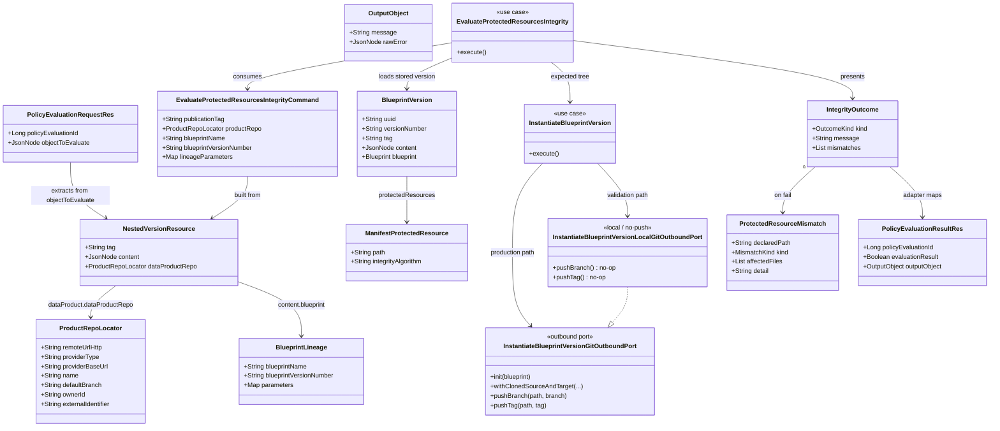

# Protected-resources integrity policy adapter

## Requirements

- Implement **protected-resources integrity evaluation** inside Blueprint Server so that, during data product **version publication**, this service can act as a **Policy adapter** (same role as Observer’s validator) and tell Policy whether immutable generated artifacts still match a fresh local re-instantiation.
- Register a Policy engine + one policy when the Blueprint **validator is active**; expose the Policy Validator Adapter evaluate API; bind the policy to V2 **`DATA_PRODUCT_VERSION_PUBLICATION_REQUESTED`** only (never Policy V1 `DATA_PRODUCT_VERSION_CREATION`).
- Given a Policy evaluation object that already contains the nested V2 version resource (`tag` + `dataProduct.dataProductRepo` + descriptor `content` with blueprint lineage): **pass not-applicable** when there is no lineage or no protected paths (or unsupported strategy); otherwise **clone the product repo at the publication tag**, **clone the blueprint source** from stored pointers, **re-instantiate locally** with recorded parameters using **`InstantiateBlueprintVersion`** and a **local/no-push Git outbound port**, **SHA-256** each protected path on both trees, and **fail** with **path-level reasons** if anything is missing or differs.
- Keep **policy subscription/evaluation** (adapter) separate from **integrity** (hash/clone/re-instantiate). Do not call Registry. Do not push branches or tags. Do not persist hashes. Do not change Policy V1. First slice: **monorepo, no composition** only.

## Entities



## Approach

1. Two packages (adapter vs integrity):
   - **Adapter** (`...pp.blueprint.validator`): Observer-validator shape — startup registration gated by `blueprint.validator.active`; inbound evaluate API matching the Policy Validator Adapter contract; map `objectToEvaluate` → integrity command; map `IntegrityOutcome` → Policy result. Never hashes, never clones.
   - **Integrity** (`...blueprintversion.services.usecases.evaluateprotectedresources`): hexagonal use case per `spdd/norms/USE_CASE_IMPLEMENTATION.md`. Orchestrates skip/fail matrix, product clone at tag, local `InstantiateBlueprintVersion`, digest compare, path-level failure messages. Never talks to Policy Service.

2. Consume the Registry V2 nested contract (already on the event):
   - Policy `objectToEvaluate` is the V2 publication event (or a wrapper that still contains it). Canonical path: `eventContent.dataProductVersion`.
   - Product clone coordinates: `dataProductVersion.tag` + `dataProductVersion.dataProduct.dataProductRepo` (`remoteUrlHttp`, provider type, `providerBaseUrl`, clone identity fields).
   - Blueprint identity / parameters: DPDS lineage on `dataProductVersion.content.blueprint` (`blueprintName`, `blueprintVersionNumber`, `parameters`). Blueprint clone coordinates, manifest, and `protectedResources` come from **this service’s store**, not extra event fields.
   - Tolerate extra wrapping (`eventContent` at root, or the version resource itself). Do **not** read Policy V1 `afterState` as the contract. Do **not** call Registry if nested repo/tag is missing.

3. Reuse `InstantiateBlueprintVersion` with a local Git port (original “mock push”):
   - Production `InstantiateBlueprintVersionFactory.buildInstantiateBlueprintVersion(command, presenter, headers)` is **unchanged** (live product integration branch + merge + push).
   - Add a **second factory method** that wires the **same** persistency / manifest / templating ports and a new **`InstantiateBlueprintVersionLocalGitOutboundPort`**: `pushBranch` / `pushTag` are no-ops; target is a **throwaway empty Git repo**, not a clone of the live product integration branch; after the instantiate callback, **snapshot the rendered working tree** (no `.git`) so hashing can run after Git clone cleanup.
   - Integrity clones the **published product tree separately** at the publication tag via its own Git outbound port (`readRepository` + `RepositoryPointerTag`).
   - Do **not** reimplement Velocity or lineage enrichment beside `InstantiateBlueprintVersion`.

4. Canonical digest (JDK SHA-256, lowercase hex; no new hashing library):
   - **File:** SHA-256 of raw working-tree bytes.
   - **Directory or glob:** resolve matches under repo root, exclude `.git`, regular files only, do not follow symlinks (symlink in a match **fails that protected path**), sort by relative path (`/` separators), digest concatenation of `relativePath + NUL + sha256(fileBytes)` for each file. Empty resolved set → **fail** (declared path not present), not equal empty hashes.
   - If `integrity.algorithm` is present and not `sha256` (case-insensitive) → fail that path. Ignore stored `integrity.value`.
   - Same algorithm on both trees.

5. Configuration (Observer-like, one surface):
   - `blueprint.validator.active` (default `false`) — register engine/policy only when true.
   - `blueprint.validator.policy.blocking` — Policy `blockingFlag` at create time.
   - Service Git credentials in Blueprint config; synthesized into the same `x-odm-gpauth-*` headers `GitProviderFactory` already understands. Never on the event. Select by **provider type** + optional **provider-base-url**. Product clone uses nested event repo’s provider; blueprint clone uses stored blueprint repo’s provider (two clients if needed). Missing creds → fail closed.
   - Policy Service address: `odm.product-plane.policy-service.address` (existing kebab prefix already used in this repo). Registration no-ops / logs if Policy is unreachable only when validator is off; when validator is on, registration failure must be visible at startup (log error; do not crash the JVM unless you cannot start without Policy — match Observer: log and skip duplicate create).

6. Exception handling:
   - Malformed evaluate payload that cannot be read → `BadRequestException` (HTTP 400 via existing `ResponseExceptionHandler`).
   - Applicable check that cannot clone / auth / timeout / render → HTTP **200** with `evaluationResult=false` and an infrastructure message (fail closed). Do not map those to generic hash mismatch.
   - Integrity use case presents domain outcomes; the adapter never swallows a fail into a silent pass.

## Structure

### Inheritance Relationships

1. `UseCase` interface defines `execute()` for integrity and instantiate
2. `EvaluateProtectedResourcesIntegrity` implements `UseCase` (package-private)
3. `EvaluateProtectedResourcesIntegrityFactory` is the sole `@Component` in the integrity package
4. `InstantiateBlueprintVersion` is reused unchanged as a class; `InstantiateBlueprintVersionLocalGitOutboundPort` implements `InstantiateBlueprintVersionGitOutboundPort` (package-private, `instantiate` package)
5. Policy evaluate DTOs are REST resources, not domain types
6. Existing `ResponseExceptionHandler` (`@ControllerAdvice`) remains the HTTP exception mapper; do not add a second advice for the validator unless a Policy-protocol mapping cannot reuse `BlueprintApiException`

### Dependencies

1. `ProtectedResourcesValidatorController` calls `ProtectedResourcesValidatorService`
2. `ProtectedResourcesValidatorService` parses `objectToEvaluate`, applies not-applicable short-circuits that do not need Git, otherwise maps to `EvaluateProtectedResourcesIntegrityCommand` and runs the integrity factory
3. `EvaluateProtectedResourcesIntegrityFactory` constructs persistency / product-Git / digest ports with `new`; asks `InstantiateBlueprintVersionFactory` for the **local** instantiate use case
4. `InstantiateBlueprintVersionFactory` (existing `@Component`) gains `buildInstantiateBlueprintVersionForLocalValidation(...)` that injects `InstantiateBlueprintVersionLocalGitOutboundPort` and config-derived headers
5. `ProtectedResourcesValidatorPolicySubscriber` (`@PostConstruct`) uses Policy engine + policy clients; gated by `blueprint.validator.active`
6. Interactive instantiate/update keep request `HttpHeaders`; validator never reads inbound Git headers from the Policy HTTP call

### Layered Architecture

1. Controller Layer: Policy evaluate HTTP (`ProtectedResourcesValidatorController`) — OpenAPI + DTO only
2. Adapter service Layer: Policy protocol mapping (`ProtectedResourcesValidatorService`)
3. Use Case Layer: skip/fail matrix, two clones, hash compare (`EvaluateProtectedResourcesIntegrity`); expected tree via `InstantiateBlueprintVersion`
4. Outbound Port Layer: product clone-at-tag, digest, persistency (load BlueprintVersion); local instantiate Git port (no-op push + throwaway target + tree snapshot)
5. Registration Layer: startup Policy engine/policy create-if-absent
6. Exception Handling Layer: existing `ResponseExceptionHandler` for transport errors (400/500); policy false results stay HTTP 200

## Operations

### Create configuration - `blueprint.validator`

1. Responsibility: Single Observer-like config surface for active flag, blocking flag, Policy engine/policy names, evaluation timeout, and per-provider Git credentials.
2. Properties (add defaults in `src/main/resources/application.yml`; override in env-specific profiles; keep `application-test.yml` able to turn the validator on with stub Policy + Git mocks):

```yaml
blueprint:
  validator:
    active: false
    evaluation-timeout-seconds: 120
    policy-engine:
      name: blueprint-protected-resources
      display-name: Blueprint Protected Resources
    policy:
      name: Protected Resources Integrity
      blocking: true
    git:
      credentials:
        - provider-type: GITHUB          # GITHUB | GITLAB | BITBUCKET | AZURE
          provider-base-url:             # optional; match stored/event base URL when self-hosted
          auth-type: PAT                 # same vocabulary as x-odm-gpauth-type
          token:                         # maps to x-odm-gpauth-param-token
          username:                      # maps to x-odm-gpauth-param-username (Bitbucket)
odm:
  product-plane:
    policy-service:
      active: false
      address:                           # Policy Service base URL when registering
```

3. Bind with `@ConfigurationProperties(prefix = "blueprint.validator")` (and existing `@Value` for `odm.product-plane.policy-service.*` / `server.baseUrl`).
4. Helper `ValidatorGitCredentialHeaders`: given `GitProviderIdentifier` (type + base URL), pick the matching credential row (type match; if several, prefer equal `provider-base-url`, else the row with empty base URL). Build `HttpHeaders` with `x-odm-gpauth-type`, `x-odm-gpauth-param-token`, and username when present. No match or blank token → integrity presents infrastructure fail (“unauthorized clone: no service Git credentials configured for provider {type}”).
5. Constraints: tokens never logged; never read from the evaluate request or from `objectToEvaluate`.

### Create Policy clients - Observer family

1. Responsibility: Outbound registration against Policy Service (`/api/v1/pp/policy/...`), using this repo’s existing `RestUtils` / `RestUtilsFactory`.
2. Types (JavaBeans in `...pp.blueprint.validator.client` / `...validator.resources.policy`):
   - `PolicyEngineClient`: `getPolicyEngines(Pageable, search)`, `createPolicyEngine(engine)`
   - `PolicyClient`: `getPolicies(Pageable, search)`, `createPolicy(policy)`
   - Resources matching Observer’s `OdmPolicyEngineResource` / `OdmPolicyResource` / `OdmPolicyEvaluationEventResource` / search options (engine `name`, `displayName`, `adapterUrl`; policy `name`, `blockingFlag`, `policyEngine`, `evaluationEvents[].event`). Copy field names so Policy Service JSON binds.
3. Routes: `{address}/api/v1/pp/policy/policy-engines` and `{address}/api/v1/pp/policy/policies` (same as Observer `OdmPolicyEngineClientImpl` / `OdmPolicyClientImpl`).
4. When `odm.product-plane.policy-service.active` is false **or** address is blank: provide no-op clients that log a warning (do not NPE at startup). Validator `active=true` without a Policy address: log error and skip registration (engine will never be called).
5. Constraints: create-if-absent only; do not modify an existing policy’s `blockingFlag` on restart (Operator must update Policy if they change config after first create — document in a short comment on the subscriber). Search existing policy by `policyEngineName` + `name`.

### Create startup subscriber - `ProtectedResourcesValidatorPolicySubscriber`

1. Responsibility: When `blueprint.validator.active` is true, register engine + policy once.
2. Annotations: `@Configuration` (or `@Component`) with `@PostConstruct init()`.
3. Logic:
   - If `active` is false, return immediately (feature has no effect).
   - Find engine by configured `policy-engine.name` (page size 500, filter in memory like Observer). If absent, create with `adapterUrl = server.baseUrl` (no path suffix).
   - If policy with that engine + configured `policy.name` is absent, create it: `blockingFlag` from `blueprint.validator.policy.blocking`; **one** evaluation event `DATA_PRODUCT_VERSION_PUBLICATION_REQUESTED`. Do **not** register `DATA_PRODUCT_VERSION_CREATION` or `DATA_PRODUCT_CREATION`.
4. Constraints: never register when inactive. Restarts must not duplicate policies.

### Create REST resources - Policy evaluate protocol

1. Responsibility: Exact Validator Adapter API Policy Service already calls.
2. Path: **`POST /api/v1/up/validator/evaluate-policy`** (Policy Service concatenates `adapterUrl` + this path; do **not** put this under `/api/v2/pp/blueprint/...`).
3. Request `PolicyEvaluationRequestRes` (name freely in this repo; JSON field names must match Observer):
   - `policyEvaluationId`: Long
   - `policy`: optional policy JSON (ignore for evaluation logic)
   - `objectToEvaluate`: JsonNode (required object)
4. Response `PolicyEvaluationResultRes`:
   - `policyEvaluationId` echoed
   - `evaluationResult`: Boolean (`true` pass / not-applicable; `false` fail)
   - `outputObject.message`: String
   - `outputObject.rawError`: JsonNode (structured mismatches or infrastructure detail; null on clean pass)
5. Jackson: `FAIL_ON_UNKNOWN_PROPERTIES = false` when reading `objectToEvaluate`.
6. OpenAPI: `@Hidden` is acceptable if this is not a public product API; otherwise `@Tag("Policies evaluation API")` like Observer.

### Create controller - `ProtectedResourcesValidatorController`

1. Responsibility: HTTP → adapter service only.
2. Annotations: `@RestController`, `@RequestMapping("/api/v1/up/validator/evaluate-policy")`, `@PostMapping` consumes JSON, `@ResponseStatus(OK)`.
3. Methods:
   - `evaluate(PolicyEvaluationRequestRes document): PolicyEvaluationResultRes`
     - Logic: delegate to `ProtectedResourcesValidatorService.evaluate(document)`.
4. Constraints: no Git, no hashing, no skip/fail matrix in the controller.

### Create adapter service - `ProtectedResourcesValidatorService`

1. Responsibility: Policy protocol + extraction of nested version resource; not-applicable short-circuit that needs only JSON; otherwise run integrity use case. Bound evaluation with `evaluation-timeout-seconds`.
2. Extract nested version resource from `objectToEvaluate` (first match):
   1. `eventContent.dataProductVersion`
   2. `dataProductVersion` at current node
   3. Current node itself if it has `content` and (`tag` or `dataProduct`)
3. Map product repo: `dataProduct.dataProductRepo` (accept JSON keys `providerType` **or** `dataProductRepoProviderType`). Required clone fields when the check is applicable: `remoteUrlHttp`, provider type. `tag` from the version resource.
4. Map lineage from `content.blueprint` (DPDS object written by `BlueprintDataProductDescriptorService`): `blueprintName`, `blueprintVersionNumber`, `parameters` (object → `Map<String, JsonNode>`). Missing/empty `blueprint` or missing name/version → **not applicable pass** (“no blueprint lineage”).
5. Malformed: `objectToEvaluate` null or not an object → `BadRequestException("Empty/Malformed Policy Evaluation Object")`.
6. If validator is somehow called while `active=false` (manual POST): still evaluate (registration is what is gated); do not 404.
7. Timeout: run integrity `execute()` on a bounded executor; on timeout present fail closed (“evaluation timed out after {n}s”) and ensure cleanup (see integrity Git ports). Interrupt the worker if possible.
8. Map `IntegrityOutcome`:
   - `NOT_APPLICABLE` / `PASSED` → `evaluationResult=true`, message from outcome
   - `FAILED` / `INFRASTRUCTURE_FAILED` → `evaluationResult=false`, message listing reasons; `rawError` = JSON array of mismatches or `{ "cause": "..." }`
9. Dependency injection: integrity factory, `ObjectMapper`, validator properties. Do not inject `GitProviderFactory` here.

### Create/Update use case factory - `InstantiateBlueprintVersionFactory`

1. Keep `buildInstantiateBlueprintVersion(command, presenter, headers)` **byte-for-byte behaviour** for production instantiate.
2. Add `buildInstantiateBlueprintVersionForLocalValidation(InstantiateBlueprintVersionCommand command, InstantiateBlueprintVersionPresenter presenter, HttpHeaders serviceHeaders, RenderedTreeSnapshot snapshot)`:
   - Same persistency / manifest / templating impls as production
   - Git port = `new InstantiateBlueprintVersionLocalGitOutboundPort(serviceHeaders, gitProviderFactory, snapshot)`
3. Constraints: do not add snapshot/no-op behaviour to the production Git port.

### Create Git outbound port - `InstantiateBlueprintVersionLocalGitOutboundPort`

1. Responsibility: Produce the **expected** rendered tree for hashing without mutating remotes and without cloning the live product integration branch.
2. Implements `InstantiateBlueprintVersionGitOutboundPort` in the `instantiate` package (package-private).
3. Methods:
   - `init(Blueprint)`: `gitProviderFactory.buildGitProvider` with **service** headers and the **blueprint repo** provider identifier (same as production `init`).
   - `withClonedSourceAndTarget(source, target, integrationBranch, operation)`:
     - Clone **source** at `source.tag()` via `readRepository(..., new RepositoryPointerTag(source.tag()), ...)` (blueprint templates).
     - Do **not** `readRepository` the `target.repository()` integration branch.
     - Create a throwaway local Git repo as `targetPath` that already has `integrationBranch` as an empty commit so existing `mergeBranch(orphan, integrationBranch)` in `InstantiateBlueprintVersion` succeeds. Prefer git-utils (`createAndCheckoutOrphanBranch` / `commit` / existing `GitOperation` methods). Do not add a second Velocity renderer.
     - Invoke `operation.accept(sourcePath, targetPath)`.
     - **After** the callback returns successfully: copy the target working tree (regular files, skip `.git`, do not follow symlinks) into `RenderedTreeSnapshot` (temp dir owned by integrity).
     - `finally`: delete clone directories used inside this method (source + throwaway target). Snapshot dir is **not** deleted here.
   - `createAndCheckoutOrphanBranch` / `commitAll` / `createCheckpointTag` / `mergeBranch`: real local git-utils ops (same as production impl).
   - `pushBranch` / `pushTag`: **no-op** (must not call `gitProvider.gitOperation().push*`).
4. Constraints: never push; never open PRs; never use inbound Policy HTTP headers.

### Create integrity use case package - `evaluateprotectedresources`

Follow `spdd/norms/USE_CASE_IMPLEMENTATION.md`: command record, presenter, factory `@Component`, package-private use case, outbound ports + plain impls.

#### Command - `EvaluateProtectedResourcesIntegrityCommand`

- `publicationTag`: String
- `productRepo`: domain record mapped from nested `DataProductRepoRes` (clone URL, provider type, base URL, name, defaultBranch, ownerId, externalIdentifier)
- `blueprintName`: String
- `blueprintVersionNumber`: String
- `lineageParameters`: `Map<String, JsonNode>` (from descriptor lineage; never null — use empty map)

Never include `*Res`, Policy DTOs, or Git tokens.

#### Presenter - `EvaluateProtectedResourcesIntegrityPresenter`

- `presentNotApplicable(String reason)`
- `presentPassed(String message)`
- `presentFailed(List<ProtectedResourceMismatch> mismatches, String message)`
- `presentInfrastructureFailure(String message)`

#### Domain types (use case package)

- `enum MismatchKind`: `MISSING_ON_PUBLISHED`, `MISSING_ON_REINSTANTIATED`, `CONTENT_DIFFERS`, `INVALID_PATH`, `SYMLINK`, `UNSUPPORTED_ALGORITHM`
- `record ProtectedResourceMismatch(String declaredPath, MismatchKind kind, List<String> affectedFiles, String detail)`
- `class RenderedTreeSnapshot` (or record holder): `Path expectedTreeRoot` set by local Git port

#### Use case - `EvaluateProtectedResourcesIntegrity.execute()`

1. Load `BlueprintVersion` via persistency port (`findByBlueprintNameAndVersion`). If not found or blueprint repo pointers missing (`remoteUrlHttp` / provider) → `presentInfrastructureFailure` / failed closed (“cannot clone blueprint source: version unknown to this Blueprint Server” / “blueprint repo pointers missing”). Do not pass not-applicable.
2. Parse manifest (`ManifestParserFactory`). Resolve `InstantiationScenario` the same way instantiate does (`strategy` + composition).
   - Not `MONOREPO_NO_COMPOSITION` → `presentNotApplicable("unsupported in this slice: {scenario}")`.
3. `protectedResources` null or empty → `presentNotApplicable("no protected resources")`.
4. If `publicationTag` blank or `productRepo` / `remoteUrlHttp` missing → `presentFailed` / fail (“cannot clone published tree: nested product repository or tag missing”).
5. Resolve service Git headers for **product** provider and **blueprint** provider (may differ). Missing → infrastructure fail with provider name, not a hash mismatch.
6. Clone **actual** tree: product Git port `withClonedProductAtTag(productRepo, publicationTag, actualPath -> ...)` using `RepositoryPointerTag`. Map `productRepo` to git-utils `Repository` (`cloneUrlHttp` ← `remoteUrlHttp`, `id` ← `externalIdentifier`, `name`, `defaultBranch`, `ownerId`).
7. Build `InstantiateBlueprintVersionCommand`:
   - `blueprintName` / `blueprintVersion` from command
   - `blueprintParameters` = lineage parameters
   - `targetRepositories` = one ROOT `TargetRepositoryDto` whose `Repository` is mapped from the **event product repo** (satisfies instantiate’s `validateTargetRepositories`; local Git port **ignores** it as a remote clone)
   - commit author = `BlueprintGitNamingConventions` defaults
8. Run `InstantiateBlueprintVersion` via `buildInstantiateBlueprintVersionForLocalValidation` with blueprint-provider headers + `RenderedTreeSnapshot`. If instantiate throws `UnsupportedOperationException` (should already be filtered) or Git/render errors → catch at adapter/use case boundary and `presentInfrastructureFailure` with the cause message (no stack traces in Policy message).
9. Digest each `ManifestProtectedResource.path` on **actual** (product tag clone) and **expected** (snapshot):
   - Path traversal (`..` or resolved path outside clone root) → mismatch `INVALID_PATH`
   - Symlink among matches → `SYMLINK` for that declared path
   - Algorithm present and not sha256 → `UNSUPPORTED_ALGORITHM`
   - No matches / missing file → `MISSING_ON_PUBLISHED` or `MISSING_ON_REINSTANTIATED` (which tree lacked it)
   - Both present, digests differ → `CONTENT_DIFFERS` with the relative file(s) under that glob/dir that differ (compare per-file sha256 after resolving the same glob on both trees; if a file exists only on one tree, list it under missing/extra as the corresponding missing kind; if both exist and bytes differ, list it under `CONTENT_DIFFERS`)
10. Any mismatch → `presentFailed` with **all** mismatches. Message **must** be actionable, e.g.  
    `Protected resource 'infrastructure/core/**' missing on published tree: infrastructure/core/main.tf; Protected resource 'README.md' present on both but digest differs.`  
    Do not return a generic “protected resources invalid” without paths.
11. No mismatches → `presentPassed("protected resources match re-instantiation")`.
12. `finally`: delete product clone temp, expected snapshot temp, and any leftover instantiate temps (ports should already clean clones). Cleanup on success, fail, and timeout.

#### Product Git outbound port

- `EvaluateProtectedResourcesIntegrityGitOutboundPort.withClonedProductAtTag(ProductRepoLocator repo, String tag, Consumer<Path> operation)`
- Impl: `GitProviderFactory.buildGitProvider` with **product** provider identifier + service headers; `readRepository(repository, new RepositoryPointerTag(tag), dir -> operation.accept(dir.toPath()))` so git-utils cleanup runs after the callback (hash inside the callback **or** copy-then-hash; if copying, delete copy in use case `finally`).
- Never push.

#### Digest outbound port

- `digest(Path repoRoot, String declaredPath): DigestResult` (`hex`, `matchedRelativePaths`) **or** throw a domain signal for invalid/symlink/empty.
- Glob matcher: `FileSystem.getPathMatcher("glob:" + declaredPath)` on repository-relative paths with `/`. If `declaredPath` has no glob metacharacters `*?[{`:
  - regular file → file digest
  - directory → all regular files under it (same concat rule)
  - missing → empty match (caller fails)
- Exclude `.git`. `FOLLOW_LINKS` off. `Files.isSymbolicLink` → fail that declared path.
- SHA-256 via `java.security.MessageDigest`; hex lowercase.

#### Persistency outbound port

- Reuse the same lookup as instantiate: `BlueprintService` + `BlueprintVersionCrudService` filters by name + version number (plain impl, `new` in factory). Map `NotFoundException` to infrastructure/fail closed in the use case (do not leak HTTP 404 to Policy; Policy expects 200 + boolean).

### Create exception / outcome mapping (no new HTTP exception type required)

1. Reuse `BadRequestException` for unreadable evaluate JSON (HTTP 400).
2. Integrity failures are **outcomes**, not `BlueprintApiException`, when Policy should record a false evaluation.
3. Unexpected `RuntimeException` after mapping: existing handler → 500. Prefer catching Git/auth/timeout inside integrity and presenting infrastructure fail (200 + false) so publication gets a Policy decision instead of an adapter 500 (Observer 500 path is only for init failures; prefer fail-closed boolean here).

### Implement tests

1. **IT** `ProtectedResourcesValidatorControllerIT`:
   - Missing `objectToEvaluate` → 400
   - No lineage → 200, `evaluationResult=true`, not-applicable message
   - Lineage + empty protectedResources → pass not-applicable
   - Unsupported strategy → pass not-applicable with explicit message
   - Applicable + missing tag/repo → 200 false, message about missing nested clone metadata
   - Applicable + matching trees (GitProviderFactoryMock: product tag tree equals local render) → 200 true
   - Applicable + modified protected file on published tree → 200 false, message contains declared path and file name
   - Verify `pushBranch` / `pushTag` **never** invoked on GitOperation
2. **Unit** digest: file, directory concat order, glob, empty match, symlink, path traversal, algorithm `SHA256` vs `md5`
3. **Unit** subscriber: inactive → no client calls; active → create-if-absent; event name is `DATA_PRODUCT_VERSION_PUBLICATION_REQUESTED` only
4. **Unit/IT** local Git port: `push*` not delegated; target not cloned at integration branch

## Norms

Apply the registry in `spdd/norms/README.md`. Read in this session:

1. `spdd/norms/USE_CASE_IMPLEMENTATION.md` — **primary** for integrity evaluation:
   - HTTP (adapter) → service → factory → `UseCase.execute()` → outbound ports
   - Use case package must not reference `*Res` / Policy DTOs; commands are records of domain types
   - Factory is the only `@Component` in the integrity package; port impls are plain `new`
   - Presenter pushes domain results; adapter maps to Policy JSON
   - Integration tests on the evaluate controller
2. `spdd/norms/GENERIC-CRUD-GUIDELINES.md` — **do not add CRUD**. Load `Blueprint` / `BlueprintVersion` through existing `GenericMappedAndFilteredCrudService` implementations **via persistency outbound ports** only (same pattern as instantiate). No new entities, no hash persistence, no new filter APIs.

Annotation / DI / exceptions / logging (from those norms + this codebase):

- Controller: `@RestController`, `@RequestMapping`, OpenAPI as needed; no business rules
- Adapter + use-cases services: `@Service`
- Factories: `@Component`
- Git/Policy secrets: never log tokens; Git headers only in git port constructors
- Exceptions: `BadRequestException` / existing `ResponseExceptionHandler`; Policy boolean outcomes are not HTTP errors
- Comments: why (no-op push, two clones, nested event paths), not what

## Safeguards

1. Functional Constraints:
   - One combined File Immutability + Parameter Sanity policy
   - Monorepo, no composition only; other strategies pass not-applicable with explicit message
   - Validator off → no Policy registration
   - No Registry callback
   - No Git push/PR/commit on product remote during validation
   - Production instantiate factory method behaviour unchanged
   - V1 Policy payloads unused and unmodified
2. Performance Constraints:
   - Bound evaluate with `blueprint.validator.evaluation-timeout-seconds` (default 120); timeout → fail closed
   - Always delete temp directories (product clone, blueprint clone, throwaway target, snapshot)
   - No caching in this slice
3. Security Constraints:
   - Git credentials only from Blueprint configuration; never from events or Policy request headers
   - Do not log PATs
   - Reject protected paths that escape the clone root
   - Do not follow symlinks; fail the declared path if a match is a symlink
4. Integration Constraints:
   - Evaluate URL **must** be `POST /api/v1/up/validator/evaluate-policy`
   - Engine `adapterUrl` = `server.baseUrl`
   - Policy event name **must** be `DATA_PRODUCT_VERSION_PUBLICATION_REQUESTED`
   - Nested clone metadata: `eventContent.dataProductVersion.tag` + `...dataProduct.dataProductRepo`
   - Lineage: `content.blueprint.blueprintName` / `blueprintVersionNumber` / `parameters`
   - Enable this validator **last** (after Registry nested fields are populated); otherwise applicable publishes fail closed
5. Business Rule Constraints:
   - Skip vs fail matrix (must implement as specified):
     - No lineage → pass not-applicable
     - Empty `protectedResources` → pass not-applicable
     - Unsupported strategy → pass not-applicable (explicit message)
     - Applicable + missing nested product repo/tag → fail
     - Applicable + unknown blueprint version / missing blueprint pointers → fail
     - Clone/auth/timeout/render error → fail closed (infrastructure message)
     - Missing path or digest mismatch → fail with **declared path**, **kind** (missing on published / missing on re-instantiated / content differs), and **file list**
   - `.odm/blueprint/` and the descriptor **may** be protected; expected tree **must** include instantiate’s lineage enrichment and relocation
6. Exception Handling Constraints:
   - Unreadable payload → HTTP 400 `BadRequestException`
   - Policy false results → HTTP 200 + `evaluationResult=false` + message
   - Messages must not include Git tokens or full credential headers
7. Technical Constraints:
   - SHA-256 via JDK `MessageDigest` only
   - git-utils clone/tag APIs inside Git port impls only
   - Local Git port no-ops `pushBranch` and `pushTag` only; do not no-op render
   - Do not write `integrity.value` into the source blueprint manifest
   - Do not hash unrendered `.vm` sources; expected tree is instantiate output
   - Do not compare against checkpoint tag unless it is also the publication tag (it usually is not)
8. Data Constraints:
   - Digest hex lowercase
   - Glob: repository-relative, `**` supported via NIO `glob:` matcher; both trees use the same matcher
   - Directory digest order: relative path lexicographic
9. API Constraints:
   - Policy request/response field names compatible with Observer validator (`policyEvaluationId`, `objectToEvaluate`, `evaluationResult`, `outputObject.message` / `rawError`)
   - Do not add sibling locator/tag fields; read nested version resource only
