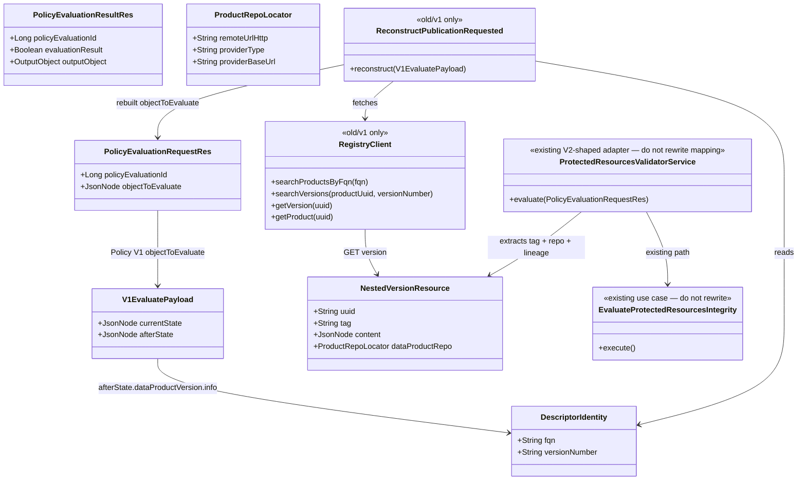

# Protected-resources V1 policy reconstruction adapter

## Requirements

- Finish the publication gate for **today’s Policy V1**: Blueprint already has the integrity use case and V2-shaped validator. Add a **removable `old/v1` adapter** so Policy can actually invoke that check.
- Register the Policy engine + one policy when the Blueprint **validator is active**; bind the policy to Policy V1 **`DATA_PRODUCT_VERSION_CREATION`** only (not `DATA_PRODUCT_VERSION_PUBLICATION_REQUESTED`, not Notification).
- On evaluate, Policy sends `{ currentState, afterState }` with **no tag and no product repo**. Reconstruct the V2 nested version resource by **fetching Registry**, then call the **existing** `ProtectedResourcesValidatorService` / `EvaluateProtectedResourcesIntegrity` path.
- Keep reconstruction isolated so Policy V2 is **delete `old/v1`** plus a thin lasting evaluate controller. Do not change Notification or Policy Service. Do not rewrite hashing, instantiate, or Git clone logic. Core must not import `old/v1`.

## Entities



## Approach

1. Isolation (Registry `old` pattern):
   - New package `org.opendatamesh.platform.pp.blueprint.old` with a README stating: **this package may depend on core; core must not depend on this package**; intended for deletion when Policy V2 exists.
   - V1-only code lives under `...old.v1`: Policy subscriber event name, evaluate HTTP adapter that understands V1 JSON, Registry client, reconstruction.
   - Lasting code stays: `EvaluateProtectedResourcesIntegrity*`, `InstantiateBlueprintVersionLocalGitOutboundPort`, `ProtectedResourcesValidatorService` (V2 nested version resource → command), Policy clients, Git credential config.
   - `old/v1` may call `ProtectedResourcesValidatorService`. Validator / integrity packages must not import `old`.

2. Do not use Notification; do not change Policy:
   - Registry’s existing V1 bridge already calls Policy `validateInput(DATA_PRODUCT_VERSION_CREATION)`.
   - Blueprint registers on that name. Policy already forwards `{ currentState, afterState }` to `POST {adapterUrl}/api/v1/up/validator/evaluate-policy`.

3. Reconstruct, then reuse:
   - From `afterState.dataProductVersion` (descriptor): read `info.fullyQualifiedName` (or `fullyQualifiedName`) and `info.version` (or `versionNumber`).
   - Registry V2: search products by FQN → search versions by product uuid + version number → GET version by uuid.
   - If GET version omits nested `dataProduct.dataProductRepo`, GET product by uuid and nest it.
   - Pass the GET version JSON as `objectToEvaluate` into the existing validator (it already accepts a node with `content` + `tag`/`dataProduct`).
   - Prefer stored Registry content over possibly 1.x-rewritten `afterState` for lineage.

4. Pass-through for already-V2-shaped payloads:
   - If `objectToEvaluate` already looks like a nested version resource (`content` present and (`tag` or `dataProduct.dataProductRepo`)), **skip Registry** and call the existing validator. Keeps current integrity ITs working and matches the Policy V2 call shape.
   - Otherwise treat the body as Policy V1 `{ currentState, afterState }`.

5. Configuration:
   - Lasting: `blueprint.validator.active` / `blocking` / Git credentials / Policy address — already exist.
   - Adapter-only: `odm.product-plane.registry-service.active` + `address` (same style as Policy client). Unused after `old/v1` is deleted — intended.
   - Local profile Registry is `http://localhost:8086`. Do not put Git tokens in this prompt or in new docs.

6. Exception handling:
   - Unreadable evaluate JSON → existing `BadRequestException` (HTTP 400).
   - Reconstruction / Registry miss / multiple FQN matches / missing FQN or version → HTTP **200** with `evaluationResult=false` and an infrastructure message (fail closed). Do not silent-pass.
   - Integrity outcomes stay as implemented (not-applicable pass, path-level fail, timeout fail closed).

7. Policy registration:
   - Create-if-absent engine + policy with **one** event `DATA_PRODUCT_VERSION_CREATION`.
   - Do not overwrite `blockingFlag` on restart.
   - Nothing has been released: no Policy-row update API, no operator delete of an old event binding.

## Structure

### Inheritance Relationships

1. Existing `UseCase` / integrity / local Git port — **unchanged**
2. `RegistryClient` interface in `old.v1` defines search/GET; `RegistryClientImpl` implements it with `RestUtils`
3. Existing `PolicyEngineClient` / `PolicyClient` stay in `...validator.client` (lasting registration API)
4. Existing `ResponseExceptionHandler` remains the HTTP exception mapper

### Dependencies

1. `old.v1` evaluate controller → `old.v1` reconstruction service → `RegistryClient` and `ProtectedResourcesValidatorService`
2. `old.v1` Policy subscriber → existing `PolicyEngineClient` / `PolicyClient` (event name CREATION)
3. `ProtectedResourcesValidatorService` → existing integrity factory (**must not** call Registry)
4. Core validator / integrity / instantiate **must not** import `...blueprint.old`

### Layered Architecture

1. Controller Layer (`old/v1`): same path `POST /api/v1/up/validator/evaluate-policy`
2. Reconstruction Layer (`old/v1`): V1 payload → Registry fetch → V2 version resource
3. Adapter service Layer (existing): nested version resource → integrity command
4. Use Case Layer (existing): clones, hash, compare
5. Registration Layer (`old/v1` subscriber): create-if-absent on `DATA_PRODUCT_VERSION_CREATION`
6. Exception Handling Layer: existing `ResponseExceptionHandler`

## Operations

### Create package isolation - `org.opendatamesh.platform.pp.blueprint.old`

1. Responsibility: Removable compatibility layer, same idea as Registry `old`.
2. Add `src/main/java/org/opendatamesh/platform/pp/blueprint/old/README.md` stating:
   - Purpose: Policy V1 reconstruction for protected-resources validation
   - Allowed: this package depends on core (validator service, Policy clients, resources)
   - Forbidden: any package outside `old` importing `old`
   - Removal: delete this tree when Policy V2 forwards `DATA_PRODUCT_VERSION_PUBLICATION_REQUESTED` with nested tag + repo; add a thin lasting controller that calls `ProtectedResourcesValidatorService` directly
3. Constraints: no hashing, Git, or instantiate code in `old`.

### Move evaluate HTTP adapter into `old.v1`

1. Move `ProtectedResourcesValidatorController` from `...validator.controllers` to `...old.v1` (keep class name or prefix `OldV1`; **keep** `POST /api/v1/up/validator/evaluate-policy`).
2. Controller still only maps HTTP → a service. No Registry URLs in the controller.
3. Delete the old controller class so there is a **single** mapping of that path.
4. Existing integrity ITs that POST V2-shaped `objectToEvaluate` must keep passing via pass-through (see reconstruction service).

### Create reconstruction service - `old.v1`

1. Responsibility: Decide pass-through vs V1 reconstruct; never hash.
2. `evaluate(PolicyEvaluationRequestRes document): PolicyEvaluationResultRes`
   - If `objectToEvaluate` is null or not an object → `BadRequestException("Empty/Malformed Policy Evaluation Object")` (same as today).
   - If it already has `content` and (`tag` or nested product repo) → call `ProtectedResourcesValidatorService.evaluate(document)` unchanged.
   - Else read `afterState`. Descriptor node = `afterState.dataProductVersion` if object, else `afterState` if it looks like a descriptor (`info` present). If neither current nor after state can be read as an object → 400.
   - Extract FQN + version from descriptor `info` (`fullyQualifiedName` / `fqn`; `version` / `versionNumber`). Missing → 200 false, message that identity cannot be read from `afterState`.
   - Call Registry lookup (below). On miss / multiple products / client error → 200 false with the cause (no stack traces, no tokens).
   - If reconstructed version has no `tag` or no clone URL after optional product GET nest → 200 false (“cannot clone published tree: nested product repository or tag missing”).
   - Build a new `PolicyEvaluationRequestRes` copying `policyEvaluationId` / `policy`, `objectToEvaluate` = GET version JSON (Jackson `JsonNode`).
   - Delegate to `ProtectedResourcesValidatorService.evaluate(...)`.
3. Timeout: keep the existing timeout **inside** `ProtectedResourcesValidatorService` for Git/render. Reconstruction fetch runs on the same request thread before that. Fail closed if Registry client throws timeout-like errors. Do not add a second hashing implementation.
4. Jackson: `FAIL_ON_UNKNOWN_PROPERTIES = false`.
5. Constraints: do not call integrity factory from `old` except through the existing validator service.

### Create Registry client - `old.v1` only

1. Responsibility: Registry V2 HTTP using existing `RestUtils` / `RestUtilsFactory` / `RestTemplateBuilder` (same as Policy clients).
2. Routes:
   - `GET {address}/api/v2/pp/registry/products` with filter `fqn` (page size small, e.g. 2)
   - `GET {address}/api/v2/pp/registry/products-versions` with `dataProductUuid` + `versionNumber`
   - `GET {address}/api/v2/pp/registry/products-versions/{uuid}`
   - `GET {address}/api/v2/pp/registry/products/{uuid}` only if version GET lacks nested repo
3. Resources: minimal JavaBeans in `old.v1` matching Registry JSON (`uuid`, `fqn`, `tag`, `versionNumber`, `content`, nested `dataProduct` / `dataProductRepo` with `remoteUrlHttp`, `providerType` **or** `dataProductRepoProviderType`, `providerBaseUrl`, clone identity fields). Do **not** add these types to the integrity package.
4. Lookup rules:
   - 0 products or 0 versions → fail closed
   - more than one product for FQN → fail closed
   - more than one version for uuid+versionNumber → fail closed (should not happen; version number is unique per product)
5. Configuration bean like `PolicyClientsConfiguration`:
   - `@Value("${odm.product-plane.registry-service.active:false}")`
   - `@Value("${odm.product-plane.registry-service.address:}")`
   - If inactive or address blank: client that fails closed with a clear “Registry not configured” message when reconstruction is needed (pass-through V2 payloads must still work **without** Registry).
6. Add to `application.yml`:

```yaml
odm:
  product-plane:
    registry-service:
      active: false
      address:
```

   In `application-localpostgres.yml` set `active: true` and `address: http://localhost:8086` next to the existing Policy block. In `application-test.yml` leave inactive/blank unless a test binds a mock.
7. Constraints: no IdentifierStrategy / FQN-derived id; no Registry V1 version GET as the sole lookup.

### Move subscriber into `old.v1` and bind CREATION

1. Move `ProtectedResourcesValidatorPolicySubscriber` into `old.v1`. Keep `@PostConstruct` create-if-absent behaviour.
2. Change `EVALUATION_EVENT` to **`DATA_PRODUCT_VERSION_CREATION`**. Do not register `DATA_PRODUCT_VERSION_PUBLICATION_REQUESTED` or `DATA_PRODUCT_CREATION`.
3. Still gated by `blueprint.validator.active` and Policy `odm.product-plane.policy-service.active/address`.
4. Engine `adapterUrl` = `server.baseUrl`. Policy `blockingFlag` from config at **create** only.
5. Update `ProtectedResourcesValidatorPolicySubscriberTest`: assert CREATION; assert it does **not** contain `DATA_PRODUCT_VERSION_PUBLICATION_REQUESTED`.
6. Constraints: no Policy update API; no migration of existing rows (nothing released).

### Leave lasting integrity / V2-shaped validator alone

1. Do **not** change `EvaluateProtectedResourcesIntegrity*` digest/Git/instantiate logic.
2. Do **not** add Registry calls to `ProtectedResourcesValidatorService`.
3. `extractVersionResource` already supports a raw version resource — reconstruction should feed that shape.
4. Production `InstantiateBlueprintVersionFactory.buildInstantiateBlueprintVersion` stays unchanged.

### Implement tests

1. **Unit** reconstruction:
   - V2-shaped payload (content + tag + repo) → Registry client never called; delegates to validator (mock)
   - V1 `afterState.dataProductVersion.info` with FQN + version → search product, search version, GET version → validator called with GET body as `objectToEvaluate`
   - Missing FQN/version → 200 false, no integrity execute
   - Zero/multiple products → 200 false
   - GET version without repo, product GET supplies repo → nested before delegate
   - Registry not configured and V1 payload → 200 false
2. **Unit** subscriber: inactive → no calls; active → create-if-absent; event **`DATA_PRODUCT_VERSION_CREATION`** only
3. **IT** keep `ProtectedResourcesValidatorControllerIT` passing (V2-shaped body, validator still off in test profile for registration). Add at least one IT or slice test that POSTs a V1 `{ afterState: { dataProductVersion: { info, blueprint }}}` with a mocked Registry client bean and asserts the integrity path still runs (or not-applicable when no lineage on reconstructed content)
4. Isolation: no new production class outside `old` importing `old` (review; add a simple ArchUnit/compile convention only if the repo already has ArchUnit — do not add a framework just for this)

## Norms

Apply the registry in `spdd/norms/README.md`. Read in this session:

1. `spdd/norms/USE_CASE_IMPLEMENTATION.md` — **do not add a second integrity use case**. Reconstruction is an HTTP/adapter concern in `old/v1`, not a hexagonal domain use case. It may call the existing validator service. Commands/presenters/ports for hashing stay as already implemented. Controllers still have no business rules beyond delegating to the reconstruction service.
2. `spdd/norms/GENERIC-CRUD-GUIDELINES.md` — **do not add CRUD**. Do not persist reconstructed events. Load Blueprint versions only through the existing integrity persistency port.

Annotation / DI / exceptions / logging:

- `old/v1` controller: `@RestController`, `@Hidden` acceptable (same as current validator controller)
- Reconstruction + Policy subscriber: Spring `@Service` / `@Configuration` **inside `old` only**
- Registry client impl: plain class constructed from an `old` `@Configuration` (same pattern as `PolicyClientsConfiguration`)
- Never log Git tokens or Registry secrets
- Reconstruction failures that should affect publication → HTTP 200 + `evaluationResult=false`, not 500
- Comments: why the package is deletable; why Registry is called only here

## Safeguards

1. Functional Constraints:
   - Do not rewrite integrity, local Git port, digest, or production instantiate
   - Do not subscribe to Notification
   - Do not change Policy Service or Registry server code
   - Core packages must not import `org.opendatamesh.platform.pp.blueprint.old`
   - `old/v1` must not hash, clone Git, or push
   - Policy event name for this slice **must** be `DATA_PRODUCT_VERSION_CREATION`
   - Create-if-absent only; no Policy update/migration of evaluation events
2. Performance Constraints:
   - Existing `blueprint.validator.evaluation-timeout-seconds` still bounds Git/render
   - Registry fetch is one search products + one search versions + one GET version (optional extra product GET)
   - Always delete temp Git dirs in the existing integrity path (unchanged)
3. Security Constraints:
   - Git credentials only from Blueprint configuration (already implemented)
   - Registry client uses configured base URL only; no tokens on events
   - Do not log PATs
4. Integration Constraints:
   - Evaluate URL **must** remain `POST /api/v1/up/validator/evaluate-policy`
   - Engine `adapterUrl` = `server.baseUrl`
   - Registry V2 paths under `/api/v2/pp/registry/products` and `/api/v2/pp/registry/products-versions`
   - Local Registry address `http://localhost:8086`
   - Pass-through when `objectToEvaluate` already has clone metadata
5. Business Rule Constraints:
   - Skip/fail matrix of the integrity use case is unchanged
   - Reconstruction cannot obtain identity, version, tag, or repo → fail closed (not not-applicable)
   - No lineage on reconstructed content → existing not-applicable pass
6. Exception Handling Constraints:
   - Unreadable payload → HTTP 400 `BadRequestException`
   - Registry/reconstruction failure → HTTP 200 + false + message
   - Messages must not include Git tokens
7. Technical Constraints:
   - No IdentifierStrategy in Blueprint
   - No Registry V1 descriptor-only GET as the source of tag/repo
   - Prefer GET version JSON as `objectToEvaluate` for the existing extractor
   - Do not persist hashes
8. Data Constraints:
   - Identity from descriptor `info` (`fullyQualifiedName`/`fqn`, `version`/`versionNumber`)
   - Repo JSON keys: accept `providerType` or `dataProductRepoProviderType` (existing mapper)
9. API Constraints:
   - Policy request/response field names stay Observer-compatible
   - Do not add sibling locator fields on Policy V1 `afterState`
