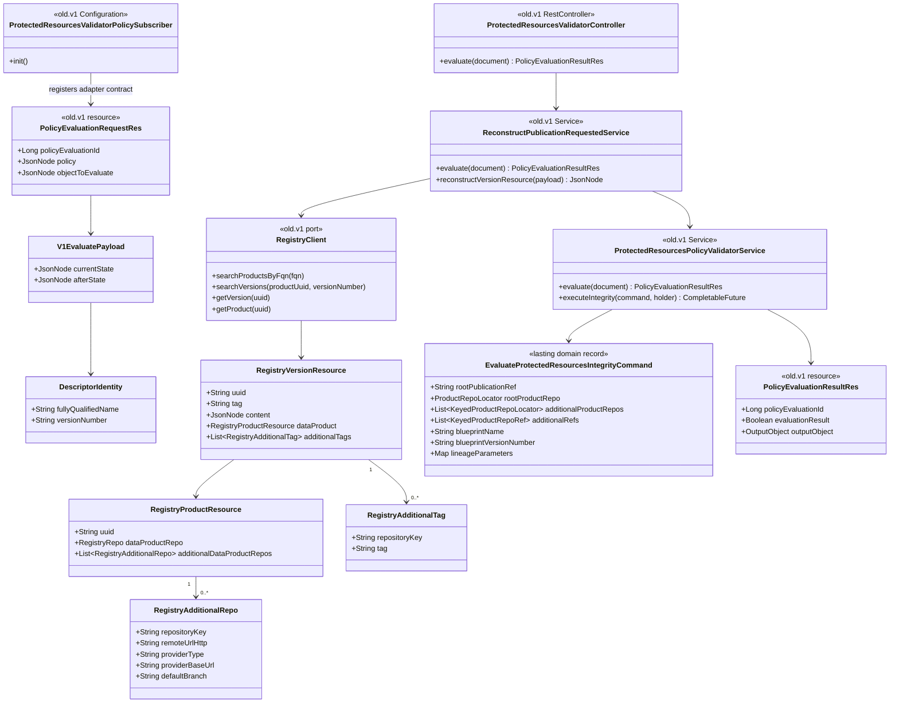

# Protected-resources Policy V1 reconstruction adapter

## Requirements

- Keep the existing removable `old/v1` Policy adapter that registers a blocking-capable validator on Policy V1 `DATA_PRODUCT_VERSION_CREATION` and exposes `POST /api/v1/up/validator/evaluate-policy`.
- Reconstruct a complete current Registry product/version context from Policy V1 `{currentState, afterState}` before invoking the lasting integrity capability.
- Carry the final Registry contracts without reinterpretation:
  - root repository locator from `dataProduct.dataProductRepo`;
  - non-root locators from `dataProduct.additionalDataProductRepos[]`, keyed by `repositoryKey`;
  - root publication ref from version `tag`;
  - non-root refs from version `additionalTags[]`, keyed by `repositoryKey`.
- Map Registry JSON into domain-only root and keyed additional locator/ref data while preserving duplicate, blank, and incomplete entries. Do not decide which mappings are required in the V1 adapter; the integrity use case makes that decision after reading the recorded manifest.
- Preserve V2-shaped pass-through behavior. The current Registry V2 publication event already nests `DataProductVersionRes`; no Registry event change is required now. If a future direct Policy V2 path omits required context, extend that event then.
- Fail closed on V1 reconstruction failures, Registry lookup failures, malformed requests, and integrity timeout without moving hashing, Git, manifest, or target-selection rules into `old/v1`.
- Keep Notification and Policy Service unchanged and keep core packages independent of `org.opendatamesh.platform.pp.blueprint.old`.

## Entities



## Approach

1. Preserve V1 isolation:
   - `old/v1` owns Policy clients/resources, subscriber, HTTP controller, Registry HTTP client, reconstruction, async execution timeout, and Policy result mapping.
   - It may depend on the lasting integrity factory and domain records. No package outside `old` may import `old`.
   - Delete this package when a direct Policy V2 integration supplies the same domain context.

2. Reconstruct current Registry state:
   - Extract FQN/version from Policy V1 `afterState.dataProductVersion.info` with existing accepted aliases.
   - Search one product, search one version, GET the full version, and GET the product only when the nested product is absent or lacks root/additional locator structure.
   - Ensure `dataProduct.additionalDataProductRepos` and version `additionalTags` are arrays; empty arrays are valid.
   - Do not require the root clone URL or root tag during reconstruction. A publication may protect only non-root targets, and requiredness is protection-scoped in core.

3. Map without lossy validation:
   - `ProtectedResourcesPolicyValidatorService` extracts the nested/raw version resource.
   - Map root locator/ref independently.
   - Map every additional locator and additional ref entry in encounter order into domain lists using exact `repositoryKey` values.
   - Preserve duplicates and incomplete entries so core can fail only when a referenced target is ambiguous or incomplete.
   - Missing Blueprint lineage remains not applicable and avoids integrity invocation.

4. Keep pass-through:
   - Existing `eventContent.dataProductVersion`, nested `dataProductVersion`, and raw Registry-version shapes skip Registry reconstruction.
   - Pass-through does not claim completeness; it maps the available structures and lets integrity validate only referenced targets.

5. Preserve Policy behavior:
   - Register create-if-absent engine/policy only when validator and Policy Service are configured.
   - Keep event `DATA_PRODUCT_VERSION_CREATION`, configured `blockingFlag`, adapter URL, and no-update-on-restart behavior.
   - Return HTTP 200 with `evaluationResult=false` for reconstruction, timeout, infrastructure, or integrity failures. Reserve HTTP 400 for malformed evaluate payloads.

6. Defer Policy V2:
   - Final Registry `EmittedEventDataProductVersionPublicationRequestedRes` contains nested `DataProductVersionRes`, whose final model contains `additionalTags` and nested product repositories.
   - Do not modify Registry now. If direct Policy V2 later strips or omits fields, extend that event/mapping as a separate integration change.

## Structure

### Inheritance Relationships

1. `ProtectedResourcesValidatorController` remains a thin `@RestController` in `old.v1`.
2. `ReconstructPublicationRequestedService` and `ProtectedResourcesPolicyValidatorService` remain `@Service` classes in `old.v1`.
3. `ProtectedResourcesValidatorPolicySubscriber` remains `@Configuration` with `@PostConstruct`.
4. `RegistryClient` remains the V1-only interface; `RegistryClientImpl` remains package-private and is built by `RegistryClientsConfiguration`.
5. `RegistryReconstructionException` remains package-private and maps to a Policy false result.
6. `ProtectedResourcesPolicyValidatorService.OutcomeHolder` remains the presenter adapter for the lasting integrity use case.

### Dependencies

1. Controller → `ReconstructPublicationRequestedService`.
2. Reconstruction → `RegistryClient` and `ProtectedResourcesPolicyValidatorService`.
3. Policy validator service → `EvaluateProtectedResourcesIntegrityFactory`.
4. Subscriber → V1 `PolicyEngineClient` and `PolicyClient`.
5. `old/v1` → lasting domain records is allowed; lasting packages → `old/v1` is forbidden.

### Layered Architecture

1. HTTP Layer: Observer-compatible Policy request/response resources and evaluate controller.
2. Reconstruction Layer: V1 descriptor identity to current Registry version/product JSON.
3. Mapping Layer: Registry-shaped JSON to domain-only integrity command.
4. Execution Layer: async integrity invocation with one configured timeout.
5. Registration Layer: create-if-absent Policy engine and policy.
6. Core Layer: lasting integrity use case from the companion prompt.

## Operations

### Preserve Policy V1 registration and HTTP surface

1. Keep `ProtectedResourcesValidatorPolicySubscriber.EVALUATION_EVENT = "DATA_PRODUCT_VERSION_CREATION"`.
2. Keep create-if-absent engine/policy behavior, configured blocking flag, `server.baseUrl`, and inactive/unconfigured no-call behavior.
3. Keep `POST /api/v1/up/validator/evaluate-policy` and Observer-compatible JSON fields.
4. Keep `ProtectedResourcesValidatorController` delegation-only.
5. Do not subscribe to Notification or add `DATA_PRODUCT_VERSION_PUBLICATION_REQUESTED` to Policy V1.

### Reconstruction - `ReconstructPublicationRequestedService`

1. Preserve current identity lookup:
   - descriptor from `afterState.dataProductVersion` or `afterState`;
   - FQN aliases `fullyQualifiedName` / `fqn`;
   - version aliases `version` / `versionNumber`;
   - unique product and version lookup, then GET full version.
2. Product completeness for reconstruction means:
   - `dataProduct` is an object;
   - `dataProduct.dataProductRepo` may be present or absent;
   - `dataProduct.additionalDataProductRepos` is an array after optional product GET/defaulting.
3. If the nested product is absent, or if its root repository/additional repository array is absent, GET the current product and nest it.
4. After nesting:
   - default missing/non-array `additionalDataProductRepos` to `[]`;
   - default missing/non-array version `additionalTags` to `[]`;
   - do not invent locator or tag entries.
5. Do not reject reconstruction solely because root `tag` or root `dataProductRepo.remoteUrlHttp` is absent. Core decides whether root metadata is required from the recorded protected list. The constant `MISSING_CLONE_METADATA` (`Cannot check protected resources: the data product version is missing its Git repository or tag`) remains and is used only when product nesting fails (missing uuid or product GET), not as an unconditional root-metadata gate.
6. Keep malformed V1 payload, zero/multiple product/version, empty Registry response, and Registry client failures fail-closed with current safe messages.
7. Preserve already-V2-shaped pass-through and do not call Registry for it.

### Mapping - `ProtectedResourcesPolicyValidatorService`

1. Keep lineage extraction from `content.blueprint.blueprintName`, `blueprintVersionNumber`, and `parameters`.
2. If lineage name/version is absent, return the existing not-applicable result and do not invoke integrity.
3. `mapToIntegrityCommand` populates:
   - `rootPublicationRef` from version `tag`;
   - `rootProductRepo` from `dataProduct.dataProductRepo`;
   - `additionalProductRepos` from every `dataProduct.additionalDataProductRepos[]`;
   - `additionalRefs` from every version `additionalTags[]`;
   - existing Blueprint identity and parameters.
4. Map additional locators with `repositoryKey` and the same clone fields supported by root `ProductRepoLocator`.
5. Map additional refs with exact `repositoryKey` and `tag`.
6. Do not trim, case-fold, deduplicate, cross-join, or reject additional entries here. Preserve order, duplicates, blanks, and null mapped fields for protection-scoped core validation.
7. Accept `providerType` and existing root alias `dataProductRepoProviderType`; use `providerType` for final additional repository resources.
8. Keep async `executeIntegrity`, timeout sealing, interruption handling, and outcome-to-Policy mapping.

### Preserve Registry client and configuration

1. Keep current Registry V2 routes:
   - `/api/v2/pp/registry/products`
   - `/api/v2/pp/registry/products-versions`
   - full GETs by UUID.
2. Keep page size 2 and unique-result enforcement.
3. Keep inactive/blank Registry client fail-closed only when V1 reconstruction actually needs Registry.
4. Do not create new Registry persistence or V1 DTO hierarchies for additional entries; reconstruction retains full GET JSON as `JsonNode`.
5. Keep configuration under `odm.product-plane.registry-service`.

### Keep Registry V2 event unchanged for now

1. Verify the authoritative Registry branch maps final `DataProductVersionRes.additionalTags` and nested `DataProductRes.additionalDataProductRepos`.
2. No Blueprint or Registry code should augment `EmittedEventDataProductVersionPublicationRequestedRes` speculatively.
3. If future direct Policy V2 delivery proves incomplete, extend its nested resource mapping in a separate change while preserving the lasting command contract.

### High-level tests (Gherkin)

```gherkin
Feature: Policy V1 registration

  Scenario: Active validator registers the creation policy once
    Given the Blueprint validator and Policy Service are configured
    And the engine and policy do not exist
    When the subscriber initializes
    Then it creates the configured engine and policy
    And the policy contains exactly DATA_PRODUCT_VERSION_CREATION
    And restart does not recreate existing resources

Feature: Policy V1 Registry reconstruction

  Scenario: V1 payload reconstructs full root and additional publication context
    Given a Policy V1 afterState identifies one data product version
    And Registry returns a root repository, keyed additional repositories, a root tag, and keyed additional tags
    When reconstruction evaluates the request
    Then the Policy validator receives all locator and ref arrays
    And integrity is invoked with root and keyed additional domain entries

  Scenario: Missing arrays default to empty
    Given Registry returns a monorepo version without additionalDataProductRepos or additionalTags arrays
    When reconstruction completes
    Then both arrays are present and empty
    And the Policy validator is invoked

  Scenario: Missing root metadata is deferred to protection-scoped integrity
    Given Registry returns keyed additional locator and ref data but no root tag or root clone URL
    When reconstruction completes
    Then reconstruction delegates to the Policy validator
    And it does not fail solely because root metadata is absent

  Scenario: Duplicate keyed entries are preserved
    Given Registry returns duplicate additional locator or ref entries for one repositoryKey
    When the Policy validator maps the integrity command
    Then every duplicate entry remains in the domain lists
    And the adapter does not silently choose one

  Scenario: V2-shaped publication object skips Registry
    Given objectToEvaluate already contains eventContent.dataProductVersion
    When reconstruction evaluates the request
    Then Registry is not called
    And available root and additional context is mapped directly

  Scenario: Missing V1 identity fails closed
    Given afterState does not provide data product FQN or version
    When reconstruction evaluates the request
    Then evaluationResult is false
    And integrity and Registry are not called

  Scenario: Registry lookup failure fails closed
    Given a readable V1 identity
    And Registry returns no unique product or version
    When reconstruction evaluates the request
    Then evaluationResult is false
    And the result contains a safe reconstruction reason

  Scenario: Reconstructed content without Blueprint lineage is not applicable
    Given Registry reconstructs a version whose content has no Blueprint lineage
    When the evaluate endpoint responds
    Then evaluationResult is true
    And the message states the version was not created from a Blueprint

  Scenario: Integrity timeout rejects the Policy evaluation
    Given a valid reconstructed command
    And integrity exceeds blueprint.validator.evaluation-timeout-seconds
    When the Policy adapter waits for completion
    Then evaluationResult is false
    And a late outcome cannot overwrite the timeout
```

| Feature / Scenario | Test class | Method |
| --- | --- | --- |
| Registration / Active validator registers once | `ProtectedResourcesValidatorPolicySubscriberTest` | preserve `activeCreatesEngineAndPolicyIfAbsent` and `activeDoesNotRecreateExistingPolicy` |
| Reconstruction / Full root and additional context | `ReconstructPublicationRequestedServiceTest` plus `ProtectedResourcesPolicyValidatorServiceTest` | `v1AfterStateReconstructsFullPublicationContext` and `mapsRootAndAdditionalLocatorRefLists` |
| Reconstruction / Missing arrays default empty | `ReconstructPublicationRequestedServiceTest` | extend `missingAdditionalReposAfterGetProductDefaultsToEmptyArray` to assert `additionalTags` |
| Reconstruction / Missing root metadata deferred | `ReconstructPublicationRequestedServiceTest` | `missingRootMetadataStillDelegatesForProtectionScopedValidation` |
| Mapping / Duplicate entries preserved | `ProtectedResourcesPolicyValidatorServiceTest` | `duplicateAdditionalEntriesRemainVisibleToIntegrity` |
| Reconstruction / V2 shape skips Registry | `ReconstructPublicationRequestedServiceTest` | preserve and extend `v2ShapedPayloadSkipsRegistryAndDelegates` |
| Reconstruction / Missing identity fails | `ReconstructPublicationRequestedServiceTest` | preserve `missingFqnAndVersionReturns200FalseWithoutIntegrity` |
| Reconstruction / Registry lookup fails | `ReconstructPublicationRequestedServiceTest` | preserve zero/multiple product/version tests |
| Reconstruction / No lineage is not applicable | `OldV1ProtectedResourcesValidatorControllerIT` | preserve `v1AfterStateWithReconstructedContentWithoutLineageIsNotApplicable` |
| Policy adapter / Timeout rejects | `ProtectedResourcesPolicyValidatorServiceTest` | `timeoutSealsOutcomeAndReturnsFalse` |

Keep each scenario implemented and copy its complete Scenario text into the test method Javadoc.

## Norms

1. [`spdd/norms/USE_CASE_IMPLEMENTATION.md`](../norms/USE_CASE_IMPLEMENTATION.md):
   - Keep the controller delegation-only.
   - Treat `old/v1` as an inbound/integration adapter; it may map REST/Registry resources to domain records.
   - Do not move transport JSON or `*Res` classes into the lasting use-case package.
   - Keep integrity business policy in the use case and Registry/JSON mechanics in V1 services.
2. [`spdd/norms/GENERIC-CRUD-GUIDELINES.md`](../norms/GENERIC-CRUD-GUIDELINES.md):
   - Do not add CRUD or persist reconstructed requests.
   - Use Registry HTTP APIs through the existing V1 client.
   - Do not alter Blueprint or BlueprintVersion generic CRUD services.

## Safeguards

1. Functional:
   - V1 event remains `DATA_PRODUCT_VERSION_CREATION`.
   - No lineage remains not applicable.
   - Reconstruction/mapping does not enforce root metadata unless integrity later determines root is protected.
   - All raw additional locator/ref entries reach core.
2. Isolation:
   - Core packages must not import `old`.
   - `old/v1` must not hash, clone Git, render, resolve manifest target coverage, or mutate repositories.
3. Data:
   - Use `repositoryKey`, never `manifestKey`.
   - Additional refs come from version `additionalTags`, never inferred from root `tag`.
   - Missing arrays become empty; missing entries are not invented.
   - Preserve duplicate and blank keyed entries for core validation.
4. API:
   - Keep Observer-compatible request/response fields and evaluate URL.
   - Malformed request → HTTP 400 (`Empty/Malformed Policy Evaluation Object`).
   - Reconstruction/integrity failure → HTTP 200 with `evaluationResult=false`.
   - Exact reconstruction/adapter messages include:
     - identity: `Cannot check protected resources: the data product name or version could not be determined`;
     - timeout: `Protected-resource check timed out after {n}s`;
     - interrupt: `Protected-resource check was interrupted`;
     - missing outcome: `Protected-resource check did not produce a result`;
     - no lineage: `This data product version was not created from a blueprint`.
5. Security:
   - Do not accept or log Git credentials in Policy/Registry payloads.
   - Sanitize client and execution errors; do not expose tokens, headers, or stack traces.
6. Performance:
   - Keep one product search, one version search, one version GET, and only a conditional product GET.
   - Keep the existing single integrity timeout; do not add a second executor or timeout policy.
7. Compatibility:
   - Preserve V2-shaped pass-through for tests and migration.
   - No support for `manifestKey`, same-tag fan-out, or sibling invented locator fields.
8. Future V2:
   - Do not change Registry events now.
   - Extend the V2 publication event only if a future direct Policy integration demonstrably lacks required locator/ref context.
