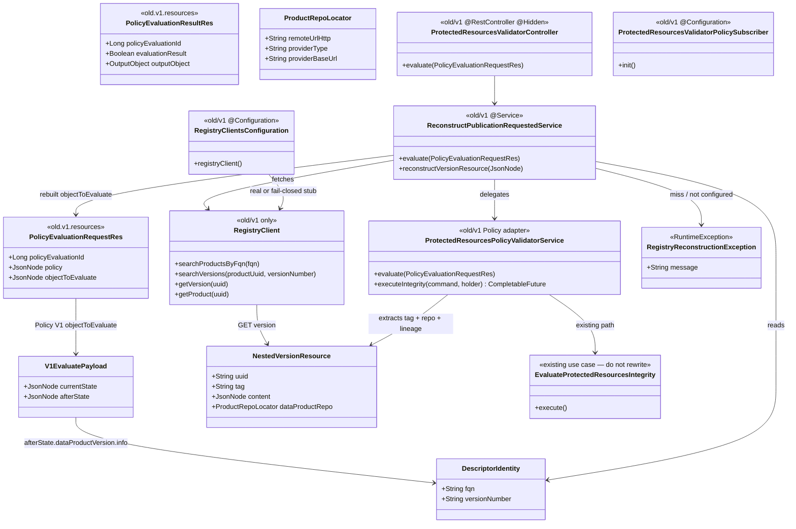

# Protected-resources V1 policy reconstruction adapter

## Requirements

- Finish the publication gate for **today’s Policy V1**: Blueprint already has the integrity use case. Add a **removable `old/v1` adapter** so Policy can actually invoke that check (`ProtectedResourcesPolicyValidatorService`, Policy DTOs/clients, reconstruction, CREATION subscription).
- Register the Policy engine + one policy when the Blueprint **validator is active**; bind the policy to Policy V1 **`DATA_PRODUCT_VERSION_CREATION`** only (not `DATA_PRODUCT_VERSION_PUBLICATION_REQUESTED`, not Notification).
- On evaluate, Policy sends `{ currentState, afterState }` with **no tag and no product repo**. Reconstruct the V2 nested version resource by **fetching Registry**, then call **`ProtectedResourcesPolicyValidatorService`** / `EvaluateProtectedResourcesIntegrity`.
- Keep reconstruction isolated so Policy V2 is **delete `old/v1`** plus a thin lasting evaluate controller. Do not change Notification or Policy Service. Do not rewrite hashing, instantiate, or Git clone logic. Core must not import `old/v1`.

## Entities



## Approach

1. Isolation (Registry `old` pattern):
   - New package `org.opendatamesh.platform.pp.blueprint.old` with a README stating: **this package may depend on core; core must not depend on this package**; intended for deletion when Policy V2 exists.
   - V1-only code lives under `...old.v1`: Policy subscriber (`ProtectedResourcesValidatorPolicySubscriber`), evaluate HTTP adapter (`ProtectedResourcesValidatorController`), Policy DTOs/clients, `ProtectedResourcesPolicyValidatorService`, Registry client + `RegistryClientsConfiguration`, reconstruction (`ReconstructPublicationRequestedService`).
   - Lasting code stays: `EvaluateProtectedResourcesIntegrity*`, `InstantiateBlueprintVersionLocalGitOutboundPort`, `BlueprintValidatorProperties` / `ValidatorGitCredentialHeaders`.
   - `old/v1` may call the integrity factory. Integrity / `validator.config` must not import `old`.

2. Do not use Notification; do not change Policy:
   - Registry’s existing V1 bridge already calls Policy `validateInput(DATA_PRODUCT_VERSION_CREATION)`.
   - Blueprint registers on that name. Policy already forwards `{ currentState, afterState }` to `POST {adapterUrl}/api/v1/up/validator/evaluate-policy`.

3. Reconstruct, then reuse:
   - From `afterState.dataProductVersion` (descriptor): read `info.fullyQualifiedName` (or `fullyQualifiedName`) and `info.version` (or `versionNumber`).
   - Registry V2: search products by FQN → search versions by product uuid + version number → GET version by uuid.
   - If GET version omits nested `dataProduct.dataProductRepo`, GET product by uuid and nest it.
   - Pass the GET version JSON as `objectToEvaluate` into `ProtectedResourcesPolicyValidatorService` (it accepts a node with `content` + `tag`/`dataProduct`).
   - Prefer stored Registry content over possibly 1.x-rewritten `afterState` for lineage.

4. Pass-through for already-V2-shaped payloads (`isAlreadyV2Shaped`):
   - If `objectToEvaluate.eventContent.dataProductVersion` is an object, **skip Registry**.
   - Else if the node (or nested `dataProductVersion`) has `content` and (`tag` or `dataProduct` or nested `dataProduct.dataProductRepo`), **skip Registry**.
   - Call `ProtectedResourcesPolicyValidatorService.evaluate(document)` with the original request. Keeps current integrity ITs working and matches the Policy V2 call shape.
   - Otherwise treat the body as Policy V1 `{ currentState, afterState }`.

5. Configuration:
   - Lasting: `blueprint.validator.active` / `blocking` / Git credentials / Policy address — already exist.
   - Adapter-only: `odm.product-plane.registry-service.active` + `address` (same style as Policy client). Unused after `old/v1` is deleted — intended.
   - Local profile Registry is `http://localhost:8086`. Do not put Git tokens in this prompt or in new docs.

6. Exception handling:
   - Unreadable evaluate JSON → existing `BadRequestException` (HTTP 400) with message `Empty/Malformed Policy Evaluation Object`.
   - Reconstruction / Registry miss / multiple FQN matches / missing FQN or version → catch `RegistryReconstructionException` → HTTP **200** with `evaluationResult=false` and the exception message (fail closed). Do not silent-pass.
   - Exact reconstruction messages:
     - missing identity: `Cannot check protected resources: the data product name or version could not be determined`
     - missing tag/clone URL after nest: `Cannot check protected resources: the data product version is missing its Git repository or tag`
     - 0 products: `no data product found in Registry for FQN '{fqn}'`
     - >1 products: `multiple data products found in Registry for FQN '{fqn}'`
     - 0 versions: `no data product version found in Registry for product '{uuid}' version '{version}'`
     - Registry inactive/blank: `Registry not configured`
   - Integrity outcomes stay as implemented (not-applicable pass, path-level fail, timeout fail closed).

7. Policy registration:
   - Create-if-absent engine + policy with **one** event `DATA_PRODUCT_VERSION_CREATION`.
   - Do not overwrite `blockingFlag` on restart.
   - Nothing has been released: no Policy-row update API, no operator delete of an old event binding.

## Structure

### Inheritance Relationships

1. Existing `UseCase` / integrity / local Git port — **unchanged**
2. `RegistryClient` interface in `old.v1` defines search/GET; `RegistryClientImpl` implements it with `RestUtils` (package-private). Inactive/blank address → anonymous fail-closed client from `RegistryClientsConfiguration` that throws `RegistryReconstructionException("Registry not configured")`
3. `PolicyEngineClient` / `PolicyClient` live in `...old.v1.client` (Policy V1 registration API); no-op clients when Policy is inactive
4. `RegistryReconstructionException` is package-private; mapped to 200 false by reconstruction, not by `ResponseExceptionHandler`
5. Existing `ResponseExceptionHandler` remains the HTTP exception mapper

### Dependencies

1. `old.v1` `ProtectedResourcesValidatorController` → `ReconstructPublicationRequestedService` → `RegistryClient` and `ProtectedResourcesPolicyValidatorService`
2. `old.v1` `ProtectedResourcesValidatorPolicySubscriber` → `old.v1` `PolicyEngineClient` / `PolicyClient` (event name `DATA_PRODUCT_VERSION_CREATION`)
3. `ProtectedResourcesPolicyValidatorService` → integrity factory (**must not** call Registry); `evaluate()` is require readable payload → map to integrity command → `@Async executeIntegrity` with timeout (`@Lazy` self, `@EnableAsync` on `BlueprintApplication`) → map to Policy result
4. Core integrity / instantiate / `validator.config` **must not** import `...blueprint.old`

### Layered Architecture

1. Controller Layer (`old/v1`): same path `POST /api/v1/up/validator/evaluate-policy`
2. Reconstruction Layer (`old/v1`): V1 payload → Registry fetch → V2 version resource
3. Adapter service Layer (`old/v1` `ProtectedResourcesPolicyValidatorService`): nested version resource → integrity command
4. Use Case Layer (existing): clones, hash, compare
5. Registration Layer (`old/v1` subscriber): create-if-absent on `DATA_PRODUCT_VERSION_CREATION`
6. Exception Handling Layer: existing `ResponseExceptionHandler`

## Operations

### Create package isolation - `org.opendatamesh.platform.pp.blueprint.old`

1. Responsibility: Removable compatibility layer, same idea as Registry `old`.
2. Add `src/main/java/org/opendatamesh/platform/pp/blueprint/old/README.md` stating:
   - Purpose: Policy V1 reconstruction for protected-resources validation
   - Allowed: this package depends on core (integrity factory, `validator.config`, shared exceptions, `RestUtils`)
   - Forbidden: any package outside `old` importing `old`
   - Removal: delete this tree when Policy V2 forwards `DATA_PRODUCT_VERSION_PUBLICATION_REQUESTED` with nested tag + repo; add a thin lasting controller that maps Policy evaluate payloads to the integrity factory
3. Constraints: no hashing, Git, or instantiate code in `old`.

### Move evaluate HTTP adapter into `old.v1`

1. `ProtectedResourcesValidatorController` lives in `...old.v1` (class name unchanged; **keep** `POST /api/v1/up/validator/evaluate-policy`). `@Hidden`, `@RestController`, `@RequestMapping("/api/v1/up/validator/evaluate-policy")`, `@PostMapping` consumes JSON, `@ResponseStatus(OK)`.
2. Controller still only maps HTTP → `ReconstructPublicationRequestedService.evaluate(document)`. No Registry URLs, no skip/fail matrix in the controller.
3. Single mapping of that path (no lasting controller until `old/v1` is deleted).
4. Existing integrity ITs (`ProtectedResourcesValidatorControllerIT`) that POST V2-shaped `objectToEvaluate` must keep passing via pass-through (see reconstruction service). V1 reconstruction ITs: `OldV1ProtectedResourcesValidatorControllerIT`, `ReconstructPublicationRequestedServiceTest`.

### Create reconstruction service - `ReconstructPublicationRequestedService` (`old.v1`)

1. Responsibility: Decide pass-through vs V1 reconstruct; never hash. `@Service`.
2. `evaluate(PolicyEvaluationRequestRes document): PolicyEvaluationResultRes`
   - If `objectToEvaluate` is null or not an object → `BadRequestException("Empty/Malformed Policy Evaluation Object")` (same as today).
   - If `isAlreadyV2Shaped(objectToEvaluate)` → call `ProtectedResourcesPolicyValidatorService.evaluate(document)` unchanged (original request object).
   - Else read `afterState` / `currentState`. If neither is a JSON object → 400 `Empty/Malformed Policy Evaluation Object`.
   - Descriptor node = `afterState.dataProductVersion` if object, else `afterState` if it looks like a descriptor (`info` present), else `afterState`.
   - Extract FQN + version from descriptor `info` (`fullyQualifiedName` / `fqn`; `version` / `versionNumber`), then the descriptor root. Missing either → `RegistryReconstructionException` with `Cannot check protected resources: the data product name or version could not be determined` (200 false; Registry never called).
   - Call Registry lookup (below). On miss / multiple products / client error → `RegistryReconstructionException` → 200 false with the cause (no stack traces, no tokens).
   - If reconstructed version has no `tag` or no `dataProduct.dataProductRepo.remoteUrlHttp` after optional product GET nest → `RegistryReconstructionException` with `Cannot check protected resources: the data product version is missing its Git repository or tag`.
   - Build a new `PolicyEvaluationRequestRes` copying `policyEvaluationId` / `policy`, `objectToEvaluate` = GET version JSON (Jackson `ObjectNode` deep copy, possibly with nested `dataProduct` from GET product).
   - Delegate to `ProtectedResourcesPolicyValidatorService.evaluate(...)`.
3. Timeout: `ProtectedResourcesPolicyValidatorService` runs integrity via Spring `@Async` (`@EnableAsync` on `BlueprintApplication`, Observer `@Lazy` self-proxy, `OutcomeHolder`) and waits with `get(evaluation-timeout-seconds)`. Reconstruction fetch runs on the same request thread before that. Fail closed if Registry client throws (`RegistryReconstructionException` wrapping `ClientException`). Do not add a second hashing implementation.
4. Jackson: `FAIL_ON_UNKNOWN_PROPERTIES = false` on a copied `ObjectMapper`.
5. Constraints: do not call integrity factory from reconstruction except through `ProtectedResourcesPolicyValidatorService`. Catch `RegistryReconstructionException` only in `evaluate`; map to `evaluationResult=false` + `rawError.cause`.

### Create Registry client - `old.v1` only

1. Responsibility: Registry V2 HTTP using existing `RestUtils` / `RestUtilsFactory` / `RestTemplateBuilder` (same as Policy clients).
2. Routes:
   - `GET {address}/api/v2/pp/registry/products` with filter `fqn` (page size small, e.g. 2)
   - `GET {address}/api/v2/pp/registry/products-versions` with `dataProductUuid` + `versionNumber`
   - `GET {address}/api/v2/pp/registry/products-versions/{uuid}`
   - `GET {address}/api/v2/pp/registry/products/{uuid}` only if version GET lacks nested repo
3. Resources: minimal JavaBeans in `old.v1` matching Registry JSON (`uuid`, `fqn`, `tag`, `versionNumber`, `content`, nested `dataProduct` / `dataProductRepo` with `remoteUrlHttp`, `providerType` **or** `dataProductRepoProviderType`, `providerBaseUrl`, clone identity fields). Do **not** add these types to the integrity package.
4. Lookup rules:
   - 0 products or 0 versions → fail closed
   - more than one product for FQN → fail closed
   - more than one version for uuid+versionNumber → fail closed (should not happen; version number is unique per product)
5. Configuration bean `RegistryClientsConfiguration` (`@Configuration`, same pattern as `PolicyClientsConfiguration`):
   - `@Value("${odm.product-plane.registry-service.active:false}")`
   - `@Value("${odm.product-plane.registry-service.address:}")`
   - If inactive or address blank: anonymous `RegistryClient` whose methods throw `RegistryReconstructionException("Registry not configured")` when reconstruction is needed (pass-through V2 payloads must still work **without** Registry).
   - Real client: `new RegistryClientImpl(RestUtils, address)` — package-private impl; page size 2 for searches; wraps `ClientException` / `ClientResourceMappingException` as `RegistryReconstructionException`.
6. Add to `application.yml`:

```yaml
odm:
  product-plane:
    registry-service:
      active: false
      address:
```

   In `application-localpostgres.yml` set `active: true` and `address: http://localhost:8086` next to the existing Policy block. In `application-test.yml` leave inactive/blank unless a test binds a mock.
7. Constraints: no IdentifierStrategy / FQN-derived id; no Registry V1 version GET as the sole lookup.

### Move subscriber into `old.v1` and bind CREATION

1. `ProtectedResourcesValidatorPolicySubscriber` is `@Configuration` in `old.v1` with `@PostConstruct init()`. Public constant `EVALUATION_EVENT = "DATA_PRODUCT_VERSION_CREATION"`.
2. Do not register `DATA_PRODUCT_VERSION_PUBLICATION_REQUESTED` or `DATA_PRODUCT_CREATION`.
3. Still gated by `blueprint.validator.active`. If active but Policy `odm.product-plane.policy-service.active/address` is off/blank: log error and skip (do not call clients).
4. Engine `adapterUrl` = `server.baseUrl`. Engine name/display-name from `blueprint.validator.policy-engine` (defaults `blueprint-service-validator` / `Blueprint Service Validator`). Policy name default `Protected Resources Integrity`. Policy `blockingFlag` from config at **create** only. Comment on create-if-absent: operators must change blocking in Policy Service after first create.
5. Constraints: no Policy update API; no migration of existing rows (nothing released). Catch `RuntimeException` around registration and log error (do not crash the JVM).

### Leave lasting integrity alone

1. Do **not** change `EvaluateProtectedResourcesIntegrity*` digest/Git/instantiate logic.
2. Do **not** add Registry calls to `ProtectedResourcesPolicyValidatorService`.
3. `extractVersionResource` on that adapter supports a raw version resource — reconstruction should feed GET version JSON (`content` + `tag` / `dataProduct`).
4. Production `InstantiateBlueprintVersionFactory.buildInstantiateBlueprintVersion` stays unchanged.
5. `@EnableAsync` on `BlueprintApplication` is required for the adapter’s `@Async executeIntegrity`; it is lasting application config, not `old/v1`-only.

## Integration Test Scenarios (Gherkin)

Trace each test to a scenario below via a javadoc comment that restates the **full** Gherkin immediately above the `@Test` method. Tests: `ProtectedResourcesValidatorPolicySubscriberTest`, `ReconstructPublicationRequestedServiceTest`, `OldV1ProtectedResourcesValidatorControllerIT`. Integrity skip/fail Gherkin lives in `spdd/prompt/BDMD-5124-202608210930-[Feat]-service-protected-resources-integrity-policy-adapter.md`.

### Feature: Policy engine registration (V1)

```gherkin
Scenario: Validator inactive does not register a Policy engine
  Given blueprint.validator.active is false
  When the Policy subscriber initializes
  Then Policy engine and policy clients are never called

Scenario: Validator active creates engine and policy if absent
  Given blueprint.validator.active is true
  And Policy Service is configured
  And no Policy engine or policy named for this validator exists
  When the Policy subscriber initializes
  Then a Policy engine is created with adapterUrl equal to server.baseUrl
  And a policy named "Protected Resources Integrity" is created
  And the policy blockingFlag is taken from Blueprint configuration
  And the policy evaluation events contain exactly "DATA_PRODUCT_VERSION_CREATION"
  And the policy evaluation events do not contain "DATA_PRODUCT_VERSION_PUBLICATION_REQUESTED"
  And the policy evaluation events do not contain "DATA_PRODUCT_CREATION"

Scenario: Validator active does not recreate an existing policy
  Given blueprint.validator.active is true
  And Policy Service is configured
  And the Policy engine and policy already exist
  When the Policy subscriber initializes
  Then createPolicyEngine is never called
  And createPolicy is never called

Scenario: Validator active but Policy Service is not configured skips registration
  Given blueprint.validator.active is true
  And Policy Service is inactive or has a blank address
  When the Policy subscriber initializes
  Then Policy engine and policy clients are never called
```

### Feature: Reconstruct V2 publication object from Policy V1

```gherkin
Scenario: V2-shaped payload skips Registry and delegates to the validator
  Given a Policy evaluate request whose objectToEvaluate already has nested version content and clone metadata
  When reconstruction evaluates the request
  Then the Registry client is never called
  And the policy validator is called with the original request

Scenario: V1 afterState reconstructs the version resource from Registry
  Given a Policy V1 objectToEvaluate with afterState.dataProductVersion.info fullyQualifiedName and version
  And Registry returns exactly one product for that FQN
  And Registry returns exactly one version for that product uuid and version number
  And GET version returns a nested version resource with tag and product repository
  When reconstruction evaluates the request
  Then the policy validator is called
  And objectToEvaluate is the GET version body including tag and nested product repository

Scenario: Missing FQN and version fail closed without integrity
  Given a Policy V1 objectToEvaluate whose afterState descriptor has no fullyQualifiedName and no version
  When reconstruction evaluates the request
  Then evaluationResult is false
  And the message states the data product name or version could not be determined
  And the Registry client is never called
  And the policy validator is never called

Scenario: No data product found in Registry fails closed
  Given a Policy V1 objectToEvaluate with a readable FQN and version
  And Registry search by FQN returns zero products
  When reconstruction evaluates the request
  Then evaluationResult is false
  And the message states no data product was found
  And the policy validator is never called

Scenario: Multiple data products for FQN fail closed
  Given a Policy V1 objectToEvaluate with a readable FQN and version
  And Registry search by FQN returns more than one product
  When reconstruction evaluates the request
  Then evaluationResult is false
  And the message states multiple data products were found
  And the policy validator is never called

Scenario: No data product version found in Registry fails closed
  Given a Policy V1 objectToEvaluate with a readable FQN and version
  And Registry returns exactly one product
  And Registry search for versions returns zero versions
  When reconstruction evaluates the request
  Then evaluationResult is false
  And the message states no data product version was found
  And the policy validator is never called

Scenario: GET version without nested repo nests the product before delegate
  Given a Policy V1 objectToEvaluate with a readable FQN and version
  And GET version omits dataProduct.dataProductRepo
  And GET product returns a product with a repository
  When reconstruction evaluates the request
  Then the policy validator receives objectToEvaluate with nested dataProduct.dataProductRepo

Scenario: Registry not configured fails closed for a V1 payload
  Given a Policy V1 objectToEvaluate with a readable FQN and version
  And the Registry client is not configured
  When reconstruction evaluates the request
  Then evaluationResult is false
  And the message states Registry is not configured
  And the policy validator is never called

Scenario: Unreadable payload throws BadRequest
  Given a Policy evaluate request with no objectToEvaluate
  When reconstruction evaluates the request
  Then a BadRequestException is thrown with message "Empty/Malformed Policy Evaluation Object"
  And the Registry client is never called

Scenario: Neither currentState nor afterState is an object throws BadRequest
  Given a Policy evaluate request whose afterState is not a JSON object
  When reconstruction evaluates the request
  Then a BadRequestException is thrown with message "Empty/Malformed Policy Evaluation Object"
  And the policy validator is never called

Scenario: Reconstructed content without lineage is not applicable
  Given a Policy V1 evaluate request with afterState identity
  And Registry GET version returns content without blueprint lineage
  When the evaluate endpoint is called
  Then the response status is 200
  And evaluationResult is true
  And the message states the version was not created from a blueprint
```

## Norms

Apply the registry in `spdd/norms/README.md`. Read in this session:

1. `spdd/norms/USE_CASE_IMPLEMENTATION.md` — **do not add a second integrity use case**. Reconstruction is an HTTP/adapter concern in `old/v1`, not a hexagonal domain use case. It may call `ProtectedResourcesPolicyValidatorService`. Commands/presenters/ports for hashing stay as already implemented. Controllers still have no business rules beyond delegating to the reconstruction service.
2. `spdd/norms/GENERIC-CRUD-GUIDELINES.md` — **do not add CRUD**. Do not persist reconstructed events. Load Blueprint versions only through the existing integrity persistency port.

Annotation / DI / exceptions / logging:

- `old/v1` controller: `@RestController`, `@Hidden` acceptable (same as current validator controller)
- Reconstruction + Policy subscriber: Spring `@Service` / `@Configuration` **inside `old` only** (`ReconstructPublicationRequestedService`, `ProtectedResourcesValidatorPolicySubscriber`)
- Registry client impl: package-private class constructed from `RegistryClientsConfiguration` (same pattern as `PolicyClientsConfiguration`)
- `RegistryReconstructionException`: package-private; HTTP 200 + false, never 5xx
- Never log Git tokens or Registry secrets
- Reconstruction failures that should affect publication → HTTP 200 + `evaluationResult=false`, not 500
- Comments: why the package is deletable; why Registry is called only here

## Safeguards

1. Functional Constraints:
   - Do not rewrite integrity, local Git port, digest, or production instantiate
   - Do not subscribe to Notification
   - Do not change Policy Service or Registry server code
   - Core packages must not import `org.opendatamesh.platform.pp.blueprint.old`
   - `old/v1` must not hash, clone Git, or push
   - Policy event name for this slice **must** be `DATA_PRODUCT_VERSION_CREATION`
   - Create-if-absent only; no Policy update/migration of evaluation events
2. Performance Constraints:
   - Existing `blueprint.validator.evaluation-timeout-seconds` still bounds Git/render
   - Registry fetch is one search products + one search versions + one GET version (optional extra product GET)
   - Always delete temp Git dirs in the existing integrity path (unchanged)
3. Security Constraints:
   - Git credentials only from Blueprint configuration (already implemented)
   - Registry client uses configured base URL only; no tokens on events
   - Do not log PATs
4. Integration Constraints:
   - Evaluate URL **must** remain `POST /api/v1/up/validator/evaluate-policy`
   - Engine `adapterUrl` = `server.baseUrl`
   - Registry V2 paths under `/api/v2/pp/registry/products` and `/api/v2/pp/registry/products-versions`
   - Local Registry address `http://localhost:8086`
   - Pass-through when `isAlreadyV2Shaped`: `eventContent.dataProductVersion` is an object, or the version node has `content` and (`tag` or `dataProduct` or nested repo)
5. Business Rule Constraints:
   - Skip/fail matrix of the integrity use case is unchanged
   - Reconstruction cannot obtain identity, version, tag, or repo → fail closed (not not-applicable)
   - No lineage on reconstructed content → existing not-applicable pass (`This data product version was not created from a blueprint`)
6. Exception Handling Constraints:
   - Unreadable payload → HTTP 400 `BadRequestException("Empty/Malformed Policy Evaluation Object")`
   - Registry/reconstruction failure → HTTP 200 + false + `RegistryReconstructionException` message (`Registry not configured`, missing identity, missing clone metadata, 0/>1 products or versions)
   - Messages must not include Git tokens
7. Technical Constraints:
   - No IdentifierStrategy in Blueprint
   - No Registry V1 descriptor-only GET as the source of tag/repo
   - Prefer GET version JSON as `objectToEvaluate` for the existing extractor
   - Do not persist hashes
8. Data Constraints:
   - Identity from descriptor `info` (`fullyQualifiedName`/`fqn`, `version`/`versionNumber`)
   - Repo JSON keys: accept `providerType` or `dataProductRepoProviderType` (existing mapper)
9. API Constraints:
   - Policy request/response field names stay Observer-compatible
   - Do not add sibling locator fields on Policy V1 `afterState`
