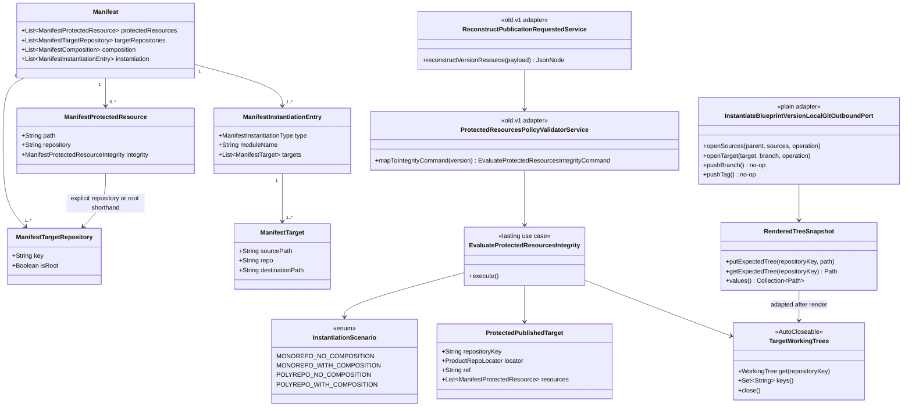

# Protected-resources integrity across repository layouts

## Requirements

- Retain the original Slice 1 filename for SPDD traceability. Treat `spdd/analysis/BDMD-5124-202609021721-[Analysis]-protected-resources-multi-repository-integrity.md` as authoritative, `spdd/prompt/BDMD-5124-202608210930-[Feat]-service-protected-resources-integrity-policy-adapter.md` as the lasting domain contract, and `spdd/prompt/BDMD-5124-202608241546-[Feat]-service-v1-protected-resources-policy-adapter.md` as the Registry reconstruction/mapping contract.
- Preserve the partially implemented Slice 1 (1→1 and composed N→1 local rendering), repair it for the final manifest, and complete Slice 2 (1→N and N→N).
- Restore the existing protected-resources implementation after the final Blueprint manifest redesign: top-level `targetRepositories[]`, exactly one `isRoot: true`, typed `instantiation[]`, route `repo`, and composition without route fields.
- Preserve the working Slice 1 foundations: optional `ManifestProtectedResource.repository`, protected-target validation, `RenderedTreeSnapshot` keyed by logical target, and local `openSources`/`openTarget` instantiation with no remote target clone or push.
- Evaluate 1→1 and composed N→1 on the final manifest without old `instantiation.repositories` or `instantiation.root.repository` references.
- Complete 1→N and N→N by comparing every target in the parent protection coverage set against its own published locator/ref and same-key expected tree.
- Keep `protectedResources[].repository` optional. Omission or blank means the explicit root target; a present value must resolve to `targetRepositories[].key`.
- Enforce parent-only policy authoring: reject a non-empty protected-resource list when publishing a catalog `MODULE`; parent Blueprints protect Module-originated output by naming final routed paths.
- Require Registry metadata only for protected targets and clone only those published targets. Unprotected target mappings do not affect this policy.
- Use each non-root target’s independent `additionalTags[].tag`; never infer it from the root tag.
- Keep Blueprint update checkpoint optimization separate from publication integrity. Reusing an unchanged pure-render checkpoint must never bypass comparison against the product snapshot being published.
- Preserve immediate publication-time scope, exact Registry-key joins after existing Blueprint manifest canonicalization, read-only Git behavior, and fail-closed applicable evaluation.

## Entities



## Approach

1. Treat current code selectively:
   - Preserve implemented Slice 1 pieces that already match the final direction:
     - `ManifestProtectedResource.repository`;
     - `OdmBlueprintValidationVisitor` and instantiate manifest validation against `targetRepositories[].key`;
     - `RenderedTreeSnapshot` map;
     - `InstantiateBlueprintVersionLocalGitOutboundPort.openSources/openTarget`;
     - `InstantiateBlueprintVersionFactory.buildInstantiateBlueprintVersionForLocalValidation`;
     - existing 1→1/N→1, reconstruction, and local Git tests.
   - Rewrite stale integrations rather than adapting deleted models:
     - `EvaluateProtectedResourcesIntegrity` still imports `ManifestInstantiationRepository`;
     - `EvaluateProtectedResourcesIntegrityInstantiateOutboundPortImpl` still reads `instantiation.root.repository`;
     - the root-only integrity command/Policy mapper cannot carry additional locators/refs;
     - polyrepo still returns not applicable.

2. Phase 1 — repair and verify Slice 1:
   - Compile exclusively against final `Manifest.getTargetRepositories()` and typed instantiation.
   - Resolve root from the sole `ManifestTargetRepository.isRoot`.
   - Adapt local snapshots to target-keyed `TargetWorkingTrees`.
   - Re-run 1→1 and N→1 with parent plus Module sources and one destination.
   - Replace the old “Module list is ignored” authoring scenario with Module publication rejection.

3. Phase 2 — complete multi-destination integrity:
   - Use the lasting command from the base prompt and V1 mapping from the adapter prompt.
   - Build disposable target DTOs for every manifest destination so the unchanged production instantiate use case renders the complete expected output.
   - Require no physical Registry locator for unprotected local expected targets; synthetic DTO repository metadata is sufficient because the local Git port never clones targets.
   - Clone published trees only for protected target keys, each at its own ref.
   - Compare declarations grouped by key and close every published/expected tree.

4. Parent-only authoring:
   - Generic manifest validation remains catalog-type-agnostic.
   - `PublishBlueprintVersion` already knows `BlueprintType`; extend its Module publication checks to reject non-empty protection.
   - Also reject a parent publication that references an inconsistent persisted Module version with a non-empty list, using the existing aggregated composition issue path. This is defense in depth, not a migration or compatibility path.

5. Key behavior:
   - Preserve existing Blueprint manifest normalization where it already exists; this task does not refactor it.
   - Once manifest keys are resolved through existing Blueprint parsing/validation helpers, join them to Registry `repositoryKey` values with exact equality and no additional trimming/case folding.
   - Missing/duplicate/conflicting metadata fails only when its target is protected.

6. Tests before extension:
   - First make `mvn clean compile` and existing Slice 1 tests pass on the final manifest.
   - Then add root-only, additional-only, mixed-target, 1→N, N→N, duplicate/missing metadata, independent-ref, and aliasing coverage.
   - Ensure parent fixtures use catalog `BLUEPRINT` and composition children use explicit catalog `MODULE`; do not rely on pre-redesign type inference.

## Structure

### Inheritance Relationships

1. `ManifestProtectedResource` remains a manifest POJO visited through `ManifestVisitor`.
2. `OdmBlueprintValidationVisitor` remains the structural manifest validator; no parallel protected-resource validator is added.
3. `PublishBlueprintVersion` remains the catalog-aware use case for Module publication rules.
4. `InstantiateBlueprintVersionLocalGitOutboundPort` remains a plain implementation of `InstantiateBlueprintVersionGitOutboundPort`.
5. `InstantiateBlueprintVersionFactory` remains the composition root for production and local-validation instantiate variants.
6. `EvaluateProtectedResourcesIntegrity` remains the package-private lasting use case defined by the base prompt.

### Dependencies

1. Publish use case → manifest outbound port for `hasProtectedResources(JsonNode)`.
2. Integrity use case → final manifest through persistence port.
3. Integrity use case → local-instantiate adapter returning target-keyed expected trees.
4. Local-instantiate adapter → `InstantiateBlueprintVersionFactory` and `RenderedTreeSnapshot`.
5. Product Git adapter → one protected locator/ref per clone.
6. Policy V1 mapping → root/additional Registry context from the companion V1 prompt.

### Layered Architecture

1. Manifest Layer: optional destination scope and structural key validation.
2. Catalog Publish Layer: catalog `MODULE` protected-list rejection.
3. Integrity Use Case Layer: protection coverage and same-key comparison.
4. Instantiate Reuse Layer: complete expected output using production routing/rendering semantics.
5. Git Adapter Layer: source clones, disposable local targets, and protected published clones.
6. Policy V1 Layer: Registry reconstruction and domain mapping, implemented separately.
7. Documentation/Test Layer: all layouts and architectural decisions.

## Operations

### Preserve manifest field and structural validation

1. Keep `ManifestProtectedResource.repository` optional with its current getter/setter.
2. Keep `OdmBlueprintValidationVisitor` collection/post-pass validation and `OdmBlueprintManifestValidatorState.ProtectedResourceRepository`.
3. Keep instantiate-time `validateProtectedResourceRepositories(...)` in `InstantiateBlueprintVersionOdmBlueprintManifestOutboundPortImpl`.
4. Validation wording must name `targetRepositories[].key` and root `isRoot: true`; remove stale test Javadocs referring to `instantiation.repositories` or `instantiation.root.repository`.
5. Blank `repository` is root shorthand and is not auto-filled into stored manifest content.
6. Do not add Registry-key validation to generic manifest parsing.

### Enforce Module policy ownership at publish

1. Add `boolean hasProtectedResources(JsonNode content)` to `PublishBlueprintVersionManifestOutboundPort`.
2. Implement it with `ManifestParserFactory` and return true only for a non-null, non-empty list.
3. In `PublishBlueprintVersion.validateModulePublishTopology(...)`, when `blueprintType == MODULE`, reject a non-empty list with:
   - problem: `A Blueprint module must not declare protectedResources`;
   - hint: `Remove protectedResources from the module; declare final protected paths on the parent Blueprint.`
4. In `validateCompositionModules(...)`, add an aggregated issue if a referenced Module version has non-empty protection. Keep loading and issue aggregation through existing ports.
5. Do not reject an empty/omitted list and do not inspect Module lists during integrity evaluation.

### Repair final-manifest use in `EvaluateProtectedResourcesIntegrity`

1. Remove deleted `ManifestInstantiationRepository` and all object-shaped instantiation access.
2. Use final `ManifestTargetRepository` declarations to:
   - collect declared logical keys;
   - resolve the sole explicit root;
   - resolve each protected declaration to explicit key or root shorthand.
3. Remove `POLYREPO_NOT_APPLICABLE_MESSAGE` and topology refusal. `InstantiationScenarioResolver` may remain for tests/diagnostics, but no valid scenario is skipped.
4. Keep empty parent protection not applicable before Registry metadata checks.
5. Apply the target-keyed domain resolution and comparison flow from the base integrity prompt.
6. Use only parent protected resources; do not load or merge Module lists.

### Update local re-instantiation adapter

1. Change `EvaluateProtectedResourcesIntegrityInstantiateOutboundPort` to return `TargetWorkingTrees`.
2. In `EvaluateProtectedResourcesIntegrityInstantiateOutboundPortImpl`:
   - parse the stored final manifest;
   - collect every `targetRepositories[].key`;
   - identify root only through `isRoot: true`;
   - build one `TargetRepositoryDto` for every declared key, not only root;
   - use deterministic synthetic `Repository` metadata and a safe local branch such as `main`, because the local Git port ignores target remotes;
   - pass all target DTOs into `InstantiateBlueprintVersionCommand`;
   - execute `buildInstantiateBlueprintVersionForLocalValidation`;
   - adapt every `RenderedTreeSnapshot` entry into one closeable keyed result.
3. Do not require Registry locator/ref data for unprotected local expected targets.
4. A missing rendered tree for a routed/protected key fails closed. Delete all snapshots on construction failure.
5. Remove JSON walking of `instantiation.root.repository` and the single-entry fallback.

### Keep update checkpoints separate from publication integrity

1. Do not modify `UpdateDataProductFromBlueprintVersion` or `contentUnchanged` to serve as an integrity result.
2. A reused pure-render checkpoint is only an update baseline; the Policy publication path must still clone the version’s recorded product refs and compare protected content.
3. Add regression coverage showing that tampering on a product snapshot fails publication integrity even when a no-op Blueprint update reused an existing checkpoint.
4. Update stale `InstantiationScenario` and test Javadocs that still describe removed manifest repository paths.

### Preserve and harden Slice 1 local Git

1. Keep `InstantiateBlueprintVersionLocalGitOutboundPort.openSources(...)` cloning all routed parent/Module sources at release tags.
2. Keep `openTarget(...)` creating a throwaway repository per `target.targetId()`, running the unchanged instantiate callback, and snapshotting by logical key.
3. Keep no-op `pushBranch`/`pushTag` and origin-free orphan checkout.
4. Never clone `target.repository()` in local validation.
5. Preserve symbolic links in the snapshot without following them so the digest layer can reject protected symlinks.
6. Keep deterministic best-effort cleanup and replacement cleanup in `RenderedTreeSnapshot.putExpectedTree`.

### Complete published multi-target evaluation

1. Consume root/additional domain lists defined by the base prompt and populated by the V1 prompt.
2. Derive the protection coverage set after root fallback.
3. For each protected key:
   - root → root locator + root ref;
   - non-root → exactly one exact-key additional locator + exactly one exact-key additional ref.
4. Fail before Git when referenced metadata is missing, blank, duplicate, or conflicting.
5. Ignore unreferenced additional entries and do not clone unprotected published repositories.
6. Clone every protected target independently, even when two locators identify the same remote.
7. Compare each declaration only against published and expected trees for its resolved key.
8. Never reuse root tag for non-root repositories.

### Align Policy V1 reconstruction

1. Implement the companion V1 prompt in the same delivery:
   - retain/fetch `additionalDataProductRepos[]`;
   - retain/default `additionalTags[]`;
   - map `repositoryKey` locators and refs without deduplication;
   - remove unconditional root-metadata rejection.
2. Do not add Registry HTTP calls to integrity core.
3. No Registry V2 event change is required unless direct V2 delivery is later proven incomplete.

### Keep documentation aligned

1. Preserve the updated `docs/service/protected-resources.md` decisions:
   - all four layouts;
   - optional root shorthand;
   - parent-only and Module rejection;
   - referenced-target-only metadata/cloning;
   - exact Registry joins;
   - immediate publication guarantee;
   - no remote alias checks;
   - fail-fast infrastructure behavior.
2. Preserve matching schema guidance in the manifest README and cross-links in service indexes.
3. Do not reintroduce monorepo-only, `manifestKey`, shared-tag, or removed manifest terminology.

### High-level tests (Gherkin)

```gherkin
Feature: Protected-resource manifest ownership

  Scenario: Omitted repository resolves to the explicit root
    Given a valid manifest whose root target is not first
    And a protected resource omits repository
    When the manifest is published and integrity is evaluated
    Then publication accepts the declaration
    And integrity compares it on the target marked isRoot true

  Scenario: Unknown protected repository is rejected
    Given a protected resource names a key absent from targetRepositories
    When the Blueprint version is published
    Then publication returns 400
    And the error names protectedResources repository and targetRepositories key

  Scenario: Module with protected resources is rejected
    Given a catalog MODULE manifest with a non-empty protectedResources list
    When the Module version is published
    Then publication returns 400
    And the message tells the author to declare final paths on the parent Blueprint

Feature: Repaired one-destination integrity

  Scenario: 1→1 matching root shorthand passes
    Given a recorded 1→1 Blueprint with root-shorthand protected paths
    And the published root tree matches local re-instantiation
    When integrity is evaluated
    Then evaluationResult is true

  Scenario: N→1 reconstructs parent and Module output
    Given a parent Blueprint composes published Modules into one target
    And the parent protects a routed Module path
    And the published tree matches local re-instantiation
    When integrity is evaluated
    Then evaluationResult is true
    And all required source repositories were opened at release tags

  Scenario: N→1 Module-originated mismatch fails
    Given the parent protects a final Module-originated path
    And the published tree differs at that path
    When integrity is evaluated
    Then evaluationResult is false
    And the message names the parent-declared destination path

Feature: Multi-destination integrity

  Scenario: 1→N protects only root and ignores unrelated metadata gaps
    Given a 1→N Blueprint protects only the root target
    And an unprotected additional target lacks locator or ref metadata
    When integrity is evaluated
    Then only the root published repository is cloned
    And the unrelated gap does not fail the policy

  Scenario: 1→N protects only an additional target
    Given a 1→N Blueprint protects only "infra-repo"
    And root publication metadata is absent
    And "infra-repo" has one locator and its own ref
    When integrity is evaluated
    Then only "infra-repo" is cloned and compared
    And root metadata absence does not fail the policy

  Scenario: Different root and additional refs are honored
    Given root and "infra-repo" are both protected
    And each has a different recorded ref
    When integrity is evaluated
    Then each repository is cloned at its own ref

  Scenario: Missing referenced additional ref fails closed
    Given "infra-repo" is protected
    And its locator exists but its additional ref is missing
    When integrity is evaluated
    Then evaluationResult is false before cloning "infra-repo"
    And the message names "infra-repo"

  Scenario: Duplicate referenced locator fails closed
    Given "infra-repo" is protected
    And two additional locator entries use repositoryKey "infra-repo"
    When integrity is evaluated
    Then evaluationResult is false
    And no ambiguous locator is selected

  Scenario: N→N compares parent and Module output by destination
    Given a parent Blueprint and Modules route protected output across root and additional targets
    And every published target matches its same-key expected tree
    When integrity is evaluated
    Then evaluationResult is true
    And no target is compared against another target tree

  Scenario: Same physical remote remains two logical comparisons
    Given two protected logical targets resolve to the same remote URL
    And each has its own recorded ref
    When integrity is evaluated
    Then both logical targets are cloned and compared independently

  Scenario: First infrastructure failure may stop evaluation
    Given several targets are protected
    And cloning one target fails
    When integrity is evaluated
    Then evaluationResult is false
    And the implementation is not required to clone remaining targets

Feature: Update checkpoint isolation

  Scenario: Reused unchanged checkpoint does not bypass publication integrity
    Given a Blueprint update reuses an unchanged pure-render checkpoint
    And the product snapshot being published contains tampering under a protected path
    When protected-resources integrity is evaluated
    Then evaluationResult is false
    And the comparison uses the published product ref rather than treating checkpoint reuse as approval
```

| Feature / Scenario | Test class | Method |
| --- | --- | --- |
| Manifest / Omitted repository resolves root | `BlueprintVersionsUseCaseControllerIT` and `EvaluateProtectedResourcesIntegrityTest` | update root-key Javadocs and add `whenRepositoryOmittedThenUseIsRootTarget` |
| Manifest / Unknown key rejected | `BlueprintVersionsUseCaseControllerIT` and `InstantiateBlueprintVersionOdmBlueprintManifestOutboundPortTest` | preserve tests, replace stale terminology |
| Manifest / Module list rejected | `BlueprintVersionsUseCaseControllerIT` | `whenPublishModuleWithProtectedResourcesThenReturn400` |
| Integrity / 1→1 root shorthand passes | `ProtectedResourcesValidatorControllerIT` | preserve `applicableMatchingTreesPass` |
| Integrity / N→1 reconstruction passes | `ProtectedResourcesValidatorControllerIT` | preserve/fix `whenMonorepoWithCompositionProtectedPathsMatchThenPass` |
| Integrity / N→1 mismatch fails | `ProtectedResourcesValidatorControllerIT` | preserve/fix `whenMonorepoWithCompositionProtectedPathMissingThenFail` |
| Integrity / Root-only subset ignores gaps | `ProtectedResourcesValidatorControllerIT` | `whenPolyrepoProtectsOnlyRootThenCloneOnlyRoot` |
| Integrity / Additional-only subset | `ProtectedResourcesValidatorControllerIT` | `whenPolyrepoProtectsOnlyAdditionalTargetThenRootMetadataNotRequired` |
| Integrity / Independent refs | `ProtectedResourcesValidatorControllerIT` | `whenMultipleTargetsProtectedThenCloneEachRecordedRef` |
| Integrity / Missing referenced ref | `EvaluateProtectedResourcesIntegrityTest` | `whenProtectedAdditionalRefMissingThenFailBeforeGit` |
| Integrity / Duplicate referenced locator | `EvaluateProtectedResourcesIntegrityTest` | `whenProtectedAdditionalLocatorDuplicatedThenFailBeforeGit` |
| Integrity / N→N same-key comparison | `ProtectedResourcesValidatorControllerIT` | `whenPolyrepoWithCompositionMatchesThenPass` |
| Integrity / Physical aliasing | `EvaluateProtectedResourcesIntegrityTest` | `whenProtectedKeysShareRemoteThenEvaluateIndependently` |
| Integrity / Fail fast infrastructure | `EvaluateProtectedResourcesIntegrityTest` | `whenProtectedTargetCloneFailsThenRemainingClonesAreOptional` |
| Update / Reused checkpoint does not bypass integrity | `BlueprintUpdateDataProductControllerIT` and `ProtectedResourcesValidatorControllerIT` | `whenUnchangedCheckpointIsReusedThenTamperedPublicationStillFailsIntegrity` |
| Local Git / Sources and targets remain local | `InstantiateBlueprintVersionLocalGitOutboundPortTest` | preserve `openSourcesClonesTagsAndOpenTargetDoesNotCloneProduct` and extend to multiple targets |
| Local snapshots / Every target retained and closed | `EvaluateProtectedResourcesIntegrityInstantiateOutboundPortImplTest` | `whenManifestHasMultipleTargetsThenReturnAllExpectedTreesAndCleanup` |

Implement each new or rewritten test and copy its complete Scenario text into the test method Javadoc. Replace the old polyrepo-not-applicable and Module-list-ignored scenarios; they assert superseded behavior.

All composition fixtures used by these tests must explicitly create parent rows with `BlueprintType.BLUEPRINT` and child rows with `BlueprintType.MODULE`. Update existing Slice 1 helpers that currently omit the child type.

## Norms

1. [`spdd/norms/USE_CASE_IMPLEMENTATION.md`](../norms/USE_CASE_IMPLEMENTATION.md):
   - Keep `EvaluateProtectedResourcesIntegrity` and `InstantiateBlueprintVersion` as package-private use cases with domain commands and presenters.
   - Keep business rules in use cases and parser/Git/filesystem mechanics in plain outbound adapters.
   - Keep factories as the Spring composition roots; do not annotate port implementations.
   - Reuse production instantiate through its factory instead of implementing a second renderer.
   - Keep REST/Registry resources out of lasting use-case packages.
2. [`spdd/norms/GENERIC-CRUD-GUIDELINES.md`](../norms/GENERIC-CRUD-GUIDELINES.md):
   - Do not add CRUD entities for protected resources, hashes, locators, refs, or snapshots.
   - Existing Blueprint/BlueprintVersion reads remain behind current persistence outbound ports.
   - Extend publish validation through its current use case/manifest port rather than altering generic CRUD algorithms.

## Safeguards

1. Final manifest:
   - Use only top-level `targetRepositories[]`, `isRoot`, typed `instantiation[]`, `repo`, and `destinationPath`.
   - No references to removed object-shaped instantiation APIs.
2. Slice preservation:
   - Keep the implemented `repository` field, validators, snapshot map, local `openSources/openTarget`, and N→1 semantics.
   - Repair rather than discard working Slice 1 tests and adapters.
3. Parent ownership:
   - Reject non-empty Module protection at publication.
   - Integrity reads only the recorded parent list.
   - A later parent version may change protection without cross-version checks.
4. Coverage:
   - No protected resources → not applicable.
   - A subset protects only that subset.
   - Every protected target must be evaluated; root-only partial success is forbidden when a non-root target is protected.
5. Registry mapping:
   - Root uses `dataProductRepo` + version `tag`.
   - Non-root uses exact-key `additionalDataProductRepos` + `additionalTags`.
   - Referenced missing/blank/duplicate/conflicting entries fail closed.
   - Unreferenced mapping defects are ignored.
6. Git:
   - Expected targets are disposable and never clone product remotes.
   - Published repositories are cloned only at recorded refs.
   - No push, pull request, or remote commit/tag mutation.
   - No alias detection; same remote may be cloned more than once for distinct logical keys.
7. Errors:
   - Infrastructure failure may stop on the first target.
   - Messages name logical key/path and never expose credentials or local paths.
   - Missing expected/published content and content differences remain distinct.
8. Performance:
   - Re-instantiate once.
   - Clone only protected published targets.
   - Keep one configured timeout and deterministic cleanup.
9. Update isolation:
   - `contentUnchanged` and checkpoint reuse never short-circuit the Policy publication comparison.
   - Published product refs, not Blueprint checkpoint tags, remain the actual-tree authority.
10. Compatibility:
   - No old manifest, `manifestKey`, shared-ref, or automatic tag-fan-out support.
   - No Registry event changes unless future direct V2 delivery proves necessary.
11. Verification order:
   - `mvn clean compile`;
   - targeted manifest/publish/local-Git/integrity/V1 tests;
   - full `mvn test` or repository-standard verification once targeted tests pass.
