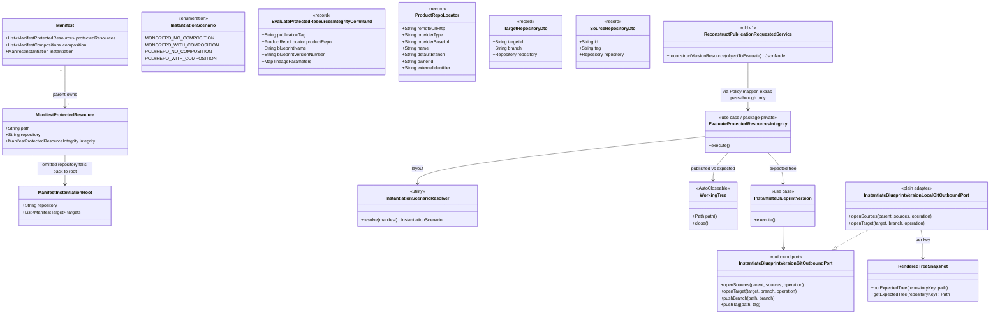

# Protected-resources integrity for monorepo with composition (N→1)

Slice 1 of `spdd/analysis/BDMD-5124-202609021721-[Analysis]-protected-resources-multi-repository-integrity.md`. Companion to `spdd/prompt/BDMD-5124-202608210930-[Feat]-service-protected-resources-integrity-policy-adapter.md` (lasting integrity) and `spdd/prompt/BDMD-5124-202608241546-[Feat]-service-v1-protected-resources-policy-adapter.md` (`old/v1`). Instantiate lifecycle: `spdd/prompt/BDMD-4820-202608261148-[Feat]-service-all-instantiation-repository-scenarios.md`.

## Requirements

- Extend protected-resources integrity so a **parent** blueprint that composes modules into **one** Git destination (N→1) is evaluated the same way as 1→1: rebuild what instantiate would have written, then hash post-instantiation paths.
- Keep **1→1** working, including manifests that omit `protectedResources[].repository`.
- Add an optional logical **`repository`** key on each protected resource (same vocabulary as routes). When omitted, **fall back to the designated root** (`instantiation.root.repository`) — today’s monorepo behaviour. When present, it must be a declared `instantiation.repositories[].key`.
- Treat **parent-only** protection as an **architectural decision**: evaluate only the parent list; never inherit or rewrite a module’s `protectedResources`. Document that rule.
- Re-ground “is this layout evaluable?” on `InstantiationScenarioResolver` (repository-key cardinality × composition). Evaluate **1→1 and N→1**. Leave **1→N and N→N** as not applicable with a message that names **polyrepo hashing not yet applied** — not “composition unsupported”.
- Rewrite the local-instantiate Git adapter onto `openSources` / `openTarget`, snapshot **one expected tree per destination key**, and still compare against **one published root clone** at the version tag. Do not map `additionalDataProductRepos` into the integrity command in this slice.
- Reconstruction in `old/v1` must **keep** `additionalDataProductRepos` on the nested product (empty array counts) so slice 2 is a mapper change, not another fetch design.

## Entities

## Approach

1. Manifest contract:
   - Add optional `repository` on `ManifestProtectedResource`. Do **not** autofill it into stored YAML (`OdmBlueprintManifestAutoFillerVisitor` stays a no-op for protected resources).
   - Publish validation: a **present** key must be a declared `instantiation.repositories[].key` (same hint style as unknown route keys). Omitted is valid.
   - Collect protected-resource keys during the visitor pass, then validate **after** instantiation keys are known (`visit(Manifest)` currently walks protected resources **before** instantiation, so an inline check would always see an empty key set).

2. Integrity use case (lasting, no Registry):
   - Replace the private `resolveScenario` that reads removed `instantiation.strategy` with `InstantiationScenarioResolver.resolve`.
   - Skip/fail order: blueprint repo configured → empty parent `protectedResources` not applicable → polyrepo not applicable → unknown present `repository` key fail closed → missing publication tag / product locator fail closed → clone + compare.
   - Destination key at hash time: `StringUtils.hasText(resource.getRepository()) ? trim(repository) : instantiation.root.repository`. Slice 1 still has one product tree; after fallback every path is on the sole key.
   - Parent-only: keep reading **only** the stored parent version’s manifest. Do not load composed modules for their `protectedResources`.

3. Expected tree (same instantiate pipeline):
   - `InstantiateBlueprintVersionLocalGitOutboundPort` must implement the **current** Git port: `openSources` clones every required source at its release tag; `openTarget` opens a **throwaway empty Git repo** (do not clone the live product integration branch); snapshot the rendered tree **per `target.targetId()`** after the callback; `pushBranch` / `pushTag` remain no-ops; keep the origin-free orphan checkout.
   - `EvaluateProtectedResourcesIntegrityInstantiateOutboundPortImpl` must stop constructing `TargetRepositoryDto` with deleted `BlueprintRepositoryLogicalType`. Set `targetId` to the parent’s `instantiation.root.repository` (via the instantiate manifest port’s `retrieveRootTargetRepositoryKey`). Dummy Git metadata may come from `ProductRepoLocator` so instantiate command validation has a repository object; the local Git adapter must ignore that URL for `openTarget`.
   - `RenderedTreeSnapshot` becomes a map keyed by logical repository key (one entry for N→1). Integrity still returns a single `WorkingTree` for the root/sole key.

4. Reconstruction (`old/v1` only):
   - Nested product is complete when `dataProduct.dataProductRepo` is an object **and** `dataProduct.additionalDataProductRepos` is an **array** (empty allowed). If version GET omitted the array, GET product and nest it (same fallback as missing root repo). If the field is still missing after GET, set an empty array on the nested product. Do **not** map extras into `EvaluateProtectedResourcesIntegrityCommand`.
   - V2-shaped payloads that skip Registry stay skipped. Slice 1 hashing does not consume extras.

5. Docs:
   - Rewrite `docs/service/protected-resources.md` for destination-scoped paths, optional `repository` + monorepo fallback, N→1 evaluation, polyrepo not-yet, `.odm/<alias>/`, and **parent-only as a documented architectural decision** (inheritance is a possible later change).
   - Manifest README: schema field + examples 2.1–2.2. Indexes already link both guides.

6. Out of this canvas:
   - Mapping extras into the integrity command; cloning more than one published remote; changing Policy/Notification; inheriting module protected lists; requiring `repository` on every item; cloning the instantiate checkpoint tag.

## Structure

### Inheritance Relationships

1. `EvaluateProtectedResourcesIntegrity` implements `UseCase` (package-private); factory remains the only `@Component` in that package.
2. `InstantiateBlueprintVersionLocalGitOutboundPort` implements `InstantiateBlueprintVersionGitOutboundPort` (plain class, constructed by `InstantiateBlueprintVersionFactory.buildInstantiateBlueprintVersionForLocalValidation`).
3. `OdmBlueprintValidationVisitor` already implements `visit(ManifestProtectedResource)`; extend it, do not add a parallel validator.

### Dependencies

1. Integrity use case calls persistency, product Git clone, local instantiate, digest ports (unchanged boundaries).
2. Integrity instantiate adapter calls `InstantiateBlueprintVersionFactory.buildInstantiateBlueprintVersionForLocalValidation` with a command whose `targetRepositories[].targetId` is the parent root key.
3. Local Git adapter depends on `GitProviderFactory` for **source** clones and commit/tag/merge helpers; throwaway **target** is JGit `Git.init`, same as today.
4. `ReconstructPublicationRequestedService` is the only Registry caller; Policy mapper still maps one `ProductRepoLocator` from `dataProductRepo`.

### Layered Architecture

1. Manifest model + publish validator: schema and declared-key rule.
2. Integrity use case: skip/fail matrix, parent-only list, destination-key fallback, compare.
3. Instantiate (reused): expected trees via local Git adapter.
4. `old/v1` reconstruction: nest extras array; no hashing.
5. Docs: author-facing contract including the parent-only architectural decision.

## Operations

### Update model - `ManifestProtectedResource`

1. Responsibility: optional destination key beside `path`.
2. Attributes:
   - `path`: `String` — unchanged, required at validation.
   - `repository`: `String` — optional logical key; Jackson binds when present.
   - `integrity`: unchanged.
3. Methods: standard getter/setter. No visitor API change unless a new child node is added (it is not).
4. Constraints: omitted or blank is treated as omitted (evaluate fallback). Do not persist a synthesized key at publish.

### Update validator - `OdmBlueprintValidationVisitor`

1. Responsibility: reject unknown protected-resource destination keys; allow omission.
2. Logic:
   - During `visit(ManifestProtectedResource)`, if `repository` has text, record `(fieldPath + ".repository", trimmed key)` on validator state (new list, similar to `routeDestinations`).
   - After instantiation (and composition) have been visited in `visit(Manifest)`, for each recorded key: if not in `state.repositoryKeys`, `context.addError(fieldPath, "Protected resource repository must match an instantiation.repositories[].key", "Use a key declared in instantiation.repositories[].key, or omit repository to use instantiation.root.repository.")`.
   - Do not require the field. Do not treat omitted as unused-key.
3. Constraints: report all problems with hints (existing validator rule). Blank `repository` is omitted, not unknown.

### Add fixture - `src/test/resources/manifest/invalid/unknown-protected-resource-repository.yaml`

1. Responsibility: publish/instantiate 400 coverage.
2. Content: 1→1 layout with `protectedResources[].repository` set to a key that is not in `instantiation.repositories`.
3. Wire into `BlueprintVersionsUseCaseControllerIT` / `BlueprintInstantiationControllerIT` the same way as `unknown-root-repository.yaml`.

### Update use case - `EvaluateProtectedResourcesIntegrity`

1. Responsibility: evaluable layouts, destination-key fallback, parent-only hashing.
2. Replace `resolveScenario` / `ManifestInstantiation.getStrategy()` with `InstantiationScenarioResolver.resolve(manifest)`.
3. `refuseIfNotEvaluable` order:
   - Blueprint repo missing clone metadata → infrastructure (unchanged).
   - Empty/null parent `protectedResources` → `presentNotApplicable("This blueprint does not declare protected resources")` **before** topology (so polyrepo with an empty list stays this message).
   - `POLYREPO_NO_COMPOSITION` or `POLYREPO_WITH_COMPOSITION` → `presentNotApplicable` with a message that **protected-resource checks currently apply only to monorepo data products (one destination repository); polyrepo hashing is not applied yet**. Do **not** say composition is unsupported.
   - For each protected resource whose `repository` is present: if it is not a declared `instantiation.repositories[].key` → `presentFailed` (fail closed) naming the path and unknown key. Do not clone.
   - Missing `publicationTag` / `productRepo` clone metadata → fail closed (unchanged).
4. `compareProtectedResource`: resolve destination key (present vs `instantiation.root.repository`) for lookup when multiple expected trees exist; slice 1 still hashes against the single expected `WorkingTree`. Do not merge module manifests.
5. Extra additional remotes on the evaluation object: ignore for cloning in this slice; do not fail 1→1/N→1 solely because extras exist.
6. Constraints: `InstantiationScenarioResolver` throwing `BadRequestException` is caught by `execute()` and presented as infrastructure / fail closed. Do not mention “instantiation strategy”.

### Update snapshot - `RenderedTreeSnapshot`

1. Responsibility: hold one rendered tree per logical destination key after git-utils deletes clones.
2. Replace the single `expectedTreeRoot` with a map `repositoryKey → Path`.
3. Methods: `putExpectedTree(String repositoryKey, Path root)`, `getExpectedTree(String repositoryKey)`, optional `values()` for cleanup.
4. Constraints: putting a second tree for the same key replaces and should delete the previous path (best-effort) to avoid leaks.

### Rewrite adapter - `InstantiateBlueprintVersionLocalGitOutboundPort`

1. Responsibility: expected trees for integrity without cloning live product remotes or pushing.
2. Remove `withClonedSourceAndTarget` and `init` (gone from `InstantiateBlueprintVersionGitOutboundPort`).
3. `openSources(Blueprint parent, List<SourceRepositoryDto> sources, Consumer<Map<String, Path>> operation)`:
   - Bind Git provider from the parent `BlueprintRepo` (same as `InstantiateBlueprintVersionGitOutboundPortImpl.initGitProvider`).
   - Dedupe sources by `id`; clone each at `RepositoryPointerTag(source.tag())` via `gitProvider.gitOperation().readRepository`; nest recursively like production so all source paths are live for the callback; cleanup after the callback returns.
4. `openTarget(TargetRepositoryDto target, String integrationBranch, Consumer<Path> operation)`:
   - Create a temp directory, `Git.init` with `integrationBranch`, empty commit (existing `initEmptyGitRepo`).
   - **Do not** call `readRepository` for the target (no `RepositoryPointerBranch`).
   - Run `operation.accept(throwawayPath)` then `snapshot.putExpectedTree(target.targetId(), copyWorkingTreeSkippingGit(throwawayPath))`.
   - `finally` delete the throwaway repo; snapshot path must outlive that delete.
5. Keep origin-free `createAndCheckoutOrphanBranch`, `commitAll` / checkpoint tag / merge via git-utils, no-op `pushBranch` / `pushTag`.
6. Constraints: never `pushBranch` / `pushTag` on a real remote; never clone `target.repository()`; mixed Git hosts remain instantiate’s problem (same provider as parent).

### Update adapter - `EvaluateProtectedResourcesIntegrityInstantiateOutboundPortImpl`

1. Responsibility: run instantiate for local validation and return the sole/root expected tree.
2. `buildInstantiateCommand`:
   - `TargetRepositoryDto(rootKey, productRepo.defaultBranch(), toGitRepository(productRepo))` — **three** canonical args; `rootKey` from instantiate manifest port `retrieveRootTargetRepositoryKey(blueprintVersion.getContent())` (or equivalent parse of stored parent content). `blueprintVersion` is already an argument to `reinstantiateBlueprintLocally`; use it. Do not use `productRepo.externalIdentifier()` as `targetId`. Do not reference `BlueprintRepositoryLogicalType`.
3. After instantiate `execute()`, take `snapshot.getExpectedTree(rootKey)` (or the single map entry if the key is unambiguously the sole destination). Missing/non-directory → infrastructure `IllegalStateException` with the existing “failed to rebuild the expected files” message; delete leftover snapshot paths.
4. Constraints: dummy Git URL on the DTO is allowed for command validation; local Git must not clone it.

### Update factory - `InstantiateBlueprintVersionFactory.buildInstantiateBlueprintVersionForLocalValidation`

1. Responsibility: unchanged wiring; pass the per-key `RenderedTreeSnapshot` into the local Git adapter.
2. No new Spring beans. Production `buildInstantiateBlueprintVersion` stays on `InstantiateBlueprintVersionGitOutboundPortImpl`.

### Update reconstruction - `ReconstructPublicationRequestedService`

1. Responsibility: nested product includes `additionalDataProductRepos` as an array.
2. Completeness: `hasNestedRepo` remains `dataProduct.dataProductRepo` is object; add `hasAdditionalReposArray` (`dataProduct.additionalDataProductRepos` is an array, including empty).
3. `reconstructVersionResource`: if nested product is missing the root repo **or** missing the extras array, `nestProduct` (GET product). After nesting, if extras is still not an array, `set("additionalDataProductRepos", empty array)` on the nested product object. Do not invent remotes.
4. Clone-url / tag checks unchanged. Do not change `ProtectedResourcesPolicyValidatorService.mapToIntegrityCommand` (still one locator from `dataProductRepo`).
5. Constraints: V2-shaped skip path unchanged. Search DTOs stay thin.

### Update docs

1. `docs/service/protected-resources.md`:
   - Drop “monorepo, no composition only” as the supported slice; state **1→1 and N→1 are evaluated**; **polyrepo is not applicable yet**.
   - Paths are post-instantiation relative to a **destination repository root**. Optional `repository` names `instantiation.repositories[].key`; omitted → `instantiation.root.repository` (monorepo fallback).
   - Composition destinations (`data-plane/storage/**`) and `.odm/<alias>/` sidecars; `.odm/blueprint/` only on the root.
   - **Parent-only (architectural decision):** only the parent’s list is evaluated; a module’s list is ignored when that blueprint is composed; standalone instantiate of the module as 1→1 still uses its own list. Inheritance through `composition[].targets` is a possible future change, not current behaviour.
   - Evaluation still clones **one** published **root** product at the publication tag for this slice; N→1 adds **source** clones (modules), not extra product remotes.
   - Related: `repositories-and-composition.md`.
2. Manifest README `protectedResources` schema: document optional `repository`. Example 2.1 may omit it. Example 2.2 must show destination paths (and may omit `repository` or set it to `main`).
3. `docs/service/repositories-and-composition.md`: add a related link to protected resources.
4. Do not rewrite instantiate/update process docs beyond the already merged cross-link.

### High-level tests (Gherkin)

Feature: Protected-resources destination key
  Scenario: Omitted repository is valid on a monorepo manifest
    Given a 1→1 blueprint whose protected resources list only `path`
    When the version is published
    Then the response is 200
    And the stored manifest has no `repository` on those items
  Scenario: Unknown repository key is rejected at publish
    Given a blueprint whose `protectedResources[].repository` is not a declared instantiation key
    When the version is published
    Then the response is 400
    And the error names `protectedResources[].repository` and hints to use a declared key or omit it
  Scenario: Present repository key matching the root is accepted
    Given a 1→1 blueprint with `protectedResources[].repository` equal to `instantiation.root.repository`
    When the version is published
    Then the response is 200

Feature: Protected-resources integrity evaluation
  Scenario: 1→1 with omitted repository still hashes as today
    Given a recorded monorepo blueprint without composition with protected paths and no `repository` keys
    And the published product tree matches a local re-instantiation
    When the validator evaluates the request
    Then evaluationResult is true
    And the message states protected resources match the blueprint
  Scenario: N→1 with protected composition destinations is evaluated
    Given a recorded parent blueprint that composes a published 1→1 module into one destination key
    And the parent `protectedResources` list a post-instantiation path under the module destination
    And the published product tree matches a local re-instantiation including that destination and `.odm/<alias>/` when protected
    When the validator evaluates the request
    Then evaluationResult is true
    And the message does not state that checks apply only to monorepo without composition
  Scenario: N→1 mismatch on a module destination path fails
    Given the same composed parent
    And the published product tree is missing a file under the protected module destination
    When the validator evaluates the request
    Then evaluationResult is false
    And the message names that path as missing from the data product version
  Scenario: Polyrepo with protected resources is not applicable
    Given a recorded blueprint with two or more repository keys and a non-empty `protectedResources` list
    When the validator evaluates the request
    Then evaluationResult is true
    And the message states polyrepo hashing is not applied yet
    And the message does not say composition is unsupported
  Scenario: Empty protectedResources is not applicable even with composition
    Given a recorded N→1 parent whose `protectedResources` list is empty
    When the validator evaluates the request
    Then evaluationResult is true
    And the message states the blueprint does not declare protected resources
  Scenario: Parent-only — module list is ignored
    Given a recorded N→1 parent with an empty `protectedResources` list
    And the composed module declares its own non-empty `protectedResources`
    When the validator evaluates the request
    Then evaluationResult is true
    And the message states the blueprint does not declare protected resources
  Scenario: Unknown repository key at evaluate fails closed
    Given a recorded 1→1 blueprint whose stored protected resource names an undeclared `repository` key
    When the validator evaluates the request
    Then evaluationResult is false
    And the message names the unknown key
  Scenario: Additional remotes on a monorepo product do not fail the check
    Given a recorded 1→1 blueprint with protected resources
    And the evaluation object’s nested product has a non-empty `additionalDataProductRepos` array
    When the validator evaluates the request
    Then the check still clones only the root product repository
    And extras alone do not make evaluationResult false

Feature: Local instantiate Git adapter for integrity
  Scenario: openSources clones sources at release tags and openTarget does not clone the product branch
    Given a local-validation Git adapter
    When instantiate runs for local validation
    Then each source is opened with a tag pointer
    And the target integration branch is never cloned
    And pushBranch and pushTag are not invoked on the Git provider
    And a snapshot exists for the target’s `targetId`

Feature: Reconstruct V2 publication object from Policy V1
  Scenario: GET version without extras array nests the product
    Given a Policy V1 objectToEvaluate with a readable FQN and version
    And GET version has `dataProduct.dataProductRepo` but omits `additionalDataProductRepos`
    And GET product returns a product with `additionalDataProductRepos` as an array
    When reconstruction evaluates the request
    Then the policy validator receives nested `additionalDataProductRepos` as an array
  Scenario: Missing extras after GET product become an empty array
    Given GET version and GET product both omit `additionalDataProductRepos`
    When reconstruction evaluates the request
    Then the nested product has `additionalDataProductRepos` as an empty array
    And the policy validator is still called

| Feature / Scenario | Test class | Method |
| --- | --- | --- |
| Destination key / Omitted repository is valid on a monorepo manifest | `ManifestParserTest` and publish IT | `givenReadmeExample21MonorepoYamlWhenDeserializeAndSerializeThenManifestMatchesReadmeAndRoundTrips` (assert `repository` null) + existing publish of example 2.1 |
| Destination key / Unknown repository key is rejected at publish | `BlueprintVersionsUseCaseControllerIT` | `when...UnknownProtectedResourceRepositoryThen...` |
| Destination key / Present repository key matching the root is accepted | `BlueprintVersionsUseCaseControllerIT` or parser test | `when...ProtectedResourceRepositoryIsRootKeyThen...` |
| Integrity / 1→1 with omitted repository still hashes as today | `ProtectedResourcesValidatorControllerIT` | keep/adjust existing matching-trees pass |
| Integrity / N→1 with protected composition destinations is evaluated | `ProtectedResourcesValidatorControllerIT` | `when...MonorepoWithCompositionProtectedPathsMatchThenPass` |
| Integrity / N→1 mismatch on a module destination path fails | `ProtectedResourcesValidatorControllerIT` | `when...MonorepoWithCompositionProtectedPathMissingThenFail` |
| Integrity / Polyrepo with protected resources is not applicable | `ProtectedResourcesValidatorControllerIT` | replace `unsupportedStrategyReturnsNotApplicable` (example 2.2 is N→1 now); add example 2.3 polyrepo case |
| Integrity / Empty protectedResources is not applicable even with composition | `ProtectedResourcesValidatorControllerIT` | `when...ComposedParentWithEmptyProtectedResourcesThenNotApplicable` |
| Integrity / Parent-only — module list is ignored | `ProtectedResourcesValidatorControllerIT` | `when...ModuleDeclaresProtectedResourcesAndParentDoesNotThenNotApplicable` |
| Integrity / Unknown repository key at evaluate fails closed | `ProtectedResourcesValidatorControllerIT` | `when...StoredUnknownProtectedRepositoryKeyThenFailClosed` |
| Integrity / Additional remotes on a monorepo product do not fail the check | `ProtectedResourcesValidatorControllerIT` | `when...MonorepoProductHasAdditionalReposThenStillEvaluatesRoot` |
| Local Git / openSources clones tags and openTarget does not clone product | `InstantiateBlueprintVersionLocalGitOutboundPortTest` | replace `withClonedSourceAndTargetDoesNotCloneTargetBranchAndDoesNotPush` |
| Reconstruct / GET version without extras array nests the product | `ReconstructPublicationRequestedServiceTest` | `getVersionWithoutAdditionalReposNestsProductBeforeDelegate` |
| Reconstruct / Missing extras after GET product become an empty array | `ReconstructPublicationRequestedServiceTest` | `missingAdditionalReposAfterGetProductDefaultsToEmptyArray` |

Each new or rewritten test method’s Javadoc copies its Scenario verbatim (existing integrity IT convention).

N→1 ITs: publish the composed module as a real 1→1 version first (same pattern as `BlueprintVersionsUseCaseControllerIT` / update ITs). Stub `readRepository` by clone URL so parent source, module source, and published product trees are distinct. Local `openTarget` must not receive the product directory. Assert the expected tree used for hashing contains composition destination files (and `.odm/<alias>/` if that path is protected), not only parent `core/`.

Rewrite `InstantiateBlueprintVersionLocalGitOutboundPortTest` to use `SourceRepositoryDto(id, tag, repository)` and `TargetRepositoryDto(targetId, branch, repository)` — the four-arg constructors with `BlueprintRepositoryLogicalType` no longer exist.

`unsupportedStrategyReturnsNotApplicable` currently publishes example 2.2 (N→1) and expects a monorepo-without-composition skip: **change it** so example 2.2 is evaluated (or skip-empty if that fixture has no protected list) and move the skip assertion to example 2.3 / 2.4.

## Norms

1. Use-case layout: `spdd/norms/USE_CASE_IMPLEMENTATION.md` — keep integrity and instantiate hexagonal: package-private use cases, `@Component` factories only, plain `*OutboundPortImpl` / local Git adapter constructed with `new`, no REST `*Res` inside `evaluateprotectedresources` or `instantiate`. Commands stay domain records (`EvaluateProtectedResourcesIntegrityCommand` is **not** widened with extras in this slice).
2. Business vs adapter: skip/fail matrix, parent-only, destination-key fallback, and “polyrepo not applicable” live in `EvaluateProtectedResourcesIntegrity`. Git clone mechanics, throwaway repos, snapshot copy, and Jackson/Registry JSON walks live in adapters (`InstantiateBlueprintVersionLocalGitOutboundPort`, `ReconstructPublicationRequestedService`).
3. Composed method (same norm): `execute()` / `refuseIfNotEvaluable` stay a short outline; do not inline Jackson path math or JGit in the use case.
4. Exceptions: publish unknown key → existing manifest validator `BadRequestException` with field path + hint. Evaluate unknown key / missing Git metadata → presenter `presentFailed` / `presentInfrastructureFailure` (Policy 200 + `evaluationResult` false), not a new HTTP error type. Do not add `GlobalExceptionHandler` changes.
5. Tests: controller ITs under `src/test/java/.../rest.v2.controllers`; reconstruction and local Git remain unit tests next to the adapters. Gherkin Javadoc on each method.
6. CRUD template (`spdd/norms/GENERIC-CRUD-GUIDELINES.md`) does **not** apply; do not introduce GenericCrud types for this feature.

## Safeguards

1. Functional: evaluate **1→1 and N→1** only. Polyrepo stays not applicable with an explicit polyrepo message until a later canvas. Empty parent list and no lineage stay not applicable.
2. Functional: **parent-only**. Do not read, merge, or rewrite `composition` children’s `protectedResources`. Do not fail parent publish because a module declares a list.
3. Functional: omitted `repository` **must** keep working for 1→1 (and N→1). Do not hard-require the field. Do not autofill it into stored YAML.
4. Functional: integrity **must not** call Registry. Reconstruction may GET product only inside `old/v1`. Do not map `additionalDataProductRepos` into `EvaluateProtectedResourcesIntegrityCommand` in this slice.
5. Functional: still **one** published product clone (root `dataProductRepo` at the version `tag`). Extra remotes must not be hashed yet and must not fail 1→1/N→1 merely by existing.
6. Technical: local expected trees **must not** clone live product integration branches or push. Production instantiate Git port stays unchanged.
7. Technical: `targetId` on the local instantiate command **must** be the logical repository key (`instantiation.root.repository`), not Git `externalIdentifier` and not deleted `BlueprintRepositoryLogicalType`.
8. Technical: `RenderedTreeSnapshot` is **per key** even though slice 1 uses one entry. Do not keep a one-tree-only API that slice 2 would have to replace.
9. Technical: compile against current `InstantiateBlueprintVersionGitOutboundPort` (`openSources` / `openTarget`). Delete leftover `withClonedSourceAndTarget` / `init` on the local adapter.
10. Security: Git credentials remain `blueprint.validator.git.credentials`. Do not take tokens from the Policy payload. Infrastructure messages must not echo tokens (existing sanitizer).
11. Integration: Policy evaluate URL, DTOs, Notification, and Registry APIs unchanged. UI/SDK for the optional key is allowed but not required for this server slice.
12. Docs: parent-only must appear in `docs/service/protected-resources.md` as an architectural decision, not only in SPDD.
13. Performance: keep the existing single evaluation timeout; extra module clones on N→1 fail closed on timeout. Do not add a second timeout policy.
14. Data: do not persist digests into the source manifest. Protected paths remain post-instantiation.
15. Exception handling: no new exception type required; reuse `BadRequestException`, `InternalException`, and integrity presenter outcomes.
