# Update data product repository from a new Blueprint version (Tag-Based 3-Way Merge)

> **Contract note (BDMD-4820):** Request/result targets use **`targetId`** (manifest `repositories[].key`), not `type` / `BlueprintRepositoryLogicalType`. Scenario resolution uses repository-key cardinality + composition presence, not `instantiation.strategy`. Phase-1 still accepts exactly one target whose `targetId` matches the sole repository key.

## Requirements

- Implement **data product repository update** when a new Blueprint version is available, using a **Tag-Based 3-Way Merge** strategy so Git compares a pure blueprint baseline, user edits on the integration branch, and the next pure blueprint render without long-lived template branches.
- Expose `POST /api/v2/pp/blueprint/blueprints-versions/update-data-product` that, for each accepted target in **`targetRepositories`**, creates a temporary update branch from the **current data-product checkpoint tag**, cleans the working tree, instantiates the **next** blueprint version (slice for that target), commits, tags the next checkpoint, pushes branch + tag, and optionally opens a same-repo Pull Request via Git provider APIs. **PR open is best-effort**: on failure after a successful update, return HTTP 200 with **`warnings`** (not `ErrorRes`).
- Design the public API as **list-in / list-out** (aligned with instantiate) so enabling monorepo+composition (**N→1**), polyrepo (**1→N**), and polyrepo+composition (**N→N**) later does **not** require a breaking request/response change: `targetRepositories[]` request, `results[]` response; **global** `createPullRequest` on/off applies to all targets; each target may set **`pullRequestTargetBranch`**.
- Phase-1 runtime remains the same limit as instantiate: **exactly one target** with `targetId` equal to the sole `instantiation.repositories[].key`, monorepo, no composition — reject other layouts until templating supports them; widen validation later without reshaping DTOs.
- Ensure **Initial Generation** leaves a **pure** checkpoint on each data product repository that receives content (orphan commit → tag → merge into the integration branch) so pre-existing user files are never part of the baseline and later updates do not appear to delete them.
- Keep checkpoint / update-branch / orphan-init **naming as domain policy** via shared **`BlueprintGitNamingConventions`** under `...services.usecases` (`checkpointTag` → `blueprint-v{versionNumber}`, `updateBranchName` → `update/blueprint-v{versionNumber}`, `orphanInitBranchName` → `odm-init/{uuid}`, plus default commit author constants), distinct from `BlueprintVersion.tag` (blueprint **source** release tag); git outbound ports only **consume** those strings. Allow a future per-target/module discriminator without changing the list API shape.
- Both **instantiate** and **update** resolve an **`InstantiationScenario`** from repository-key cardinality + presence of `composition` (1→1 / N→1 / 1→N / N→N). Phase 1 implements only **`MONOREPO_NO_COMPOSITION`** (singular repository key → singular mapped target); other scenarios throw **`UnsupportedOperationException`** (mapped to HTTP 400 `NotSupported`).
- Both use cases intentionally orchestrate Git workflows via **granular** per-use-case git outbound ports so steps stay readable in the use case: instantiate Initial Generation is **inlined** in `instantiateMonorepoNoComposition` (orphan → render → commit → tag → merge → push); update is **inlined** in `updateMonorepoNoComposition` (branch from checkpoint → clean → render → commit → tag → push). Ports own clone lifecycle + single-purpose Git ops + author defaults; `CreatePullRequest` stays inside update `openPullRequest` only (option **A**, best-effort warnings). Update may catch git-utils **`GitException`** solely when mapping PR open failures to **`warnings`**.
- Centralize **templating / render-and-copy** (Velocity evaluation, tree copy, manifest/readme lineage relocation for monorepo-no-composition) in a shared **utility service** (`BlueprintRenderService`); both **instantiate** and **update** templating outbound port impls **delegate** `monorepoNoCompositionRenderAndCopy` to it so render logic lives in one place. Place both shared services — **`BlueprintRenderService`** and **`BlueprintDataProductDescriptorService`** — under the **`usecases` package** (shared location outside the `instantiate` / `updatedataproduct` use-case subpackages). Do **not** call the instantiate use case from update (Git flows differ). Reuse instantiate **manifest validation** patterns; route descriptor lineage enrichment through each use case’s **templating outbound port** (not a Spring bean on the use case). Align instantiate to the same auth-header and enrichment boundaries. Git orchestration stays on **separate** per-use-case git outbound ports.
- Leave **PR merge and update-branch deletion** to the user in the Git provider UI (out of scope for the server).
- Consume **git-utils 1.1.0** APIs only inside git port impls (`createAndCheckoutBranch`, `createAndCheckoutOrphanBranch`, `mergeBranch`, `pushBranch`, `pushTag`, `createPullRequest`); do not re-implement raw JGit or provider HTTP in blueprint-server. Working-tree clean on update is a **port-local NIO** `cleanWorkingTreePreservingGit` (not a git-utils API).

## Entities

```mermaid
classDiagram
  direction TB

  class Blueprint {
    +String uuid
    +String name
    +BlueprintRepo blueprintRepo
  }

  class BlueprintVersion {
    +String uuid
    +String versionNumber
    +String tag
    +JsonNode content
    +Blueprint blueprint
  }

  class BlueprintRepo {
    +String remoteUrlHttp
    +String defaultBranch
    +String providerType
    +String providerBaseUrl
    +String descriptorTemplatePath
    +String manifestRootPath
  }

  class Repository {
    <<git-utils>>
    +String remoteUrl
    +String defaultBranch
  }

  class UpdateDataProductTargetRepository {
    +String targetId
    +String branch
    +Repository repository
    +String pullRequestTargetBranch
  }

  class UpdateDataProductCommand {
    +String blueprintName
    +String currentVersionNumber
    +String nextVersionNumber
    +Map parameters
    +List~UpdateDataProductTargetRepository~ targetRepositories
    +String commitAuthorName
    +String commitAuthorEmail
    +boolean createPullRequest
  }

  class BlueprintGitNamingConventions {
    <<shared usecases pkg>>
    +DEFAULT_COMMIT_AUTHOR_NAME
    +DEFAULT_COMMIT_AUTHOR_EMAIL
    +checkpointTag(versionNumber) String
    +updateBranchName(versionNumber) String
    +orphanInitBranchName() String
  }

  class InstantiationScenario {
    <<shared usecases enum>>
    MONOREPO_NO_COMPOSITION
    MONOREPO_WITH_COMPOSITION
    POLYREPO_NO_COMPOSITION
    POLYREPO_WITH_COMPOSITION
  }

  class InstantiateBlueprintVersion {
    <<use case>>
    +execute()
  }

  class UpdateDataProductFromBlueprintVersion {
    <<use case>>
    +execute()
  }

  class InstantiateBlueprintVersionGitOutboundPort {
    <<outbound port>>
    +init(blueprint)
    +withClonedSourceAndTarget(source, target, integrationBranch, operation)
    +createAndCheckoutOrphanBranch(targetRepository, branchName)
    +commitAll(targetRepository, branchName, message, authorName, authorEmail) String
    +createCheckpointTag(targetRepository, checkpointTag, commitHash, authorName, authorEmail)
    +mergeBranch(targetRepository, sourceBranch, targetBranch)
    +pushBranch(targetRepository, branchName)
    +pushTag(targetRepository, tagName)
  }

  class UpdateTargetGitResult {
    <<use-case internal>>
    +String updateBranchName
    +String checkpointTag
    +String commitHash
  }

  class UpdateDataProductTargetResult {
    +String targetId
    +Repository repository
    +String updateBranchName
    +String checkpointTag
    +String commitHash
    +String pullRequestWebUrl
  }

  class UpdateDataProductResult {
    +List~UpdateDataProductTargetResult~ results
    +List~String~ warnings
  }

  class UpdateDataProductTargetRepositoryRes {
    +String targetId
    +String branch
    +RepositoryRes repository
    +String pullRequestTargetBranch
  }

  class UpdateDataProductCommandRes {
    +String blueprintName
    +String currentVersionNumber
    +String nextVersionNumber
    +Map parameters
    +List~UpdateDataProductTargetRepositoryRes~ targetRepositories
    +String commitAuthorName
    +String commitAuthorEmail
    +Boolean createPullRequest
  }

  class UpdateDataProductTargetResultRes {
    +String targetId
    +RepositoryRes repository
    +String updateBranchName
    +String checkpointTag
    +String commitHash
    +String pullRequestWebUrl
  }

  class UpdateDataProductResultRes {
    +List~UpdateDataProductTargetResultRes~ results
    +List~String~ warnings
  }

  class UpdateDataProductGitOutboundPort {
    <<outbound port>>
    +init(blueprint)
    +withClonedSourceAndTargetAtCheckpoint(sourceRepo, sourceTag, targetRepo, currentCheckpointTag, operation)
    +createAndCheckoutBranch(targetRepository, branchName)
    +cleanWorkingTreePreservingGit(targetRepository)
    +commitAll(targetRepository, branchName, message, authorName, authorEmail) String
    +createCheckpointTag(targetRepository, checkpointTag, commitHash, authorName, authorEmail)
    +pushBranch(targetRepository, branchName)
    +pushTag(targetRepository, tagName)
    +openPullRequest(repository, sourceBranch, targetBranch, title, body) String
  }

  class UpdateDataProductTemplatingOutboundPort {
    <<outbound port>>
    +monorepoNoCompositionRenderAndCopy(...)
    +enrichDescriptorWithBlueprintMetadata(rootTarget, version, parameters)
  }

  class InstantiateBlueprintVersionTemplatingOutboundPort {
    <<outbound port>>
    +monorepoNoCompositionRenderAndCopy(...)
    +enrichDescriptorWithBlueprintMetadata(rootTarget, version, parameters)
  }

  class BlueprintRenderService {
    <<shared @Service / usecases pkg>>
    +monorepoNoCompositionRenderAndCopy(version, parameters, sourceRoot, targetRoot)
  }

  class BlueprintDataProductDescriptorService {
    <<shared utility / usecases pkg>>
    +enrichDescriptorWithBlueprintMetadata(rootTarget, version, parameters)
  }

  Blueprint "1" --> "*" BlueprintVersion : owns
  Blueprint "1" --> "1" BlueprintRepo : has
  UpdateDataProductCommandRes --> UpdateDataProductCommand : maps to
  UpdateDataProductCommand "1" --> "*" UpdateDataProductTargetRepository : targets
  UpdateDataProductCommand --> BlueprintVersion : resolves current/next
  BlueprintGitNamingConventions --> UpdateDataProductGitOutboundPort : supplies naming/author defaults
  BlueprintGitNamingConventions --> InstantiateBlueprintVersionGitOutboundPort : supplies orphan/author defaults
  InstantiationScenario --> UpdateDataProductFromBlueprintVersion : layout drives orchestration
  InstantiationScenario --> InstantiateBlueprintVersion : layout drives orchestration
  UpdateDataProductCommand --> UpdateDataProductResult : produces
  UpdateDataProductResult "1" --> "*" UpdateDataProductTargetResult : per target
  UpdateDataProductResult --> UpdateDataProductResultRes : maps to
  UpdateTargetGitResult --> UpdateDataProductTargetResult : feeds per-target outcome
  UpdateDataProductTemplatingOutboundPort ..> BlueprintRenderService : delegates monorepoNoCompositionRenderAndCopy
  InstantiateBlueprintVersionTemplatingOutboundPort ..> BlueprintRenderService : delegates monorepoNoCompositionRenderAndCopy
  UpdateDataProductTemplatingOutboundPort ..> BlueprintDataProductDescriptorService : delegates enrichment
  InstantiateBlueprintVersionTemplatingOutboundPort ..> BlueprintDataProductDescriptorService : delegates enrichment
```


## Approach

1. Dedicated update use case (hexagonal):
   - Add package `...blueprintversion.services.usecases.updatedataproduct` following `spdd/norms/USE_CASE_IMPLEMENTATION.md`.
   - Wire REST on `BlueprintVersionsUseCaseController` (same pattern as publish / update-documentation-fields).
   - Keep the use case free of Spring/HTTP; REST `*Res` types stay outside the use case package.
   - Use case talks only through outbound ports; no direct `BlueprintRenderService` or `BlueprintDataProductDescriptorService` injection.

2. Forward-compatible multi-repo API (breaking-change avoidance):
   - Mirror instantiate: request **`targetRepositories: List<…>`** with `type`, optional `branch`, `repository`, optional **`pullRequestTargetBranch`**.
   - Response **`results: List<…>`** with correlatable `type` + `repository`, plus `updateBranchName`, `checkpointTag`, `commitHash`, optional `pullRequestWebUrl`, plus top-level **`warnings: List&lt;String&gt;`** for non-fatal side-operation issues (e.g. PR open failure).
   - Top-level **`createPullRequest`** (boolean): **global** on/off for all targets in the request.
   - Phase 1: `InstantiationScenario.MONOREPO_NO_COMPOSITION` only (exactly one target (`targetId` = sole repository key)); other layouts → `UnsupportedOperationException`. Do **not** ship singular `targetRepository` / singular result fields; do **not** put PR on/off on list entries.
   - Future N→1 / 1→N / N→N: fill the corresponding scenario method; keep DTO field names stable. Defer partial-failure policy across multiple targets until multi-target is enabled.

3. Granular git outbound ports (git-utils 1.1.0 inside the adapters only):
   - Set blueprint-server `git-utils` dependency to **1.1.0**.
   - **Update** use case orchestrates the checkpoint update **inlined** in `updateMonorepoNoComposition` using a **granular** `UpdateDataProductGitOutboundPort` (`withClonedSourceAndTargetAtCheckpoint`, `createAndCheckoutBranch`, `cleanWorkingTreePreservingGit`, `commitAll`, `createCheckpointTag`, `pushBranch`, `pushTag`). Checkpoint / update-branch names come from `BlueprintGitNamingConventions`; author defaults apply inside the port’s `commitAll` / `createCheckpointTag`.
   - **Separate PR (side operation):** after a successful update, if global `createPullRequest` is true, use case calls **`openPullRequest(...): String webUrl`**. If PR creation fails (`GitException`), the overall update remains **successful (HTTP 200)**; append a clear entry to response **`warnings`** and leave `pullRequestWebUrl` null for that target. Do **not** fail the request or return `ErrorRes` solely because PR open failed. Git-utils `CreatePullRequest` is built only inside the git port impl; never appears on the use case.
   - **Initial Generation companion** on instantiate: the **use case** orchestrates Initial Generation **inlined** in `instantiateMonorepoNoComposition` using a **granular** `InstantiateBlueprintVersionGitOutboundPort` (`withClonedSourceAndTarget`, `createAndCheckoutOrphanBranch`, `commitAll`, `createCheckpointTag`, `mergeBranch`, `pushBranch`, `pushTag`).

4. Separation of concerns:
   - **Naming (domain):** shared `BlueprintGitNamingConventions` under `...services.usecases` — `checkpointTag` / `updateBranchName` / `orphanInitBranchName` / author defaults. Use cases pass computed strings into git commands / port calls.
   - **Auth headers:** factory → git port ctor only; never on the domain command; never validated in `execute()`.
   - **Author defaults:** applied inside git port commit/tag paths when name/email blank (`BlueprintGitNamingConventions` defaults: `odm-blueprint-server` / `odm-blueprint-server@local`).
   - **Shared render utility:** `BlueprintRenderService` (Spring `@Service`) owns the single monorepo-no-composition Velocity render-and-copy implementation as **`monorepoNoCompositionRenderAndCopy`**. Instantiate and update keep their own templating outbound **ports** (use-case API shape), but each **impl** delegates to this utility — no duplicated Velocity/tree-copy logic across packages. Use cases never inject the utility directly.
   - **Shared package placement:** Keep both `BlueprintRenderService` and `BlueprintDataProductDescriptorService` under `...blueprintversion.services.usecases` (shared package alongside use-case subpackages such as `instantiate` and `updatedataproduct` — not inside either).
   - **Descriptor enrichment:** `templatingPort.enrichDescriptorWithBlueprintMetadata(...)`; factory injects `BlueprintDataProductDescriptorService` into the templating **impl** only (enrichment remains separate from render utility).
   - **Git stays per use case:** instantiate and update each keep their own granular git port (+ update `openPullRequest`); do not share or compose those ports across use cases. Both keep workflow steps visible in the scenario methods (no separate named `updateFromCheckpoint` / `createInitialCheckpoint` methods required).
   - Fail fast if current checkpoint tag is missing; reject next tag / update branch collisions (git-utils behavior surfaced by the port).
   - Optional PR: global on/off; per-target `pullRequestTargetBranch` or repo `defaultBranch`. Server never merges or deletes the update branch. **PR open is best-effort**: failure yields **warnings** on a successful update response, not a hard error. Per-target `branch` on the update DTO is retained for API alignment with instantiate but is **unused** by the update Git workflow (always starts from the current checkpoint tag).

5. Align instantiate (same ticket):
   - Remove `authHeaders` from `InstantiateBlueprintVersionCommand`; pass `HttpHeaders` only into `InstantiateBlueprintVersionFactory.build...(command, presenter, headers)` → git port ctor.
   - Stop injecting `BlueprintDataProductDescriptorService` into the instantiate use case; call enrichment via templating outbound port.
   - Refactor instantiate templating port impl to **delegate** `monorepoNoCompositionRenderAndCopy` to `BlueprintRenderService` (extract current duplicated logic into the utility).
   - Resolve `InstantiationScenario` from manifest (`strategy` + composition); switch in `execute()` — only `MONOREPO_NO_COMPOSITION` runs; N→1 / 1→N / N→N throw `UnsupportedOperationException`.
   - `instantiateMonorepoNoComposition`: resolve singular ROOT source + singular ROOT target (list APIs at the boundary only), then run Initial Generation with granular git port steps (inlined in the method).
   - Instantiate git outbound port exposes granular Initial Generation ops only (`withClonedSourceAndTarget`, orphan/commit/tag/merge/push*); no opaque single-method checkpoint workflow on the port.

## Structure

### Inheritance Relationships

1. `UseCase` interface defines `execute()` for all use cases
2. `UpdateDataProductFromBlueprintVersion` implements `UseCase` (package-private)
3. `UpdateDataProductFromBlueprintVersionFactory` is the sole `@Component` composition root in the use case package
4. Outbound port impls are plain Java classes (no Spring stereotypes)
5. `InstantiateBlueprintVersion` and `UpdateDataProductFromBlueprintVersion` both select layout via shared `InstantiationScenario`; each orchestrates its Git workflow **inlined** in the monorepo-no-composition scenario method via a granular git port

### Dependencies

1. `BlueprintVersionsUseCaseController` calls `BlueprintVersionUseCasesService`
2. `BlueprintVersionUseCasesService` maps `UpdateDataProductCommandRes` → `UpdateDataProductCommand`, builds presenter holder, passes request `HttpHeaders` **only** into the factory for git-port construction, maps results → `UpdateDataProductResultRes`
3. `UpdateDataProductFromBlueprintVersionFactory` constructs Git / Persist / Manifest / Templating outbound ports with `new`; injects `GitProviderFactory` + headers into git port impl; injects `BlueprintRenderService` + `BlueprintDataProductDescriptorService` into **templating** port impl only
4. `InstantiateBlueprintVersionFactory` likewise injects `BlueprintRenderService` + `BlueprintDataProductDescriptorService` into the instantiate templating port impl only
5. Use cases depend on ports + `BlueprintGitNamingConventions` only; never receive auth headers; never reference `CreatePullRequest`, `BlueprintRenderService`, or `BlueprintDataProductDescriptorService`
6. Git outbound port impl uses constructor-held headers with `GitProviderFactory` → `GitProvider` → `GitOperation` + provider `createPullRequest` (update only)

### Layered Architecture

1. Controller Layer: HTTP mapping and OpenAPI only (`BlueprintVersionsUseCaseController`)
2. Use Cases Service Layer: DTO ↔ command/result bridging (`BlueprintVersionUseCasesService`)
3. Use Case Layer: business orchestration (`UpdateDataProductFromBlueprintVersion`, `InstantiateBlueprintVersion`) — naming, validation, scenario routing, per-target / 1→1 checkpoint flows inlined in scenario methods, optional PR call
4. Outbound Port Layer: granular Git ops per use case (update + instantiate) plus update `openPullRequest`, thin templating+enrichment adapters, manifest, persistency
5. Core / Infrastructure: BlueprintVersion services; shared usecases-package utilities **`BlueprintRenderService`** (`@Service`), **`BlueprintDataProductDescriptorService`** (`@Service`), **`BlueprintGitNamingConventions`**, **`InstantiationScenario`**; `GitProviderFactory`; git-utils 1.1.0
6. Exception Handling Layer: existing `ResponseExceptionHandler` (including `UnsupportedOperationException` → HTTP 400 `NotSupported`)

## Operations

### Bump dependency - git-utils 1.1.0

1. Responsibility: Make branch/orphan/merge/selective-push/PR APIs available to blueprint-server
2. Change: set `git-utils` version in `pom.xml` to **1.1.0**
3. Constraints: consume library APIs only inside git port impls (except update use case may catch `GitException` for PR→warnings)

### Create REST resources - update-data-product

1. Package: `rest.v2.resources.blueprintversion.usecases.updatedataproduct`
2. `UpdateDataProductTargetRepositoryRes` (list element):
   - `targetId`: String — manifest `repositories[].key`
   - `branch`: String (optional) — integration branch; defaults to `repository.defaultBranch`
   - `repository`: RepositoryRes
   - `pullRequestTargetBranch`: String (optional) — PR base for this repository when global `createPullRequest` is true; defaults to `repository.defaultBranch`
3. `UpdateDataProductCommandRes`:
   - `blueprintName`, `currentVersionNumber`, `nextVersionNumber`
   - `parameters`: Map&lt;String, JsonNode&gt;
   - `targetRepositories`: List&lt;UpdateDataProductTargetRepositoryRes&gt; (phase 1: exactly one target (`targetId` = sole repository key))
   - `commitAuthorName` / `commitAuthorEmail` (optional; defaults applied in git port)
   - `createPullRequest`: Boolean (optional, default false) — **global** on/off
4. `UpdateDataProductTargetResultRes` / `UpdateDataProductResultRes` with `results[]` as previously defined, plus top-level **`warnings: List&lt;String&gt;`** (empty when none; user-visible side-operation messages such as PR open failure)
5. Constraints: list-in / list-out; no singular target/result DTO; no PR on/off on list entries

### Extend Controller / Service

1. Controller: `POST .../update-data-product`; forward `HttpHeaders` to service for factory→git-port wiring only
2. Service: map `*CommandRes` → domain command **without** auth headers; `factory.buildUpdateDataProduct(command, presenter, headers).execute()`; map `results` to `*ResultRes`

### Create Use Case package - updatedataproduct

1. Files:
   - `UpdateDataProductFromBlueprintVersion.java`
   - `UpdateDataProductCommand.java`, `UpdateDataProductTargetRepositoryDto.java`
   - `UpdateDataProductPresenter.java`, `UpdateDataProductResult.java`, `UpdateDataProductTargetResult.java`
   - `UpdateTargetGitResult.java` (package-private outcome of the inlined update Git steps before optional PR)
   - `UpdateDataProductFromBlueprintVersionFactory.java` (`@Component`)
   - Persistency / Manifest / Templating / Git outbound ports + impls
2. Naming: use shared `BlueprintGitNamingConventions` from `...services.usecases` (not a package-private class inside `updatedataproduct`)
3. Templating port includes `monorepoNoCompositionRenderAndCopy(...)` and `enrichDescriptorWithBlueprintMetadata(Path rootTarget, BlueprintVersion version, Map parameters)`; **impl** delegates render to shared `BlueprintRenderService` and enrichment to `BlueprintDataProductDescriptorService`
4. Git port holds auth headers from factory construction; does **not** own naming conventions; remains update-specific (granular ops + `openPullRequest`; not shared with instantiate); `cleanWorkingTreePreservingGit` is port-local NIO (preserves `.git`)

### Extract shared utility - BlueprintRenderService

1. Responsibility: single ownership of monorepo-no-composition Velocity **render-and-copy** (temp directory, tree copy skipping `.git`, `.vm` evaluation, readme/manifest relocation under `.odm/blueprint/`)
2. Type: Spring `@Service` in package `...blueprintversion.services.usecases` (shared under the **usecases** package, outside `instantiate` / `updatedataproduct`)
3. Primary method: `monorepoNoCompositionRenderAndCopy(BlueprintVersion version, Map parameters, Path sourceRoot, Path targetRoot)` — path-based API so both instantiate and update templating ports can call it
4. Constraints: does **not** perform Git operations; does **not** open PRs; does **not** own checkpoint naming; descriptor enrichment stays on `BlueprintDataProductDescriptorService` (called from templating port impls, not from the render utility)
5. Migration: move the duplicated logic formerly living in instantiate and update `*TemplatingOutboundPortImpl` classes into this utility; leave thin port adapters that delegate

### Relocate shared utility - BlueprintDataProductDescriptorService

1. Responsibility unchanged: enrich root data-product descriptor with blueprint lineage metadata after render
2. Package: `...blueprintversion.services.usecases` (same shared **usecases** package as `BlueprintRenderService`; relocated from `instantiate`)
3. Update imports in instantiate/update factories and templating port impls; keep Spring `@Service` and factory → templating-impl injection only (never inject into use case classes)

### Implement Use Case - UpdateDataProductFromBlueprintVersion

1. Interface: `void execute()`
2. Core method logic:
   - Input Validation: blueprint name, current/next versions, non-empty `targetRepositories`, parameters; current ≠ next; each target has targetId + repository; current and next must belong to the same Blueprint. **Do not** validate auth headers
   - Business Logic:
     1. Load current and next `BlueprintVersion` via persistency port (same Blueprint)
     2. Parse next manifest → `resolveScenario` → validate manifest/parameters via manifest port
     3. **Switch** on `InstantiationScenario`:
        - `MONOREPO_NO_COMPOSITION` → `updateMonorepoNoComposition(...)`
        - other scenarios → `UnsupportedOperationException` (HTTP 400 `NotSupported`)
     4. `presenter.presentResult(new UpdateDataProductResult(results, warnings))` — HTTP 200 when the update Git workflow succeeded, even if `warnings` is non-empty
   - `updateMonorepoNoComposition` (1→1; Git workflow **inlined** — no separate `updateFromCheckpoint` method):
     1. Validate targets (exactly one `ROOT`) → `gitPort.init`
     2. Resolve singular source repository (`nextVersion.tag`) + singular ROOT target
     3. Compute `currentTag` / `nextTag` / `updateBranch` via `BlueprintGitNamingConventions`
     4. `gitPort.withClonedSourceAndTargetAtCheckpoint(...)` then inside callback: `createAndCheckoutBranch` → `cleanWorkingTreePreservingGit` → `monorepoNoCompositionRenderAndCopy` → `enrichDescriptorWithBlueprintMetadata` → `commitAll` → `createCheckpointTag` → `pushBranch` → `pushTag`
     5. Build `UpdateTargetGitResult(updateBranch, nextCheckpointTag, commitHash)`
     6. Optional PR: if `createPullRequest`, try `openPullRequest` (catch `GitException` → warning only)
     7. Return singleton `results` list
   - Exception Handling: missing versions → `NotFoundException`; validation → `BadRequestException`; unsupported layout → `UnsupportedOperationException`; Git failures during update steps → existing Git/`ErrorRes` mapping and **fail the request**; PR open failures → **warnings only**
3. Dependency Injection: command, presenter, persistency/manifest/templating/git ports only
4. Extensibility: fill other scenario methods when multi-repo is enabled; widen validation/templating only

### Implement Git Outbound Port - UpdateDataProductGitOutboundPort

1. Responsibility: clone lifecycle + single-purpose Git operations for checkpoint update + PR open; **not** naming conventions; **not** the full update business workflow
2. Construction: Factory passes `HttpHeaders` into impl ctor
3. Methods (granular ops invoked on paths from `withClonedSourceAndTargetAtCheckpoint`):
   - `init(Blueprint)` — provider from BlueprintRepo + ctor headers
   - `withClonedSourceAndTargetAtCheckpoint(sourceRepo, sourceTag, targetRepo, currentCheckpointTag, BiConsumer<Path,Path>)` — nested `readRepository` (**target first** at checkpoint tag, then **source** at release tag), then callback
   - `createAndCheckoutBranch`, `cleanWorkingTreePreservingGit` (port-local NIO delete preserving `.git`), `commitAll` (returns SHA; author defaults), `createCheckpointTag` (author defaults), `pushBranch`, `pushTag`
   - `openPullRequest(...)` — map to git-utils `CreatePullRequest` **inside the impl**; return `webUrl`
4. Constraints: no merge/delete of the update branch on the server; do not hide branch→clean→commit→tag→push behind one opaque method; do not expose `CreatePullRequest` on the use case

### Align InstantiateBlueprintVersion (companion + SoC)

1. Remove `authHeaders` from `InstantiateBlueprintVersionCommand` and from use case validation
2. Factory: `buildInstantiateBlueprintVersion(command, presenter, HttpHeaders headers)` → headers into git port impl only; inject `BlueprintRenderService` into templating port impl
3. Move descriptor enrichment from use case–injected `BlueprintDataProductDescriptorService` to `InstantiateBlueprintVersionTemplatingOutboundPort.enrichDescriptorWithBlueprintMetadata(...)`; relocate `BlueprintDataProductDescriptorService` to the shared `...services.usecases` package alongside `BlueprintRenderService`
4. Refactor `InstantiateBlueprintVersionTemplatingOutboundPortImpl.monorepoNoCompositionRenderAndCopy` to **delegate** to `BlueprintRenderService.monorepoNoCompositionRenderAndCopy(...)` — no local duplicate of Velocity/tree-copy implementation
5. Use shared public `InstantiationScenario` enum under `...services.usecases` and `resolveScenario(Manifest)` from repository-key cardinality + composition presence
6. `execute()`: validate command → load version → parse manifest → resolve scenario → validate manifest/parameters → **switch** on scenario:
   - `MONOREPO_NO_COMPOSITION` → `instantiateMonorepoNoComposition(...)`
   - other scenarios → `UnsupportedOperationException` with a clear message (HTTP 400 `NotSupported` via `ResponseExceptionHandler`)
7. `instantiateMonorepoNoComposition` (1→1): validate targets → `gitPort.init` → resolve singular ROOT `source` + singular ROOT `target` from list boundaries → merge lineage parameters → run Initial Generation **inlined** (no separate `createInitialCheckpoint` method):
   1. Resolve integration branch + orphan branch name (`BlueprintGitNamingConventions.orphanInitBranchName`)
   2. `gitPort.withClonedSourceAndTarget(source, target, integrationBranch, callback)`
   3. Inside callback: `createAndCheckoutOrphanBranch` → `monorepoNoCompositionRenderAndCopy` + ROOT descriptor enrichment → `commitAll` → `createCheckpointTag` → `mergeBranch` → `pushBranch` → `pushTag`
8. Instantiate git outbound port (granular, not opaque):
   - `init`, `withClonedSourceAndTarget`, `createAndCheckoutOrphanBranch`, `commitAll`, `createCheckpointTag`, `mergeBranch`, `pushBranch`, `pushTag`
9. Manifest port validates parameters + requires a valid instantiation topology (`repositories` + `root`); **layout support** (composition / polyrepo) is owned by the use-case scenario switch, not by early BadRequest rejection in the manifest adapter
10. Do **not** invoke instantiate use case from update; shared code path is only the render utility (+ enrichment service + naming conventions)

### Implement Git Outbound Port - InstantiateBlueprintVersionGitOutboundPort

1. Responsibility: clone lifecycle + single-purpose Git operations for Initial Generation; **not** naming conventions; **not** the full checkpoint business workflow
2. Construction: Factory passes `HttpHeaders` into impl ctor
3. Methods (invoked on paths from `withClonedSourceAndTarget`):
   - `init(Blueprint)` — provider from BlueprintRepo + ctor headers
   - `withClonedSourceAndTarget(source, target, integrationBranch, BiConsumer&lt;Path,Path&gt;)` — nested `readRepository` (target at branch, source at tag), then callback
   - `createAndCheckoutOrphanBranch`, `commitAll` (returns SHA; applies author defaults), `createCheckpointTag` (author defaults), `mergeBranch`, `pushBranch`, `pushTag`
4. Constraints: do not hide orphan→commit→tag→merge→push behind one opaque method; keep steps callable from the use case

### Shared naming utility - BlueprintGitNamingConventions

1. Package: `...blueprintversion.services.usecases` (shared)
2. Methods/constants: `checkpointTag`, `updateBranchName`, `orphanInitBranchName`, `DEFAULT_COMMIT_AUTHOR_NAME`, `DEFAULT_COMMIT_AUTHOR_EMAIL`
3. Used by instantiate and update use cases (and author-default resolution inside git port impls)

### Create Integration Tests

1. Implement the Gherkin scenarios in **Integration Test Scenarios (Gherkin)** below as controller ITs (`GitProviderFactoryMock` patterns from `BlueprintInstantiationControllerIT`) and real-Git scenario coverage in `TagBasedThreeWayMergeIT` (Scenario 1 pure checkpoint + Scenario 2A/2B merge outcomes).
2. Error responses MUST use the standard `ErrorRes` shape (`status`, `error`, `message`, `path`) via `ResponseExceptionHandler`, with stable, user-visible `message` text (and `error` name) as specified in each scenario — no opaque 500s for expected client/Git failures
3. Shipped coverage note: `BlueprintUpdateDataProductControllerIT` covers happy paths, PR warnings, key validations, missing checkpoint, branch collision, auth failure; extend toward the full Gherkin matrix as needed

## Norms

1. Annotation Standards: Controllers use `@RestController`, `@RequestMapping`, OpenAPI annotations; Factories use `@Component` only; use cases and `*OutboundPortImpl` have **no** Spring stereotypes — see `spdd/norms/USE_CASE_IMPLEMENTATION.md`.
2. Dependency Injection: Factory constructs port impls with `new`; use case receives ports via constructor; REST `*Res` never enter the use case package; `HttpHeaders` for Git auth go factory → git outbound port only; `BlueprintRenderService` and `BlueprintDataProductDescriptorService` go factory → templating outbound port impl only (never into the use case).
3. Exception Handling: Existing domain/API exceptions + `ResponseExceptionHandler` (including `UnsupportedOperationException` → 400 `NotSupported`); no new GlobalExceptionHandler.
4. Data Validation: Manifest/parameter/target rules; use case validates domain command fields only (not auth headers). Layout support for both instantiate and update is decided via shared `InstantiationScenario` in each use case.
5. Logging: Do not log secrets from auth headers held by the git port.
6. Documentation Standards: OpenAPI `@Schema` on new resources; SPDD prompt is the feature contract.
7. CRUD access: Via persistency outbound ports to core services (`GENERIC-CRUD-GUIDELINES.md` for those services). Use-case layout per `USE_CASE_IMPLEMENTATION.md`.
8. Testing: Add/extend controller IT coverage (`USE_CASE_IMPLEMENTATION.md` §10).
9. Port altitude: prefer **granular** per-use-case git outbound ports so workflows stay readable in the use case scenario methods:
   - **Update:** inlined in `updateMonorepoNoComposition` via `withClonedSourceAndTargetAtCheckpoint` / branch / clean / commit / tag / push; keep `openPullRequest` as a separate side-operation method (`CreatePullRequest` only inside the port impl).
   - **Instantiate:** inlined in `instantiateMonorepoNoComposition` via `withClonedSourceAndTarget` / orphan / commit / tag / merge / push.
10. Shared render ownership: Velocity render-and-copy lives only in `BlueprintRenderService.monorepoNoCompositionRenderAndCopy`; instantiate/update templating port impls are thin adapters. Git outbound ports remain use-case-specific and must not be unified into one shared git port.
11. Shared service package: `BlueprintRenderService`, `BlueprintDataProductDescriptorService`, and `BlueprintGitNamingConventions` live under `...services.usecases` (not under `instantiate` or `updatedataproduct`).

## Safeguards

1. Functional Constraints: Update branches from **current** checkpoint tag only; checkpoint commits are pure blueprint renders; tag-based merge is per target repository.
2. Performance Constraints: Phase-1 single monorepo ROOT; synchronous Git I/O like instantiate; multi-repo runtime later without API breakage.
3. Security Constraints: Auth headers factory → git port only; never on domain command; do not persist credentials or leak tokens in errors.
4. Integration Constraints: git-utils **1.1.0** for Git ops inside git port impls; no duplicate JGit/provider clients in blueprint-server. Update use case may catch `GitException` solely to map PR open failures to **`warnings`**.
5. Business Rule Constraints:
   - Naming owned by shared `BlueprintGitNamingConventions` (`blueprint-v{versionNumber}` / `update/blueprint-v{versionNumber}` / `odm-init/{uuid}`); git ports consume strings only
   - Author defaults owned by git port commit/tag paths (`odm-blueprint-server` / `odm-blueprint-server@local`)
   - Missing current checkpoint → fail; collisions → reject
   - Parameters validated against **next** version manifest (update) / request blueprint version (instantiate)
   - PR: global on/off; open via separate `openPullRequest` after successful update ; per-target `pullRequestTargetBranch`; no merge/delete on server; **PR failure → warnings on HTTP 200 success response**, not `ErrorRes`
   - Instantiate unsupported layouts (N→1 / 1→N / N→N) → `UnsupportedOperationException` → HTTP 400 `NotSupported`
6. Exception Handling Constraints: Clear client errors via `ErrorRes` for hard failures (validation, missing resources, update Git failures, unsupported instantiation layouts); expected statuses/`error` names/`message` text are defined in **Integration Test Scenarios (Gherkin)**; no server-side merge conflict resolution; PR side-operation failures MUST NOT turn a successful update into an error response — expose them as **`warnings`**.
7. Technical Constraints: Use cases must not reference `CreatePullRequest`, `BlueprintRenderService`, or `BlueprintDataProductDescriptorService`. Both instantiate and update **orchestrate** their Git workflows via granular git port methods so steps remain visible in scenario methods; they must not call raw git-utils **operation** types (exception: update may catch `GitException` for PR→warnings). Templating outbound port impls of **both** MUST delegate `monorepoNoCompositionRenderAndCopy` to the shared `BlueprintRenderService`. Shared utilities (`BlueprintRenderService`, `BlueprintDataProductDescriptorService`, `BlueprintGitNamingConventions`, `InstantiationScenario`) live under `...services.usecases`. Git outbound ports MUST remain separate per use case. Do not compose update by calling the instantiate use case.
8. Data Constraints: Listed targets must exist; phase 1 exactly one ROOT; author fields optional; update ignores per-target `branch` for the Git workflow (checkpoint-based).
9. API Constraints:
   - `POST /api/v2/pp/blueprint/blueprints-versions/update-data-product`
   - Request: blueprintName, currentVersionNumber, nextVersionNumber, parameters, `targetRepositories[]` (type, repository, optional branch / pullRequestTargetBranch), optional author, global `createPullRequest`
   - Response: `results[]` (type, repository, updateBranchName, checkpointTag, commitHash, optional pullRequestWebUrl), plus **`warnings[]`** (empty or user-visible side-operation messages)
   - Auth headers not part of the body; wired to git port via factory
10. Scenario Constraints: Scenario 1 (Initial Generation) via instantiate `instantiateMonorepoNoComposition` (inlined); Scenario 2A/2B via update `updateMonorepoNoComposition` (inlined) + optional `openPullRequest`; both gated by `InstantiationScenario`; server does not resolve conflicts.

## Integration Test Scenarios (Gherkin)

Acceptance rule for all error scenarios: the API returns JSON `ErrorRes` with `status`, `error`, `message`, and `path`. The `message` MUST be a clear, user-visible explanation (no stack traces, no secrets). Expected HTTP status and `error` name are part of the acceptance criteria.

Background (shared unless overridden):

```gherkin
Background:
  Given the blueprint "mesh-dp" exists with published versions "1.0.0" and "2.0.0"
  And version "1.0.0" has source tag "v1.0.0" and a monorepo odm-blueprint manifest without composition
  And version "2.0.0" has source tag "v2.0.0" and a monorepo odm-blueprint manifest without composition
  And the data product target repository "dp-repo" exists with default branch "main"
  And Git credentials are supplied via request headers
  And the endpoint is POST "/api/v2/pp/blueprint/blueprints-versions/update-data-product"
```

### Scenario group: Happy paths

```gherkin
Scenario: Successful update without opening a pull request
  Given the target repository has checkpoint tag "blueprint-v1.0.0" pointing to a pure blueprint-v1 render
  And neither branch "update/blueprint-v2.0.0" nor tag "blueprint-v2.0.0" exists on the target
  When the client sends an update-data-product request with:
    | blueprintName         | mesh-dp |
    | currentVersionNumber  | 1.0.0   |
    | nextVersionNumber     | 2.0.0   |
    | createPullRequest     | false   |
    | targetRepositories    | one ROOT entry for dp-repo |
    | parameters            | valid values for version 2.0.0 manifest |
  Then the response status is 200
  And the response body contains results with exactly 1 entry
  And results[0].updateBranchName is "update/blueprint-v2.0.0"
  And results[0].checkpointTag is "blueprint-v2.0.0"
  And results[0].commitHash is a non-blank SHA
  And results[0].pullRequestWebUrl is null or absent
  And warnings is empty or absent
  And the remote has branch "update/blueprint-v2.0.0" and tag "blueprint-v2.0.0"
  And no pull request was created

Scenario: Successful update with global pull request opening
  Given the target repository has checkpoint tag "blueprint-v1.0.0"
  And neither branch "update/blueprint-v2.0.0" nor tag "blueprint-v2.0.0" exists on the target
  When the client sends an update-data-product request with createPullRequest true
  And the ROOT target has pullRequestTargetBranch "main"
  Then the response status is 200
  And results[0].pullRequestWebUrl is a non-blank provider URL
  And warnings is empty or absent
  And a pull request was opened from "update/blueprint-v2.0.0" into "main"

Scenario: Successful update uses repository default branch as PR target when pullRequestTargetBranch is omitted
  Given the target repository default branch is "main"
  And createPullRequest is true
  And the ROOT target omits pullRequestTargetBranch
  When the client sends a valid update-data-product request
  Then the response status is 200
  And a pull request was opened into "main"

Scenario: Successful update applies default commit author when author fields are omitted
  Given a valid update request without commitAuthorName and commitAuthorEmail
  When the client sends the request
  Then the response status is 200
  And the update commit and checkpoint tag use the server default author identity

Scenario: Scenario 1 — pre-existing user files are preserved after initial pure checkpoint then update
  Given the target repository "main" already contains user file "user/custom.md"
  And Initial Generation applied blueprint "1.0.0" via pure orphan checkpoint "blueprint-v1.0.0" merged into "main"
  When the client updates from "1.0.0" to "2.0.0"
  Then the response status is 200
  And the update branch tip does not delete "user/custom.md" relative to the three-way merge baseline
  And checkpoint "blueprint-v2.0.0" contains only pure blueprint-rendered content

Scenario: Instantiate Initial Generation leaves a pure checkpoint (companion)
  Given an existing non-empty target repository with user files
  When the client instantiates blueprint version "1.0.0" onto that target
  Then the operation succeeds
  And tag "blueprint-v1.0.0" exists on a pure orphan-derived commit
  And "main" contains both user files and blueprint files after merge
  And the temporary orphan branch is not left as the published lasting branch on the remote
```

### Scenario group: Request validation errors (HTTP 400, error = BadRequestException)

```gherkin
Scenario: Reject missing blueprint name
  When the client sends an update request with blank blueprintName
  Then the response status is 400
  And the error field is "BadRequestException"
  And the message is "Blueprint name is required"

Scenario: Reject missing current version number
  When the client sends an update request with blank currentVersionNumber
  Then the response status is 400
  And the error field is "BadRequestException"
  And the message is "Current blueprint version number is required"

Scenario: Reject missing next version number
  When the client sends an update request with blank nextVersionNumber
  Then the response status is 400
  And the error field is "BadRequestException"
  And the message is "Next blueprint version number is required"

Scenario: Reject when current and next version numbers are equal
  When the client sends an update request with currentVersionNumber "1.0.0" and nextVersionNumber "1.0.0"
  Then the response status is 400
  And the error field is "BadRequestException"
  And the message is "Current and next blueprint version numbers must be different"

Scenario: Reject null parameters map
  When the client sends an update request with parameters null
  Then the response status is 400
  And the error field is "BadRequestException"
  And the message is "Blueprint parameters are required"

Scenario: Reject empty targetRepositories
  When the client sends an update request with targetRepositories as an empty list
  Then the response status is 400
  And the error field is "BadRequestException"
  And the message is "At least one target repository is required"

Scenario: Reject more than one target repository in phase 1
  When the client sends an update request with two ROOT targetRepositories
  Then the response status is 400
  And the error field is "BadRequestException"
  And the message is "Exactly one target repository is required, only monorepo is supported in this phase"

Scenario: Reject target repository without type
  When the client sends an update request whose only target omits type
  Then the response status is 400
  And the error field is "BadRequestException"
  And the message contains "Target repository type is required"

Scenario: Reject target repository without repository reference
  When the client sends an update request whose only target omits repository
  Then the response status is 400
  And the error field is "BadRequestException"
  And the message contains "Target repository reference is required"

Scenario: Reject non-root target type in phase 1
  When the client sends an update request with a single target whose type is not ROOT
  Then the response status is 400
  And the error field is "BadRequestException"
  And the message is "Target repository targetId must match the sole instantiation.repositories[].key"
```

### Scenario group: Manifest and parameter errors (HTTP 400, error = BadRequestException)

```gherkin
Scenario: Reject unsupported composition on next version
  Given next version "2.0.0" manifest declares a non-empty composition
  When the client sends a valid otherwise update request
  Then the response status is 400
  And the error field is "NotSupported"
  And the message states that monorepo with composition (N→1) update is not supported yet

Scenario: Reject non-monorepo strategy on next version
  Given next version "2.0.0" manifest has instantiation strategy other than monorepo
  When the client sends a valid otherwise update request
  Then the response status is 400
  And the error field is "NotSupported"
  And the message states that polyrepo update is not supported yet

Scenario: Reject invalid parameters for next version manifest
  Given version "2.0.0" requires parameter "ownerEmail" with format email
  When the client sends parameters that violate that constraint
  Then the response status is 400
  And the error field is "BadRequestException"
  And the message describes the parameter validation failure in user-readable form
```

### Scenario group: Not found errors (HTTP 404, error = NotFoundException)

```gherkin
Scenario: Reject unknown blueprint name
  When the client sends an update request for blueprintName "does-not-exist"
  Then the response status is 404
  And the error field is "NotFoundException"
  And the message identifies that the blueprint or version was not found

Scenario: Reject unknown current version
  When the client sends currentVersionNumber "9.9.9" for an existing blueprint
  Then the response status is 404
  And the error field is "NotFoundException"
  And the message identifies that blueprint version "9.9.9" was not found

Scenario: Reject unknown next version
  When the client sends nextVersionNumber "9.9.9" for an existing blueprint
  Then the response status is 404
  And the error field is "NotFoundException"
  And the message identifies that blueprint version "9.9.9" was not found
```

### Scenario group: Checkpoint and Git collision errors (HTTP 400, error = GitOperationFailed or BadRequestException)

```gherkin
Scenario: Fail when current checkpoint tag is missing
  Given the target repository does not have tag "blueprint-v1.0.0"
  When the client sends a valid update from "1.0.0" to "2.0.0"
  Then the response status is 400
  And the error field is "GitOperationFailed"
  And the message clearly states that checkpoint tag "blueprint-v1.0.0" was not found
  And no update branch "update/blueprint-v2.0.0" was created on the remote

Scenario: Reject when update branch already exists
  Given checkpoint tag "blueprint-v1.0.0" exists
  And branch "update/blueprint-v2.0.0" already exists on the remote
  When the client sends a valid update from "1.0.0" to "2.0.0"
  Then the response status is 400
  And the error field is "GitOperationFailed"
  And the message clearly states that branch "update/blueprint-v2.0.0" already exists
  And tag "blueprint-v2.0.0" was not created by this request

Scenario: Reject when next checkpoint tag already exists
  Given checkpoint tag "blueprint-v1.0.0" exists
  And tag "blueprint-v2.0.0" already exists on the remote
  When the client sends a valid update from "1.0.0" to "2.0.0"
  Then the response status is 400
  And the error field is "GitOperationFailed"
  And the message clearly states that tag "blueprint-v2.0.0" already exists or cannot be created
```

### Scenario group: Git authentication and provider errors

```gherkin
Scenario: Fail when Git credentials are invalid
  Given request headers contain invalid Git provider credentials
  When the client sends a valid update-data-product request
  Then the response status is 400
  And the error field is "Git Provider Authentication Failed"
  And the message explains authentication failure without exposing secret values

Scenario: Fail when Git provider rejects a hard update operation
  Given the Git provider returns a client error during push of the update branch or checkpoint tag
  When the client sends a valid update-data-product request
  Then the response status matches the provider error status when available
  And the error field is "GitProviderError"
  And the message contains the provider error body or a clear operation failure description
  And the message does not contain credential secrets
```

### Scenario group: Pull request side-operation warnings after successful update

```gherkin
Scenario: PR creation failure still returns successful update with warnings
  Given createPullRequest is true
  And the update-from-checkpoint workflow succeeds (branch and tag pushed)
  And openPullRequest fails at the provider
  When the client sends the update-data-product request
  Then the response status is 200
  And the response body contains results with exactly 1 entry
  And results[0].updateBranchName is "update/blueprint-v2.0.0"
  And results[0].checkpointTag is "blueprint-v2.0.0"
  And results[0].commitHash is a non-blank SHA
  And results[0].pullRequestWebUrl is null or absent
  And warnings contains at least one user-visible message stating that pull request creation failed
  And the warning message identifies the affected repository and that the update branch/tag were already pushed
  And the warning message does not contain credential secrets
  And the response is not an ErrorRes
```
