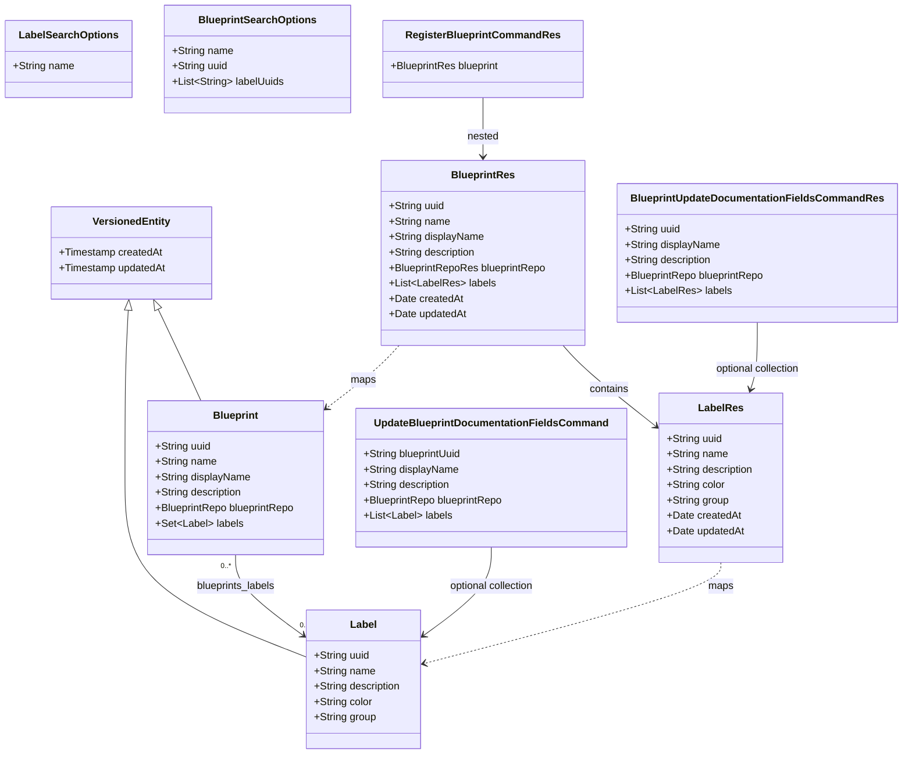

# Blueprint categorization labels (taxonomy catalog + assignments)

## Requirements

- Give Blueprint Editors a **label catalog** they can create, update, list, and delete, and let them **assign existing labels** to blueprints so the catalog can be categorized.
- Give Blueprint Users a way to **filter the blueprint list by one or more labels** (match any), composed with existing name search, using **exact label identity** (not substring).
- Keep **Git version tags** (`BlueprintVersion.tag`) unchanged; this feature is named **label** everywhere (tables, types, APIs, tests).
- Give catalog labels an optional lightweight **group** string (presentation and catalog metadata only), analog of custom-property `group` / `properties_group`. Grouping must not introduce a Group entity, uniqueness inside a group, exclusivity, or search/filter APIs by group.
- Scope is **odm-platform-pp-blueprint-server only**. Do not implement UI. Do not add new `blindata-agent` `/labels` paths (GET = `BLUEPRINTS_VIEWER`; POST/PUT/DELETE = `BLUEPRINTS_ADMIN`; `group` is an additive field on `LabelRes`). No seed labels. No deprecation. No concatenated tags column. Labels schema (including `label_group`) lives in **`V3__blueprint_labels.sql`** because **`V2__blueprint_type.sql`** was taken by the merged blueprint-type feature; do not add a later Flyway version only for `label_group`.

## Entities

Physical model (Flyway; schema `odm_blueprint`):

- Flyway files: `V1__init_schema_template.sql` (existing), `V2__blueprint_type.sql` (sibling feature: `blueprints.blueprint_type`), **`V3__blueprint_labels.sql`** (this feature: `labels` + `blueprints_labels`, including `label_group`). After merge with the blueprint-type branch, labels could not stay as V2.
- `labels`: `uuid` PK `varchar(36)`, `name` `varchar(255)`, `description` text, `color` `varchar(32)`, optional `label_group` `varchar(255)`, `created_at`, `updated_at`. **No unique index on `name`.** Column `label_group` maps to Java/JSON field `group` (avoid SQL reserved word `GROUP`; same rationale as custom properties `properties_group`). **No** `label_groups` table. **No** FK from labels to a group identity.
- `blueprints_labels`: **not an entity**. Columns `blueprint_uuid`, `label_uuid` only. **Composite PK** `(blueprint_uuid, label_uuid)`. Both FKs **ON DELETE CASCADE**. No `uuid`, no `created_at`. **No group column on the join** — group lives on the label.

## Approach

1. Label catalog (anemic CRUD):
   - New aggregate under `...label` mirroring `...blueprint`: entity, repository with nested `Specs`, MapStruct mapper, `GenericMappedAndFilteredCrudServiceImpl`, thin `LabelController`.
   - CRUD **is** the public catalog (no register use case). OpenAPI **documented** (not `@Hidden`).
   - Empty catalog is valid. No migration seed rows.
   - Optional catalog field **`group`** (column `label_group`): presentation/metadata only. Create/update/read/list return it. MapStruct maps the same-named field on `Label` / `LabelRes`. Because `BlueprintRes.labels` embeds `LabelRes`, blueprint get/search/register/update-documentation-fields return `group` automatically — no new blueprint endpoints.

2. Assignments on Blueprint:
   - `Blueprint` owns `@ManyToMany` `@JoinTable(name = "blueprints_labels")` `Set<Label> labels`. **Do not** map a join entity. **Do not** map an inverse `Set<Blueprint>` on `Label` (avoids deleting catalog labels when a blueprint is deleted and avoids loading all blueprints).
   - Cascade on the association: **do not** use `CascadeType.REMOVE` / `ALL` on `labels` (must not delete `Label` rows when a blueprint is deleted). Join rows follow DB CASCADE and Hibernate collection replace.
   - `BlueprintRes.labels` is `List<LabelRes>`. Reads return full catalog fields (including `group`). Writes require **uuid** per item; name/description/color/`group` on the nested object are ignored (catalog is source of truth).
   - Hidden POST/PUT on `BlueprintController` persist assignments because they already map `BlueprintRes` ↔ `Blueprint`.
   - Register maps nested `BlueprintRes` via `BlueprintMapper` — same path.
   - Update-documentation-fields **does not** use `BlueprintRes`; extend command + domain record + use case: **null labels = preserve**; **non-null (including empty) = replace**. Same omit/replace idea as nested repository.

3. Search:
   - Add `List<String> labelUuids` to `BlueprintSearchOptions`.
   - `BlueprintsRepository.Specs.hasAnyLabelUuid(Collection<String>)`: join `labels`, `uuid IN (...)`, `query.distinct(true)`. Empty/null collection → conjunction (no filter).
   - Combine with existing specs via `SpecsUtils.combineWithAnd`. `IN` is match-**any** (OR). Name filter still AND with the label spec.
   - Must actually apply the spec in `BlueprintServiceImpl.getSpecFromFilters` (unlike unused `uuid` on search options — do not leave this unwired).
   - **Do not** add `group` to `LabelSearchOptions`. Catalog search stays name `LIKE` only.
   - **Do not** add group-based blueprint search. `GET /blueprints` stays identity-based `labelUuids` only. Grouping does not change query meaning (still OR on selected identities; no exclusivity).
   - Document `group` as a valid **sort** property on label search, consistent with existing generic CRUD sort by entity fields (`name`, `color`, etc.). Sorting is not a filter. Do not invent a dedicated group-sort operation.

4. Validation and errors:
   - Reuse `BadRequestException`, `ResourceConflictException`, `NotFoundException`, `ResponseExceptionHandler`. **No new exception types.**
   - Label **name** required, max 255. **Trim then validate:** strip leading/trailing whitespace; whitespace-only → 400 required. Persist the trimmed string. **Simple characters including internal spaces** `^[A-Za-z0-9][A-Za-z0-9 _-]*$` → 400 on fail (`BadRequestException("Name may contain only simple characters (letters, digits, space, hyphen, underscore) and must start with a letter or digit")`). Blueprint `name` is not charset-restricted and is not trimmed; do not copy that.
   - Label **name** case-insensitive uniqueness via `existsByNameIgnoreCase` / `existsByNameIgnoreCaseAndUuidNot` in `beforeCreation` / `beforeOverwrite` → **409** `ResourceConflictException`, same message style as blueprints (`A label with name 'X' already exists`). **Global** — group is not part of the natural key; the same name in different groups is still 409.
   - Label **color** optional; if present must match `^#[0-9A-Fa-f]{6}$`, max 32 → 400 (`BadRequestException("Color must match #RRGGBB hex format")`).
   - Label **description** optional; no extra charset rule.
   - Label **group** optional. **Trim then validate:** strip leading/trailing whitespace; if the result has no text, **`setGroup(null)`** (whitespace-only is **not** a stored group — not a 400; not stored as `""` or `"   "`). If the trimmed value has text, length ≤ 255 → 400 when exceeded. Persist the **trimmed** string (`"  Status  "` → `Status`). **Free text** (internal spaces allowed, e.g. `Status`). **Do not** apply `LABEL_NAME_PATTERN` to group. Omit, null, and blank after trim are accepted. Do not require group. Distinct group strings are **exact trimmed strings** (no case-folding; `Status` vs `status` are two groups — custom-properties pattern). Group does **not** participate in name uniqueness.
   - Duplicate label uuid on one blueprint request → 400 (`BadRequestException("A blueprint cannot have the same label twice")`). Missing/blank nested uuid → 400 (`"Label uuid is required"`). Unknown label uuid on assignment → **400** (`"Unknown label uuid: " + uuid`), not 404 (payload is invalid; missing catalog GET remains 404).
   - CRUD POST/PUT: null `labels` on `BlueprintRes` → empty set (full resource; missing collection means no assignments).

5. Persistence / Flyway:
   - Create **`V3__blueprint_labels.sql`** beside `V1__init_schema_template.sql` and `V2__blueprint_type.sql`. Do **not** add a later version only for `label_group` — the column is on the same `labels` table created in V3. Labels originally targeted V2; after merge, V2 is `blueprint_type`, so labels moved to V3.
   - Flyway already targets `hibernate.default_schema`.
   - JPA `ddl-auto: validate` must match V3 (`labels.label_group`).

6. Out of this slice:
   - UI, seed data, deprecation column, concatenated-column `CONTAINS` on blueprints, join-table entity, DB unique on `labels.name`, version-level labels.
   - First-class Group entity / `label_groups` table / group CRUD / rename-one-place / group color or order entity.
   - Exclusive groups / “one label per group” on a blueprint; unique label names per group.
   - `LabelSearchOptions.group`, `GET /labels?group=`, or `GET /blueprints` filtered by group name.
   - New agent `/labels` paths. Agent GET `/labels` = `BLUEPRINTS_VIEWER` and POST/PUT/DELETE = `BLUEPRINTS_ADMIN` ship in the **same delivery** as the UI (documented in the UI analysis); grouping does not add routes.
   - A later Flyway version after V3 only to add `label_group` (the column is already on the V3 `labels` table).

## Structure

### Inheritance Relationships

1. `LabelService` interface extends `GenericMappedAndFilteredCrudService<LabelSearchOptions, LabelRes, Label, String>`.
2. `LabelServiceImpl` extends `GenericMappedAndFilteredCrudServiceImpl<...>` and implements `LabelService`.
3. `Label` and existing `Blueprint` extend `VersionedEntity`.
4. `LabelRes` extends `VersionedRes`.
5. `LabelsRepository.Specs` extends `SpecsUtils`.
6. `UpdateBlueprintDocumentationFields` still implements `UseCase`; command record gains optional `List<Label> labels`.
7. Existing `BlueprintApiException` hierarchy unchanged (`BadRequestException`, `NotFoundException`, `ResourceConflictException`).

### Dependencies

1. `LabelController` injects `LabelService`.
2. `LabelServiceImpl` depends on `LabelMapper` and `LabelsRepository`.
3. `BlueprintServiceImpl` depends on `BlueprintMapper`, `BlueprintsRepository`, and `LabelsRepository` (reconcile assignment uuids to managed `Label` instances).
4. `BlueprintMapper` uses `LabelMapper` (`@Mapper(..., uses = LabelMapper.class)`).
5. `BlueprintUseCasesService` maps documentation-fields `List<LabelRes>` → `List<Label>` (uuid stubs) via `LabelMapper` / same pattern as repo convert; register unchanged besides mapper nesting.
6. `UpdateBlueprintDocumentationFieldsPersistenceOutboundPortImpl` still calls `blueprintService.overwrite` so reconcile/validate of labels run in generic CRUD.
7. `ResponseExceptionHandler` already maps `BlueprintApiException` to `ErrorRes`.

### Layered Architecture

1. Controller layer: `LabelController` (catalog CRUD); existing `BlueprintController` / `BlueprintUseCaseController` stay thin.
2. Use-case layer: only **extend** update-documentation-fields (command, use case `execute`, use-cases service mapping). No new use case for assigning labels.
3. Core service layer: `LabelServiceImpl` catalog rules; `BlueprintServiceImpl` assignment validate/reconcile + search spec.
4. Repository layer: `LabelsRepository`; `BlueprintsRepository.Specs.hasAnyLabelUuid`.
5. Data access: Flyway `labels` + `blueprints_labels`; JPA many-to-many join table.
6. Exception handling layer: existing `ResponseExceptionHandler`.

## Operations

### Create Flyway migration - `V3__blueprint_labels.sql`

1. Responsibility: Create catalog and join tables in `src/main/resources/db/migration/postgresql/`, same style as `V1__init_schema_template.sql` (`create table if not exists`, `varchar(36)` ids, no business unique indexes). File is **`V3__blueprint_labels.sql`** because **`V2__blueprint_type.sql`** already exists (merged blueprint-type feature). Do **not** add `V4__*` (or any later version) only for grouping — `label_group` is a column on this V3 `labels` table.
2. `labels`: columns `uuid` PK, `name varchar(255)`, `description text`, `color varchar(32)`, optional `label_group varchar(255)`, `created_at timestamp`, `updated_at timestamp`.
3. `blueprints_labels`: `blueprint_uuid varchar(36) not null references blueprints(uuid) on delete cascade`, `label_uuid varchar(36) not null references labels(uuid) on delete cascade`, `primary key (blueprint_uuid, label_uuid)`. Unchanged by grouping — **no group column on the join**.
4. Constraints: no `uuid` or `created_at` on the join; no `UNIQUE(name)` on `labels`; no `label_groups` table; no unique constraint on `label_group`.
5. Schema only. Do **not** insert seed / default catalog rows. Empty catalog is valid; admins create labels through the API.

### Create entity - `Label`

1. Responsibility: JPA catalog entity.
2. Package: `org.opendatamesh.platform.pp.blueprint.label.entities`.
3. Attributes: `uuid` (`@Id`, `@GeneratedValue(UUID)`, column `uuid`), `name`, `description`, `color`, optional `group` mapped to column `label_group` (length 255); extend `VersionedEntity`. `@Table(name = "labels")`. JavaBean getters/setters including `getGroup` / `setGroup`.
4. Do **not** map `Set<Blueprint>` and do **not** create a join entity class.
5. Do **not** create a Group entity or `label_groups` mapping.

### Create repository - `LabelsRepository`

1. Responsibility: paging + specifications + uniqueness checks.
2. Extends `PagingAndSortingAndSpecificationExecutorRepository<Label, String>`.
3. Methods: `existsByNameIgnoreCase(String name)`, `existsByNameIgnoreCaseAndUuidNot(String name, String uuid)`.
4. Nested `Specs extends SpecsUtils`: `hasName(String name)` — case-insensitive substring `LIKE` (`%name%`, escape `_`/`%` via `escapeLikeParameter` / `LIKE_ESCAPE_CHAR`, same as `BlueprintVersionsShortRepository.Specs.matchSearch`), empty → conjunction. **Not** exact match (blueprint `hasName` stays exact; only the label catalog picker search is contains).
5. Do **not** add `hasGroup` or any group predicate. Catalog filtering stays name-only.

### Create REST types - `LabelRes`, `LabelSearchOptions`, `LabelMapper`

1. Package: `org.opendatamesh.platform.pp.blueprint.rest.v2.resources.label`.
2. `LabelRes` extends `VersionedRes`: `uuid`, `name`, `description`, `color`, optional `group` with `@Schema`. `@Schema(name = "labels")`. Schema text for `name`: trimmed on write; letters, digits, space, hyphen, and underscore; must start with a letter or digit. Schema text for `group`: optional catalog group (free text; presentation metadata; not a filter key). Values are trimmed on write; whitespace-only is stored as no group (`null`). Distinct groups are exact trimmed strings.
3. `LabelSearchOptions`: `name` with `@Parameter` text “Filter labels by name. Case-insensitive substring match (LIKE).” **Do not add a `group` field** (no search-by-group).
4. `LabelMapper`: `@Mapper(componentModel = "spring")`, `toRes` / `toEntity` (same-named `group` maps automatically).

### Implement service - `LabelService` / `LabelServiceImpl`

1. Interface in `...label.services.core` extending `GenericMappedAndFilteredCrudService<LabelSearchOptions, LabelRes, Label, String>`.
2. Implementation `@Service`, constructor-inject mapper + repository (same as `BlueprintServiceImpl`).
3. `getSpecFromFilters`: AND-combine `hasName` when name has text. Do **not** add a group predicate. `LabelSearchOptions` has no `group` field.
4. `toRes` / `toEntity` delegate to `LabelMapper`.
5. `validate(Label)`:
   - null → `BadRequestException("Label cannot be null")`.
   - name: if not null, **trim** and `setName(trimmed)`. Then required (`validateRequired`). Whitespace-only after trim → 400 required.
   - name length ≤ 255 on the trimmed value.
   - name must match `^[A-Za-z0-9][A-Za-z0-9 _-]*$` else `BadRequestException("Name may contain only simple characters (letters, digits, space, hyphen, underscore) and must start with a letter or digit")`. Internal spaces allowed. Leading/trailing spaces are not stored.
   - color: if has text, length ≤ 32 and must match `^#[0-9A-Fa-f]{6}$` else `BadRequestException("Color must match #RRGGBB hex format")`.
   - group: optional. If `group != null`, **trim**. If no text after trim, **`objectToValidate.setGroup(null)`** and do not throw required. If text remains, `validateLength("Group", group, 255)` else 400 (`"{field} cannot exceed {max} characters"`), then `setGroup(trimmed)`. Do **not** apply the name character pattern. Internal spaces allowed. Do not uniqueness-check group. Distinct stored values are exact trimmed strings (no case-folding).
6. `reconcile`: no-op (no nested refs).
7. `beforeCreation` / `beforeOverwrite`: uniqueness excluding self on overwrite; duplicate → `ResourceConflictException("A label with name '" + name + "' already exists")`. Uniqueness is **name only** (case-insensitive). Do **not** scope uniqueness by group. Same name with different groups is still 409.
8. Override `overwriteResource` to set resource uuid from path like `BlueprintServiceImpl`.
9. `findOne` missing id: existing generic `NotFoundException("Resource with id=" + identifier + " not found")`.

### Create controller - `LabelController`

1. Package: `...rest.v2.controllers`.
2. `@RequestMapping("/api/v2/pp/blueprint/labels")`, `produces = APPLICATION_JSON_VALUE`.
3. `@Tag(name = "Labels", description = "Endpoints for managing blueprint categorization labels")`.
4. Inject `LabelService`.
5. Endpoints (all **documented**, not `@Hidden`):
   - `POST` → 201 `createResource`
   - `GET /{uuid}` → 200 / 404 `findOneResource`
   - `GET` search: `LabelSearchOptions` + `@PageableDefault(page = 0, size = 20, sort = "createdAt", direction = DESC)`; valid sort properties uuid, name, description, color, **group**, createdAt, updatedAt — document like `BlueprintController.searchBlueprints`. Include `group` because generic CRUD already sorts by entity fields; this is **not** a group filter. Do **not** add `LabelSearchOptions.group`.
   - `PUT /{uuid}` → 200 `overwriteResource`
   - `DELETE /{uuid}` → 204 `delete`
6. OpenAPI `@Operation` / `@ApiResponses` including 400, 404, 409 (create/update), 500.

### Update entity - `Blueprint`

1. Add `Set<Label> labels` with `@ManyToMany`, `@JoinTable(name = "blueprints_labels", joinColumns = @JoinColumn(name = "blueprint_uuid"), inverseJoinColumns = @JoinColumn(name = "label_uuid"))`.
2. Use `HashSet`; initialize empty.
3. Fetch: `@Fetch(FetchMode.SELECT)` consistent with `blueprintRepo`. No `CascadeType.REMOVE`/`ALL` on labels.
4. Getters/setters.

### Update resources - `BlueprintRes`, `BlueprintSearchOptions`, `BlueprintMapper`

1. `BlueprintRes`: `List<LabelRes> labels` with `@Schema` describing catalog labels; on write only uuid is used.
2. `BlueprintSearchOptions`: `List<String> labelUuids` with `@Parameter(description = "Filter blueprints that have any of these label UUIDs (match any).")`. Repeat the query parameter for multiple values (Spring binds the list; `encodeQueryData` / clients send `labelUuids=a&labelUuids=b`).
3. `BlueprintMapper`: `uses = LabelMapper.class` so the collection maps both ways.

### Update service - `BlueprintServiceImpl` + `BlueprintsRepository`

1. Inject `LabelsRepository`.
2. `validate`: after existing field checks, `validateLabels(blueprint)`:
   - null collection → skip (reconcile will normalize).
   - any label null or blank uuid → 400.
   - duplicate uuids in the collection (case-sensitive uuid string) → `BadRequestException("A blueprint cannot have the same label twice")`.
3. `reconcile`: existing repo reconcile; then `reconcileLabels`:
   - if `labels == null`, set empty `HashSet`.
   - else replace with a new `HashSet` of **managed** labels: for each uuid, `labelsRepository.findById(uuid).orElseThrow(() -> new BadRequestException("Unknown label uuid: " + uuid))`.
4. `getSpecFromFilters`: if `labelUuids` not empty, add `Specs.hasAnyLabelUuid`.
5. `BlueprintsRepository.Specs.hasAnyLabelUuid(Collection<String> labelUuids)`:
   - null/empty → conjunction.
   - else join attribute `labels`, `query.distinct(true)` when query non-null, predicate `join.get(Label_.uuid).in(labelUuids)`.

### Update use case - documentation fields

1. `BlueprintUpdateDocumentationFieldsCommandRes`: add `List<LabelRes> labels` (optional). Jackson missing field = null = omit.
2. `UpdateBlueprintDocumentationFieldsCommand`: add `List<Label> labels` (nullable).
3. `BlueprintUseCasesService.updateBlueprintDocumentationFields`: if `command.getLabels() != null`, map each `LabelRes` to `Label` via `LabelMapper.toEntity` (uuid stubs); pass list to domain command; if null, pass null.
4. `UpdateBlueprintDocumentationFields.execute`: after displayName/description (and repo if present), `if (command.labels() != null) { blueprint.setLabels(new HashSet<>(command.labels())); }` — empty list clears assignments. Null does not call setter (preserve; collection still lazy-loaded on later map to res).
5. Persistence still `blueprintService.overwrite` so `validate` + `reconcileLabels` run.
6. Structural validation port does not need label charset rules (those live on `LabelService`); assignment duplicates/unknown ids are enforced in `BlueprintServiceImpl` during overwrite.
7. Register: no use-case code change if `BlueprintMapper` maps nested labels; create path reconcile loads managed labels.

### Update tests - `RoutesV2` and ITs

1. `RoutesV2.LABELS("/api/v2/pp/blueprint/labels")`.
2. New `LabelControllerIT` extends `BlueprintApplicationIT`, same style as `BlueprintControllerIT` (comment tracing scenarios):
   - create 201; get 200; search (name filter is case-insensitive substring `LIKE`; `tes` matches `Test`); update 200; delete 204 then get 404
   - duplicate name 409
   - illegal name characters 400 (e.g. `illegal/name`; a space in the name is **not** illegal)
   - name with internal spaces 201 (e.g. `Source aligned`)
   - padded name (`"  Name  "`) round-trips as trimmed `Name`
   - whitespace-only name (`"   "`) 400
   - invalid color 400
   - missing name 400
   - get unknown uuid 404
   - create/update/read **round-trip `group`** (e.g. `Status`) on 201/200 and subsequent GET
   - omit, null, and blank `group` accepted on create (201); GET shows no group value (null/empty) — not a 400
   - whitespace-only `group` (`"   "`) accepted on create (201); GET shows no group value (trimmed away) — not a 400 and **not** stored as spaces
   - padded group (`"  Status  "`) round-trips as `Status`
   - two labels with groups `Status` and `status` both succeed (exact strings; not folded)
   - duplicate name still 409 when the two payloads use **different groups**
   - group with spaces allowed (e.g. `Release Status`); group is **not** rejected by the name character pattern
   - group of **255** characters after trim accepted (including padded input that trims to 255)
   - group longer than 255 after trim → 400
   - **Do not** add ITs for search-by-group (`?group=`) or blueprint filter-by-group (those APIs must not exist)
3. Extend `BlueprintControllerIT`:
   - create blueprint with existing labels; GET returns label name/color and nested `group` (catalog fields, including group, appear because `BlueprintRes.labels` embeds `LabelRes`)
   - PUT replace assignment set
   - POST with unknown label uuid 400
   - POST with duplicate label uuid 400
   - search `labelUuids` match-any: two blueprints, two labels; filter one label returns only assigned; filter both uuids returns union; compose with `name`
   - unlabeled blueprint still returned when no label filter
   - existing `labelUuids` search **unchanged** by grouping (still identity OR; do not add a group query parameter on blueprints)
4. Extend `BlueprintUseCaseControllerIT`:
   - register with labels 201 and GET shows them (including nested `group` when set on the catalog label)
   - update-documentation-fields **omit** labels → assignments unchanged
   - update-documentation-fields **present** list → replaced
   - update-documentation-fields **empty** list → all assignments cleared
5. Cleanup created labels and blueprints in tests (delete blueprint then label, or either order thanks to CASCADE).

### Do not create - GlobalExceptionHandler / new exception classes

1. Use existing `ResponseExceptionHandler` and `ErrorRes`.
2. Do not add `deprecated` on `labels`.
3. Do not add fields or filters on `BlueprintVersion` / `BlueprintVersionSearchOptions.tag`.
4. Do not add `LabelSearchOptions.group` or a group spec on `LabelsRepository`.
5. Do not add group-based fields on `BlueprintSearchOptions`.
6. Do not create a Group entity, `label_groups` table, or group column on `blueprints_labels`.
7. Do not add a later Flyway version after `V3__blueprint_labels.sql` only for `label_group` (the column is already on that table). Do not revive `V2__blueprint_labels.sql` — V2 is `V2__blueprint_type.sql`.

## Norms

1. Annotation standards: `@RestController`, `@RequestMapping`, `@Service`, `@Component` (factories only), JPA `@Entity`/`@Table`/`@Column`, OpenAPI `@Tag`/`@Operation`/`@Schema`/`@Parameter` as on `BlueprintController`. Label catalog endpoints are **not** `@Hidden`. Blueprint POST/PUT/DELETE stay `@Hidden`.
2. Dependency injection: constructor injection on services (as `BlueprintServiceImpl`); `@Autowired` field injection on controllers matching `BlueprintController`.
3. Exception handling: throw existing `BlueprintApiException` subtypes only. `ResponseExceptionHandler` maps them to `ErrorRes` (`status`, `error` = simple class name, `message`, `path`). Duplicate **label name** → `ResourceConflictException` (409). Field/charset/unknown assignment uuid/duplicate assignment → `BadRequestException` (400). Missing label or blueprint by path id → `NotFoundException` (404).
4. Data validation: required + length in `validate()`; uniqueness in `beforeCreation`/`beforeOverwrite`; association loading in `reconcile()`. Mirror `BlueprintServiceImpl` helpers (`validateRequired`, `validateLength`). Label name charset (including internal spaces) and color format are additional `validate()` checks, not a new validator framework. Name is **trim then** required/length/pattern (max 255 on trimmed value); whitespace-only name is 400. Group is optional: **trim then** length-only (max 255 on trimmed value); **not** name-pattern; **not** part of uniqueness; whitespace-only becomes no group.
5. Filtering: repository nested `Specs` + `SpecsUtils.combineWithAnd`. Label filter on blueprints is one spec using `IN` (OR). Label catalog `hasName` is escaped case-insensitive `LIKE`. Do not invent a second search stack. Do **not** add `LabelSearchOptions.group` or a group spec. Generic entity-field **sort** may include `group`; that is not a filter.
6. Use cases: follow `spdd/norms/USE_CASE_IMPLEMENTATION.md` — REST `*Res` stay out of `...services.usecases.*`; domain command record only; documentation-fields factory remains the only `@Component` in that package; port impls stay plain classes. Extend the existing use case; do not add a new “assign labels” use case.
7. Generic CRUD: follow `spdd/norms/GENERIC-CRUD-GUIDELINES.md` — `LabelServiceImpl` implements `getRepository`, `validate`, `reconcile`, `getSpecFromFilters`, `toRes`, `toEntity`. Reads go through `*Resource` methods so lazy `labels` map inside `TransactionHandler`.
8. Logging: rely on existing handler logging; no new logging standard.
9. Tests: `*ControllerIT` under `src/test/java/...rest/v2/controllers`, extend `BlueprintApplicationIT`, `TestRestTemplate`, `RoutesV2`.
10. Naming: `label`/`labels`/`labelUuids`/`Label`/`LabelRes`/`blueprints_labels`. Java/JSON field `group`; SQL column `label_group`. Never `tag`/`tags` for this feature. Never a type or table named `LabelGroup` / `label_groups`.

Norm files read for this prompt: `spdd/norms/README.md`, `spdd/norms/GENERIC-CRUD-GUIDELINES.md`, `spdd/norms/USE_CASE_IMPLEMENTATION.md`.

## Safeguards

1. Functional constraints:
   - Labels exist only at **blueprint** catalog level, not versions.
   - Assignments reference **existing** labels only (define-first via label CRUD).
   - Delete label **cascades** join rows; blueprints remain.
   - Delete blueprint **cascades** join rows; labels remain.
   - No seed labels; empty catalog and unlabeled blueprints are valid.
   - Multi-label blueprint search is match-**any**; unlabeled rows are not excluded unless a label filter is set.
   - Label catalog `GET` `name` filter is case-insensitive substring `LIKE` (escaped), not exact match. **No** `group` search option.
   - Blueprint list filter stays `labelUuids` match-any (OR). **No** filter-by-group. Grouping does not change query meaning and does not imply exclusivity.
   - Documentation-fields: omit labels preserves; present (including `[]`) replaces.
   - Hidden blueprint PUT: null labels collection becomes empty (full overwrite).
   - Catalog `group` is optional presentation metadata; omit/null/blank after trim is valid; whitespace-only is trimmed to **`null`** (no group); UI **"Other"** is not stored by this API. Distinct groups are exact trimmed strings (custom-properties pattern).
2. Performance constraints: blueprint list mapping runs inside existing `TransactionHandler`; use `SELECT` fetch and `distinct` when joining labels for filter. No extra usage-count table.
3. Security constraints: no auth in this service. Do not implement agent handlers here and do not add new `/labels` paths. Additive `group` on `LabelRes` only. Do not log secrets.
4. Integration constraints: do not change git-utils, registry, or UI. Do not alter `BlueprintVersion.tag` semantics or `BlueprintVersionSearchOptions.tag`.
5. Business rule constraints:
   - Label name unique case-insensitively (409), **global** — group is not part of the key; same name in different groups is still 409.
   - Label name simple characters **including internal spaces** (`^[A-Za-z0-9][A-Za-z0-9 _-]*$`); **trim then validate**; whitespace-only name is 400. Color `#RRGGBB` when set (400).
   - Label group optional free text max 255 **after trim**; not name-pattern; not required; not unique. Trim on write; whitespace-only is stored as `null`. Distinct groups are exact trimmed strings (no case-folding).
   - No exclusivity inside a group; any combination of labels may be assigned.
   - One association per (blueprint, label) pair (composite PK + 400 on duplicate ids in payload).
6. Exception handling constraints: existing handler and exception types only; messages must not expose stack traces or SQL.
7. Technical constraints:
   - No join entity; no join `uuid`/`created_at`.
   - No Flyway `UNIQUE` on `labels.name`.
   - No `deprecated` column.
   - No concatenated/JSON labels column on `blueprints`.
   - No `CascadeType.REMOVE` from `Blueprint` to `Label`.
   - JPA schema must validate against Flyway.
   - Column `label_group` / field `group`. Created in **`V3__blueprint_labels.sql`**. `V2__blueprint_type.sql` is the sibling blueprint-type migration. Do **not** add a later version only for `label_group`.
   - No `label_groups` table; no Group entity; no group FK.
   - Do not add `group` to `LabelSearchOptions`. Sort by `group` only via existing generic entity-field sort (document it with the other sort properties).
8. Data constraints: ids `varchar(36)`; name/color/group lengths as columns; color optional; group optional (trimmed; empty after trim stored as `null`).
9. API constraints:
   - Catalog base path `/api/v2/pp/blueprint/labels`.
   - Blueprint get/search remain `/api/v2/pp/blueprint/blueprints`; responses include `labels` on `BlueprintRes` (nested `group` included).
   - Search filter query param `labelUuids` (repeatable). No group query param on labels or blueprints.
   - Product language **label**, never tag, in OpenAPI names and descriptions for this feature.
10. Out of scope: create-on-apply, RESTRICT delete, deprecation, seed data, concatenated `CONTAINS` on blueprints, join entity, first-class groups, exclusivity, per-group name uniqueness, search-by-group, filter-by-group, new agent routes, a later Flyway version after V3 only for `label_group`. UI grouping presentation is the companion UI SPDD (not generated from this server prompt). Agent `/labels` handlers are the same-delivery companions (not generated from this server prompt).
