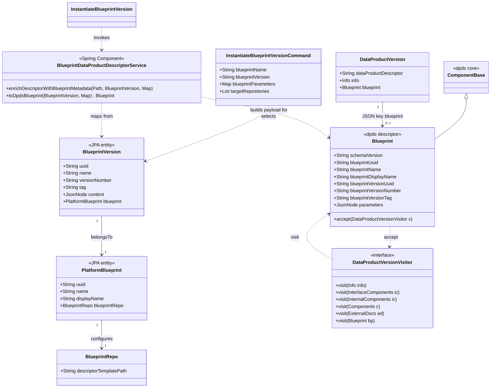

# Blueprint lineage in the data product descriptor (parser, blueprint server, builder UI)

## Requirements

- Implement end-to-end **blueprint provenance** so every data product instantiated from a blueprint carries a **canonical lineage record inside its root data product descriptor**, identifying the **`BlueprintVersion` entity** (natural keys + `uuid`) and the **resolved parameter map** used at instantiation time.
- Ensure **JSON and YAML** descriptor files are supported end-to-end using the **shared descriptor parser model** (parse → mutate → serialize) without ad hoc string patching of the document.
- Restrict descriptor enrichment to the **single root** repository layout: **one** data product descriptor path per instantiation; **no** lineage writes to non-root targets.
- Evolve the **specification model in code only** across `odm-specification-dpdescriptor-parser`, `odm-platform-pp-blueprint-server`, and `blindata-ui`; **exclude** updates to public specification documents on the website.
- Deliver **blindata-ui** parity: extend **`descriptorSdk`** for the new lineage shape and show a **read-only** lineage reference on the **builder home** with a link to the blueprint **detail** view for the **same agent and ODM config** only, optionally pre-selecting the published version via query or router state.
- Preserve **backward compatibility** for descriptors without a **`blueprint`** block and for existing instantiation flows outside this feature’s scope (non-monorepo / composition remains unsupported as today).
- Keep **visitor contracts aligned** across **Java parser**, **`ParserImpl` / ref visitors**, and **TypeScript `descriptorSdk`** (visitor interface, extension visitor, `DataProductDescriptorParserImpl`, and every **`DataProductVersionVisitor` implementer**) so extension handling and future walks include **`blueprint`** / `Blueprint` consistently.

## Entities

## Approach

1. **Specification model (parser)**:
   - Introduce a **typed** `Blueprint` class under `org.opendatamesh.dpds.model` (e.g. subpackage `blueprint`) that **`extends ComponentBase`** so unknown/extension keys round-trip like other DPDS components.
   - Add a **nullable** field on `DataProductVersion` mapped to the **JSON root key `blueprint`** exactly (use `@JsonProperty("blueprint")` on the Java field if the Java identifier differs, or name the field `blueprint` if acceptable). Use the **same key** in TypeScript `fromRaw` / `toRaw` known-key lists.
   - Keep `Parser` / `ParserImpl` contract unchanged at the interface level; extend the object graph only. Align `ObjectMapper` settings with existing `ParserFactory` (`NON_EMPTY` inclusion) so an absent `blueprint` omits cleanly.
   - **Align visitors (Java)**: extend `DataProductVersionVisitor` with `visit(Blueprint)`; implement on `DataProductVersionExtensionVisitorImpl` and `DataProductVersionRefVisitor`; add `accept(DataProductVersionVisitor)` on DPDS `Blueprint`; invoke `getblueprint().accept(visitor)` from `ParserImpl` in deserialize/serialize when extensions are active (same ordering as other root walks).
   - Add unit tests that deserialize known JSON/YAML fragments containing a `blueprint` object, assert field binding, serialize, and compare structure (golden or normalized JSON).
2. **Blueprint server**:
   - Add Maven dependency on **`odm-specification-dpdescriptor-parser`** (version property) using the existing GitHub Packages repository id; align Jackson with Spring Boot BOM where practical.
   - Implement **`BlueprintDataProductDescriptorService`** (`@Component`): resolves the **rendered** descriptor path from `BlueprintRepo.descriptorTemplatePath` (strip `.vm` suffix, normalize slashes), detects **JSON vs YAML** from extension or content probe, parses file to `JsonNode` then `ParserFactory.getParser(alignedMapper).deserialize`, sets the **`blueprint`** subtree (`org.opendatamesh.dpds.model.blueprint.Blueprint`) via static **`toDpdsBlueprint`**, `serialize`, writes bytes back with **same format** as input. If `descriptorTemplatePath` is blank, **skip** enrichment (info log, no throw).
   - Invoke enrichment **only** for the **root** target path after `InstantiateBlueprintVersionTemplatingOutboundPortImpl.renderAndCopy` completes and **before** `InstantiateBlueprintVersionGitOutboundPort.commitAndPush` for that path; leave other targets untouched.
   - On missing file, invalid descriptor, or parse failure: **fail instantiation** with `InternalException` / existing domain exception style so the callback chain surfaces a controlled error (consistent with `ResponseExceptionHandler`).
3. **Blindata-ui**:
   - Extend `descriptorSdk/model/DataProductVersion.ts` `fromRaw` / `toRaw` known-key lists with the root key **`blueprint`** (same as Java `@JsonProperty`); add a **`Blueprint`** class (mirror of parser `Blueprint extends ComponentBase`) under e.g. `descriptorSdk/model/blueprint/Blueprint.ts` with `fromRaw` / `toRaw`, reusing `ComponentBase` patterns from the SDK.
   - **Align visitors (TypeScript)**: extend `DataProductVersionVisitor` with `visit(blueprint: Blueprint)`; update `DataProductVersionExtensionVisitorImpl` (union overload + `visitBlueprint`); update `DataProductDescriptorParserImpl` to call `dataProductVersion.blueprint?.accept(visitor)` when extensions are registered (mirror `ParserImpl`); add `accept` on TS `Blueprint`.
   - Update every other **`DataProductVersionVisitor` implementation** in the repo (e.g. `PortsAdapterDpdsToInternalModelVisitorImpl`, `InfoAdapterDpdsToInternalModelVisitorImpl`, `DevopsAdapterDpdsToInternalModelVisitorImpl`) with a `visit(blueprint)` method — **no-op** unless that vertical intentionally maps provenance into its internal model.
   - Add `descriptorSdk/tests` coverage mirroring parser fixtures.
   - Add a small **read-only** presentational component on **builder home** (e.g. card or inline row near `BuilderHomeDescriptorPreview` or header grid) reading **`blueprint`** from the already-parsed descriptor in Redux; **hide** cleanly when **`blueprint`** is absent.
   - Build navigation URL with **`useBlueprintsNavigation().buildUrl('detail/' + blueprintUuid)`** and append **`?versionUuid=`** (or pass `history.location.state`) so blueprint detail can pre-select version; implement minimal read of that param in `BlueprintsDetailPageContent` (or equivalent) if not already present. Use **`react-router`** vs **`react-router-dom`** imports consistently with each subtree.
4. **Cross-cutting**:
   - Document canonical JSON field list in one place (ticket or README snippet) for triple-repo reviews.
   - **Do not** use legacy `BlueprintDataProductAdditionalProperties` private keys.
   - Treat **visitor interface + `ParserImpl` / `DataProductDescriptorParserImpl` walk order** as part of the public contract of the descriptor stack: parser and UI changes ship together.

## Structure

### Inheritance relationships

1. `Parser` interface defines deserialize/serialize for `DataProductVersion`.
2. `ParserImpl` implements `Parser` and remains the single orchestration point for extension handlers.
3. Parser `Blueprint` **`extends ComponentBase`** and is referenced from `DataProductVersion` under the JSON property **`blueprint`** (Jackson mapping).
4. **`DataProductVersionVisitor`** (Java and TS) gains **`visit(Blueprint)`** / **`visit(blueprint: Blueprint)`**; DPDS **`Blueprint.accept`** dispatches to that visitor; **`ParserImpl`** and **`DataProductDescriptorParserImpl`** invoke the walk when `blueprint` is non-null and extension pipelines are active.
5. Domain exceptions used by instantiation (`InternalException`, `BadRequestException`, etc.) integrate with existing `@ControllerAdvice` handling.

### Dependencies

1. `InstantiateBlueprintVersion` orchestrates persistency, manifest, templating, Git ports; **`BlueprintDataProductDescriptorService`** depends on `Parser`, `ObjectMapper` (YAML + JSON), and path utilities — **not** on web layer.
2. `InstantiateBlueprintVersionFactory` is a Spring `@Component`; constructor-injects **`BlueprintDataProductDescriptorService`** and passes it into `InstantiateBlueprintVersion`.
3. `InstantiateBlueprintVersionTemplatingOutboundPortImpl` remains unchanged in behavior; enrichment runs **after** it in the use case.
4. blindata-ui: **`InfoAdapterDpdsToInternalModelVisitorImpl`** maps DPDS `Blueprint` → **`InfoEditorBlueprint`** on `InfoEditorModel`; **`OdmDataProductBuilderGeneralInfo`** mounts **`BuilderHomeBlueprintLineage`** when `internalModel.blueprint` is set; **all** `DataProductVersionVisitor` implementers compile against the extended interface.

### Layered architecture (blueprint-server)

1. **REST layer**: unchanged instantiate endpoint contract; errors bubble to `ResponseExceptionHandler`.
2. **Use case layer**: `InstantiateBlueprintVersion` gains orchestration step for root descriptor enrichment.
3. **Domain / infrastructure helper**: file I/O + parser calls colocated in `...instantiate` package or `...descriptor` subpackage.
4. **Exception handling layer**: existing `ResponseExceptionHandler` (`@ControllerAdvice`) maps failures to API responses; enricher throws typed runtime exceptions already handled or extend handler if a new narrow type is introduced.

## Operations

### Create model class — `Blueprint` (parser repo, `extends ComponentBase`)

1. **Responsibility**: Hold stable JSON for blueprint provenance embedded in the descriptor root under the key **`blueprint`**.
2. **Inheritance**: `public class Blueprint extends ComponentBase` (package e.g. `org.opendatamesh.dpds.model.blueprint`) so extension properties behave consistently with other DPDS components.
3. **Attributes** (first-class fields; keep cross-repo parity with TS mirror):
  - `schemaVersion`: `String` — optional version of the lineage sub-schema (e.g. `"1"`).
  - `blueprintUuid`: `String` — parent platform `Blueprint` / JPA `uuid`.
  - `blueprintName`: `String` — parent `name` (natural key).
  - `blueprintDisplayName`: `String` — parent `displayName` (human-readable label for UI).
  - `blueprintVersionUuid`: `String` — `BlueprintVersion.uuid`.
  - `blueprintVersionNumber`: `String` — `BlueprintVersion.versionNumber`.
  - `blueprintVersionTag`: `String` — nullable `BlueprintVersion.tag`.
  - `parameters`: `JsonNode` — object node mirroring resolved Velocity parameters (same keys/values as merged map).
4. **Methods**:
   - Standard getters/setters; **`public void accept(DataProductVersionVisitor visitor) { visitor.visit(this); }`** on DPDS `Blueprint` (same pattern as `Info.accept`).
   - **`static org.opendatamesh.dpds.model.blueprint.Blueprint toDpdsBlueprint(BlueprintVersion, Map<String, JsonNode>)`** on **`BlueprintDataProductDescriptorService`** (blueprint-server) maps JPA entity → DPDS `Blueprint` without coupling parser to Spring — **parser stays free of JPA types**.
5. **Constraints**: Never persist secrets not already present in manifest defaults; if redaction policy is added later, keep field boundaries stable.

### Extend entity — `DataProductVersion` (parser repo)

1. **Responsibility**: Root descriptor object includes optional blueprint provenance under **`blueprint`**.
2. **Attributes**: e.g. `@JsonProperty("blueprint") private Blueprint blueprint;` (or equivalent JavaBean name with explicit `@JsonProperty("blueprint")`).
3. **Methods**: getters/setters only.
4. **Logic**: Visitor alignment is **mandatory** (see following section); do not rely on `ComponentBase` alone for extension moves off `Blueprint`.
5. **Tests**: Add fixture with JSON/YAML including top-level **`blueprint`**, round-trip `Parser.deserialize` → `serialize`.

### Align visitors — parser (`odm-specification-dpdescriptor-parser`)

1. **`DataProductVersionVisitor`**: Add `void visit(org.opendatamesh.dpds.model.blueprint.Blueprint blueprint)` (import or FQCN as needed to disambiguate from other `Blueprint` types in downstream repos).
2. **`DataProductVersionExtensionVisitorImpl`**: Implement `visit(Blueprint blueprint)` calling `extensionHandler.handleComponentBaseExtension(blueprint, Blueprint.class)` (mirror `visit(ExternalDocs)` depth; recurse only if `Blueprint` later gains navigable children).
3. **`DataProductVersionRefVisitor`**: Implement `visit(Blueprint blueprint)` calling `referenceFileHandler.handleComponentBaseReference(blueprint)`.
4. **`ParserImpl`**: In `deserialize` and `serialize`, after `extensionHandler.handleComponentBaseExtension(dataProductVersion, DataProductVersion.class)`, if `dataProductVersion.getblueprint() != null`, call **`dataProductVersion.getblueprint().accept(visitor)`** (same guard block as existing child walks).
5. **Regression**: Run existing parser tests; add a test with registered `ComponentBaseExtendedConverter` proving `Blueprint` receives extension handling when present under `blueprint`.

### Align visitors — `descriptorSdk` + editor adapters (`blindata-ui`)

1. **`DataProductVersionVisitor.ts`**: Add `visit(blueprint: Blueprint): void` to the interface.
2. **`Blueprint.ts` (SDK)**: Add `accept(visitor: DataProductVersionVisitor): void { visitor.visit(this); }`.
3. **`DataProductVersionExtensionVisitorImpl.ts`**: Extend the combined `visit(...)` overload union to include `Blueprint`; implement `private visitBlueprint(blueprint: Blueprint)` calling `this.extensionHandler.handleComponentBaseExtension(blueprint, Blueprint)` (use the `Blueprint` **class** reference consistent with `ExtensionHandler` APIs).
4. **`DataProductDescriptorParserImpl.ts`**: After `handleComponentBaseExtension` on the root, if `dataProductVersion.blueprint` is defined, call **`dataProductVersion.blueprint.accept(visitor)`** in both `deserialize` and `serialize` when converters are registered (mirror `ParserImpl`).
5. **Editor adapters** implementing `DataProductVersionVisitor` (`PortsAdapterDpdsToInternalModelVisitorImpl`, `InfoAdapterDpdsToInternalModelVisitorImpl`, `DevopsAdapterDpdsToInternalModelVisitorImpl`): add **`visit(blueprint: Blueprint): void`** — default **empty / no-op** unless that slice intentionally surfaces provenance in its internal model.
6. **Compile / tests**: `tsc`/CI must pass with no unimplemented interface members; extend `descriptorSdk` tests if visitor behavior is asserted.

### Add Maven dependency — `odm-platform-pp-blueprint-server/pom.xml`

1. **Responsibility**: Consume new parser artifact version.
2. **Logic** (implemented):
  - Property `<odm.dpds.parser.version>2.4.0</odm.dpds.parser.version>`.
  - Dependency `org.opendatamesh:odm-specification-dpdescriptor-parser` at `${odm.dpds.parser.version}`.
  - GitHub Packages repository `odm-spec-parser-repo` for `opendatamesh-initiative/odm-specification-dpdescriptor-parser` remains configured.
3. **Constraints**: Run `mvn -q dependency:tree` locally to confirm no duplicate Jackson conflicts; if conflicts appear, exclude narrow transitive Jackson from parser or align parser POM in parser repo.

### Implement component — `BlueprintDataProductDescriptorService` (blueprint-server)

1. **Responsibility**: Mutate on-disk root descriptor after templating; embed DPDS `blueprint` provenance (distinct from platform JPA `Blueprint` entity — see class Javadoc).
2. **Package**: `org.opendatamesh.platform.pp.blueprint.blueprintversion.services.usecases.instantiate`.
3. **Annotations**: `@Component`.
4. **Methods**:
  - `void enrichDescriptorWithBlueprintMetadata(Path rootTargetPath, BlueprintVersion blueprintVersion, Map<String, JsonNode> resolvedParameters)`
  - `static org.opendatamesh.dpds.model.blueprint.Blueprint toDpdsBlueprint(BlueprintVersion blueprintVersion, Map<String, JsonNode> resolvedParameters)` — sets `schemaVersion` to `"1"`, maps platform blueprint uuid/name/displayName, version uuid/number/tag, and builds `parameters` object node (skips null parameter values).
  - **Logic** (`enrichDescriptorWithBlueprintMetadata`):
    - If `descriptorTemplatePath` is empty/null → **return** (info log; no lineage write).
    - Normalize template path (`renderedDescriptorRelativePath`): backslashes → `/`, strip leading `/`, strip `.vm` suffix; if blank after normalize → throw `InternalException`.
    - Resolve `Path descriptorFile = rootTargetPath.resolve(relative)`; if `!Files.isRegularFile(descriptorFile)` → throw `InternalException` (`Expected rendered data product descriptor at '%s' after templating; file missing`).
    - Read bytes; **`detectFormat`**: extension `.json` / `.yaml` / `.yml`, else UTF-8 probe for `{`, `[`, or `---`; otherwise throw `InternalException` with format hint message.
    - Use dedicated static `ObjectMapper` instances (`JSON_DPDS`, `YAML_DPDS`) with `JsonInclude.NON_EMPTY`; YAML disables `WRITE_DOC_START_MARKER`.
    - `Parser parser = ParserFactory.getParser(rootMapper)`; `deserialize` / `serialize` via private helpers; set `dpv.setblueprint(toDpdsBlueprint(...))`.
    - Write back: JSON uses pretty printer; YAML writes via `convertValue(serialized, Object.class)`.
  - **Edge**: I/O and parser failures wrap `InternalException` with cause and path in message.
5. **Dependency injection**: Spring bean; `InstantiateBlueprintVersionFactory` constructor-injects and passes into use case.

### Modify use case — `InstantiateBlueprintVersion`

1. **Responsibility**: Call descriptor service between templating and Git push for **root** target only.
2. **Methods**: `execute()` — parse manifest early; build `Map<String, JsonNode> resolvedParameters = mergeParametersForLineage(manifest, command.blueprintParameters())` (manifest parameter keys: request value if non-null, else manifest default); after `templatingPort.renderAndCopy(...)`, `Path rootTargetPath = resolveRootTargetPath(...)` (the sole phase-1 target / first mapped `targetId`, else `InternalException`), then `blueprintDataProductDescriptorService.enrichDescriptorWithBlueprintMetadata(rootTargetPath, blueprintVersion, resolvedParameters)`.
3. **Logic**: `mergeParametersForLineage` mirrors manifest-declared keys only (not ad hoc request-only keys); aligns with parameters declared in blueprint manifest for lineage persistence.
4. **Constraints**: Enrichment invoked once on the mapped target path inside clone callback, before per-target `commitAndPush`; do not change `commitAndPush` contract.

### Modify factory — `InstantiateBlueprintVersionFactory`

1. **Responsibility**: Spring `@Component`; constructor-inject `BlueprintDataProductDescriptorService` and pass into `InstantiateBlueprintVersion` (constructor arity +1).
2. **Logic**: `buildInstantiateBlueprintVersion(...)` wires existing outbound port impls and passes the injected descriptor service; use case remains non-Spring (plain `new`).

### Extend integration tests — `BlueprintInstantiationControllerIT`

1. **Responsibility**: Assert enriched descriptor on target after successful instantiate (within existing happy-path IT).
2. **Logic** (implemented in `whenInstantiateMonorepoThenReturn200` assertions):
  - After successful REST call, read `targetDir.resolve("templates/descriptor.json")`; parse with `ParserFactory.getParser()`; assert `getblueprint()` non-null; `blueprintVersionUuid` and `blueprintUuid` match `BlueprintContext` from test setup.
  - JSON descriptor path covered by IT harness; YAML round-trip covered by parser unit test (`BluerintRoundTripTest` + fixture).

### Extend TypeScript model — `descriptorSdk/model/blueprint/Blueprint.ts` + `DataProductVersion.ts` (blindata-ui)

1. **Responsibility**: Mirror Java JSON contract for **`blueprint`** using a `Blueprint` class that **extends** the SDK’s `ComponentBase` (same pattern as other DPDS components).
2. **Attributes**: include `blueprintDisplayName` in known keys (parity with Java `Blueprint` and golden fixture).
3. **Methods**:
  - `Blueprint.fromRaw(raw: unknown): Blueprint`
  - `toRaw(): Record<string, unknown>`
  - `accept(visitor: DataProductVersionVisitor): void`
4. **Logic**: Extend `DataProductVersion.fromRaw` / `toRaw` known keys array with **`"blueprint"`** exactly (must match JSON root key and Java field).
5. **Tests**: `descriptorSdk/tests/__tests__/blueprint.test.ts` mirroring Java golden file (`data_product_descriptor_with_blueprint.json`).

### Extend info internal model — `InfoEditorBlueprint` + adapters (blindata-ui)

1. **Responsibility**: Surface lineage on builder home via info editor model (not raw `DataProductVersion` in UI).
2. **Attributes** (`InfoEditorBlueprint`): `blueprintUuid`, `blueprintName`, `blueprintDisplayName`, `blueprintVersionUuid`, `blueprintVersionNumber`.
3. **Logic**: `InfoAdapterDpdsToInternalModelVisitorImpl.visit(Blueprint)` maps DPDS fields → `InfoEditorModel.blueprint`; `InfoAdapterInternalModelToDpdsVisitorImpl` maps back on save (if blueprint present).

### Create UI component — `BuilderHomeBlueprintLineage.tsx`

1. **Responsibility**: Read-only display + link to blueprint detail (same agent/config via `useBlueprintsNavigation`).
2. **Attributes**: `blueprint: InfoEditorBlueprint` (required prop; parent guards presence).
3. **Methods**: `CardActionArea` + `Link` (`react-router-dom`) → `buildUrl('detail/' + blueprintUuid) + '?versionUuid=' + encodeURIComponent(blueprintVersionUuid)` when version uuid present; display `blueprintDisplayName || blueprintName` and `blueprintVersionNumber` with MUI `Paper` / `Stack`.
4. **Constraints**: If `blueprintUuid` missing, return `null`; no edit controls.

### Wire builder home — `OdmDataProductBuilderGeneralInfo`

1. **Responsibility**: Mount lineage in General Info card when `internalModel.blueprint` is set.
2. **Logic**: Render labeled row (“Blueprint”) with `BuilderHomeBlueprintLineage` beside domain/FQN fields; data flows from descriptor parse → info adapter → `InfoEditorModel` already loaded for general info panel.
3. **Constraints**: Hidden when blueprint block absent from descriptor; no dependency on descriptor preview visibility.

### Pre-select blueprint version — `BlueprintsDetailPageContent` (blindata-ui)

1. **Responsibility**: Read `versionUuid` from `useLocation().search` or `location.state` on mount; if matches a loaded version in list, set selected version state.
2. **Logic**: `useEffect` depending on `versions` list and query param; clear param after apply optional (avoid infinite loops).
3. **Constraints**: No-op if param missing; same agent/config assumed.

## Norms

1. **Java (blueprint-server + parser)**:
  - Prefer **constructor injection** in Spring-managed classes (`BlueprintDataProductDescriptorService`, `InstantiateBlueprintVersionFactory`); package-private collaborators for non-Spring use case `InstantiateBlueprintVersion`.
  - Use existing exception types (`InternalException`, `BadRequestException`) for predictable failures; map to HTTP via existing `ResponseExceptionHandler` (`@ControllerAdvice`) — **do not** introduce a second global handler.
  - Log errors at enrichment boundary with **repository path and blueprint id**; avoid logging full parameter payloads if they may contain secrets.
2. **TypeScript / React (blindata-ui)**:
  - Functional components; hooks for navigation; match existing MUI patterns on builder home.
  - Keep `descriptorSdk` free of React imports; UI components live under `builder_home`.
3. **Naming**: Single **canonical JSON root key** **`blueprint`** across Java (`@JsonProperty`), TS `fromRaw`/`toRaw`, fixtures, and tests. Parser **class name** is **`Blueprint`** (`extends ComponentBase`); disambiguate in JavaDoc from platform JPA `org.opendatamesh.platform.pp.blueprint.blueprint.entities.Blueprint` when both appear in blueprint-server code.
4. **Visitor parity**: Any change to `DataProductVersionVisitor` in the parser must land the same contract in **`descriptorSdk/visitors/DataProductVersionVisitor.ts`** and every Java/TS implementation (`ExtensionVisitor`, `RefVisitor`, editor adapters) in the **same PR or stacked PRs** so CI never leaves orphan `visit` methods.
5. **Tests**: Any change to `Parser` behavior requires parser unit tests; blueprint-server requires IT or unit test for enricher; UI requires `descriptorSdk` tests + shallow render test optional.
6. **Versioning**: Bump **`odm-specification-dpdescriptor-parser`** minor version when releasing; bump consumer POM property in lockstep.

## Safeguards

1. **Functional**: Lineage written **only** inside the **root** data product descriptor; **no** writes to auxiliary repos; **no** public website spec edits.
2. **Format**: Support **JSON and YAML** read/write on the root descriptor file; if format cannot be determined, **fail** with `InternalException`: `Cannot determine data product descriptor format for file name '%s'; use extension .json, .yaml, .yml, or start the file with '---' or '{'`. Skip enrichment (no fail) when blueprint repo has no `descriptorTemplatePath` configured.
3. **Compatibility**: Descriptors **without** the **`blueprint`** key must still parse in UI and parser; instantiation without blueprint (N/A path) unchanged.
4. **Navigation**: Builder links **only** within **current** `agentUuid` and `configUuid`; **no** cross-session URLs; **no** `BlueprintDataProductAdditionalProperties` keys.
5. **Security**: Do not add new secret channels; parameters persisted are the same as already passed to Velocity — document risk that manifest defaults could embed secrets.
6. **Performance**: Single parse + serialize per instantiation on one file — acceptable; avoid loading entire repo twice.
7. **Concurrency**: Instantiation already sequential per target; do not parallelize file writes on same path.
8. **API**: REST instantiate request/response schemas **unchanged** unless product explicitly adds lineage echo (default: no change).
9. **Router**: Use **`react-router-dom`**’s `useHistory`/`useLocation` only in blueprints subtree per existing imports; builder subtree keeps `react-router` where already used.
10. **Out of scope**: Hash immutability policies, re-instantiate verification, non-monorepo templating — must not block this delivery.

